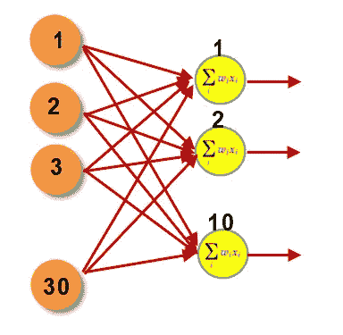
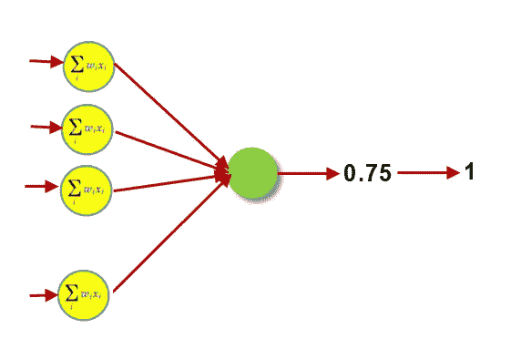
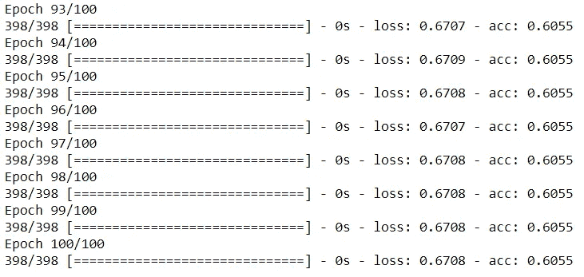
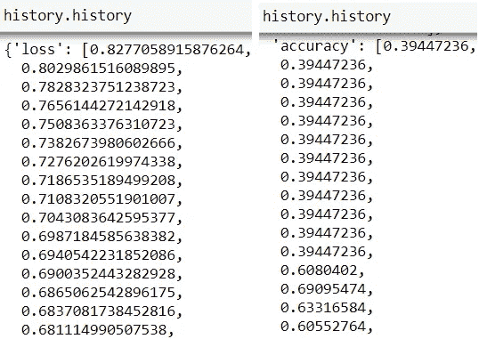
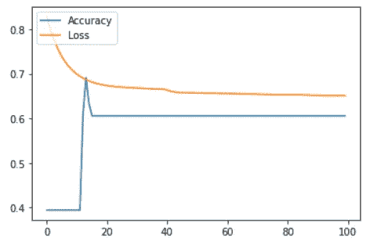
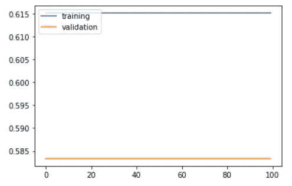

# 深度学习—分类示例

> 原文：<https://medium.com/analytics-vidhya/deep-learning-classification-example-c7d5bc74b35e?source=collection_archive---------23----------------------->

大家好！！！今天写这篇文章是一种巨大的快乐，因为这是我在 2021 年能够写的第一篇文章。新年快乐！！🥳 🎂 🎉

在这篇文章中，我们将看到深度学习技术的延续。我们将看到一个带有分类示例的深度学习模型。

在我们上一篇文章中，我们学习了使用一个简单的神经网络来解决回归问题——[人工神经网络用一个回归例子](https://devskrol.com/index.php/2020/11/22/388/)来解释。

如果你错过了前传，请查看以下内容:

[人工智能——深度学习简介和历史](https://devskrol.com/index.php/2020/11/07/artificial-intelligence-a-brief-introduction-and-history-of-deep-learning/)

[神经元如何工作？以及人工神经元是如何模仿人脑神经元的？](https://devskrol.com/index.php/2020/11/08/how-neurons-work-and-how-artificial-neuron-mimics-neurons-in-human-brain/)

[人工神经网络用回归实例说明](https://devskrol.com/index.php/2020/11/22/388/)

# 分类示例数据集:

为了便于使用和下载，我们采用了来自 sklearn.datasets 的乳腺癌数据集。

```
from sklearn.datasets import load_breast_cancer
from sklearn.model_selection import train_test_splitwhole_data = load_breast_cancer()X_data = whole_data.data
y_data = whole_data.targetX_train, X_test, y_train, y_test = train_test_split(X_data, y_data, test_size = 0.3, random_state = 7)
```

最后，我们有 398 个记录的数据集用于训练，171 个记录用于 30 个特征的测试。尽管这对于深度学习来说是一个非常少的数据，但我们将它用于实验目的。

**数据集文档:**[http://sci kit-learn . org/stable/modules/generated/sk learn . datasets . load _ breast _ cancer . html # sk learn . datasets . load _ breast _ cancer](http://scikit-learn.org/stable/modules/generated/sklearn.datasets.load_breast_cancer.html#sklearn.datasets.load_breast_cancer)

```
X_train.shape, X_test.shape, y_train.shape, y_test.shapeOutput:
((398, 30), (171, 30), (398,), (171,))
```

# 模型创建:

```
from keras.models import Sequentialmodel = Sequential()
```

创建一个顺序模型。让我们给它添加深度学习层。

```
# Keras model with two hidden layer with 10 neurons each 
model.add(Dense(10, input_shape = (30,)))    
# Input layer
model.add(Activation('sigmoid'))
model.add(Dense(10))                         
# Hidden layer 
model.add(Activation('sigmoid'))
model.add(Dense(10))                         
# Hidden layer 
model.add(Activation('sigmoid'))
model.add(Dense(1))                          
# Output layer => output dimension = 1 since it is regression problem
model.add(Activation('sigmoid'))
```

这里可以注意到输入层具有 30°的输入形状。第一行也提到了 10。

现在我们大多数人可能会有一个问题，确切的输入形状是什么？30 还是 10？

得到输入的第一层是输入层，这里有 30 个神经元。每 1 个输入节点对应一个要素。下一层是第一个隐藏层，有 10 个神经元。



按作者分类的图像-输入图层和第一个隐藏图层

我们还可以看到，输出层只有 1 个神经元。为什么没有 2 个神经元作为目标变量是一个二元类(1-恶性，0-良性)？

这一个神经元输出值将是 0 和 1 之间的概率值，因为我们在输出层中使用 sigmoid 激活。基于阈值 0.5，可以将概率值确定为 0 或 1n。



按作者分类的图像-最后一个隐藏层和输出层

现在我们已经构建了神经网络。让我们用优化器和损失函数来编译它。

```
from keras import optimizerssgd = optimizers.SGD(lr = 0.01)    # stochastic gradient descent optimizermodel.compile(optimizer = sgd, loss = 'binary_crossentropy', metrics = ['accuracy'])
```

随机梯度下降用作优化器，当反向传播和“二元交叉熵”损失函数用于评估时，将使用该优化器。

为了得到整个结构的摘要，我们可以使用 summary()函数对模型进行处理。

```
model.summary()Output:
_________________________________________________________________
Layer (type)                 Output Shape              Param #   
=================================================================
dense_9 (Dense)              (None, 10)                310       
_________________________________________________________________
activation_4 (Activation)    (None, 10)                0         
_________________________________________________________________
dense_10 (Dense)             (None, 10)                110       
_________________________________________________________________
activation_5 (Activation)    (None, 10)                0         
_________________________________________________________________
dense_11 (Dense)             (None, 10)                110       
_________________________________________________________________
activation_6 (Activation)    (None, 10)                0         
_________________________________________________________________
dense_12 (Dense)             (None, 1)                 11        
_________________________________________________________________
activation_7 (Activation)    (None, 1)                 0         
_________________________________________________________________
dense_13 (Dense)             (None, 10)                20        
_________________________________________________________________
dense_14 (Dense)             (None, 10)                110       
_________________________________________________________________
dense_15 (Dense)             (None, 10)                110       
_________________________________________________________________
dense_16 (Dense)             (None, 1)                 11        
=================================================================
Total params: 792.0
Trainable params: 792.0
Non-trainable params: 0.0
_________________________________________________________________
```

这个总结有助于我们理解权重和偏差的总数。总参数:792.0

# 训练模型:

```
history = model.fit(X_train, y_train, batch_size = 50, epochs = 100, verbose = 1)
```

上面的代码将在 50 个批次和 100 个时期中训练模型。

1 次迭代-发送到神经网络一次的一个数据点或一组数据点。

批处理大小= 50。这意味着整个训练数据点将被划分，并且对于每次迭代，将批量给出 50 个数据点。

纪元= 100。一个时期提到整个数据集被发送到训练 1 次。即神经网络将用 398 个数据点训练 100 次。每次都将使用反向传播来更新权重。

从而最终的权重将被近似优化。基于数据集、学习速率、激活函数等，增加历元的数量可能会也可能不会优化它。

由于我们将 verbose 设为 1，我们将能够看到每个历元中的精度和损失。



作者图片-模型训练日志

这里你可以看到我们的损耗更高，精度更低。

# 评估:

模型的评估函数。文档可以在这里找到[https://keras.io/metrics/](https://keras.io/metrics/)。

```
results = model.evaluate(X_test, y_test)Output:
32/171 [====>.........................] - ETA: 0s
```

现在我们有了结果。该对象将有两个指标损失和准确性。

```
print(model.metrics_names)     # list of metric names the model is employing
print(results)                 # actual figure of metrics computed
print('loss: ', results[0])
print('accuracy: ', results[1])Output:
['loss', 'acc']
[0.6395693376050358, 0.6783625724022848]
loss:  0.6395693376050358
accuracy:  0.6783625724022848
```

为了清楚地了解整个训练过程中发生了什么，我们可以使用从 model.fit 语句接收的对象。我们把它命名为历史。



作者图片-培训过程的历史

我们可以使用 matplotlib 进行可视化:

```
from matplotlib import pyplot as pltplt.plot(history.history['accuracy'])
plt.plot(history.history['loss'])
plt.legend(['Accuracy', 'Loss'], loc = 'upper left')
plt.show()
```



输出

如果我们在拟合函数中添加了验证分割，我们将同时获得训练和验证结果。

```
history = model.fit(X_train, y_train, validation_split = 0.3, epochs = 100, verbose = 0)
plt.plot(history.history['accuracy'])
plt.plot(history.history['val_accuracy'])
plt.legend(['training', 'validation'], loc = 'upper left')
plt.show()
```



输出

您可以看到，在这个新模型中，验证和训练的准确性没有提高。我们也使用相同的训练数据进行验证分割。所以训练数据是不够的。

# 结论:

现在你可能会认为，所有的 CPU 时间和 GPU 时间都浪费在不太准确的地方了？甚至 ML 模型给出了更好的结果！！！

是的，当我第一次看到这种准确性时，我也有同样的想法。

我们还没有做一件事情，这是模型创建的有趣部分。是啊！调音！

这是一个基本模型。我们仍然可以用不同数量的神经元、层、时期、不同的激活函数、优化器和损失函数来调整这个模型。

我们也可以增加数据集来获得更好的结果。

我打算发表一篇文章来调整这个模型。下期文章再见。

感谢您阅读我们的文章，希望您喜欢。😊

喜欢支持？只要按一下拍手按钮❤️.

快乐学习！👩‍💻