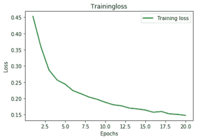

# 深度学习:使用 PyTorch 和 CIFAR-10 创建图像分类器

> 原文：<https://medium.com/analytics-vidhya/deep-learning-creating-an-image-classifier-using-pytorch-with-cifar-10-f603659722b2?source=collection_archive---------5----------------------->


[https://www . Futura-sciences . com/tech/definitions/intelligence-artifielle-deep-learning-17262/](https://www.futura-sciences.com/tech/definitions/intelligence-artificielle-deep-learning-17262/)

> 请注意，本文分为两部分。第一部分，也就是你现在正在阅读的部分，是关于创建图像分类器的。第二部分是关于模型的操作和部署。你可以在这里找到[。本文末尾提供了更多的信息。谢谢！](/analytics-vidhya/deep-learning-loading-and-operationalizing-our-model-13c4da002225)

起初，这些人工智能，机器学习，深度学习的东西听起来像一些机器代码之类的东西，很可怕。如果这就是你现在的处境，那么我也曾经是你的处境。在做了一些工作后，我发现这并不可怕。希望在你读完之后，你会同意我的观点。

在这篇文章中，我们将着眼于建立一个图像分类器。耶！你说对了，图像分类器。不要害怕，我们会经历所有的步骤，肯定会很有趣。

我们将 PyTorch nn 模块用于在 CIFAR-10 数据上训练和测试我们的模型。CIFAR 代表加拿大高级研究所。10 代表数据集中包含的 10 类图像，即:飞机、汽车、鸟、猫、鹿、狗、青蛙、马、船、卡车。所以基本上我们的模型将能够处理这些项目。你可以从 [kaggle](https://www.kaggle.com/pankrzysiu/cifar10-python) 下载数据集。

> 你可以看看其他的数据集。请随意查看[这里的](https://pytorch.org/vision/stable/datasets.html#torchvision-datasets)。
> 
> 也有一些预训练的模型。到目前为止，在 CIFAR-10 数据集上训练和测试的性能最好的模型是 [GPipe](https://arxiv.org/pdf/1811.06965.pdf) ，准确率为 99.0%。本文的目的不是要击败这种准确性，我们只是想让自己动手构建自己的内部神经网络。

当涉及到构建神经网络时，主要包括三个步骤；

*   准备和探索我们的数据
*   建设和培训以及
*   测试。

# 准备和探索

重要的是，我们要看到我们处理的是什么样的数据。然后，我们必须将数据分成两部分，一部分用于训练，另一部分用于测试。通常是 80%比 20%，但这取决于你。

下面是必要的导入，以便我们加载和划分数据。

```
import torchvisionimport torchvision.transforms as transforms
```

然后，我们创建集合和加载器

```
data_dir = './data' # directory of the cifar-10 data you downloadedtransform = transforms.Compose([transforms.RandomHorizontalFlip(), transforms.ToTensor()]) trainset = torchvision.datasets.CIFAR10(root=data_dir, train=True, download=True, transform=transform)train_loader = torch.utils.data.DataLoader(trainset, batch_size=5, shuffle=True, num_workers=2)testset = torchvision.datasets.CIFAR10(root=data_dir, train=False, download=True, transform=transform)test_loader = torch.utils.data.DataLoader(testset, batch_size=5, shuffle=False, num_workers=2)# The 10 classes in the dataset
classes = ('plane', 'car', 'bird', 'cat', 'deer', 'dog', 'frog', 'horse', 'ship', 'truck')
```

现在，让我们研究一下训练集和测试集的数据…

```
# to get the length of the taindata
print(len(trainset))# get sample of train data and see length
sample = next(iter(trainset))
print(len(sample))# get the image and it's label
image, label = sample
print(type(image))
print(type(label))# view image shape
image.shape# length of test data
print(len(testset))
```

现在我们已经看到了一些基本的统计数据，让我们来看看来自训练和测试加载器的一些图片

```
import matplotlib.pyplot as plt
import numpy as np# train_loader images
dataiter = iter(train_loader)
batch = next(dataiter)
labels = batch[1][0:5]
images = batch[0][0:5]for i in range(5):
    print(classes[labels[i]])
    image = images[i].numpy()
    plt.imshow(np.rot90(image.T, k=3))
    plt.show()# test_loader images
dataiter = iter(test_loader)
batch = next(dataiter)
labels = batch[1][0:5]
images = batch[0][0:5]for i in range(5):
    print(classes[labels[i]])
    image = images[i].numpy()
    plt.imshow(np.rot90(image.T, k=3))
    plt.show()
```

此时，我们至少在一定程度上了解了我们的数据。喜欢的话可以多探索。

# 建造和训练

既然我们已经探索了我们的数据，让我们建立我们的模型。为了刷新，nn 是不同层的组合，以提出 ur 架构。你可以在这里探索不同的 torch.nn 图层[。如果我们必须在这里讨论不同的层和它们的功能，这确实是一个很长的话题，所以我鼓励你看看](https://pytorch.org/docs/stable/nn.html)[这个链接](https://pytorch.org/docs/stable/nn.html)来了解更多关于它们的信息。为了不让事情变得复杂，我将与你分享我的架构(经过一些改进)。可以随意修改和探索。

```
import torch
import torch.nn as nn
import torch.nn.functional as Fclass Net(nn.Module):
    def __init__(self):
        super(Net, self).__init__()
        self.conv1 = nn.Conv2d(3, 32, 3)
        self.conv2 = nn.Conv2d(32, 64, 3)
        self.conv3 = nn.Conv2d(64, 128, 3)
        self.pool = nn.MaxPool2d(2, 2)
        self.fc1 = nn.Linear(128 * 2 * 2, 128)
        self.fc2 = nn.Linear(128, 64)
        self.fc3 = nn.Linear(64, 32)
        self.fc4 = nn.Linear(32, 10)
        self.dropout1 = nn.Dropout(p=0.2, inplace=False) def forward(self, x):
        x = self.pool(F.relu(self.conv1(x)))
        x = self.dropout1(x)
        x = self.pool(F.relu(self.conv2(x)))
        x = self.dropout1(x)
        x = self.pool(F.relu(self.conv3(x)))
        x = self.dropout1(x)
        x = x.view(-1, 128 * 2 * 2)
        x = F.relu(self.fc1(x))
        x = F.relu(self.fc2(x))
        x = F.relu(self.fc3(x))
        x = self.fc4(x) #output layer

        return x
```

现在让我们实例化模型类。

```
model = Net()
```

我相信你一定听说过 GPU。如果不是仍然很酷。GPU(图形处理单元)主要用于游戏电脑，以提供高视频处理能力。我们希望利用这一强大的资源来训练我们的模型。其实并不是一定要用 GPU。CPU 是可以工作的，只是它慢很多，需要更多的时间来训练和测试。花那么多时间也可能会影响模型的性能。

因此，我们将检查运行代码的当前机器上是否存在 GPU，否则，我们使用 CPU。

```
device = 'cuda' if torch.cuda.is_available() else 'cpu'
model.to(device)
```

我们现在指定我们的损失函数。神经网络使用随机梯度下降进行预训练，因此我们必须选择一个损失函数，这将有助于优化。这让人困惑吗？如果是这样，我鼓励你看看[这篇文章](https://machinelearningmastery.com/loss-and-loss-functions-for-training-deep-learning-neural-networks/)，里面讨论了损失函数。此外，你可以看看其他一些损失函数，你可以在这里使用。

```
criterion = nn.CrossEntropyLoss()# Stochastic gradient descent: to perform parameter update for each training sample
optimizer = optim.SGD(model.parameters(), lr=0.001, momentum=0.9)
```

现在我们可以开始模型的训练了。

```
epoch_losses = [] # using this to record the training loss so that we can plot it against the epochmodel.train()
for epoch in range(20):
    running_loss = 0.0
    saved_loss = 0.0 for i, data in enumerate(train_loader, 0):
        # get inputs and labels and convert to appropriate device
        inputs, labels = data
        inputs, labels = inputs.to(device), labels.to(device)

        # zero the parameter gradients
        optimizer.zero_grad() outputs = model(inputs)
        loss = criterion(outputs, labels)
        loss.backward()
        optimizer.step()

        # print stats
        running_loss += loss.item()
        if i % 2000 == 1999:  # print every 2000 mini-batches
            print('%d, %5d| loss: %.3f' %(epoch+1, i+1, running_loss/2000))
            saved_loss = running_loss
            running_loss = 0.0
    epoch_losses.append(saved_loss/10000)
print('Training done!')  # print when finished training
```

请随意花些时间看看上面的代码，以防乍一看不太清楚。

现在让我们画一个图表，显示我们的训练损失和时期。

```
epochs = range(1,21)plt.plot(epochs, epoch_losses, 'g', label='Training loss')
plt.title('Trainingloss')
plt.xlabel('Epochs')
plt.ylabel('Loss')
plt.legend()
plt.show()
```

让我给你看一个曲线应该是什么样子的例子:



注意曲线是如何趋近于零的。损失越低，模型预测得越好。通常，曲线上的最低点是模型可以很好预测的地方。如果曲线开始增加，这意味着我们的模型是过度拟合。通常，在曲线开始增加的情况下，我们调整时期的数量，以便我们的模型只训练诅咒最低的时期的数量。这样，我们可以为我们的模型获得一些好的性能(准确性)。

就我而言，我只训练了 20 个纪元。从我的曲线来看，它表明曲线有可能变低(减少损失)，从而提高模型性能。你可以试着自己增加纪元的数量。你怎么想呢?

# 测试模型

既然模型已经训练好了，我们就该测试了。我们将使用我们之前创建的 test_loader。我们想测量模型的准确性。

```
total = 0
correct = 0model.eval() # out our model in evaluation modewith torch.no_grad():
    for data in test_loader:
        images, labels = data
        images, labels = images.to(device), labels.to(device)
        outputs = model(images)
        _, predicted = torch.max(outputs.data, 1)
        total += labels.size(0)
        correct += (predicted == labels).sum().item()
print('Accuracy: %d %%' % (100 * correct / total))
```

从我自己的部分来说，运行测试后，我得到了 75%的准确率。这是一个不错的准确性。但是肯定可以改进。

如果您想测试对特定图像的预测，请查看 blow 片段。

```
dataiter = iter(testloader)
images, labels = dataiter.next()print('Truth: ', ' '.join('%5s' % classes[labels[j]] for j in range(5)))
outputs = net(images)# Output prediction
_, predicted = torch.max(outputs, 1)
print('Predicted: ', ' '.join('%5s' % classes[predicted[j]] for j in range(5)))
```

现在您可以方便地保存模型了。

```
checkpoint = {'model': model,
            'state_dict': model.state_dict(),
            'optimizer' : optimizer.state_dict()}torch.save(checkpoint, 'checkpoint.pth')
```

如果你想加载模型并在其他地方重用，你可以使用 [torch.load](https://pytorch.org/docs/stable/generated/torch.load.html) 函数。它将模型检查点文件作为参数。

就这样…

# 额外的

如果您想部署该模型，以便它可以作为服务使用，我想给您一点提示。

您可以提供一个云服务器，您将在其中加载您的模型，您有一个简单的 RESTFul flask 或 fastapi API，它接收图像，然后将图像加载到您的模型，获得预测，并将响应发送回用户。

请注意，图像的大小可能不同，因此您必须调整图像的大小，以便您的模型可以处理图像，否则模型将无法正常工作。

希望你不会再看到深度学习的东西变得很奇怪。

非常感谢您的阅读。

# 第二部分

你可以在[这里](/analytics-vidhya/deep-learning-loading-and-operationalizing-our-model-13c4da002225)阅读**深度学习部分:加载并操作我们的模型**。

# 参考

*   [神经网络编程——用 PyTorch 进行深度学习](https://deeplizard.com/learn/video/mUueSPmcOBc)
*   [CIFAR-10 Python](https://www.kaggle.com/pankrzysiu/cifar10-python)
*   [梯度下降优化算法概述](https://ruder.io/optimizing-gradient-descent/)