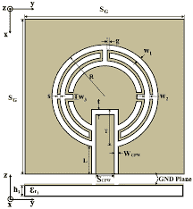
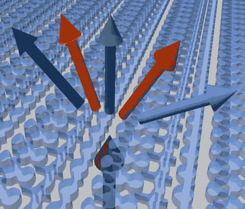
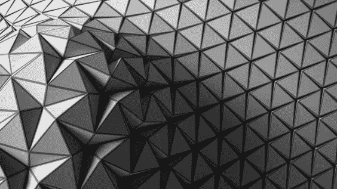

# 使用超材料启发技术的小型化缝隙天线设计的深度学习

> 原文：<https://medium.com/analytics-vidhya/deep-learning-for-miniaturized-slot-antenna-design-using-metamaterial-inspired-techniques-dde25df5074d?source=collection_archive---------13----------------------->

**无线通信中天线小型化的必要性**

在电气工程的几乎所有领域，研究兴趣已经转向小型化。电磁学，尤其是天线，也不例外。随着全球无线系统的快速发展，小型化天线已经成为许多天线工程师的研究热点。在过去的几年里，小型化天线的设计受到了极大的重视。使用小天线有很多原因，其中大部分是物理限制。例如，高速飞机或军舰由于使用大型天线的机械强度(即风龄)而容易损坏。人们越来越关注将天线做得足够小，以便最终与局域网接收前端的其余部分一起安装在单个芯片上。由于移动平台中天线放置的可用空间有限，更多的天线可能被紧密封装，这产生了它们之间的互耦和寄生耦合的风险。许多应用都需要小型天线，例如隐形军用地面车辆、警察或安全部队的隐蔽电气设备、公路车辆或火车上的障碍清除以及小动物的无线电跟踪等。它还用于最近的应用，如个人通信和手持设备，如智能手机、平板电脑和计算机 RFID 和传感系统，包括印刷电路板设计等。

**小型化对天线性能的影响**

众所周知，天线的小型化会影响其辐射特性。缩小天线尺寸会影响其带宽、增益、效率以及与馈电的匹配。这直接源于这样一个事实，即天线是一种用于将导波转换为辐射波的装置，反之亦然。这种转换过程与波长有关，在确定这种转换的效果和频率时，天线尺寸比天线技术更重要。多年来，许多作者研究了天线的电尺寸与其辐射性能之间的关系。天线尺寸及其性能彼此密切相关。显示天线尺寸与其最大带宽和增益之间关系的第一个基本结果出现在 20 世纪 40 年代末。Wheeler 使用辐射功率因数(定义为天线电阻和天线电抗之间的商)来量化天线的辐射。Wheeler 使用一个简单的等效集总电路推导出，在天线由简单电路匹配的情况下，这个商等于带宽乘以效率。这篇早期论文首次尝试从数学上证实效率和带宽的乘积与天线所占体积直接相关。事实上，随着天线尺寸的减小，其电抗会增加，但辐射电阻会降低。Wheeler 的工作被 Chu 推广，他从天线周围的球面波阻抗函数的部分分数的展开中导出了等效集总电路元件。因此，全向天线的最小品质因数 Q 与其体积之间的关系正式建立。这些结果表明，天线小型化会影响天线的增益、带宽和效率。此外，由于天线 Q 值的增加和电尺寸的减小，天线变得更难与馈电匹配。

**文献综述**

构建小型化天线的最简单方法是加载不同的集总元件。其思想是，小于半波长的天线具有很强的电抗输入阻抗，这将通过负载来补偿。可以通过添加电容器、线圈、顶部加载等来执行加载。这种加载的效果是降低天线的效率，或者增加天线的品质因数，从而降低其带宽。弯曲天线是小型化天线的另一种简单形式，其中半波长偶极子通过弯曲导线而变得紧凑。类似的方法已经被应用于设计曲折型缝隙天线。曲折天线很难与 50 W 线匹配。这一困难是由于这样一个事实，即在间隔很近的导线上以相反方向流动的几乎同相的电流辐射在远场区域往往会相互抵消。这导致非常低的辐射电阻。在 2000 年，一个双带曲折线被用来增加小型化天线的带宽.

超材料的发展为天线设计师创造一种具有非常规特性或增强性能的新型结构提供了新的可能性。超材料是人工制造的结构或介质，表现出天然材料中没有的不寻常的特性。它可以通过在主体介质中嵌入周期性结构的特定内含物来合成。这些材料中的一些表现出负介电常数或负磁导率。如果这种材料的介电常数和磁导率在相同频率下都为负，则该复合材料对于各向同性介质具有有效的负折射率，并且被称为左手超材料。1968 年，维斯拉格进行了第一次理论研究。在他的工作中断很长一段时间后，随着 pendry *等人*开发出第一种超材料，人们对这一领域重新产生了兴趣。Pendry 提出了一种人造材料，由所谓的缝隙环谐振器(SRR)和提供负介电常数的导线组成，尽管该缝隙环谐振器由非磁性材料制成，但仍呈现负磁导率值的频带。接下来，史密斯*等人*展示了第一个左手材料的实现，它由一系列 SRR 和导线组成。

# 深度学习遇到超材料的地方

纳米光子学领域的突破——光在纳米尺度上的表现——为“超材料”的发明铺平了道路，这种人造材料有着巨大的应用，从远程纳米传感到能量采集和医疗诊断。但它们对日常生活的影响受到了复杂的制造过程和巨大误差的阻碍。

现在，特拉维夫大学一项新的跨学科研究发表在《光:科学与应用》上，展示了一种简化设计和表征基本纳米光子超材料元素的方法。这项研究由 TAU 大学物理和天文学院的 Haim Suchowski 博士和 TAU 大学 Blavatnik 计算机科学学院的 Lior Wolf 教授领导，由研究科学家 Michael Mrejen 博士和 TAU 大学研究生 Itzik 马尔基尔、Achiya Nagler 和 Uri Arieli 进行。

“设计超材料的过程包括雕刻具有精确电磁响应的纳米元件，”Mrejen 博士说。“但由于所涉及的物理学的复杂性，这些元件的设计、制造和表征过程需要大量的反复试验，这极大地限制了它们的应用。”

# 深度学习是精密制造的关键

“我们的新方法几乎完全依赖于深度学习，这是一种受人脑分层结构启发的计算机网络，”沃尔夫教授解释道。“这是最先进的机器学习形式之一，推动了技术的重大进步，包括语音识别、翻译和图像处理。我们认为这将是设计纳米光子超材料元素的正确方法。”

科学家们向深度学习网络输入了 15，000 个人工实验，以教会网络纳米元素的形状和它们的电磁响应之间的复杂关系。“我们证明了一个‘训练有素’的深度学习网络可以在一瞬间预测一个制造的纳米结构的几何形状，”Suchowski 博士说。

研究人员还证明，他们的方法成功地产生了可以与特定化学物质和蛋白质相互作用的纳米元素的新设计。

# 广泛适用的结果

“这些结果广泛适用于许多领域，包括光谱学和靶向治疗，即高效快速地设计能够靶向恶意蛋白质的纳米粒子，”Suchowski 博士说。“这是第一次，一个经过数千次合成实验训练的新型深度神经网络不仅能够确定纳米尺寸物体的尺寸，还能够为目标化学物质和生物分子快速设计和表征基于超表面的光学元件。

“我们的解决方案也可以反过来使用。一旦制造出形状，通常需要昂贵的设备和时间来确定实际制造的精确形状。我们基于计算机的解决方案基于简单的传输测量，瞬间就能做到这一点。”

研究人员还就他们的新方法写了一份专利，目前正在扩展他们的深度学习算法，以包括纳米粒子的化学表征。

本文转载自 [AFTAU](https://www.aftau.org/home) 提供的[资料](https://www.aftau.org/news-page-computers--technology?&storyid4702=2412&ncs4702=3)。注意:材料的长度和内容可能已经过编辑。欲了解更多信息，请联系引用的来源。

# 参考

# 学术文献

1.K. Fujimoto，A. Henderson，K. Hirasawa，J.R. James，小型天线。纽约:约翰·威利
父子出版社，1987 年。
2。电小超定向和超导天线。新泽西州:威利出版社，2006 年。
3。R. A .博柏利，“电小天线:综述”，IEEE 电小天线学术讨论会
。英国伦敦:IEEE，1990 年 10 月，第 1-5 页。
4。H. A Wheeler，“小型天线的基本限制”，IRE 会议录，第 35 卷，
第 1479-1484 页，1947 年 12 月。
5。朱立军，“全向天线的物理限制”，《应用物理杂志》，
第 19 卷，第 1163-1175 页，1948 年 12 月。
6。A. K. Skrivervik，J.-F. Zürcher，O. Staub，J. R.Mosig，“PCS 天线设计:小型化的挑战”，IEEE 天线与传播。杂志，第 43 卷，第 4 期，第 12-26 页，2001 年 8 月。
7。赖士德和泰，"一种新型的谐振天线"，电气与电子工程学会会刊。天线
传播。，第 39 卷，第 1428-1430 页，1991 年 9 月。
8。J. M. Kim、J. G. Yook、W. Y. Song、Y. J. Yoon、J. Y. Park 和 H. K. Park，“紧凑型
曲折型缝隙天线”，正在进行中。天线传播。社会主义者里面的症状。美联社挖吧。，第 2 卷，
马萨诸塞州波士顿，2001 年 7 月，第 724–727 页。

9.K. Noguchi、N. Yasui、M. Mizusawa、S. Betsudan 和 T. Katagi，“增加安装在导电盒上的双带弯折线天线的带宽
”,在 Proc。天线传播。
足球。里面的症状。美联社挖吧。，第 4 卷，2001 年，第 112-115 页。

10.N. Engheta 和 R. W. Ziolkowski 编辑。、超材料:物理与工程
探索。新泽西州霍博肯-皮斯卡塔韦:威利-IEEE 出版社，2006 年。
11。超材料:批判与选择。纽约:威利出版社，2009 年。
12。Veselago，V. G .,“同时具有负值
e 和μ的物质的电动力学”，苏联物理学 USP。，第 10 卷，第 4 号，509-514，1968 年 1 月-2 月。
13。J. B. Pendry、A. J. Holden、W. J. Stewart 和 I. Youngs，“金属介观结构中的极低频
等离子体”，列特物理杂志。，第 76 卷，第 25 期，第 4773–4776 页，1996 年 6 月
。14。Pendry，J. B .，A. J. Holden，D. J. Robbins 和 W. J. Stewart，“导体的磁性
和增强的非线性现象”，IEEE Trans。微波理论技术。，第 47 卷，№11，
第 2075–2084 页，1999 年 11 月。
15。Smith，D. R .、W. J. Padilla、D. C. Vier、S. C. Nemat-Nasser 和 S. Schultz，“同时具有负磁导率和介电常数的复合
介质”，列特物理杂志。，第 84 卷，
第 18 期，第 4184-4187 页，2000 年 5 月。
16。A. Alu、F. Bilotti、N. Engheta 和 L. Vegni，“加载超材料的亚波长、紧凑、谐振贴片
天线”，IEEE Trans .天线传播。，第 55 卷，第 1 期，第 13-25 页，
2007 年。
17。K. Buell、H. Mosallaei 和 K. Sarabandi，“提供
可调小型化因子的小型贴片天线基板”，IEEE Trans .微波。理论技术。，第 54 卷，第 1 期，第 135-146 页，
2006 年。
18。H. Mosallaei 和 K. Sarabandi，“印制在磁电机上的贴片天线的设计和建模”
电介质嵌入式电路元基板，IEEE Trans .天线传播。，第 55 卷，第 1 期，
第 45-52 页，2007 年。

19.I .马尔基尔，m .姆雷真，Nagler，a .，Arieli，u .，Wolf，l .，& Suchowski，H. (2018)。通过深度学习进行等离子纳米结构设计和表征。光:科学与应用，7(1)，60。[https://doi.org/10.1038/s41377-018-0060-7](https://doi.org/10.1038/s41377-018-0060-7)