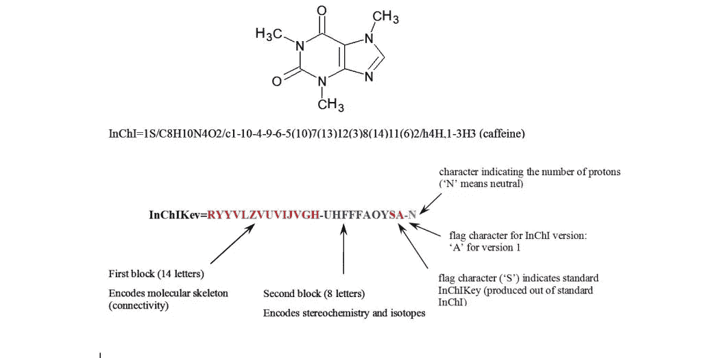
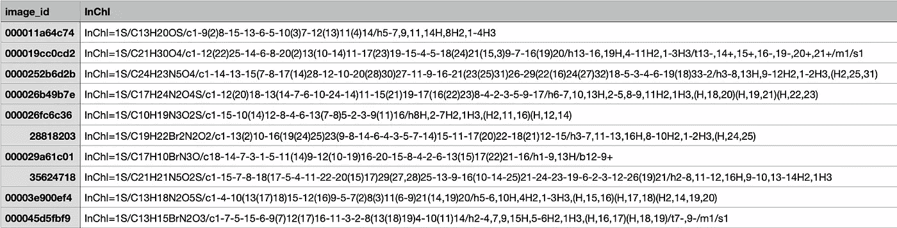
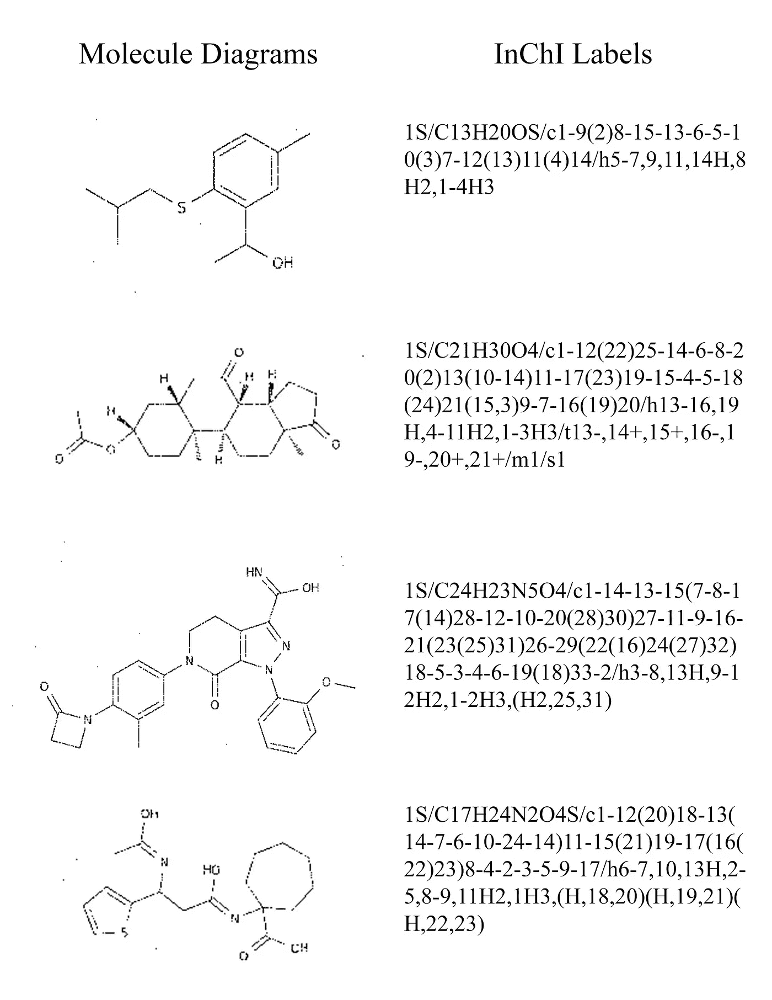

# 用于分子翻译的深度学习

> 原文：<https://medium.com/analytics-vidhya/deep-learning-for-molecular-translation-b032b90750bc?source=collection_archive---------13----------------------->

如何使用神经网络帮助将分子结构图转换为相应的国际化学标识符(InChI)文本字符串。

分子结构[1]

# 背景和动机

随着我们进入一个以数字媒体和出版物为主的新领域，学习如何将旧的做事方式与新的方式相协调变得极其重要。在化学领域，几十年来通常的做法是用所谓的骨架式来表示化合物的结构形式。过去的出版物充满了这些图表，但是，现在，随着我们越来越依赖于让计算机解析文档并正确解释这些分子图像，找到一种方法将这些结构转换成机器可以容易理解和操作的形式是非常重要的。[2]实现这一目标的第一步发生在 21 世纪初，当时来自世界各地的科学家共同开发了国际化学标识符(InChI)标签，该标签可用于以机器可读字符串的形式表示任何化合物的特定组成和键结构。[3]

咖啡因的骨架配方和相应的英制标签[3]

InChI 的创建是一项巨大的成就，有助于将该领域推向一种更加数字友好的形式，但这种新的标签系统也使几十年来带有骨架结构图的旧出版物被遗忘和利用不足。为了帮助扩大对以前发表的化学研究的访问，必须开发一种方法来准确有效地分析已发表的科学文献并识别已知化合物的存在。拥有一个可以细读旧论文并确定已知化合物存在的模型将通过帮助研究人员避免重新探索或重新发布已经记录的化学物质的陷阱来加速当前的创新。[2]

阻止在这一点上找到这样一种解决方案的主要障碍是，这些骨架公式的大多数公共数据集以及它们相应的 InChI 标签对于当代机器学习模型来说太稀疏了，并且即使是最好的模型目前也只能在理想的图像条件下产生大约 90%的准确度(这对于旧的科学出版物的扫描来说通常不是这样)。[2]这导致该任务的进展停滞不前，但是，多亏了百时美施贵宝的团队，包含超过 400 万张结构图像及其相应的 InChI 标签的数据集已经可用，这是我们将用来训练我们的模型的，并有望揭示机器学习技术的一个利基但重要的应用。然而，在扩展我们如何计划使用我们当前的深度学习知识来解决这个问题之前，我们将首先对我们已经获得的数据进行一些初步的探索性数据分析。

# 探索性数据分析

如上所述，这个数据集最值得注意的一个方面是它的庞大规模。对于超过 400 万个 image-ID 对(分解为 240 万个带有相应 InChI 标签的训练图像和 160 万个测试图像)，就管理计算能力而言，处理如此大量的数据本身就是一项艰巨的任务。仅仅下载数据集就花了大约 8 个小时，但是，一旦我们访问了里面的内容，我们就能够对我们正在处理的东西有一个更清晰的认识。让我们先来看看图像 ID 及其对应的 InChI 标签的表格:

图像 ID 及其对应的英制标签表

正如您所看到的，数据集中的每个条目都有一个对应于一个 InChI 标记的图像 ID，结果是每个分子只有一个训练图像，这意味着每个标记都是唯一的。这与我们过去在处理具有有限且明确定义的输出空间的图像分类问题时所看到的场景完全不同。在这种情况下，没有多余的类，因为标签不应该被认为是我们可以对图像进行分类的类别，而是顺序输出数据。在这一点上，很明显，我们正在进入一个新的领域，必须应用一些更先进的深度学习架构，如 RNNs，来执行必要的顺序令牌预测，以便为给定的图像输入产生正确的输出。为了更清楚地看到输入空间和输出空间之间的这种关系，接下来让我们看几个分子骨架图和它们相应的英制标签:

分子结构图及其对应的英制标签

我们的模型不仅需要能够通过卷积神经网络(CNN)处理分子结构的图像，还需要在其 InChI 标记的预测中表现出时间动态性。换句话说，在将我们的数据输入 CNN 后，我们还需要使用递归神经网络(RNN)来预测标签，一次一个字符，因为任何字符出现在标签中的可能性肯定取决于前面的字符(例如，以“1S/C24H2”开头的标签更有可能将“0”作为其下一个字符，而不是“C”)。得出这个结论后，现在是时候弄清楚如何实际设计一个合适的架构了。

# 初步模型设计

假设我们的输入特征空间是一个图像，而我们的输出特征空间是一个由有限字汇的字符组成的变长字符串，我们开发这种模型的方法将涉及结合与图像识别相关的技术(利用 CNN)和与文本生成相关的技术(利用 RNNs 和诸如 LSTM 的架构)。我们目前的计划是设计一个模型，首先将预训练的 CNN 模型(如 ResNet 或 EfficientNet)应用于预处理的训练图像，然后通过一系列 LSTM 层运行该基础模型的扁平化输出，以生成预测的令牌。下图说明了这一过程，虽然我们的 LSTM 输出令牌将是单个字符而不是整个单词令牌，但这种对我们总体架构的描述完美地捕捉了我们模型的情感。

当标记是描述性单词时，这种通过神经网络从图像到文本串的转换被称为自动图像字幕。我们将不再使用描述性的单词，而是用单个字符标记来做这件事，当把这些字符标记看作一个完整的字符串时，就有希望准确地描述 InChI 形式的骨架公式。

我们模型的一般架构设计[4]

虽然理想情况下，我们能够通过简单地实现我们自己在课堂上学到的技术和理论来产生一个高性能的模型，但我们必须接受这样一个事实，即我们当前的深度学习和编码能力是如此之强，以至于在短短两周内从零开始为这样一个复杂的任务开发一个完整的模型不是特别可行。(一般来说，分配给这种规模和范围的项目的时间很可能是 1-2 个月。)因此，我们计划主要使用其他人在他们的公共笔记本中提供的框架来为我们的模型提供一般结构，但是我们将使用这一学期获得的知识来修改架构，以对我们当前处理的结果进行有意义的改进。[5]这将使我们能够获得探索和发现最佳图像字幕模型的实际操作经验，同时有望避免一些耗时的调试过程以及与从头开始编码完整管道的更多技术方面相关的陷阱。

# 后续步骤

展望未来，我们的主要焦点将是构建一个初步的 CNN+LSTM 模型，其中将强调适当地处理如此大的数据集的数据清理和格式化，因为我们是在有限的计算资源下工作的。此外，我们将花费大量时间研究其他成功的模型和笔记本，概述其他人已经采取的方法，因为如上所述，由于手头任务的高度复杂性和对数据进行有意义的分类所需的模型架构，我们不会从头开始创建完整的管道。相反，我们计划利用奇妙的 Kaggle 社区，在这个社区中，用户经常交换想法和代码，目的是生产更好的集体产品。特别是，我们计划彻底研究已公开共享的现有数据管道和基础模型，并将最佳方面综合在一起。[5]之后，我们的目标是应用我们在课堂上学到的特定于 CNN 和 RNNs 的技术来改进这个基础模型。具体来说，我们计划探索实施注意力和波束搜索如何以有意义的方式帮助提高模型的准确性，以及尝试 LSTM 超参数的新配置是否也会带来好处。最终，我们希望对现有的公共模型进行新颖的改进，然后与 Kaggle 社区分享我们的发现，以延续这种合作创新的循环。

我们希望您发现我们最初的博客帖子有趣且信息丰富，我们期待在未来分享更多我们的工作！敬请关注我们即将发布的中期和最终博客文章中的进展更新。

关于作者:Ethan Huang 和我(Griffin McCauley)都是布朗大学应用数学专业的大三学生。此外，我是男子大学越野队和田径队的成员，也是经济系的助教，伊森是 NFL 平台 Starting Eleven 的主席和学术导师。

鸣谢:该项目基于百时美施贵宝-分子翻译 Kaggle 竞赛([https://www.kaggle.com/c/bms-molecular-translation](https://www.kaggle.com/c/bms-molecular-translation))，是数据科学倡议硕士项目中布朗大学数据 2040 课程(数据科学中的深度学习和专题)的一部分。

参考资料:

1.  [https://www . thoughtco . com/definition-of-molecular-weight-605369](https://www.thoughtco.com/definition-of-molecular-weight-605369)
2.  【https://www.kaggle.com/c/bms-molecular-translation 
3.  [https://iupac.org/100/stories/what-on-earth-is-inchi/](https://iupac.org/100/stories/what-on-earth-is-inchi/)
4.  https://in.pinterest.com/pin/540713499005943010/
5.  [https://www . ka ggle . com/markwijkhuizen/tensor flow-TPU-训练-基线-lb-16-92](https://www.kaggle.com/markwijkhuizen/tensorflow-tpu-training-baseline-lb-16-92)