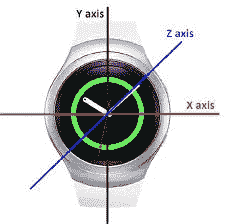
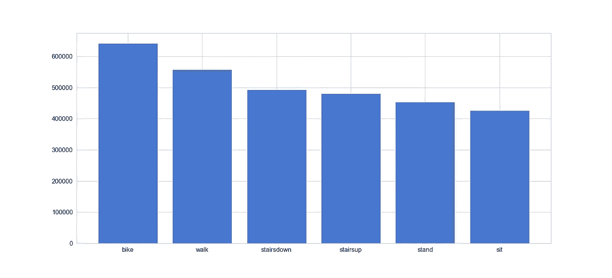
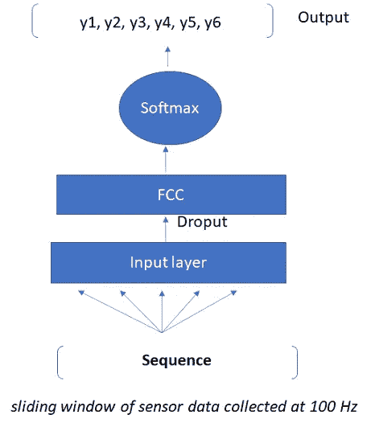
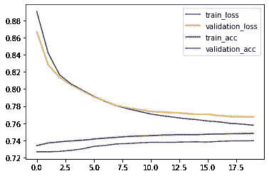

# 使用智能手表中的传感器数据进行身体活动检测的深度学习

> 原文：<https://medium.com/analytics-vidhya/deep-learning-for-physical-activity-detection-using-sensor-data-in-smart-watches-8bbfb33fc2d4?source=collection_archive---------11----------------------->

可穿戴设备的流行主要是由健康和健身意识的增强所驱动的。智能手表已经成为最受欢迎的可穿戴设备之一，全球主要公司推出的产品加速了智能手表的使用。这些设备包含多个传感器，如加速度计、陀螺仪、心率监测器等。使用这些传感器数据的人类活动识别是有需求的，并且它促进了各种以人为中心的应用的发展，例如健康监测、跌倒检测等。,.活动识别是基于这样的假设，即从身体上或环境传感器获得的特定身体运动转化为特定的信号模式，可以使用机器学习或深度学习技术对其进行识别/分类。

来源:[研究之门](https://www.researchgate.net/publication/317150667_The_Usage_of_Statistical_Learning_Methods_on_Wearable_Devices_and_a_Case_Study_Activity_Recognition_on_Smartwatches)

近年来，在移动/web 应用程序中部署深度学习模型以实时进行推理越来越流行。用于监控身体活动的设备上推理的可能性减少了通信延迟，并使深度学习模型在身体活动识别中流行。

在当前的实验中，RNN、GRU 和 LSTM 架构被用于通过智能手表上的加速度计数据来识别身体活动。

# **数据**

实验基于[异构活动识别数据集](https://archive.ics.uci.edu/ml/datasets/human+activity+recognition+using+smartphones)。该数据集由智能手机和智能手表传感器数据组成。在本文的过程中，只考虑智能手表加速度计数据，详情如下。

数据采集设备:4 块智能手表(2 块 LG 手表，2 块三星 Galaxy Gears)。

下面给出了数据集中的字段及其简短描述。

*   索引:行号。
*   Arrival_Time:测量到达感测应用程序的时间。
*   Creation_Time:操作系统附加到样本的时间戳。
*   x，y，z:相应轴的加速度计值。
*   用户:执行活动的用户，用户从 *a* 到 *i* 命名。
*   型号:手表型号。
*   设备:型号名称和编号，例如 nexus4_1 或 nexus4_2。
*   Gt:活动标签-自行车、坐、站、走、楼梯、楼梯下降和无效。在数据准备步骤中，从数据集中移除空类。

# 数据探索和模型创建

数据中的活动分布如下，很明显，骑自行车和坐着是数据中最具代表性和最不具代表性的类别。

每种活动类型的数据样本

在本实验中，探索了用于活动检测问题的各种递归神经网络(RNN)架构。

RNN-基本 RNN 是组织成连续层的节点网络，其中给定层中的每个节点都连接到下一个连续层中的每个其他节点。尽管 rnn 广泛用于顺序数据，但它们有一定的局限性。由于消失梯度或爆炸梯度，rnn 不能跟踪长期相关性。

GRU 和 LSTM:长短期记忆(LSTM)和门控循环单位(GRU)是作为 RNNs 的短期记忆的解决方案而创建的。它们有称为“门”的内部机制，可以调节信息的流动。

## 序列模型的数据准备

*   **列车测试分割**

在当前的实验中，应用了训练-测试分离策略，使得 80%的数据进入训练集，20%进入测试集。

*   **规模特征**

要素集的标准化有利于模型，将不同比例的不同要素输入到模型中会导致网络在表示中错误地将某些要素的优先级设置为高于其他要素。scikitlearn 的 Robustscaler 根据四分位数范围缩放数据，因此对异常值具有鲁棒性。然后，来自训练集的中位数和四分位间距用于转换测试集。

*   **创建时间序列数据输入**

在 Keras 中，输入数据应以 3D 格式给出，根据文档 ***，这些尺寸为[ *batch_size，timesteps，input_dim* ]。*** 但是，不需要指定 *batch_size* 。时间步长“t”的预测是基于指定数量的先前和当前时间步长特征计算的，这必须由*时间步长*指定。 *input_dim* 是数据*中的特征数。* 这样，上一步的数据就要被 LSTM 重塑为 3D。同样，由于目标变量是分类的，在该步骤中，最频繁出现的标签被用作该时间窗口的标签。

为模型选择的序列长度为 300，对应于 3 秒，因为传感器数据是以 100Hz 的频率收集的。

*   **对目标进行热编码**

因为目标变量是分类的，所以应用一种热编码，该热编码涉及用二进制向量来表示每个分类变量，该二进制向量对于每个唯一标签具有一个元素，并且用 1 来标记类标签，所有其他元素为 0。

## **型号规格**

为了简单和比较，在不同的模型中保持相似的架构。

*   输入层是 SimpleRNN/ LSTM/GRU
*   SpatialDropout1D 在模型中执行变分丢弃。
*   完全连接的层
*   输出层创建 6 个输出值，每个类一个。
*   激活功能为“softmax”。
*   “分类交叉熵”被用作损失函数。

**模型评估**

来自 RNN、LSTM 和 GRU 的准确性在所探索的建筑中几乎相同。图中显示了 GRU 模型的训练历史。使用该模型的测试集的准确率约为 74%。进一步的参数/网络优化可以提高模型的性能。

# 结论

随着技术的进步，很容易将机器学习/深度学习模型部署到移动平台。人类活动识别解决方案也越来越多地集成到移动应用程序中。

本文描述了使用智能手表传感器数据为人体活动识别创建序列模型的过程。这里探讨了 RNN、LSTM 和 GRU 的 Keras 实现。对于具有简单 GRU 网络架构的测试数据集，获得了 74%的准确度。

[Github 中的完整脚本](https://github.com/reshkurian/Physical_activity_recognition/blob/main/activity_recognition.ipynb)

# 参考

[张量流](https://www.tensorflow.org/guide/keras/sequential_model)

[时间序列——Python 和 Keras](https://machinelearningmastery.com/time-series-prediction-lstm-recurrent-neural-networks-python-keras/)

[HAR 与 LSTMs](https://towardsdatascience.com/time-series-classification-for-human-activity-recognition-with-lstms-using-tensorflow-2-and-keras-b816431afdff)