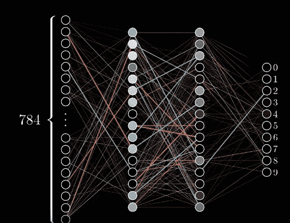
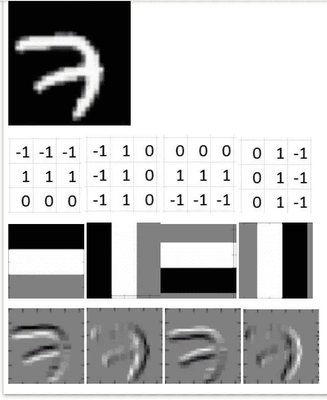
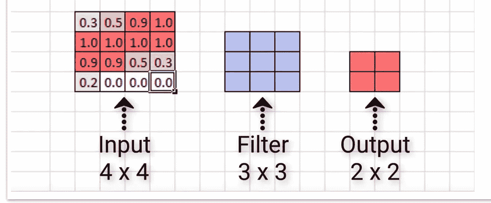
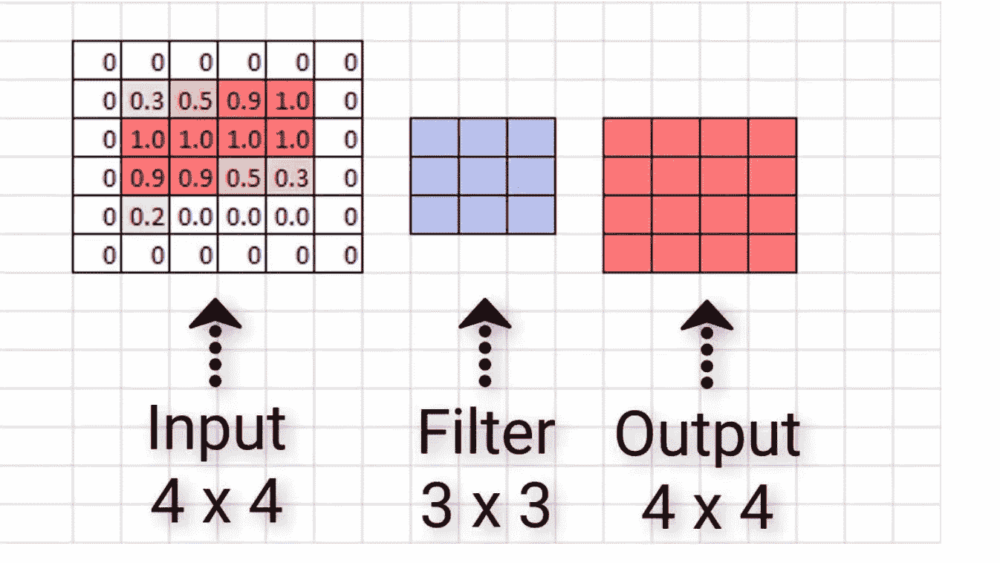
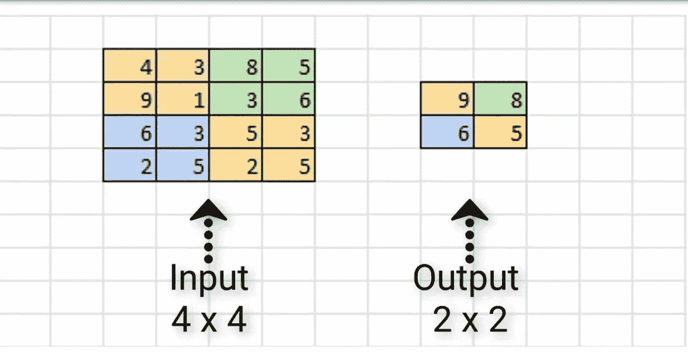
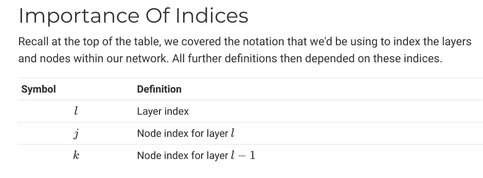
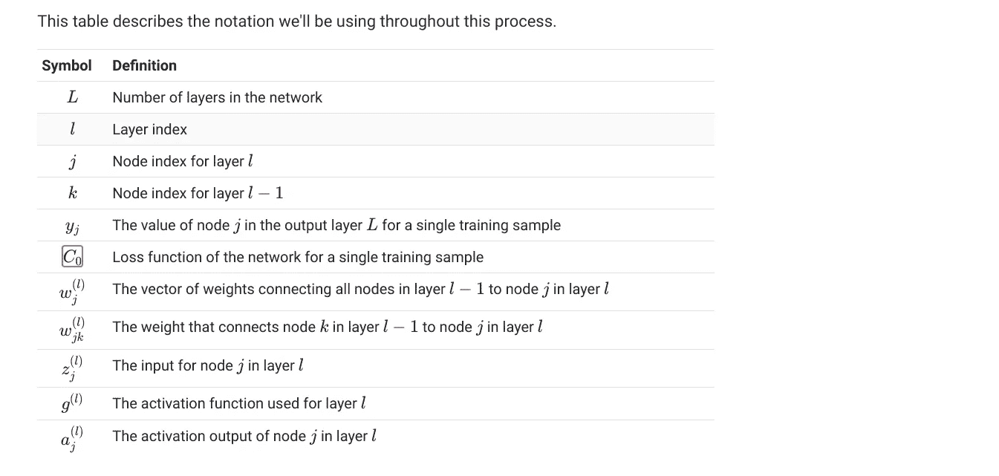

# 具有 Keras 代码的深度学习基本概念

> 原文：<https://medium.com/analytics-vidhya/deep-learning-fundamental-concept-with-keras-code-8293640699b?source=collection_archive---------14----------------------->

Keras 代码实施— Abhishek Adarsh Mishra

深度神经网络与 Keras 代码实现

# **机器学习**

机器学习是使用算法分析数据，从数据中学习，然后决定或预测新数据的实践。

*   从这些数据中学习。

该算法分析给定的媒体数据，并学习对负面文章和正面文章进行分类的特征。

# 深度学习

深度学习是机器学习的一个子领域，它使用受大脑神经网络结构和功能启发的算法。

# **人工神经网络**

人工神经网络是一个计算系统，它由一组称为神经元的连接单元组成，这些单元被组织成我们所说的层。

*   人工神经网络是用我们称之为神经元的东西构建的。
*   人工神经网络中的神经元被组织成我们所说的层。
*   ANN 中的层(除了输入和输出层之外的所有层)称为隐藏层。
*   如果一个 ANN 有一个以上的隐藏层，则称该 ANN 为深层 ANN

节点被组织成我们所说的层。在最高级别，每个人工神经网络中有三种类型的层:

*   输入层
*   隐藏层
*   输出层

**深度学习 Keras 序列模型**

> 从 keras.models 导入序列
> 
> 从 keras.layers 导入密集，激活
> 
> #生成一个神经网络
> 
> 模型=顺序([
> 
> Dense(5，input_shape=(3，)，activation='relu ')，#隐藏层，shape 是输入层
> 
> Dense(2，activation='softmax ')，#输出层
> 
> ])

# **神经网络中的层**

然而，存在不同类型的层。一些例子包括:

*   密集(或完全连接)层
*   卷积层
*   池层
*   循环层
*   标准化图层

**层权重**

两个节点之间的每个连接都有一个关联权重，它只是一个数字。

每个权重代表两个节点之间的连接强度。当网络在输入层的给定节点接收到输入时，该输入通过连接传递到下一个节点，并且该输入将乘以分配给该连接的权重。

> 节点输出=激活(输入的加权和)

**前向传递神经网络**

一旦我们获得给定节点的输出，所获得的输出就是作为输入传递给下一层中的节点的值。

**寻找最佳权重**

随着模型的学习，所有连接处的权重都会更新和优化，以便输入数据点映射到正确的输出预测类

> 将 numpy 作为 np 导入
> 
> 从 scipy 导入 ndimage
> 
> 将 matplotlib.pyplot 作为 plt 导入
> 
> %matplotlib 内联
> 
> img = NP . expand _ dims(ndimage . im read(' NN。PNG ')、0)
> 
> plt.imshow(img[0])

# 激活功能

在人工神经网络中，激活函数是将节点的输入映射到其相应输出的函数。

**乙状结肠激活功能**

Sigmoid 接收输入并执行以下操作:

*   对于大多数负输入，sigmoid 会将输入转换为非常接近 0 的数字。
*   对于大多数正输入，sigmoid 会将输入转换为非常接近 1 的数字。
*   对于相对接近 0 的输入，sigmoid 会将输入转换为 0 到 1 之间的某个数字。

> sigmoid(x) = e^x/(e^x + 1)

**激活功能直觉**

嗯，激活功能是由我们大脑中的活动激发的，不同的神经元被不同的刺激激活。

例如，如果你闻到一些令人愉快的味道，比如新鲜出炉的饼干，你大脑中的某些神经元就会被激活。如果你闻到不愉快的味道，比如变质的牛奶，这将导致你大脑中的其他神经元放电。

> **relu** 激活功能=整流器线性单元
> 
> **relu(x)** = max(0，x)

**带激活功能的代码**

> 从 keras.models 导入序列
> 
> 从 keras.layers 导入密集，激活
> 
> 模型=顺序([
> 
> 密集(单位=5，输入形状=(3，)，激活='relu ')
> 
> ])
> 
> 模型=顺序()
> 
> model.add(Dense(units=5，input_shape=(3，))
> 
> model.add(激活(' relu '))

# 训练人工神经网络

**优化算法**

使用我们称之为优化算法的方法来优化权重。

最广为人知的优化器被称为**随机梯度下降**，或者更简单地说，SGD。

当我们有任何优化问题时，我们必须有一个优化目标，所以现在让我们考虑 SGD 在优化模型权重方面的目标是什么。

SGD 的目标是最小化某个给定的函数，我们称之为损失函数。

**损失函数**

一个常见的损失函数是均方误差(MSE ),但我们可以用几个损失函数来代替它

损失是网络对图像的预测与图像的真实标签之间的误差或差异，SGD 将尝试最小化该误差，以使我们的模型尽可能准确地进行预测。

# **解释了神经网络如何学习**

一个**时期**指的是在训练期间整个数据集到网络的一次传递。

20 个历元意味着传递了 20 次数据

**损失函数的梯度**

计算损失后，为网络中的每个权重计算该损失函数的梯度。

我们已经计算了单个输出的损失，并计算了单个选定重量的损失梯度。这个计算是使用一种叫做**反向传播，* *的技术来完成的

**学习率**

然后，我们将梯度值乘以一个叫做学习率的东西。学习率是一个很小的数字，通常在 0.01 和 0.0001 之间，但实际值可以变化。

学习率告诉我们在最小值的方向上应该走多大的**步**。(更新)

**更新权重**

好的，我们用学习率乘以梯度，然后从权重中减去这个乘积，这将给出这个权重的新的更新值。

> 新 wt=旧 wt —(学习率*梯度)

**代号**

> 导入 keras
> 
> 将 numpy 作为 np 导入
> 
> 从 keras.models 导入序列
> 
> 从 keras.layers 导入激活
> 
> 从 keras.layers.core 导入密集
> 
> 优化程序导入 Adam
> 
> 从 keras.metrics 导入分类交叉熵
> 
> 模型=顺序([
> 
> Dense(units=16，input_shape=(1，)，activation='relu ')，
> 
> 密集(单位=32，激活='relu ')，
> 
> 密集(单位=2，激活= ' s 形')
> 
> ])
> 
> 模型.编译(
> 
> optimizer = Adam(learning _ rate = 0.0001)，
> 
> loss= '稀疏分类交叉熵'，
> 
> 度量=['准确性']
> 
> )
> 
> train_samples = np.array([
> 
> [150, 67],
> 
> [130, 60],
> 
> [200, 65],
> 
> [125, 52],
> 
> [230, 72],
> 
> [181, 70]
> 
> ])
> 
> # 0:男性
> 
> # 1:女性
> 
> train_labels = np.array([1，1，0，1，0，0])
> 
> #scaled_train_samples 是由训练样本组成的 numpy 数组。
> 
> #train_labels 是一个 numpy 数组，由训练样本的相应标签组成。
> 
> 模型. fit(
> 
> x =训练样本，
> 
> y =火车标签，
> 
> batch_size=3
> 
> 纪元=10，
> 
> 洗牌=真，
> 
> 详细=2，
> 
> )

# 神经网络中的损失函数

> 误差=输出-实际值
> 
> 平均平方误差=总和((输出-实际) )

我们可以看到指定的损失函数**loss = ' sparse _ category _ cross entropy '**。

**代码**

> 模型=顺序([
> 
> Dense(16，input_shape=(1，)，activation='relu ')，
> 
> Dense(32，激活='relu ')，
> 
> Dense(2，激活='sigmoid ')
> 
> ])
> 
> 模型.编译(
> 
> 亚当(learning_rate=.0001)，
> 
> 损失= '稀疏分类交叉熵'，#损失函数
> 
> 度量=['准确性']
> 
> )

当前可用于 Keras 的损失函数如下:

*   均方误差
*   平均绝对误差
*   平均值绝对百分比误差
*   均方对数误差
*   方形铰链
*   关键
*   分类铰链
*   对数曲线
*   分类交叉熵
*   稀疏分类交叉熵
*   二元交叉熵
*   库尔贝克 _ 莱布勒 _ 散度
*   泊松
*   余弦近似

# 喀拉的学习率

> 模型=顺序([
> 
> Dense(units=16，input_shape=(1，)，activation='relu ')，
> 
> Dense(units=32，activation='relu '，kernel _ regulator = regulators . L2(0.01))，
> 
> 密集(单位=2，激活= ' s 形')
> 
> ])
> 
> 模型.编译(
> 
> optimizer = Adam(learning _ rate = 0.0001)，
> 
> loss= '稀疏分类交叉熵'，
> 
> 度量=['准确性']
> 
> )

# 解释了培训、测试和验证集

**训练集**

训练集就像它听起来的那样。这是用来训练模型的数据集。在每个时期，我们的模型将在我们的训练集中对相同的数据进行一次又一次的训练，它将继续学习这些数据的特征。

**验证设置**

验证集是一组独立于训练集的数据，用于在训练期间验证我们的模型。这一验证过程有助于提供有助于我们调整超参数的信息。

我们需要验证集的主要原因之一是确保我们的模型不会**过度适应**训练集中的数据。

验证集让我们可以看到模型在训练过程中概括得有多好。

**测试设置**

测试集是在模型已经被训练之后用于测试模型的一组数据。测试集独立于训练集和验证集。

在将模型部署到生产环境之前，测试集提供了对模型泛化能力的最终检查。

**代号**

> 模型. fit(
> 
> x=scaled_train_samples，#scaled_train_samples 是由训练样本组成的 numpy 数组。
> 
> y=train_labels，#train_labels 是一个 numpy 数组，由训练样本的相应标签组成。
> 
> 验证数据=有效设置，
> 
> batch_size=10
> 
> 纪元=20，
> 
> 洗牌=真，
> 
> 详细=2
> 
> )

# 用神经网络预测

预测是基于模型在训练中所学到的东西。

传递无标签的样品

**在现实世界中部署模型(生产)**

除了在我们的测试数据上运行预测，我们还可以让我们的模型在现实世界的数据上预测，一旦它被部署来服务于它的实际目的。

> 预测=模型.预测(
> 
> x =缩放测试样本，
> 
> batch_size=10
> 
> 详细=0
> 
> )

# **过拟合**

当我们的模型变得非常擅长对包含在训练集中的数据进行分类或预测，但不擅长对未经训练的数据进行分类时，就会发生过度拟合。因此，从本质上讲，模型过度拟合了训练集中的数据。

如果在训练期间，模型的指标很好，但是当我们使用模型预测测试数据时，它不能准确地对测试集中的数据进行分类，我们也可以认为我们的模型是过度拟合的。

**减少过拟合**

*   向训练集添加更多数据
*   数据扩充(通过裁剪、旋转、翻转来添加新数据或修改旧数据
*   降低模型的复杂性(去除神经元层)
*   丢弃一些神经元(数据)

# 欠拟合

当一个模型不能对它被训练的数据进行分类时，它就被认为是不适合的。

当给定的训练数据的度量很差时，我们可以知道模型是欠拟合的，这意味着模型的训练精度低和/或训练损失高。

**减少欠配合**

*   增加模型的复杂性
*   增加模型中的层数。
*   增加每层中神经元的数量。
*   改变我们使用的图层类型和位置。
*   向输入样本添加更多要素(更多列)
*   降低辍学率

# **监督学习**

*   标记数据
*   标签用于监督或指导学习过程。

# 无监督学习

无监督学习发生在未标记的数据上。

它将尝试从数据中学习某种类型的结构，并从这些数据中提取有用的信息或特征。

它将学习如何创建从给定输入到特定输出的映射，这是基于它对没有任何标签的数据结构的学习。

无监督学习示例

*   聚类算法
*   自动编码器

自动编码器是一种人工神经网络，它接收输入，然后输出该输入的重构。

# 半监督学习

半监督学习使用监督和非监督学习技术的组合，这是因为，在我们使用半监督学习的场景中，我们将有标记和未标记数据的组合。

*   标记数据上的第一列
*   然后用先前训练的标记数据预测的伪标记来训练剩余数据。

**伪标记**允许我们在大得多的数据集上进行训练。

# 数据扩充

当我们根据对现有数据的修改创建新数据时，就会发生这种情况。

所有这些都是常见的数据扩充技术。

*   水平翻转
*   垂直翻转
*   旋转
*   放大
*   缩小
*   种植
*   颜色变化

用于在过度拟合的情况下增加数据数量。

# 一键编码

冷热值

一种广泛用于用数值对分类数据进行编码的编码类型被称为一次性编码。

一键编码将我们的分类标签转换成 0 和 1 的向量。这些向量的长度是我们的模型期望分类的类或类别的数量。

0 和 1 的向量

如果我们对图像进行分类，是狗还是猫，那么我们对应于这些类别的独热编码向量的长度都是 2，反映了这两个类别。

如果我们添加另一个类别，如蜥蜴，这样我们就可以分类图像是狗、猫还是蜥蜴，那么我们对应的独热编码向量的长度都将是 3，因为我们现在有三个类别。

*   标签索引-0 索引-1 索引-2
*   第 1 0 0 类
*   狗 0 1 0
*   蜥蜴 0 0 1

— — — — — — — — — — -

*   标签向量
*   猫[1，0，0，0]
*   狗[0，1，0，0]
*   蜥蜴
*   美洲驼[0，0，0，1]

# 卷积神经网络

CNN 是一种人工神经网络，具有某种类型的专门化，能够挑选或检测模式。这种模式检测使得 CNN 对图像分析如此有用。

CNN 有被称为卷积层的隐藏层，这些层构成了 CNN，嗯…CNN！

滤波器和卷积运算

如前所述，卷积神经网络能够检测图像中的模式。

对于每个卷积层，我们需要指定该层应该具有的滤波器数量。这些过滤器实际上是用来检测模式的。

这就是我们所说的模式。

*   优势
*   形状
*   口感
*   曲线
*   目标
*   颜色；色彩；色调

# 可视化卷积滤波器

> #使用 ImageNet 权重构建 VGG16 网络
> 
> model = VGG16(weights='imagenet '，include_top=False)
> 
> 打印(“模型已加载”)
> 
> 模型.摘要()
> 
> #输入图像的占位符
> 
> 输入 _ 输入=模型.输入
> 
> #获取每个“关键”层的符号输出(我们给出了唯一的名称)
> 
> layer_dict = dict([(layer.name，layer)for layer in model . layers[1:]])

**处理**

> model = VGG16(weights='imagenet '，include_top=False)
> 
> #我们建立了一个最大化激活的损失函数
> 
> 所考虑层的第 n 个过滤器的数量
> 
> 层输出=层字典[层名称]。输出
> 
> if k . image _ data _ format()= = ' channels _ first ':
> 
> loss = K.mean(layer_output[:，filter_index，:))
> 
> 否则:
> 
> loss = K.mean(图层输出[:，:，:，过滤器索引])
> 
> #我们计算输入图像在这种损失下的梯度
> 
> grads = K.gradients(loss，input_img)[0]
> 
> #我们从带有随机噪声的灰度图像开始
> 
> if k . image _ data _ format()= = ' channels _ first ':
> 
> input _ img _ data = NP . random . random((1，3，img_width，img_height))
> 
> 否则:
> 
> input _ img _ data = NP . random . random((1，img_width，img_height，3))
> 
> input _ img _ data =(input _ img _ data—0.5)* 20+128
> 
> save _ img(' stitched_filters _ % dx % d . png ' %(n，n)，stitched _ filters)

# 零填充

图像尺寸通过过滤而减小。

为了便于形象化，让我们来看一个更小的例子。这里我们有一个大小为 4 x 4 的输入，然后是一个 3 x 3 的滤波器。让我们看看这个滤波器可以对输入进行多少次卷积，以及最终的输出大小是多少。

> 图像= (n* *n)滤镜= (f** f)输出= (n-f+1) * (n-f+g)

所以角落丢了。

**什么是零填充？**

我们现在知道零填充反对什么问题，但它实际上是什么？

当我们在输入图像的边缘周围添加一个像素值都为零的边界时，就会出现零填充。这在图像外部添加了一种零填充，因此被称为零填充。回到前面的小例子，如果我们用零值像素填充输入，让我们看看卷积输入后的输出大小。

*   填充-类型-描述影响
*   “有效”-无填充-尺寸减小
*   “相同”-边缘周围的零-尺寸保持不变

**使用 Keras 中的代码**

> 导入 keras
> 
> 从 keras.models 导入序列
> 
> 从 keras.layers 导入激活
> 
> 从 keras.layers.core 导入密集、展平
> 
> 来自 keras.layers .卷积导入*
> 
> model_valid =顺序([
> 
> Dense(16，input_shape=(20，20，3)，activation='relu ')，
> 
> Conv2D(32，kernel_size=(3，3)，activation='relu '，padding='valid ')，
> 
> Conv2D(64，kernel_size=(5，5)，activation='relu '，padding='valid ')，
> 
> Conv2D(128，kernel_size=(7，7)，activation='relu '，padding='valid ')，
> 
> Flatten()，
> 
> Dense(2，activation='softmax ')
> 
> ])
> 
> 模型 _ 有效.摘要()

# 最大池化

它减小了矩阵的大小

**为什么要使用 Max Pooling？**

*   减少计算量和参数
*   减少过度拟合

**代码**

> 导入 keras
> 
> 从 keras.models 导入序列
> 
> 从 keras.layers 导入激活
> 
> 从 keras.layers.core 导入密集、展平
> 
> 来自 keras.layers .卷积导入*
> 
> 从 keras.layers.pooling 导入*
> 
> model_valid =顺序([
> 
> Dense(16，input_shape=(20，20，3)，activation='relu ')，
> 
> Conv2D(32，kernel_size=(3，3)，activation='relu '，padding='same ')，
> 
> MaxPooling2D(pool_size=(2，2)，strides=2，padding='valid ')，
> 
> Conv2D(64，kernel_size=(5，5)，activation='relu '，padding='same ')，
> 
> Flatten()，
> 
> Dense(2，activation='softmax ')
> 
> ])
> 
> 模型 _ 有效.摘要()

# 神经网络中的反向传播

*   随机梯度下降
*   正向传播
*   计算损失

反向传播是梯度下降用来计算损失函数的梯度的工具。

**反向传播直觉**

为了更新权重，梯度下降将从查看来自输出节点的激活输出开始。

**反向传播的数学观测值**

*   观察我们如何表达损失函数
*   观察我们如何表达给定节点的输入和输出。
*   观察我们如何区分损失函数。

# 消失和爆炸梯度解释|由反向传播引起的问题

**什么是渐变消失问题？**

通常，消失梯度问题是在训练神经网络时引起主要困难的问题。更具体地说，这是一个涉及网络早期层中权重的问题。

现在，有时网络前几层的权重梯度变得很小，几乎为零。因此，消失梯度。

**爆炸梯度**现在考虑计算相同重量的梯度，但不是很小的项，如果它们很大呢？我们所说的“大”是指不止一个。

如果我们把一堆都大于 1 的项相乘，我们会得到大于 1 的数，甚至可能比 1 大很多。

# 重量初始化

具体来说，每当我们构建和编译一个网络时，权重的值将被设置为随机数。每个重量一个随机数。典型地，这些随机数将是正态分布的，使得这些数的分布具有 0 的平均值和 1 的标准偏差。

**随机初始化的问题**

如果我们的激活函数的期望输出位于饱和的相反侧，那么在训练期间，当 SGD 更新权重以试图影响激活输出时，它只会对该激活输出的值进行非常小的改变，甚至几乎不会在正确的方向上递增。

**Xavier 初始化**

事后看来，我们应该能够回过头来看看我们已经讨论过的问题，并追溯到这些问题是由加权和的方差大于或小于 1 引起的。所以要解决这个问题，我们能做的就是迫使这个方差变小。

> var(wt)= 2/n
> 
> 更新-
> 
> 重量=根(2/n)
> 
> var(wt) = 2/((n)in + (n)out)

**代码**

> 从 keras.models 导入序列
> 
> 从 keras.layers 导入密集，激活
> 
> 模型=顺序([
> 
> Dense(16，input_shape=(1，5)，activation='relu ')，
> 
> Dense(32，activation='relu '，kernel _ initializer = ' glorot _ uniform ')，# glorot _ uniform 是 xavier 初始化
> 
> Dense(2，activation='softmax ')
> 
> ])

# 偏见

*   首先，当我们谈论偏见时，我们是在每个神经元的基础上谈论的。我们可以认为每个神经元都有自己的偏置项，因此整个网络将由多个偏置项组成。
*   现在，分配给这些偏差的值是可以学习的，就像权重一样。
*   增加模型的灵活性。
*   g(w1x1 + w2x2 + ……+ wnxn + B)

b 是偏差项

# 人工神经网络中的可学习参数

由网络在训练期间学习的参数

> **可学习参数** =输入+输出+偏置

# CNN 中的可学习参数

> 输入*输出+偏差

在哪里，

输入=(如果最后一项密集，则输入是节点的编号)或(如果最后一层是 conv，则输入是过滤器的编号)

> 输出=(过滤器数量)+(过滤器尺寸)
> 
> 偏差=过滤器数量

# 正规化

*   正则化是一种通过惩罚复杂性来帮助减少过度拟合或减少我们网络中的变化的技术。
*   减轻大重量。
*   损失+ x
*   其中 x 对于大 wt 是不利的

**L2 正规化**

最常见的正则化技术称为 L2 正则化。我们知道，正则化基本上包括在损失函数中增加一项，对大权重进行惩罚。

损失+ x

这里 x = summation(1，n){||w[f]|| * lamda/2m}

*   n =层数
*   w[f] =第 j 层的 wt 矩阵
*   m =输入数量

# 密码

> 从 keras.models 导入序列
> 
> 从 keras.layers 导入密集，激活
> 
> 模型=顺序([
> 
> Dense(16，input_shape=(1，5)，activation='relu ')，
> 
> Dense(32，activation='relu '，kernel _ regulator = regular iser . L2(0.01))，# l2 regulariser
> 
> Dense(2，activation='softmax ')
> 
> ])

# 神经网络中的批量大小

批量大小是一次传递到网络的样本数量

> 巴克。=纪元
> 
> 历元中的批次=训练集大小/ batch_size

*   批量越大=训练越快，但质量下降。

> 模型. fit(
> 
> x =缩放的训练样本，
> 
> y =火车标签，
> 
> 验证数据=有效设置，
> 
> batch_size=10，#批量大小
> 
> 纪元=20，
> 
> 洗牌=真，
> 
> 详细=2
> 
> )

# 微调神经网络

微调与术语迁移学习密切相关

当我们使用从解决一个问题中获得的知识，并将其应用于一个新的但相关的问题时，迁移学习就发生了。

为什么要使用微调？假设原始任务与新任务相似，使用已经设计和训练好的人工神经网络可以让我们利用模型已经学习到的东西，而不必从头开始开发。

例如，我们必须选择使用多少层，使用什么类型的层，以什么顺序放置层，每层包含多少节点，决定使用多少正则化，将我们的学习速率设置为什么，等等。

*   层数
*   层的类型
*   层的顺序
*   每层中的节点数
*   使用多少正则化
*   学习率

# 批量标准化(“批量标准”)

**标准化技术**

z= (x-m)/s

**为什么？**

这些非标准化数据集中较大的数据点会导致神经网络不稳定，因为相对较大的输入会通过网络中的层向下级联，这可能导致不平衡的梯度，从而可能导致著名的**爆炸梯度问题**。

将批次定额应用于图层

*   批处理规范化应用于图层。
*   标准化激活函数的输出 x
*   z=(x-m)/s
*   将归一化输出 z 乘以任意参数 g。
*   z*g
*   将任意参数 b 添加到结果乘积(z*g)中。
*   (z*g)+b

**代码**

> 从 keras.models 导入序列
> 
> 从 keras.layers 导入密集、激活、批量标准化#导入批量标准化
> 
> 模型=顺序([
> 
> 密集(units=16，input_shape=(1，5)，activation='relu ')，
> 
> 密集(单位=32，激活='relu ')，
> 
> 批次正常化(轴=1)，#批次正常化
> 
> 密集(单位=2，激活='softmax ')
> 
> ])