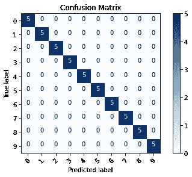

# 用 Keras 和 Tensorflow 实现深度学习

> 原文：<https://medium.com/analytics-vidhya/deep-learning-implementation-with-keras-and-tensorflow-c29ef21e5a1d?source=collection_archive---------10----------------------->

## 喀拉斯和张量流


克拉斯

# 克拉斯

Keras 是一个开源软件库，为人工神经网络提供了 Python 接口。Keras 充当 TensorFlow 库的接口。

Keras 的开发重点是实现快速实验。正因为如此，它非常用户友好，让我们从想法到实现只需几步。

# 先决条件

首先浏览一下我的关于带有 Keras 代码的[深度学习基本概念的文章。](/analytics-vidhya/deep-learning-fundamental-concept-with-keras-code-8293640699b)

我会推荐你使用 Google Colab 来执行本课程的代码。

使用此网站编码相关问题

*   [https://www.tensorflow.org/](https://www.tensorflow.org/)

# 代码的 Github 链接

[https://github . com/AbhishekAdarshMishra/Deep-Learning-Implementation-with-Keras-and-tensor flow](https://github.com/AbhishekAdarshMishra/Deep-Learning-Implementation-with-Keras-and-Tensorflow)

# 历史

从历史上看，Keras 是一个高级 API，位于三个低级神经网络 API 之一之上，充当这些低级库的包装器。这些库被称为 Keras 后端引擎。

后来，Keras 与 TensorFlow 库集成在一起，现在完全打包在一起了。

现在，当您安装 TensorFlow 时，您还会自动获得 Keras，因为它现在是 TensorFlow 库的一部分。

# 如何安装 Keras

> pip 安装张量流

# **colab 中的 GPU 设置**

->任务栏

*   ->运行时
*   ---->更改运行时类型
*   -------->硬件= GPU

**代码**

```
physical_devices = tf.config.experimental.list_physical_devices('GPU')
print("Num GPUs Available: ", len(physical_devices))
tf.config.experimental.set_memory_growth(physical_devices[0], True)
```

# 数据准备和预处理

参考:-

*   [https://www . tensor flow . org/API _ docs/python/TF/keras/Sequential](https://www.tensorflow.org/api_docs/python/tf/keras/Sequential)

顺序模型

```
fit(
    x=None, 
    y=None,
    batch_size=None,
    epochs=1,
    verbose=1,
    callbacks=None,
    validation_split=0.0,
    validation_data=None,
    shuffle=True,
    class_weight=None,
    sample_weight=None,
    initial_epoch=0,
    steps_per_epoch=None,
    validation_steps=None,
    validation_batch_size=None,
    validation_freq=1,
    max_queue_size=10,
    workers=1,
    use_multiprocessing=False
)
```

数据准备

```
import numpy as np
from random import randint
from sklearn.utils import shuffle
from sklearn.preprocessing import MinMaxScalertrain_labels = []
train_samples = []
```

*   在一项临床试验中，一种实验性药物在年龄从`13`到`100`不等的个体身上进行了测试。
*   该试验有`2100`名参与者。一半的参与者不到`65`岁，另一半是`65`岁或以上。
*   大约`95%`名`65`或以上的患者出现了药物副作用。
*   在`65`以下的患者中，大约`95%`的患者没有出现副作用。

```
for i in range(50):
    # The ~5% of younger individuals who did experience side effects
    random_younger = randint(13,64)
    train_samples.append(random_younger)
    train_labels.append(1)
    # 1 represent experice side effect # The ~5% of older individuals who did not experience side effects 
    random_older = randint(65,100)
    train_samples.append(random_older)
    train_labels.append(0)
    # 0 represent does not experience side effectfor i in range(1000):
    # The ~95% of younger individuals who did not experience side effects
    random_younger = randint(13,64)
    train_samples.append(random_younger)
    train_labels.append(0)

    # The ~95% of older individuals who did experience side effects
    random_older = randint(65,100)
    train_samples.append(random_older)
    train_labels.append(1)for i in train_samples:
    print(i)for i in train_labels:
    print(i)
```

我们现在将两个列表都转换成 NumPy 数组，这是因为我们讨论了`fit()`函数所期望的，然后我们对数组进行洗牌，以去除在创建过程中对数据施加的任何顺序。

```
train_labels = np.array(train_labels)
train_samples = np.array(train_samples)
train_labels, train_samples = shuffle(train_labels, train_samples)
```

`MinMaxScaler`类将所有数据从`13`到`100`的范围缩小到`0`到`1`的范围。

```
scaler = MinMaxScaler(feature_range=(0,1))
scaled_train_samples = scaler.fit_transform(train_samples.reshape(-1,1))
```

让我们迭代缩放后的数据

```
for i in scaled_train_samples:
    print(i)
```

# 使用 TensorFlow 的 Keras API 创建神经网络

使用 TensorFlow 中集成的 Keras API 中的`Sequential`模型创建一个简单的人工神经网络。

```
import tensorflow as tf
from tensorflow import keras
from tensorflow.keras.models import Sequential
from tensorflow.keras.layers import Activation, Dense
from tensorflow.keras.optimizers import Adam
from tensorflow.keras.metrics import categorical_crossentropyphysical_devices = tf.config.experimental.list_physical_devices('GPU')
print("Num GPUs Available: ", len(physical_devices))
#(if available gpu uncomment) tf.config.experimental.set_memory_growth(physical_devices[0], True)model = Sequential([
    Dense(units=16, input_shape=(1,), activation='relu'),
    Dense(units=32, activation='relu'),
    Dense(units=2, activation='softmax')
])model.summary()
```

*   第一层=它包含一个有 16 个(任意值)节点的密集层，我们也定义了输入形状。
*   第二层=它是隐藏层。
*   第三层=包含输出。
*   softmax 和 relu 是激活函数。

# 训练神经网络

## 编译模型

```
model.compile(optimizer=Adam(learning_rate=0.0001), loss='sparse_categorical_crossentropy', metrics=['accuracy'])
```

*   它包含学习率、损失函数和我们为准确性度量选择的度量。
*   Adam 接受可选参数学习率。

## 训练模型

```
model.fit(x=scaled_train_samples, y=train_labels, batch_size=10, epochs=30, verbose=2)
```

*   Epoch 是所有数据到网络的一次传递。即整个数据被传递的次数。
*   批量是指每次通过的样本数量。
*   对于输出，verbose 为 1 或 2。主要是 2 用在里面。
*   在输出中，我们将看到模型的训练精度几乎达到 94%。

# 构建验证集

我们希望训练数据集更准确，并且具有低损失值。因此，为了检查这一点，我们使用了一个验证集。

在训练开始之前，我们可以选择删除训练集的一部分，并将其放入**验证集**。

*   验证集显示了我们的数据集有多一般化。
*   如果准确度和验证准确度相似，那么我们的模型是一般化的。
*   否则，也许存在过度拟合的情况。

有两种类型的验证集。

## 1 >手动创建验证集

Numpy 数组或张量的元组`valid_set = (x_val, y_val)`。

当我们调用`model.fit()`时，除了训练集之外，我们还会传入验证集

```
model.fit(
      x=scaled_train_samples
    , y=train_labels
    , validation_data=valid_set
    , batch_size=10
    , epochs=30
    , verbose=2
)
```

## 2 >使用 Keras 创建验证集

当我们调用`model.fit()`时，我们可以为`validation_split`参数设置一个值。它需要一个介于`0`和`1`之间的分数。

```
model.fit(
      x=scaled_train_samples
    , y=train_labels
    , validation_split=0.1
    , batch_size=10
    , epochs=30
    , verbose=2
)
```

# 神经网络预测

***推论***

该模型使用从训练中获得的知识，并使用它来推断预测或结果。

***测试设置***

```
test_labels =  []
test_samples = []

for i in range(10):
    # The 5% of younger individuals who did experience side effects
    random_younger = randint(13,64)
    test_samples.append(random_younger)
    test_labels.append(1)

    # The 5% of older individuals who did not experience side effects
    random_older = randint(65,100)
    test_samples.append(random_older)
    test_labels.append(0)

for i in range(200):
    # The 95% of younger individuals who did not experience side effects
    random_younger = randint(13,64)
    test_samples.append(random_younger)
    test_labels.append(0)

    # The 95% of older individuals who did experience side effects
    random_older = randint(65,100)
    test_samples.append(random_older)
    test_labels.append(1)

test_labels = np.array(test_labels)
test_samples = np.array(test_samples)
test_labels, test_samples = shuffle(test_labels, test_samples)

scaled_test_samples = scaler.fit_transform(test_samples.reshape(-1,1))
```

**预测**

```
predictions = model.predict(
      x=scaled_test_samples
    , batch_size=10
    , verbose=0  # zero as we dont want this function to print #output, instead we want it to be stored in prediction only
)for i in predictions:
    print(i)
```

第一列包含每个患者未出现副作用的概率，用`0`表示。第二列包含每个患者出现副作用的概率，用一个`1`表示。

因此，舍入预测将给出哪个值为 0 或 1 的概率较高。

```
rounded_predictions = np.argmax(predictions, axis=-1)

for i in rounded_predictions:
    print(i)
```

# 混淆矩阵

这用于评估我们的模型训练 w.r.t 测试集的准确程度。

对于混淆矩阵，我们传递真实标签`test_labels`以及测试集的网络预测标签`rounded_predictions`。

```
%matplotlib inline
from sklearn.metrics import confusion_matrix
import itertools
import matplotlib.pyplot as pltcm = confusion_matrix(y_true=test_labels, y_pred=rounded_predictions)
```

下面，我们有一个名为`plot_confusion_matrix()`的函数，它直接来自于 [scikit-learn 的网站](https://scikit-learn.org/stable/auto_examples/model_selection/plot_confusion_matrix.html#sphx-glr-auto-examples-model-selection-plot-confusion-matrix-py)。这是他们为了绘制混乱矩阵而提供的代码。

```
def plot_confusion_matrix(cm, classes,
                        normalize=False,
                        title='Confusion matrix',
                        cmap=plt.cm.Blues):
    """
    This function prints and plots the confusion matrix.
    Normalization can be applied by setting `normalize=True`.
    """
    plt.imshow(cm, interpolation='nearest', cmap=cmap)
    plt.title(title)
    plt.colorbar()
    tick_marks = np.arange(len(classes))
    plt.xticks(tick_marks, classes, rotation=45)
    plt.yticks(tick_marks, classes)

    if normalize:
        cm = cm.astype('float') / cm.sum(axis=1)[:, np.newaxis]
        print("Normalized confusion matrix")
    else:
        print('Confusion matrix, without normalization')

    print(cm)

    thresh = cm.max() / 2.
    for i, j in itertools.product(range(cm.shape[0]), range(cm.shape[1])):
        plt.text(j, i, cm[i, j],
            horizontalalignment="center",
            color="white" if cm[i, j] > thresh else "black")

    plt.tight_layout()
    plt.ylabel('True label')
    plt.xlabel('Predicted label')
```

标签的标题是“无副作用”和“有副作用”

```
cm_plot_labels = ['no_side_effects','had_side_effects']plot_confusion_matrix(cm=cm, classes=cm_plot_labels, title='Confusion Matrix')
```


图:混淆矩阵

## 阅读混淆矩阵

主对角线包含当前值，次对角线包含错误答案。

因此，主对角线应包含最大值，次对角线应包含最小值。

# 保存并加载模型

**1。model.save()**

```
# Check first to see if file exists already.
# If not , the model is saved to disk.import os.path
if os.path.isfile('models/medical_trial_model.h5') is False:
model.save('models/medical_trial_model.h5')
```

此保存功能保存:

*   模型的架构，允许重新创建模型。
*   模型的重量。
*   训练配置(损耗、优化器)。
*   优化器的状态，允许从您停止的地方重新开始训练。

**2。负载 _ 型号**

```
from tensorflow.keras.models import load_model
new_model = load_model('models/medical_trial_model.h5')new_model.summary()new_model.get_weights()new_model.optimizer
```

**3。model.to_json()**

如果您只需要保存模型的架构，而不需要保存其权重或训练配置，您可以使用以下函数只保存架构。

```
# save as JSONjson_string = model.to_json()# save as YAML
# yaml_string = model.to_yaml()json_string# model reconstruction from JSONfrom tensorflow.keras.models import model_from_json
model_architecture = model_from_json(json_string)# model reconstruction form YAML
# from tensorflow.keras.models import model_from_yaml
# model = model_from_yaml(yaml_string)model_architecture.summary()
```

**4。model.save_weights()**

如果你只需要保存一个模型的权重，你可以使用下面的函数只保存权重。

```
# Check first to see if file exists already.
# If not , the model is saved to disk.import os.path
if os.path.isfile('models/medical_trial_model.h5') is False:
model.save('models/medical_trial_model.h5')model2 = Sequential([
Dense(units=16, input_shape=(1,), activation='relu'),
Dense(units=32, activation='relu'),
Dense(units=2, activation='softmax')
])model2.load_weights('models/my_model_weights.h5')model2.get_weights()
```

# 卷积神经网络的图像准备

**Kagle 数据集导入**

*   kaggle ->帐户部分->生成 API 令牌
*   在 python 的下一步中将会用到这个令牌。
*   将 kaggle.json 文件粘贴到我的驱动器/kaggle_dataset 中

```
from google.colab import drive
drive.mount('/content/gdrive')import os
os.environ['KAGGLE_CONFIG_DIR']='/content/gdrive/My Drive/kaggle_dataset'%cd /content/gdrive/My Drive/kaggle_dataset!kaggle competitions download -c dogs-vs-cats!mkdir train
!mv train.zip train%cd train
!unzip train.zip
```

**整理数据**

```
import numpy as np
import tensorflow as tf
from tensorflow import keras
from tensorflow.keras.models import Sequential
from tensorflow.keras.layers import Activation, Dense, Flatten, BatchNormalization, Conv2D, MaxPool2D
from tensorflow.keras.optimizers import Adam
from tensorflow.keras.metrics import categorical_crossentropy
from tensorflow.keras.preprocessing.image import ImageDataGenerator
from sklearn.metrics import confusion_matrix
import itertools
import os
import shutil
import random
import glob
import matplotlib.pyplot as plt
import warnings
warnings.simplefilter(action='ignore', category=FutureWarning)
%matplotlib inline # Organize data into train, valid, test dirs
os.chdir('data/dogs-vs-cats')
if os.path.isdir('train/dog') is False:
    os.makedirs('train/dog')
    os.makedirs('train/cat')
    os.makedirs('valid/dog')
    os.makedirs('valid/cat')
    os.makedirs('test/dog')
    os.makedirs('test/cat') os.chdir('/content/gdrive/MyDrive/kaggle_dataset/train/train/')
for i in random.sample(glob.glob('cat*'), 500):
shutil.move(i, '/content/gdrive/MyDrive/kaggle_dataset/train/cat')
for i in random.sample(glob.glob('dog*'), 500):
shutil.move(i, '/content/gdrive/MyDrive/kaggle_dataset/train/dog')
for i in random.sample(glob.glob('cat*'), 100):
shutil.move(i, '/content/gdrive/MyDrive/kaggle_dataset/valid/cat')
for i in random.sample(glob.glob('dog*'), 100):
shutil.move(i, '/content/gdrive/MyDrive/kaggle_dataset/valid/dog')
for i in random.sample(glob.glob('cat*'), 50):
shutil.move(i, '/content/gdrive/MyDrive/kaggle_dataset/test/cat')
for i in random.sample(glob.glob('dog*'), 50):
shutil.move(i, '/content/gdrive/MyDrive/kaggle_dataset/test/dog')
os.chdir('../../')
```

**处理数据**

```
physical_devices = tf.config.experimental.list_physical_devices('GPU')
print("Num GPUs Available: ", len(physical_devices))
tf.config.experimental.set_memory_growth(physical_devices[0], True) train_path = 'data/dogs-vs-cats/train'
valid_path = 'data/dogs-vs-cats/valid'
test_path = 'data/dogs-vs-cats/test'
```

*   我们使用 Keras 的`ImageDataGenerator`类从`train`、`valid`和`test`目录中创建批量数据。
*   我们使用 vgg16 格式处理数据。我们将进一步讨论它。
*   目标尺寸(224，224)用于设置所有图像的尺寸

```
train_batches = ImageDataGenerator(preprocessing_function=tf.keras.applications.vgg16.preprocess_input) \
    .flow_from_directory(directory=train_path, target_size=(224,224), classes=['cat', 'dog'], batch_size=10)
valid_batches = ImageDataGenerator(preprocessing_function=tf.keras.applications.vgg16.preprocess_input) \
    .flow_from_directory(directory=valid_path, target_size=(224,224), classes=['cat', 'dog'], batch_size=10)
test_batches = ImageDataGenerator(preprocessing_function=tf.keras.applications.vgg16.preprocess_input) \
    .flow_from_directory(directory=test_path, target_size=(224,224), classes=['cat', 'dog'], batch_size=10, shuffle=False)
```

**将数据可视化**

```
assert train_batches.n == 1000
assert valid_batches.n == 200
assert test_batches.n == 100
assert train_batches.num_classes == valid_batches.num_classes == test_batches.num_classes == 2imgs, labels = next(train_batches)
```

下面的函数将以 1 行 10 列的网格形式绘制图像

```
def plotImages(images_arr):
    fig, axes = plt.subplots(1, 10, figsize=(20,20))
    axes = axes.flatten()
    for img, ax in zip( images_arr, axes):
        ax.imshow(img)
        ax.axis('off')
    plt.tight_layout()
    plt.show()plotImages(imgs)
print(labels)
```

因此在输出中,[0，1]代表狗,[1，0]代表猫。

# CNN 的代码更新

`DirectoryIterator`，使用`ImageDataGenerator.flow_from_directory()`功能。请注意，`DirectoryIterator`实际上是一个无限重复的数据集，因为只要我们希望，迭代器生成的成批数据将会无限地继续出现。

对于这种类型的数据，需要向`fit()`函数传递一个参数。该参数称为`steps_per_epoch`，应设置为在宣布一个时期结束并开始下一个时期之前从训练集中产生的步骤数(样本批次)。

例如:100 幅训练图像，我们的批量是 5，那么我们将设置`steps_per_epoch= 20`。

如果我们也向模型传递验证数据，我们还需要指定一个名为`validation_steps`的参数。这个参数的行为与`steps_per_epoch`完全相同，除了在我们的验证集上。

同样，对于 predict 函数，我们必须使用 steps 函数。

# 建立和训练一个 CNN

**搭建一个简单的 CNN**

我们将使用 Keras `Sequential`型号

```
model = Sequential([
    Conv2D(filters=32, kernel_size=(3, 3), activation='relu', padding = 'same', input_shape=(224,224,3)),
    MaxPool2D(pool_size=(2, 2), strides=2),
    Conv2D(filters=64, kernel_size=(3, 3), activation='relu', padding = 'same'),
    MaxPool2D(pool_size=(2, 2), strides=2),
    Flatten(),
    Dense(units=2, activation='softmax')
])
```

*   过滤器设置任意任意值
*   最常用的内核大小(3，3)。
*   padding = 'same '启用零填充
*   MAXPOOLING 删除了参数并减少了计算量。

**训练一个简单的 CNN**

```
model.compile(optimizer=Adam(learning_rate=0.0001), loss='categorical_crossentropy', metrics=['accuracy'])model.fit(x=train_batches,
    steps_per_epoch=len(train_batches),
    validation_data=valid_batches,
    validation_steps=len(valid_batches),
    epochs=10,
    verbose=2
)
```

在输出中，我们可以看到准确率为 100%，而验证准确率仅为 68%，这意味着存在过度拟合的情况。

# CNN 预测

**准备测试数据**

```
test_imgs, test_labels = next(test_batches)
plotImages(test_imgs)
print(test_labels)
```

**根据测试数据进行预测**

```
predictions = model.predict(x=test_batches, steps=len(test_batches), verbose=0)np.round(predictions)
```

**混淆矩阵**

```
cm = confusion_matrix(y_true=test_batches.classes, y_pred=np.argmax(predictions, axis=-1))This function prints and plots the confusion matrix.
    Normalization can be applied by setting `normalize=True`.
    """
    plt.imshow(cm, interpolation='nearest', cmap=cmap)
    plt.title(title)
    plt.colorbar()
    tick_marks = np.arange(len(classes))
    plt.xticks(tick_marks, classes, rotation=45)
    plt.yticks(tick_marks, classes)

    if normalize:
        cm = cm.astype('float') / cm.sum(axis=1)[:, np.newaxis]
        print("Normalized confusion matrix")
    else:
        print('Confusion matrix, without normalization')

    print(cm)

    thresh = cm.max() / 2.
    for i, j in itertools.product(range(cm.shape[0]), range(cm.shape[1])):
        plt.text(j, i, cm[i, j],
            horizontalalignment="center",
            color="white" if cm[i, j] > thresh else "black")

    plt.tight_layout()
    plt.ylabel('True label')
    plt.xlabel('Predicted label')
```

绘制混淆矩阵。

```
cm_plot_labels = ['cat','dog']
plot_confusion_matrix(cm=cm, classes=cm_plot_labels, title='Confusion Matrix')
```


混淆矩阵

# 建立一个微调的神经网络

## VGG16 和 ImageNet

我们将用来对猫和狗的图像进行分类的预训练模型被称为 VGG16，这是赢得 2014 年 [ImageNet](http://www.image-net.org/) 竞赛的模型。ImageNet 图书馆收藏了成千上万张属于不同类别的图片。我们只需要 2 个类，将被用作狗和猫。

## **VGG16**

它仅通过从每个点减去在训练集上计算的平均 RGB 值来进行预处理。

## 构建微调模型

下载 vgg16 型号

```
vgg16_model = tf.keras.applications.vgg16.VGG16()
vgg16_model.summary()
type(vgg16_model)
```

制作一个新的顺序模型，包括 vgg16 的所有层，不包括最后一个密集层(输出)。

```
model = Sequential()
for layer in vgg16_model.layers[:-1]:
    model.add(layer)
model.summary()
```

使所有层可训练=假。

```
for layer in model.layers:
    layer.trainable = False
```

添加一个有两个节点的密集层。

```
model.add(Dense(units=2, activation='softmax'))
model.summary()
```

因此，我们最终得到了最后一个包含 2 个节点的密集层(输出)。这允许从 134268738 个参数中训练大约 8194 个参数。

# 训练一个微调的神经网络

**vgg16**

```
model.compile(optimizer=Adam(learning_rate=0.0001), loss='categorical_crossentropy', metrics=['accuracy']) model.fit(x=train_batches,
          steps_per_epoch=len(train_batches),
          validation_data=valid_batches,
          validation_steps=len(valid_batches),
          epochs=5,
          verbose=2
)
```

由于 vgg16 是预训练的模型，所以我们从第一个时期获得 85%的准确度。再多训练一点就能达到 99%的准确率。

# 用微调的神经网络进行预测

```
test_imgs, test_labels = next(test_batches)
plotImages(test_imgs)
print(test_labels)predictions = model.predict(x=test_batches, steps=len(test_batches), verbose=0)
```

## 用混淆矩阵绘制预测

```
cm = confusion_matrix(y_true=test_batches.classes, y_pred=np.argmax(predictions, axis=-1))
cm_plot_labels = ['cat','dog']
plot_confusion_matrix(cm=cm, classes=cm_plot_labels, title='Confusion Matrix')
```


混淆矩阵

# MobileNet 图像分类

MobileNets 是一类小型、低延迟、低功耗的模型，可用于分类、检测和卷积神经网络擅长的其他常见任务。由于它们的体积小，这些被认为是在移动设备上使用的伟大的深度学习模型。

VGG16= 553 mb

移动网络= 17 mb

```
import numpy as np
import tensorflow as tf
from tensorflow import keras
from tensorflow.keras.layers import Dense, Activation
from tensorflow.keras.optimizers import Adam
from tensorflow.keras.metrics import categorical_crossentropy
from tensorflow.keras.preprocessing.image import ImageDataGenerator
from tensorflow.keras.preprocessing import image
from tensorflow.keras.models import Model
from tensorflow.keras.applications import imagenet_utils
from sklearn.metrics import confusion_matrix
import itertools
import os
import shutil
import random
import matplotlib.pyplot as plt
%matplotlib inlinephysical_devices = tf.config.experimental.list_physical_devices('GPU')
print("Num GPUs Available: ", len(physical_devices))
tf.config.experimental.set_memory_growth(physical_devices[0], True)
```

下载 mobilenet

```
mobile = tf.keras.applications.mobilenet.MobileNet()
```

`prepare_image()`接受一个图像`file`，并处理图像以得到模型期望的格式。

```
def prepare_image(file):
    img_path = '/content/gdrive/MyDrive/MobileNetSample/'
    img = image.load_img(img_path + file, target_size=(224, 224))
    img_array = image.img_to_array(img)
    img_array_expanded_dims = np.expand_dims(img_array, axis=0)
    return tf.keras.applications.mobilenet.preprocess_input(img_array_expanded_dims)
```

## 使用 MobileNet 预测

## 移动网络蜥蜴预测

```
from IPython.display import ImageImage(filename='/content/gdrive/MyDrive/MobileNetSample/1.jpg', width=300,height=200)
```


蜥蜴

将图像文件发送到 prepare_data()函数并获得预测。

```
preprocessed_image = prepare_image('1.jpg')
predictions = mobile.predict(preprocessed_image)results = imagenet_utils.decode_predictions(predictions)results
```

## **MobileNet 浓缩咖啡预测**

```
from IPython.display import ImageImage(filename='/content/gdrive/MyDrive/MobileNetSample/2.jpg', width=300,height=200)
```


浓咖啡

将图像文件发送到 prepare_data()函数并获得预测。

```
preprocessed_image = prepare_image('2.jpg')
predictions = mobile.predict(preprocessed_image)results = imagenet_utils.decode_predictions(predictions)results
```

## **MobileNet 草莓预测**

```
from IPython.display import ImageImage(filename='/content/gdrive/MyDrive/MobileNetSample/3.jpg', width=300,height=200)
```


草莓

将图像文件发送到 prepare_data()函数并获得预测。

```
preprocessed_image = prepare_image('3.jpg')
predictions = mobile.predict(preprocessed_image)results = imagenet_utils.decode_predictions(predictions)results
```

# 为微调的 MobileNet 处理图像

我们现在正在研究一个从未在移动网络上训练过的手语数据集，不像猫和狗以前在 vgg16 上训练过。

下载数据集= [数据集](https://github.com/ardamavi/Sign-Language-Digits-Dataset)。

将此数据保存在文件夹中，并通过移动方法将数据提取到测试、训练和有效数据集中。

**组织数据**

```
# Organize data into train, valid, test dirs
os.chdir('/content/gdrive/MyDrive/kaggle_dataset/sign/Dataset')
if os.path.isdir('train/0/') is False: 
    os.mkdir('train')
    os.mkdir('valid')
    os.mkdir('test')

    for i in range(0, 10):
        shutil.move(f'{i}', 'train')
        os.mkdir(f'valid/{i}')
        os.mkdir(f'test/{i}')

        valid_samples = random.sample(os.listdir(f'train/{i}'), 30)
        for j in valid_samples:
            shutil.move(f'train/{i}/{j}', f'valid/{i}')

        test_samples = random.sample(os.listdir(f'train/{i}'), 5)
        for k in test_samples:
            shutil.move(f'train/{i}/{k}', f'test/{i}')
os.chdir('../..')
```

**处理数据**

```
train_path = '/content/gdrive/MyDrive/kaggle_dataset/sign/Dataset/train'
valid_path = '/content/gdrive/MyDrive/kaggle_dataset/sign/Dataset/valid'
test_path = '/content/gdrive/MyDrive/kaggle_dataset/sign/Dataset/test'train_batches = ImageDataGenerator(preprocessing_function=tf.keras.applications.mobilenet.preprocess_input).flow_from_directory(directory=train_path, target_size=(224,224), batch_size=10)valid_batches = ImageDataGenerator(preprocessing_function=tf.keras.applications.mobilenet.preprocess_input).flow_from_directory(directory=valid_path, target_size=(224,224), batch_size=10)test_batches = ImageDataGenerator(preprocessing_function=tf.keras.applications.mobilenet.preprocess_input).flow_from_directory(directory=test_path, target_size=(224,224), batch_size=10, shuffle=False)
```

# 在自定义数据集上微调 MobileNet

**修改型号**

```
mobile = tf.keras.applications.mobilenet.MobileNet()
mobile.summary()
```

接下来，我们将从模型的第六层到最后一层获取输出，并将其存储在变量 x 中。这将是一个密集层，有 10 个输出节点，对应于 10 个相应的类。

```
x = mobile.layers[-6].output
output = Dense(units=10, activation='softmax')(x)
model = Model(inputs=mobile.input, outputs=output)
```

我做了一点实验，发现训练最后 23 层会给我们一个相当不错的模型。

```
for layer in model.layers[:-23]:
layer.trainable = False
model.summary()
```

**训练模型**

```
model.compile(optimizer=Adam(lr=0.0001), loss='categorical_crossentropy', metrics=['accuracy'])model.fit(x=train_batches,
steps_per_epoch=len(train_batches),
validation_data=valid_batches,
validation_steps=len(valid_batches),
epochs=30,
verbose=2
)
```

**预测**

```
test_labels = test_batches.classes
predictions = model.predict(x=test_batches, steps=len(test_batches), verbose=0)
```

混淆矩阵

```
cm = confusion_matrix(y_true=test_labels, y_pred=predictions.argmax(axis=1))
```

情节混乱矩阵

```
def plot_confusion_matrix(cm, classes,
                          normalize=False,
                          title='Confusion matrix',
                          cmap=plt.cm.Blues):
    """
    This function prints and plots the confusion matrix.
    Normalization can be applied by setting `normalize=True`.
    """
    plt.imshow(cm, interpolation='nearest', cmap=cmap)
    plt.title(title)
    plt.colorbar()
    tick_marks = np.arange(len(classes))
    plt.xticks(tick_marks, classes, rotation=45)
    plt.yticks(tick_marks, classes)

    if normalize:
        cm = cm.astype('float') / cm.sum(axis=1)[:, np.newaxis]
        print("Normalized confusion matrix")
    else:
        print('Confusion matrix, without normalization')

    print(cm)

    thresh = cm.max() / 2.
    for i, j in itertools.product(range(cm.shape[0]), range(cm.shape[1])):
        plt.text(j, i, cm[i, j],
            horizontalalignment="center",
            color="white" if cm[i, j] > thresh else "black")

    plt.tight_layout()
    plt.ylabel('True label')
    plt.xlabel('Predicted label')
```

我们为混淆矩阵创建标签。

```
test_batches.class_indices
```

创建标签后，我们绘制混淆矩阵。

```
cm_plot_labels = ['0','1','2','3','4','5','6','7','8','9']
plot_confusion_matrix(cm=cm, classes=cm_plot_labels, title='Confusion Matrix')
```



混淆矩阵

# **数据增强**

特别是对于图像数据，数据扩充可以包括水平或垂直翻转图像、旋转图像、放大或缩小、裁剪或改变颜色。

## 为什么我们需要数据增强？

*   也许我们有一个小的训练集，或者也许我们只是想让我们的训练集更大。
*   使用数据扩充的另一个原因是减少过度拟合。

```
import matplotlib.pyplot as plt
import numpy as np
import os
import random
import tensorflow as tf
from tensorflow import keras
from tensorflow.keras.preprocessing.image import ImageDataGenerator
%matplotlib inlinedef plotImages(images_arr):
    fig, axes = plt.subplots(1, 10, figsize=(20,20))
    axes = axes.flatten()
    for img, ax in zip( images_arr, axes):
        ax.imshow(img)
        ax.axis('off')
    plt.tight_layout()
    plt.show()
```

使用图像生成器进行翻转、旋转、移动、缩放等操作。

```
gen = ImageDataGenerator(rotation_range=10, width_shift_range=0.1, height_shift_range=0.1, shear_range=0.15, zoom_range=0.1, 
    channel_shift_range=10., horizontal_flip=True)
```

从数据集中选择一个随机图像。

```
chosen_image = random.choice(os.listdir('/content/gdrive/MyDrive/kaggle_dataset/train/dog'))
image_path = '/content/gdrive/MyDrive/kaggle_dataset/train/dog/' + chosen_image
```

**获取图像**

```
image = np.expand_dims(plt.imread(image_path),0)
plt.imshow(image[0])
```


原始资料

我们将从原始图像中生成批量的增强图像

```
aug_iter = gen.flow(image)
```

我们会得到十个增强图像的样本。

```
aug_images = [next(aug_iter)[0].astype(np.uint8) for i in range(10)]
```

我们将绘制增强图像。

```
plotImages(aug_images)
```


扩充数据

## 保存扩充数据

```
aug_iter = gen.flow(image, save_to_dir='/content/gdrive/MyDrive/kaggle_dataset/train/dog', save_prefix='aug-image-', save_format='jpeg')
```