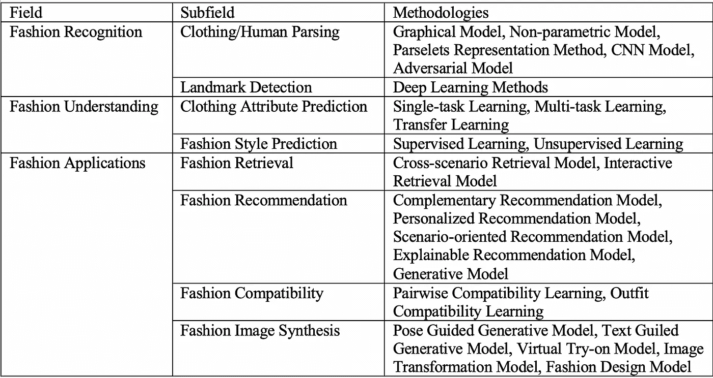

# 时尚行业的深度学习

> 原文：<https://medium.com/analytics-vidhya/deep-learning-in-fashion-industry-dcb897ac3c33?source=collection_archive---------3----------------------->

最近，时尚产业已经成为全球经济的重要产业之一。潮流瞬息万变，服装业已经证明了自己是最具创造力的领域之一。世界各地的人们，不管他们的经济状况如何，都愿意花钱来跟上潮流。随着互联网和手持设备的出现，顾客可以在旅途中轻松购物。在人们紧跟时尚潮流的同时，机器学习正在改变时尚行业的趋势。每个品牌，无论大小，都利用机器学习方法，通过吸引客户和始终走在潮流的前面来增加增长。每天都有系统跟踪每一笔销售和即将到来的趋势，这给了公司大量关于用户感兴趣的知识。同时，社交媒体上的影响者分享的数据，品牌分享的时尚数据等等，积累了大量跨平台的时尚数据。人们非常关心流行什么样的风格，他们在新的潮流中看起来怎么样，以及如何提升他们的自信和个性；对于品牌来说，利用积累的数据并向用户提供适当的推荐更有意义。时尚行业使用机器学习的主要驱动力之一是客户喜欢个性化。

在这篇文章中，我们将看看深度学习和计算机视觉技术中帮助品牌保持领先地位的可用方法。此外，我们将看到美学如何帮助获得客户的注意。人工智能启发的深度学习模型可以准确地判断哪种风格更适合特定的客户，并预测消费者对新设计的接受程度。

时尚研究可以分为低级时尚、中级时尚和高级时尚。下表描述了分类，

时尚研究领域分类

现在，我们将深入探讨时尚研究各种分类，

**低级时尚识别**:时尚识别无非是像素级的计算和处理时尚图像。它可以进一步分为，

1.  服装/人体解析

*   *图形模型:*关注受约束的解析问题，处理小范围的低级不一致。该方法包括**超像素标注**、**服装协同解析集成系统**、**弱监督服装解析、**和**基于 MRF 的颜色和类别推理模块**等模型。
*   *非参数模型:*这不需要很多先入为主的知识，但依赖于分割和姿态估计。包括**最近邻风格检索**、**深度准参数人体解析框架**、**半监督学习**等模型。
*   Parselets 表示:P arselets 被用作基本构建块，以克服姿态估计和服装之间的不一致。这使用了**可变形混合解析模型**和**同时人体解析姿态估计**。
*   *CNN 模型:*卷积神经网络对于服装/人体解析非常有效，但是它确实忽略了语义部分之间的微观上下文像素和宏观上下文。该方法使用**情境化 CNN 架构**、**主动模板回归、**和**自监督结构敏感学习**。
*   *对抗模型:*该模型通过使用对抗网络来减少结果中的语义不一致和局部不一致。它使用**宏-微对抗网络(MMAN)** 进行人工解析。

*2。*地标检测 *:* 最初，该方法使用回归模型，但是后来发现回归模型非常非线性，并且不容易优化。因此，在神经网络和全局-局部嵌入模块上扩展的知识引导的时尚网络被用于精确的地标预测。这里用到的模型有，**三步深度时尚对齐框架，深度地标网络，知识引导时尚网络，全局-局部嵌入模块。**

**中级时尚理解:**服装属性是代表人的信息的紧凑表示。服装属性不仅仅是基本的颜色和图案。这些属性包括衣领、材料、长度等等。这些属性可以用于推荐和分析。但是除了属性，时尚风格来自于个人如何组合每一套服装。这代表了个性和审美。

服装属性示例

1.  服装属性预测

*   *单任务学习:*这种方法在学习属性的同时专注于时尚的特定领域。它使用**基于 CRF 的方法**、**随机森林方法**和**增强深度 CNN** 。
*   *多任务学习:*该方法同时执行多项任务，如学习服装属性和地标检测*。*这里使用的几个模型是**特殊感知概念表示**和**端到端深度 CNN。**
*   *迁移学习:*该方法在学习服装属性的同时，弥合了来自各个领域的图像之间的鸿沟。它使用**迁移学习模型**，以及**建立在更快的 R-CNN 模型**上的深度模型。

2.时尚风格预测

*   *监督学习:*可以使用 **SVM** 预测时尚风格，使用一组手工制作的特征，通过训练深度特征提取网络使用有区别的风格特征，最后通过构建基于服装风格语义空间的分类网络。
*   *无监督学习 g:通过在服装数据上训练多语言主题模型，模型学习时尚中各种元素和风格之间的相似性。*

**高级时尚应用:**这些应用是在低级时尚认知和中级时尚理解的帮助下构建的。它用于时尚推荐、时尚检索、时尚图像合成、时尚兼容性和时尚数据挖掘。

1.  时尚检索

*   *跨场景检索模型:*这里的一种方法是使用像 **WTBI** 这样的深度学习技术，将一个网店物品与一个现实世界的物品进行匹配，反之亦然，这意味着它可以是单向的，也可以是双向的。此外，**双属性感知排序网络(DARN)** 和**深度双向**交叉三元组嵌入算法用于跨场景检索。
*   *交互式检索模型:*在这种方法中，用户可以给定一幅图像作为搜索的输入，以检索到与输入图像相似的来自世界各地的若干产品。

2.时尚推荐

*   *互补推荐模型:*给定一件衣服，该方法推荐与之搭配的合适的赠品。

描述给定底部配套布料的示例

*   *个性化推荐模型:*在这里，用户接收基于交互的项目、用户的意见、反馈和发展趋势的个性化推荐。使用的模型很少**张量分解**和**张量分解**。
*   *面向场景的推荐模型:*在这种方法中，纯粹基于呈现的场合向用户推荐服装。

基于场景的推荐如何工作的例子

*   *生成模型:*在这里，用户不仅被推荐现有的商品，而且根据用户的喜好生成新的时尚服装，该服装是对现有服装的改进。这里使用的几个模型是**神经协同监督学习框架**和**深度图像生成神经网络**。

一个装备改进建议的例子

3.时尚兼容性

*   *成对兼容学习:*该学习类别接受一个时尚项目作为输入，并从不同类别中搜索所有其他兼容项目。
*   *服装兼容性建模:*该学习类别搜索所有类别，并找到最适合的项目以形成兼容的服装，即该模型试图测量整个服装的兼容性。

4.时尚图像合成

*   *姿态引导的生成模型:*通过保持服装与任意姿态的输入相同来生成新的时装。最近提出的方法很少是新颖的架构或损耗来改善结果。

姿态引导的时尚图像生成

*   *文本引导的生成模型:*服装图像基于关于服装外观的文本叙述而生成。这使用**基于特征的线性调制**通过自然语言处理来翻译视觉特征。

文本引导的时尚服装生成示例

*   *虚拟试穿模型:*顾名思义，这种方法将图像中的一件服装物品转移到一个人的图像上，以虚拟方式查看服装穿在用户身上的样子。**氟橡胶**和 **VTNFP** 型号用于此目的。

虚拟服装试穿示例

*   *服装设计模型:*该方法接收用户输入的设计图像和布料图像，并生成完整成品的图像。

利用服装设计和材料图像生成服装图像

现在让我们来看看机器学习在时尚行业的三大支柱:推荐、审美和个性化。

电子建议系统已经成为最广泛使用的信息过滤系统之一。在时装业也是如此，最简单的方法是服装检索和推荐。这些系统完全依赖于用户给出的偏好和评级。值得注意的是，推荐系统只是向用户建议新的趋势和服装，而不考虑对特定风格、正确的颜色对比有更深入了解的时尚专家，甚至不考虑通过参加着装课程获得的复杂知识。虽然推荐系统未能考虑上述所有因素，但基于深度学习的自动时尚构图系统包含了所有关键因素。针对服装构成问题的深度学习方法由一个端到端的系统组成，该系统通过深度卷积网络对视觉特征进行编码，该网络接收时尚服装并预测用户参与度。在这种方法中，通过基于服装的外观和其他元数据对服装候选进行评分来构成服装。为了使系统能够感知上下文，使用了多模式深度学习框架；这利用了来自图像本身的上下文，并且发现它优于单模型方法。下面的架构描述了一个服装评分模型，该模型将被组合并推荐给用户。

时装评分模型

时尚推荐系统中使用的其他方法很少，

*   基于隐式反馈
*   基于弱外观特征
*   语义属性区域引导方法
*   使用对立特征转换器的补充推荐
*   神经兼容性建模

一个美学和时尚携手并进。一件衣服的视觉外观在时装业中起着至关重要的作用。除了用被称为美学词汇的词汇来描述服装之外；派对服装、休闲服装、正式服装等等，也有描述服装的视觉特征。其中一个方法是通过构建一个新颖的视觉特征、图像尺度空间和美学话语空间的三层框架来弥合两者之间的差距。然后艺术场图像尺度空间作为中间层；二维图像尺度空间充当中间层。这一层对审美的话有很深的理解。这种方法基于 Kobayashi 提出的理论，其中在 16 个美学类别中有 180 个关键词，并且这些词中的每一个都具有图像尺度空间中的坐标值。欧几里德距离用于确定哪个美学单词与图像对齐。

服装形象与美学词汇映射举例

时尚美学中使用的其他方法很少，

*   脑启发深度网络
*   简约主义方法
*   神经美学

个性化是时尚产业发展的一个关键因素。个性化促进个性和独特性。每个顾客都想要百万分之一的体验。个性化服装的产生必须在时尚品牌中获得动力。这里，考虑了用户关于个别物品和服装的偏好，并且向用户建议了新的服装。遵循一种变换器编码器-解码器架构方法，该方法认为一套服装中的每个物品将与同一套服装中的其他物品具有不同的交互权重。当用户点击物品时，系统开始通过一次添加一件物品来创建一套服装。如果点击了一个以上的类似项目，则考虑该项目的交互权重，并保留权重较大的项目，而丢弃其他项目。这个过程一直持续到全套服装完成。

用于个性化服装生成的架构

个性化中使用的其他方法很少，

*   生成性对抗训练
*   非结构化数据中的个性化
*   项目到集合的度量学习方法

> 结论:随着越来越多的研究人员投入到时尚世界及其不断增长的利用人工智能、计算机视觉和深度学习的需求中；更先进和复杂的方法的范围增加，以使时尚品牌能够提供优秀的客户服务，同时保持在时尚产业的顶端。在像现在这样前所未有的时代，虚拟购物体验变得极为重要。人工智能和深度学习可以帮助时装制造商提供更好的制造和库存管理流程。时装业就是这样一个行业，每天每分钟都在积累大量的数据，这一领域的研究将使客户和研究界受益。

# 参考

[1]龚、魏和莱拉·哈立德。"美学、个性化和推荐:关于时尚深度学习的调查."*ArXiv*ABS/2101.08301(2021):n . PAG

[2]顾，晓玲等.《人工智能在服装分析与理解中的应用》 *Inf。过程。管理。57 (2020): 102276。*

[3]本文中的所有图片均摘自上述论文。