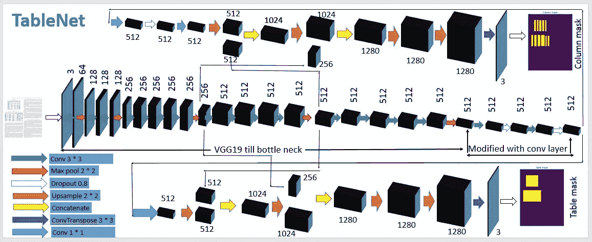
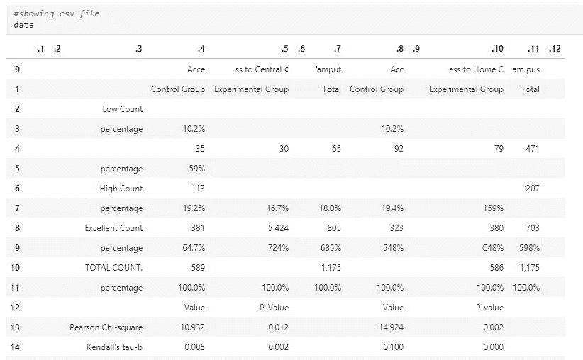

# 从扫描文档图像中检测表格和提取表格数据

> 原文：<https://medium.com/analytics-vidhya/deep-learning-model-for-end-to-end-table-detection-and-tabular-data-extraction-from-scanned-3eec3dce354c?source=collection_archive---------0----------------------->

现在，pdf 或 doc 文件形式的扫描照片被上传用于验证。因此，员工过去习惯于从文档中手动提取申请人的详细信息，这既繁琐又耗时，因此增加了人力成本和低效的数据处理时间。因此，人们发现有必要借助数字图书馆从文档中抽取信息。

我们基本上是在寻找任何有用的信息，如果它存在于
表格子图像中。因此，需要对图像进行数字化处理，以便计算机能够对其进行处理，从而对 DL 进行实验。不同图像中的表格结构的变化以及用结构标识可视地分离表格使得这非常具有挑战性。

# 目录:

> 1.商务问题
> 2。TableNet 架构简介
> 3。ML 配方
> 4。探索性数据分析:
> 5。绩效指标
> 6。我的方法
> 7。模型
> 8 的演练。数据提取
> 9。部署
> 10。未来工作
> 11。参考

# **1。业务问题:**

如今，随着手机和扫描仪广泛用于拍照和上传文档，人们发现提取所需信息的非结构化文件(即以表格形式包含有用信息的文件)的需求非常迫切。从表格数据中提取信息是具有挑战性的，这使得深度学习的最新技术得以发挥。从这个问题中我们遇到两件事。一个是从文档中检测出准确的表格，另一个是成功地从中提取数据。

成功地完成这项任务还没有完成，因为检测表是容易的部分，但是从结构(行和列)中提取数据是困难的部分。在这个案例研究中，我们将讨论深度学习 TableNet:一种新颖的端到端深度学习模型，用于表格检测和结构识别。

# 2.TableNet 架构简介:

根据业务问题陈述，我们的输入是模型的图像文件，我们将获得两个输出，即关于表检测和表格结构(行和列)识别。它是对表格子图像的逐像素检测，而表格结构识别包括对检测到的表格中的各个行和列进行分割。该模型由编码器和解码器两部分组成。预训练的 VGG19 模型被引入作为基线编码器模型。

这两个分支从作为解码器输入的编码输出出来，最终分别预测表区域的分割和表区域内的列的分割。当涉及训练时，共享的公共层权重由从编码器和解码器接收的梯度频繁更新，并且每个解码器层的权重单独更新。在此基础上训练预训练的 VGG19 模型可以提高性能。

TableNet 架构

可视化看起来像下面给出的东西。

可视化 TableNet

该架构旨在预测两个输出，即桌子检测和结构识别。仅检测列输出可能会导致大量误报，并且输出可能不符合实际情况。因此，检测表格的卷积滤波器由列检测滤波器增强，因此也有助于检测列。

因此，从上面显示的架构来看，两个解码器共享公共的编码器层。编码器的输出被引入作为解码器功能的输入，接着是卷积层，然后与来自编码器层的第四最大池层连接。然后，使用编码器的第三个最大池层将其上采样为所需形状，并执行连接，随后是上采样层，最后是 Conv2DTranspose，以满足模型输入的形状。

# 3.毫升配方:

它是实际结果与预测结果之间的像素级比较。它还说明了模型预测表结构的准确程度。因此，这是一个分类问题。

## 数据源:

1.  IC Dar _ 2017 _ table _ dataset:[https://github . com/ma Wanda-jun/TableTrainNet/tree/master/dataset](https://github.com/mawanda-jun/TableTrainNet/tree/master/dataset)
2.  旱獭数据集:【https://www.icst.pku.edu.cn/cpdp/sjzy/index.htm 

## 数据描述:

由图像及其相应的标注组成，标注指示图像中表格的坐标。图像在。bmp 格式，而注释文件在。xml 文件。

ICDAR 2017 的图像总数与对应的注释文件相同。marmot 数据集总共缺少 14 个注释文件。

# 4 .探索性数据分析:

## 我们将检查土拨鼠数据集:

显示来自 marmot 数据集的随机图像文件:

原象

显示相应的表和列掩码:

绘制代表整个图像的高度和宽度范围的图形:

图像的高度范围在 600–1000 之间，宽度范围在 800–1000 之间。我们将重塑图像为 1024 * 1024，因为模型的输入应该具有所需的相同形状。

## 现在，我们将检查 ICDAR-2017 的另一个数据集:

显示来自 ICDAR-2017 数据集的随机图像文件:

原象

显示相应的表格掩码:

桌面遮罩

不幸的是，从注释文件中，我们只能提取表掩码。根据研究论文，ICDAR-2017 数据集用于测试目的，而 marmot 数据集用于训练模型。

# 5.绩效指标:

模型的性能通过 f1 分数、精确度和召回率进行了验证。

# 6.我的方法:

在仔细阅读了我上面提到的研究论文后，我提出了第一种方法。根据业务问题陈述，我们必须预测表掩码和结构(行和列)识别。因为有两个数据集，其中一个数据集用于训练模型，另一个数据集用于测试模型。根据我绘制的高度和宽度图，我们需要将所有图像的大小调整为 1024 * 1024。首先，我们需要从注释文件中提取表和列掩码，我们需要将它与预测的输出进行比较。

模型架构由编码器和解码器两部分组成。我们使用预训练的 VGG19 直到瓶颈，该瓶颈通过具有 ReLU 激活的两个(1×1)卷积层进一步扩展，随后是概率为 0.8 的丢弃层。解码器的两个分支由此而来。编码器的输出被引入作为解码器功能的输入，接着是卷积层，然后与来自编码器层的第四最大池层连接。然后，使用编码器的第三个最大池层将其上采样为所需形状，并执行连接，随后是上采样层，最后是 Conv2DTranspose，以满足模型输入的形状。

根据研究论文，我们被指示使用 Adam 作为优化器，参数β1 = 0.9，β2 = 0.999，ε= 1e-08。我们需要创建一个单独的文件，其中存储了所有文件，包括图像及其对应的表以及列掩码。在数据管道时，我们将从给定的位置获取文件，并且必须批量创建数据加载器。我们需要使用 TensorFlow API 创建数据管道，该 API 在内部发送数据来训练模型并加快性能。

由于数据非常少，我们需要将 marmot 数据集分成几组，并以 9:1 的比例进行测试。f1 分数、精确度和召回率验证了模型性能。由于数据较少，我们必须用较大的历元来训练模型，并且必须最大化 f1 分数。

# 7 .到模型的漫游:

因为我们知道平板电脑模型有两个输出，所以我们需要使用 TensorFlow API 创建数据管道，这样它就应该输入图像及其对应的遮罩，以便与结果进行比较。因此，下面给出的代码是创建数据加载器的整个数据管道。

模型的数据管道

增加了 VGG19 预训练模型，直到瓶颈作为带有一点点卷积层的基线模型。形状为 1024 * 1024 的输入图像被传递到模型，并且两个输出被期望从模型中输出。第一个输出是表格掩码，检测该表格是否存在于给定图像中，第二个输出是列掩码，识别表格中的行和列。

执行两个输出背后的想法是，如果没有表检测，列掩码输出可能会导致假阳性的增加，这会破坏模型，我们可能无法从表中获得数据。因此，表检测增强了列解码器识别正确的行和列的能力。

所以下面给出的是关于模型创建的代码。

## 显示训练图:

表掩码、列掩码和总体损失的训练图

首先，两个是关于表和列掩码的损失，最后一个是关于训练和测试数据集的总体损失。该图绘制在损失和时期数之间。从图表中我们可以看出，在历元达到 75 历元之后，所有曲线的损耗都是稳定的。列检测中的损失是波动的，直到最后，这意味着必须进一步进行训练。

在用 200 个时期训练模型之后，这些是预测的输出模型。

## 原始图像:

## 预测图像:

因为性能指标将通过精确度、召回率和 f1 分数来验证模型工作的效率。

下面是给定模型的结果。

将平板电脑模型与 AlexNet 进行比较，看看平板电脑与另一个模型相比表现如何。

# 应用 AlexNet:

用 200 个时期训练模型后，有输出模型在预测。

以下是给定型号的结果。

我已经尝试了 AlexNet 编码器架构，并与解码器合并，以预测表和列掩码。AlexNet 的相应精度、召回率和 f1 值并没有比 TableNet 有所提高。与 TableNet 相比，有效性损失更大。

# 8.数据提取:

在训练 TableNet 模型并找出最佳权重后，主要任务之一是预测图像中是否存在表格，如果存在，则以 CSV 文件的形式从表格中提取信息。

因此，对于给定的图像，下面给出的是来自预测表图像的 CSV 文件。

相应预测图像的 csv 文件

# 9.部署:

我使用 Flask 来部署这个 DL 模型。

# 10.未来工作:

我用 200 个纪元训练了 TableNet 模型，这比研究论文要求的要少得多。因此，准确性受到了影响，但模型仍然为表掩码提供了 95%的 f1 值，为列掩码提供了 86%的 f1 值。由于 GPU 支持有限，我无法运行更多的 epochs 来提高 f1 分数，因此从图像中预测的表格会与实际表格有一点偏差，此外，它还会直接影响将表格转换为 CSV 文件。

按照研究论文推荐的程序，我们需要将模型训练到 5000 个历元，以便提高效率。所以未来我想利用 GPU 的支持，用大量的历元来训练模型。

用 marmot 数据集训练模型，总文件数为 495，这在我们训练深度学习模型时过低。将来，如果有更多的可用数据，我会训练这个模型。

发现所有的 marmot 文件都是模糊的，所以模型不能正确地预测表格，这可能是不能正确预测表格的原因。Tesseract OCR(pytesserac)更适合高分辨率图像，因为我们有低分辨率的图像，因此我们可以看到，对于一些表格图像，tessera CT OCR 无法将图像正确转换为文本。

因此，总之，包含大量数据的高分辨率图像以及高 GPU 支持可以极大地提高模型性能。这是我将来想做的几件作品。

# 11.参考

1.  [TableNet:深度学习模型，用于从扫描的文档图像中进行端到端的表格检测和表格数据提取](https://arxiv.org/pdf/2001.01469.pdf)
2.  图像分割|张量流核心

 [## 图像分割|张量流核心

### 本教程的重点是图像分割的任务，使用一个修改的 U-Net。到目前为止，您已经看到了图像…

www.tensorflow.org](https://www.tensorflow.org/tutorials/images/segmentation) 

3.进行端到端案例研究

 [## 应用课程

### 我们知道转行是多么具有挑战性。我们的应用人工智能/机器学习课程被设计为整体学习…

www.appliedaicourse.com](https://www.appliedaicourse.com/) 

**你可以从我下面的 GitHub 链接查看这个案例研究的所有细节:**

 [## tiwaridipak 103/Table _ extraction

### 它是一个深度学习模型，用于从扫描的文档图像中进行端到端的表格检测和表格数据提取…

github.com](https://github.com/tiwaridipak103/Table_extraction) 

**我的 LinkedIn** :

 [## 迪帕克 Kr。Tiwari -培训生-应用人工智能课程| LinkedIn

### 查看 Dipak Kr。蒂瓦里在全球最大的职业社区 LinkedIn 上的个人资料。迪帕克 Kr。有 3 个工作列在…

www.linkedin.com](https://www.linkedin.com/in/dipak-kr-tiwari/)