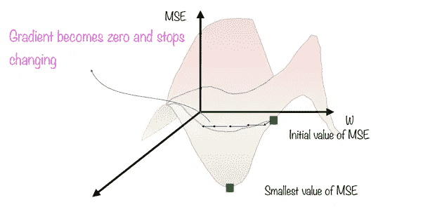
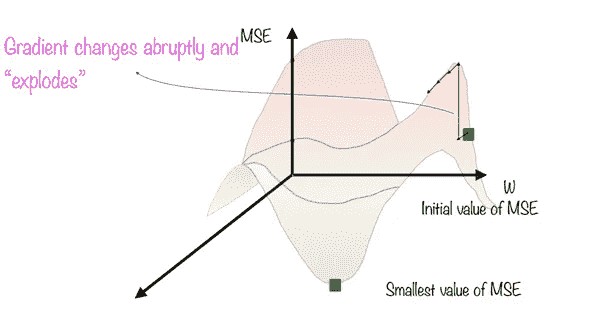
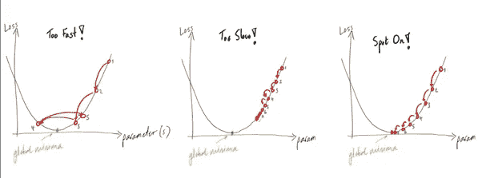
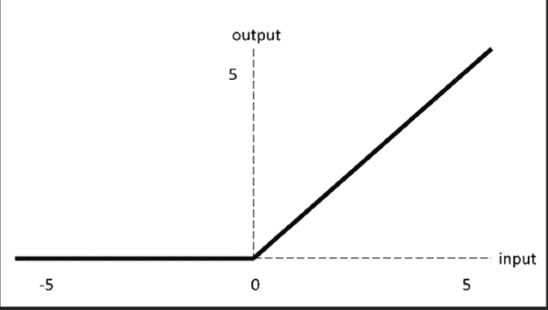
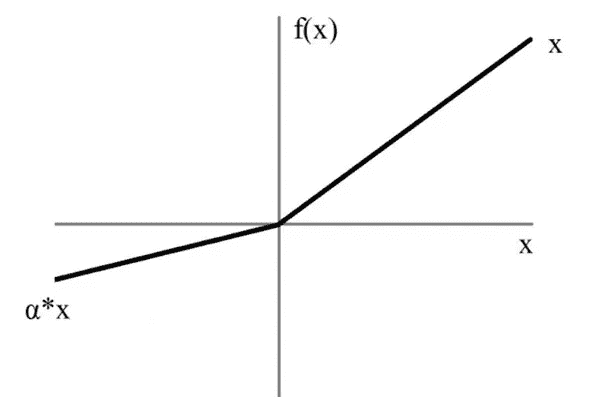
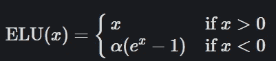
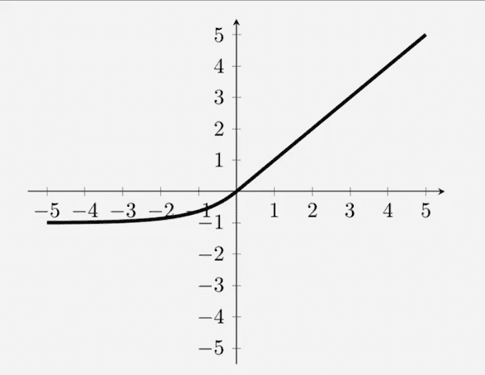
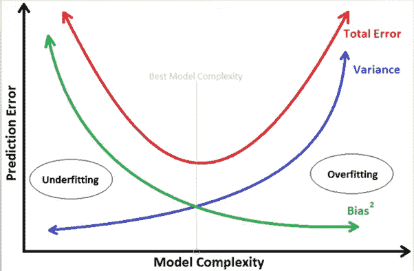
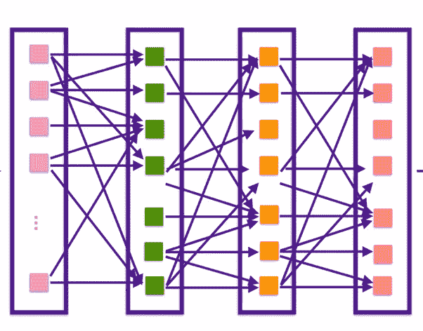
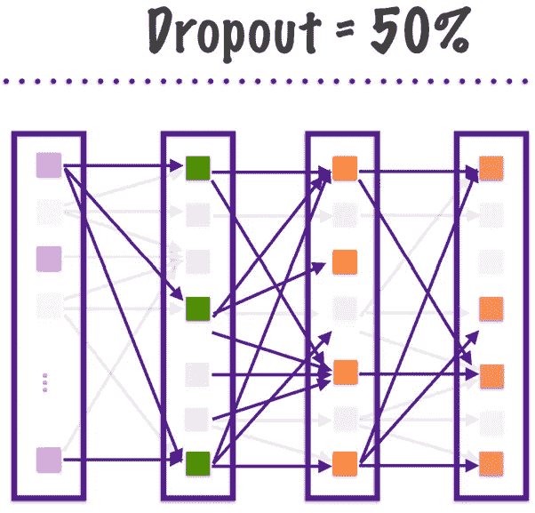

# 神经网络中的过拟合问题及优化技术

> 原文：<https://medium.com/analytics-vidhya/deep-learning-overfitting-issu-optimization-techniques-68714400e2ca?source=collection_archive---------8----------------------->

本文将涵盖以下主题

*   梯度下降的问题
*   饱和函数的问题
*   方差偏差权衡
*   不同类型的优化器
*   正规化和交叉验证

## 消失，爆炸梯度，死亡神经元

消失梯度下降出现在具有梯度下降学习方法和反向传播的神经网络中。梯度下降是一种迭代方法，在每个时期更新权重和偏差，以最小化损失。在反向传播期间，在每次迭代中，通过当前权重减去总误差相对于当前权重的偏导数来更新权重。在一些情况下，在一些迭代之后，层的权重将永远不会改变，梯度下降将永远不会收敛到最优解。

有一些激活函数，如 Sigmoid，双曲线 Tan h，其范围在(0，1)和(-1，1)之间，两条曲线都是 S 形的，对于大的输入值，在一段时间后将达到饱和，因此 Sigmoid 函数输入的大变化将导致导数更接近 0。这意味着梯度很小，权重和偏差没有正确更新，这将导致整个网络不准确，还可能导致神经元死亡。

消失梯度下降

**爆炸梯度下降**

与网络中每个权重相关联的梯度等于许多数字的乘积。如果值的乘积大于 1，可能会导致梯度变得非常大。假设在下面的例子中，它从初始值开始，突然均方误差呈指数增长，MSE 再次下降。现在，当前的 MSE 高于初始值，因此，模型将是不稳定的，损失将非常高，并且算法发散并且永远不会达到好的解决方案

爆炸梯度下降

**梯度下降或香草梯度下降:**

梯度下降是线性回归中的一种迭代优化算法，用于寻找微分函数的局部最小值。梯度下降算法将在斜率开始时选择随机初始化，并截取和计算误差项。在每次迭代中，它将反向检查误差项，并反向传播和更新斜率和截距值，直到误差最小。

正如我们在下图(1)中看到的，当学习率较高时，它会收敛得更快，但不会达到精确的全局最小值。在图(2)中，我们的学习率非常低。当数据集很大时，它会花费更长的时间来收敛，有时它可能会在局部最小值处饱和。图(3)显示了一个大小和方向正确的示例。

**优点:**

实现起来非常简单

**缺点:**

因为它需要整个数据集来计算反向传播中的导数并更新权重，所以它消耗更多的存储器并且计算量很大。由于这个原因，它可能以局部最小值结束，也没有达到全局最小值。

**随机梯度下降:**

随机梯度下降从整个数据集中分批提取较少数量的样本，并执行 1 个历元，因为样本数据集很小，所以内存消耗将很低，并且成本函数将在最初波动，并随着时间的推移而降低。在这两种情况下，我们必须手动选择学习率，这将是一个超参数

**优势:**

内存消耗低

**缺点:**

*   完成完整数据集的 1 个历元所需的时间高于梯度下降。
*   可能停留在局部最小值

**ADAGRAD(自适应梯度算法)**

学习率被称为是自适应的，因为它是基于每个参数中斜率的陡度来缩放的。当斜率较陡时，会降低学习率，使误差梯度向正确的方向移动以达到全局最小值。

**优点:**

无需手动更新学习率

**缺点:**

由于大量迭代，学习率将降低到非常小的数值，这可能导致收敛缓慢。

**Adam(自适应运动估计)**

Adam 是 Adam 的升级版本，这种方法也计算每个参数的自适应学习率。但是它收敛更快，计算量更小，克服了 Adagrad 的缺点。

这是神经网络中广泛使用的优化器。

# **优化技术:**

1.正确初始化

2.批量标准化

3.使用不饱和激活函数

4.渐变剪辑

**正确初始化**

考虑具有三个隐藏层的神经网络，并假设它们在每个神经元的输出的初始化期间具有恒定的权重和 0 偏差。在前向/反向传播期间，所有三个隐藏层的权重在整个过程中将是对称的，并且将防止神经元学习不同的东西。

假设我们有一个随机初始化的权重，而不是常数，如果权重初始化得更高，那么这将导致爆炸梯度问题。

为了克服这一点，我们需要使用 **Xavier 或 He 初始化。**

让我们考虑一个线性神经元。

y = w1x1 + w2x2 + … + wNxN + b

对于每个经过的层，我们期望输入层的方差等于输出层的方差，

让我们计算 y 的方差。

**var(y)= var(w1x 1+w2x 2+…+wNxN+b)**

让我们计算上式右边括号内各项的方差。

var(wixi)= E(Xi)2 var(wi)+E(wi)2 var(Xi)+var(wi)var(Xi)

这里 E()代表给定变量的期望值，基本代表平均值。我们假设输入和权重来自零均值的高斯分布。因此“E()”项消失了，我们得到:

var(wixi) = var(wi) var(xi)

注意‘b’是一个常数，方差为零，所以它会消失。让我们代入原始方程:

var(y)= var(w1)var(x1)+…+var(wN)var(xN)

因为它们都是同分布的，所以我们可以写成:

var(y) = N * var(wi) * var(xi)

所以如果我们希望 y 的方差和 x 一样，那么“N *var(wi)”项应该等于 1。因此:

N * var(wi) = 1
var(wi) = 1/N

Navg= Nin +Nout/2

Var(Wi)= 2/(Nin +Nout)

该值将是随机初始化的权重的倍数，以防止梯度爆炸。

**批量标准化:**

首先，归一化意味着，我们的输入特征将具有不同的尺度。我们将使用各种归一化技术，如标准缩放器、最小最大缩放器、鲁棒缩放器，以便在预处理步骤中使所有特征具有相同的尺度。

即使我们在预处理中将所有输入特征转换为标准比例，当激活函数被添加到每个隐藏层的输出时，这也将导致数据中的小变化。

因此，在激活函数的输出端，每一个隐层后都加入了批量归一化，对数据进行归一化处理。

它简单地计算为(输入均值)/标准差。通过增加批量归一化，加快了模型的训练速度。

**渐变裁剪:**

梯度削波是一种方法，其中在通过网络的反向传播期间，将**误差导数改变或削波到阈值**，并使用削波的梯度来更新权重。

通过重新调整误差导数，权重的更新也将被重新调整，从而显著降低梯度消失或爆炸的可能性。

**不饱和激活功能:**

**RELU(整流线性单元):**

这是非线性的，通常值的范围在 0 到无穷大之间，斜率永远不会达到 0，除非值为负。RELU 在计算上比 Sigmoid 和 Tan h 更便宜

**A(x)= max(0，x)。如果 x 是正数，它给出一个输出 x，否则给出 0**

RELU

**泄漏的 Relu:**

对于负值，RELU 函数将总是导致斜率为 0，因此为了克服这种情况，引入了在负方向具有窄斜率的泄漏 Relu。

**LReLU(x)= { x if x>0αx if x≤0 }**

泄漏 Relu

**ELU(指数线性单位)**

如果输入值 X>0，那么这将与 RELU 相同，但是当 x <0 we get a value less than 0.This graph is similar to Leaky RELU but we induce a exponential function here. This will mitigate dying of Neurons.

ELU

**过拟合和方差偏差权衡**时

**偏差:**偏差是您的预测模型捕捉输入数据集的实际趋势的程度，高偏差可能会导致训练数据集中的高误差，并可能导致过度拟合。

**方差:**模型的可变性是数据从实际数据点传播的程度。具有高方差的模型将对训练数据具有复杂的拟合，这将导致测试数据中的高方差，从而导致过度拟合。

如果模型非常简单，具有较少数量的特征，则它可能具有高偏差和低方差，从而导致拟合不足。它将不能正确地捕捉模式，所以我们需要在神经网络中添加更多的数据或模型层。

如果模型非常复杂且基数很高，则它可能具有低偏差和高方差，这将导致过度拟合。当模型已经用训练数据集进行了异常训练，并且当新数据被引入到模型中时，它未能更好地执行时，将会产生这种结果。为了克服这个问题，我们可能需要减少层数/关闭神经元或使用正则化方法来克服这个问题。

因此，总是建议在偏差和方差之间进行适当的权衡，以获得模型的最佳性能

方差偏差权衡

**减轻过度拟合:**

1.正规化

2.交互效度分析

3.退出

**正规化:**

最常见的正规化方法有 L1、L2 以及 L1 和 L2 的结合。

L2 正则化也称为岭正则化，这将在损失函数中增加一个惩罚因子。由于增加了正则项，它降低了权重，因为它假设具有降低的权重的模型不太复杂。这将使权重更接近于零，但永远不会为零。

**成本函数=损失+ λ ∑||w||**

L1 正则化也被称为套索正则化，它惩罚权重的绝对值。权重有时会衰减到零。

这里的 **λ是控制相对权重的超级参数。**

**成本函数=损失+ λ ∑|w|**

弹性网

这是 L1 和 L2 正规化的结合。

**代价函数=损失+ λ ∑||w|| + λ ∑|w|**

**交叉验证:**

交叉验证是一种将训练数据集分为训练数据集和验证数据集，并执行不同的迭代折叠以从使用不同数据集组合执行的所有迭代中获得误差度量的平均值的方法。取平均值会给出一个广义误差项，我们可以用它来比较验证集和测试集，以检查它是否是一个过拟合模型。

**退出:**

退出是一种有意关闭部分神经元以避免过度适应的方法。在每个训练步骤中，随机选择退出神经元和不同神经元。

复杂模型多层感知器

在隐藏层中应用 50%的下降后，拓扑将如下所示:

Keras 中的超参数调谐:

Github 链接:[深度学习/深度学习超参数. ipynb at main jayachandran 9283/深度学习(github.com)](https://github.com/Jayachandran9283/Deep-Learning/blob/main/Deep%20Learning%20Hyperparameters.ipynb)