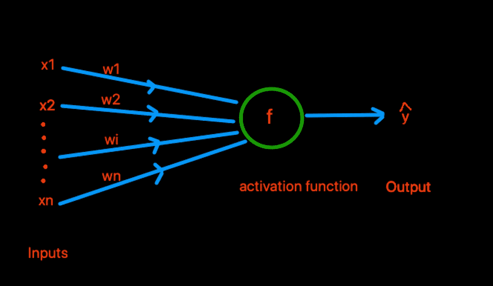
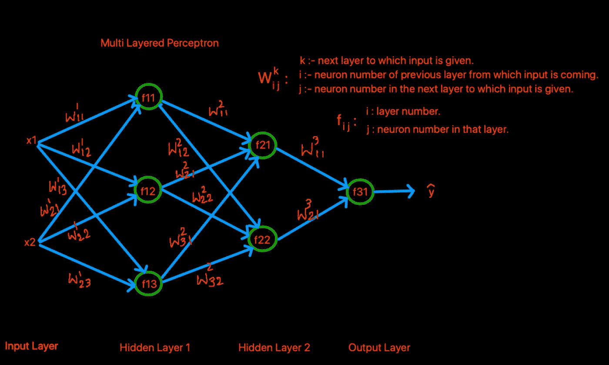
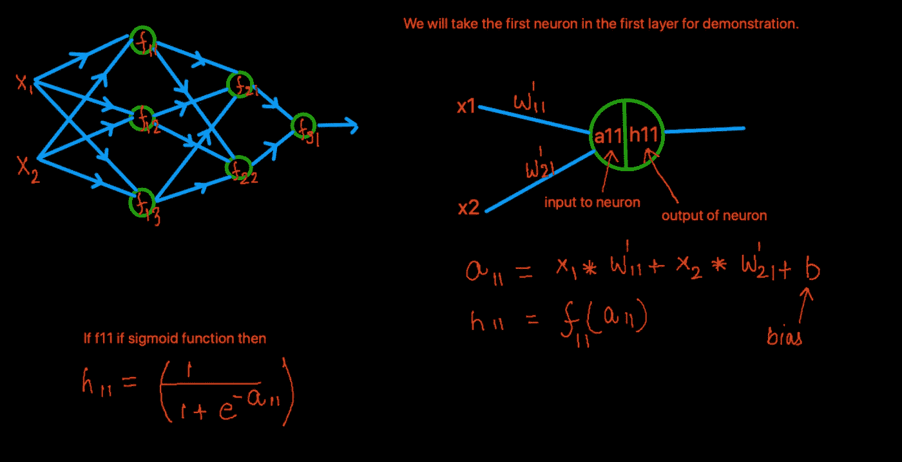
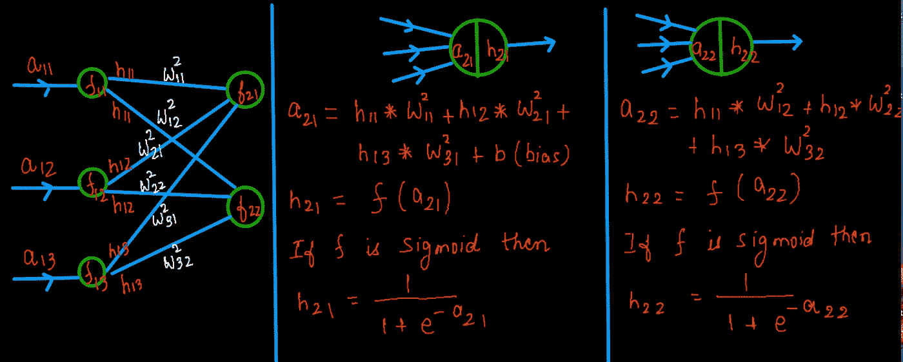
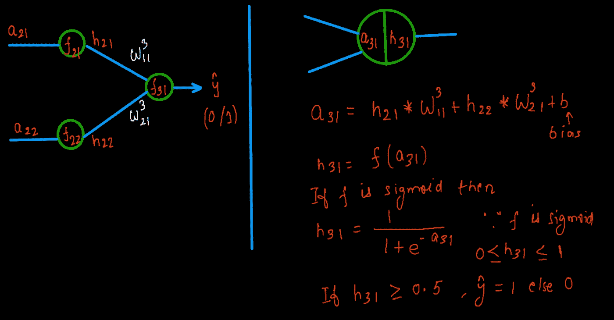

# 深度学习:感知器和多层感知器

> 原文：<https://medium.com/analytics-vidhya/deep-learning-perceptron-and-multi-layered-perceptron-ac8ca69c2c36?source=collection_archive---------12----------------------->

在这篇文章中，我将解释什么是感知器和多层感知器及其背后的数学。

感知器。

上图是整个深度学习的积木。感知器与神经元具有相似性，因为其结构非常相似。感知器也像神经元一样接受输入和输出。因此，神经网络这个名称通常用于命名深度学习中的模型。

> 感知器是深度学习中所有架构的构建模块。

给感知器的输入是权重和输入的点积。该函数接受这个输入并给出一些输出。如果输出大于 0，则最终的 output(y^为 1，否则为 0。您可以选择任何功能作为激活功能。例如:乙状结肠、tanh、relu 等。

# **多层感知器(MLP):**

顾名思义，在 MLP 我们有多层感知器。MLPs 是前馈人工神经网络。在 MLP，我们至少有 3 层。第一层称为输入层，接下来的层称为隐藏层，最后一层称为输出层。输入层中的节点没有激活，事实上，输入层中的节点表示数据点。如果使用 d 维向量表示数据点，则输入图层将具有 d 个节点。下图将使这一点更加清楚。

多层感知器。

在上图中，我们有一个输入层，两个隐藏层，和最后一个最终层。所有层都是完全连接的。这意味着当前节点与前一层的节点相连接。我们在每一层都有一个权重矩阵来存储该层的所有权重。这基本上就是训练结束后我们所得到的。所有这些权重在训练期间使用**返回** - **传播**进行更新。不要担心反向传播。我们将在下一篇文章中详细了解这一点。请熟悉图表中使用的符号和下标。这将有助于你理解这篇文章。

我们在节点中使用的函数是非线性的。所谓非线性 iI 是指输出不会线性地依赖于函数的输入。这意味着，如果投入增加 10%，并不意味着产出也会增加 10%，产出可能会增加 10%以上或 10%以下。诸如 sigmoid、tanh 等激活函数是非线性激活函数的例子。在我的文章中，我将主要使用 sigmoid 作为激活函数。有一点值得一提的是 **sigmoid 永远只会给出 0 到 1 之间的输出。**

在上图中，x1 和 x2 代表数据点的矢量表示的两个值。这里我取了一个二维数据点。在上面的几行中，我已经提到 MLPs 是前馈神经网络。前馈意味着节点之间的连接不是循环的，而是单向的。从左到右。

现在，我们将了解输入是如何馈入网络的。下图是第一个隐藏层的输入。

输入到第一个隐藏层。

类似地，另外两个神经元将获得输入 a12 和 a13。这里输入和输出的下标与神经元相同。现在让我们看看下一个隐藏层得到什么输入。在这里，我们将考虑第二个隐藏层的两个神经元。从下面给出的图表可以清楚地看出这一点。

显示输入如何提供给第二个隐藏层的图表。

现在，我们将移动到最后一层，即输出层。这一层将给出最终输出。我们将以二元分类为例，在这里我们只给出两个值。1 或 0。如果最后一层的输出大于 0.5，则为 1，否则为 0。下图将使这一点更加清楚。

显示从输出层生成输出的图表。

整个过程显示到现在为止，其中我们在向前的方向上将输入馈送到 MLP 或神经网络。因此，使用的术语是前馈神经网络。现在，由于我们有了给定数据点的预测标签，我们可以计算损失。我们可以使用均方误差或对数损失(也称为交叉熵)公式来计算损失。如果你想更好地理解什么是交叉熵，那就看看这篇 [**文章**](https://towardsdatascience.com/cross-entropy-log-loss-and-intuition-behind-it-364558dca514) 。

如果你不理解损失函数，不用担心。当我们学习如何使用反向传播在 MLP 更新权重时，我将介绍这一点。

我希望到目前为止，您可能已经清楚地了解了我们是如何为 MLP 提供输入的。在接下来的文章中，我们将了解当我们给出输入时，MLP 是如何被训练的。

# 序列中的文章。这些文章很快就会出现。

**反向传播及其背后的数学**。

编写你的第一个感知机。

**编写你的第一个 MLP** 。

如果你是 ML 和 DL 的新手，想知道如何防止模特**过拟合和欠拟合**，请浏览这个 [**博客**](https://towardsdatascience.com/overfitting-and-underfitting-in-machine-learning-89738c58f610) 。

 [## 机器学习中的过拟合和欠拟合

### 在这篇文章中，你将了解什么是过度拟合和欠拟合。您还将学习如何防止模型…

towardsdatascience.com](https://towardsdatascience.com/overfitting-and-underfitting-in-machine-learning-89738c58f610) 

参考资料:

1.  [https://en.wikipedia.org/wiki/Multilayer_perceptron](https://en.wikipedia.org/wiki/Multilayer_perceptron)
2.  [https://machinelingmastery . com/neural-networks-crash-course/](https://machinelearningmastery.com/neural-networks-crash-course/)
3.  【http://d2l.ai/chapter_multilayer-perceptrons/mlp.html 