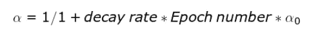

# 深度学习专业化课程

> 原文：<https://medium.com/analytics-vidhya/deep-learning-specialization-course-20c115b77d0e?source=collection_archive---------21----------------------->

## 课程 2:改善神经网络:超参数调整、正规化与最佳化(第二周笔记)

本周我们将学习优化算法，这将使我们更快地训练我们的神经网络。深度学习可以有效地处理海量数据，但在这些数据集上训练算法真的很慢。因此，让我们深入学习优化算法。

## 小批量梯度下降

过去，我们已经了解到矢量化有助于处理 M 个训练示例，而无需显式 for 循环。但是，当示例的数量增加到一个非常高的数量时，训练过程就会变得很慢。随着梯度下降的实现，我们将不得不首先处理整个训练集，然后在梯度下降中向前移动一步。

事实证明，如果我们让梯度下降开始取得一些进展，甚至在我们处理完整个训练集之前，我们就可以获得更快的算法。为此，我们可以将训练集分成称为**小批量的小训练集。**它们可以用花括号表示。

小批量 t : X^{t}，Y^{t}
**其中，**x 的维数为(nX，小批量)
y 的维数为(1，小批量)

**实现**

例如，小批量的大小是 1000，总训练样本是五百万。将有 5000 个小批量。

对于小批量梯度下降，单次通过训练集被称为 1 个时期。

当我们一次处理整个训练集时，我们应该期望成本在每次迭代后降低，但是当处理小批量时，我们不能期望成本在每次历元迭代后降低，如下图所示。

图片来源:吴恩达

如果小批量的大小等于 M，则它变成批量梯度下降。如果我们试图在等高线图上绘制梯度下降，可能需要相对较大的步骤才能达到最小值。

如果小批量的大小等于 1，那么它变成随机梯度下降。如果我们试图在等高线图上绘制随机梯度下降，它可能需要非常小和嘈杂的步骤。训练集的单个例子也可能误导算法走向错误的方向。它永远不会收敛，继续振荡。在实践中，我们应该使用介于 1 和 m 之间的小批量。

**选择小批量规模的准则**

1.  如果训练集大小小于 2000，则使用梯度下降。
2.  如果训练集大小较大，则使用小批量大小，如 64，128，256(2 的幂)。

## [指数加权平均](https://madhurijain27.medium.com/understanding-exponentially-weighted-average-5b6f5099eb01) (EWA)

有比梯度下降更好的算法。为了理解它们，我们必须首先理解指数加权平均线或移动平均线。

为了计算指数加权平均值，我们可以利用以下公式:

**指数加权平均中的偏差校正**

偏差修正是可以更精确地增强 EWA 计算的技术细节。当β的值在 0.5 到 1.0 之间选择时。值 V 不代表初始水平的θ的正确值，因此引入了偏差。这可以通过将 Vt 的值除以 1-β来纠正。新方程如下。

## 动量梯度下降

该算法比标准的梯度下降算法工作得更快。在该算法中，我们首先对权重应用指数加权平均，然后更新权重来计算代价函数。

## RMS Prop

该算法也被称为均方根 prop，它也可以加速梯度下降。它的实现可以如下进行。

## 亚当优化算法

Adam 一词来自自适应矩估计。该算法采用 RMS Prop 和带动量的梯度下降，并将它们放在一起，如以下实现所示。

**Adam 优化算法中的超参数**

1.  阿尔法:学习率，它的值需要调整。
2.  Beta 1:默认情况下，它的值应该是 0.9。这是作者推荐的
3.  Beta 2: 0.999，推荐值
4.  ε:10^-8

## 学习率衰减

可能有助于加速算法的一件事情是随着时间的推移降低学习率。如果我们保持一个学习率的固定值，那么它会四处游荡，但永远不会真正收敛，如下图所示。

如果我们慢慢降低学习速率，我们可以在初始阶段快速学习，当学习接近收敛时，它可以采取较小的步骤来达到最小值。

学习率的值可以使用以下公式计算:

因此，如果我们希望使用学习率衰减，我们可以尝试多个值的α-零和衰减率，看看什么效果最好。

## **想到了那天**

阅读帮助你建立自己对事物的观点。

继续读！！快乐学习:)