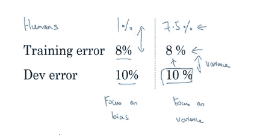

# 深度学习专业化课程 3

> 原文：<https://medium.com/analytics-vidhya/deep-learning-specialization-course-3-2e245684ffd?source=collection_archive---------17----------------------->

## 构建机器学习项目(第一周笔记)

我开始学习这门专业化课程已经有很长时间了，但在此期间，我对机器学习领域可供我学习的内容感到不知所措，并继续浏览与这门课程失去联系的其他内容。这次我决定完成认证，然后继续练习其他课程。

当你打算在这个真正有利可图的领域转行时，你有没有感受到类似的挑战？如果是，请在评论中发表。我们一起肯定能找到在数据科学领域大放异彩的方法。

没有任何延迟，让我们开始学习如何构建一个机器学习项目。

## 为什么选择 ML 战略

先说个例子；我们已经建立了一个猫分类器，并取得了 90%的准确率。现在，为了改进分类器，我们可能会尝试一些事情，例如收集更多的数据，应用 L2 正则化，尝试删除一些单元，或者尝试更大或更小的网络。但是，如果我们朝着错误的方向前进，我们就有可能花费大量的时间却没有取得丰硕的成果。如果我们有快速有效的方法来识别这些或其他想法中哪些是值得追求的，这不是很好吗？因此，在本课程中，我们将学习几种分析 ML 问题的策略和方法，这些策略和方法将为我们指明最有希望的方向。

## 正交化

机器学习系统的挑战之一是，在训练模型时，我们可以尝试几件事情。其中一个重要步骤是调整超参数。清楚地确定调整什么以达到特定效果的过程称为正交化。

为了让监督学习系统做得更好，我们通常需要确保四件事情成立。

1.  该模型应该在训练集上运行良好。应该和人类水平的性能相当。我们可以使用更大的网络或切换到更好的算法来确保更好的性能。
2.  在成本函数上很好地适应开发集。我们可以利用正则化或更大的训练集来确保在 dev 集上的良好性能。
3.  在成本函数上很好地拟合测试集。如果模型在测试集上做得不好，但在开发集上做得很好，那么我们将不得不找到一个更大的开发集，因为它可能被过度调整了。
4.  在现实世界中表现出色。如果模型在现实世界中表现不佳，那么我们可能不得不改变开发测试集的分布，或者我们选择的成本函数没有按预期表现。

我们将详细了解每一点。

## **单个数字评估指标**

无论我们是尝试调整超参数还是尝试学习算法的不同想法，如果我们有一个单一的实数评估指标，我们可以更快地跟踪我们的进展。

例如，我们已经训练了分类器 A 和分类器 b。现在我们要决定哪一个执行得最好。为了测量性能，我们可以利用精确度和召回率。根据定义，**精度是:在分类器识别为正确的例子中，实际上正确的百分比。**根据定义，**回忆被定义为那些实际上是正确的例子，有多少被分类器正确地识别。**

使用查准率作为评估标准的问题是，如果分类器 A 在查全率上做得更好，分类器 B 在查准率上做得更好，那么我们不确定哪个分类器更好。因此，我们可以确定一个结合两者的度量标准，而不是使用精度和召回率。

在机器学习中，结合精确度和召回率的标准方式被称为 **F1 分数**。我们可以把 F1 的分数看作是精确度和召回率的平均值。它可以定义为:

数学上称为**调和平均**。

## 满足和优化度量

将所有参数组合成一个评估指标并不总是容易的。在这种情况下，设置优化和满意指标是很有用的。例如，对于一个 cat 分类器，除了准确性度量之外，我们希望将运行时间定义为在多个分类器之间进行选择的另一个参数。运行时间定义为对任何图像进行分类所需的时间。分类器 A 花费 80 毫秒，分类器 b 花费 90 毫秒，分类器 C 花费 140 毫秒。因此，我们可以做的一件事是将精度和运行时间结合在一个评估指标中，如下式所示。

但不知何故，像线性加权和那样结合这两个指标似乎不太合适。相反，我们可以做的是，我们可以选择一个分类器，最大限度地提高准确性，但运行时间不到 100 毫秒。除此之外，我们不应该关心。在这种情况下，准确性作为优化指标，运行时间作为满意指标。

## 培训/开发/测试分布

我们设置培训开发和测试集的方式会对团队在构建机器学习应用程序方面取得进展的速度产生巨大影响。下面列出了最推荐的做法:

1.  从同一个发行版中选择开发和测试集。
2.  在训练列车开发和测试装置时，70/30 或 60/20/20 分配不再适用。在早期，当我们拥有少量数据时，利用 70/30 或 60/20/20 分布进行训练是合理的，但在现代，当我们拥有数百万数据时，这种分布就没有意义了。相反，我们可以利用 98/1/1 分布，因为趋势是将更多的数据用于训练，而将更少的数据用于开发和测试集。

## 为什么是人类水平的性能

最近，几个机器学习团队热衷于通过他们的算法实现人类水平的性能。这可能有两个主要原因:

1.  由于深度学习的进步，机器学习算法已经开始更好地工作。因此，与人类水平的性能竞争变得更加可行。
2.  当我们试图实现可以由人类执行的类似功能时，设计和构建机器学习算法的工作流要高效得多。

随着时间的推移，随着我们对更多的数据和更大的算法进行更多的训练，性能会超过但永远不会超过理论极限。这个极限称为 ***贝叶斯最优误差*** 。

## 可避免的偏见

我们总是希望我们的算法在训练集上做得很好，但有时在知道人类水平的表现的情况下，我们不想做得太好。例如，在下面的截图中，第一个算法有 8%的训练误差，与 1%的人为误差相比，这是非常高的。因此，我们希望专注于减少人为误差和训练误差之间的偏差。而考虑到较高的人为误差，第二种算法在训练集上表现良好。因此，我们希望专注于减少训练和开发错误之间的差异。

所以在这两个例子中，我们都可以把人的水平误差看作贝叶斯误差。根据定义，人的水平误差比贝叶斯误差更糟糕，因为没有什么比贝叶斯误差更好，但它也不会太远。因此，我们可以将人为错误视为贝叶斯错误的代理，贝叶斯错误和训练错误之间的差异被称为 ***可避免的偏差*** 。这一术语承认存在某种偏差或某种最小程度的误差，我们不能就此罢休。

敬请关注下周笔记:)

***继续学习…！！坚持终身学习..！！***