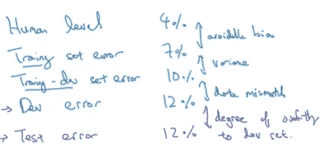
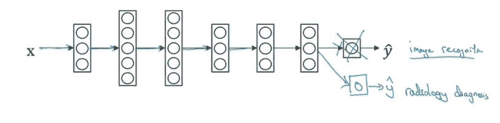

# 深度学习专业化课程 3

> 原文：<https://medium.com/analytics-vidhya/deep-learning-specialization-course-3-bc467e3dd085?source=collection_archive---------25----------------------->

## **构建机器学习项目(第 2 周笔记)**

这门专业课我们已经学了一半了。第一周的笔记请查看[这篇](/analytics-vidhya/deep-learning-specialization-course-3-2e245684ffd)文章。

## 误差分析

当我们试图升级我们的算法以像人类一样执行时，如果它没有达到那个标准，手动检查错误可以提供下一步该做什么的洞察力。这个过程被称为**错误分析。**

在花费几个月的时间试图通过专注于特定的解决方案来提高算法的性能之前，应该利用错误分析来确定它是否值得。让我们用例子来理解这个。我们有一个猫分类器，它有 10%的错误率。现在，我们可以手动检查 dev 集，以识别错误标记的示例的类型。假设，算法错误地标记了狗的图像。然后我们可以执行以下步骤进行人工错误分析。

1.  列出 100 个贴错标签的例子
2.  确定每个示例的类别
3.  统计每个类别的示例

如果与狗相关的图片是 100%中的 5 张，那么就不值得花力气了。相对而言，它只会提高 0.5%的性能。因此，我们可以专注于提高算法性能的其他方法。这个过程将帮助我们确定改进方法的优先顺序。

监督学习的数据包括输入 X 和输出 y。有时，输入被错误标记。深度学习算法对随机误差是鲁棒的，因此只要错误标记的例子离随机不远，该算法就能很好地工作，但是它们对系统误差不那么鲁棒。因此，我们可以在列出错误标记的例子时再增加一列，并确定有多少比例的例子导致了错误的输出 y。

如果我们正在开发一个全新的机器学习应用程序，那么 Andrew 想要给出的许多建议之一就是快速构建应用程序，然后迭代并利用偏差/方差和错误分析来决定接下来的步骤。

## 不匹配的训练集和开发/测试集的偏差/差异

如下图所示，当人因失误和训练集失误之间存在差异时。这就是所谓的可避免的偏见。训练集和训练偏差集误差之间的较大差异可能是由较高的方差引起的。训练开发集和开发集错误之间的差异可能是由数据不匹配引起的。最后，dev 和测试集误差之间的差异可能是由过度适应 dev 集的程度引起的。

## **寻址数据不匹配**

当我们在训练模型时遇到数据不匹配问题时，我们可以做以下事情:

1.  执行手动错误分析，并尝试理解训练集和开发/测试集之间的差异。
2.  使训练数据更加相似，或者收集更多与开发/测试数据相似的数据。这可以通过人工数据合成来实现

## 迁移学习

深度学习中一个强大的想法是，有时你可以从一个任务中获取神经网络学习的知识，并将这些知识应用到一个单独的任务中。这就是所谓的迁移学习。例如，我们有一个神经网络，它已经学会识别像猫这样的物体，然后使用这些知识或部分知识来帮助更好地阅读 x 射线扫描。

在上面的图像中，我们有一个经过训练的图像识别神经网络。所以你首先用一个神经网络，在 X-Y 对上训练它，其中 X 是一个图像，Y 是某个物体。我们正在使这个神经网络适应读取 X 射线扫描，我们能做的是取出神经网络的最后一个输出层，并将其与输入到输出层的权重一起删除。然后，我们可以为最后一层创建一组新的随机初始化权重，并将该输出用于放射诊断。

如果我们有大量的放射扫描数据，我们还可以重新训练神经网络的所有参数。然后对图像识别数据的训练称为预训练阶段。对放射学数据的训练被称为微调。

这可能有所帮助的原因是，许多低级功能，如检测边缘、检测曲线和从非常大的图像识别数据集中检测阳性对象，可能有助于您的学习算法在放射诊断中做得更好。

迁移学习主要是在你有很多你要迁移的问题的数据，而你要迁移的问题的数据相对较少的时候有用。例如，假设你有一百万个图像识别任务的例子。

## 多任务学习

在迁移学习中，你有一个连续的过程，我们从任务 A 学习，然后转移到任务 b。在多任务学习中，我们同时开始，试图让一个神经网络同时做几件事。然后这些任务中的每一个都会帮助所有其他的任务。

它在以下情况下很有用:

1.  训练一组任务，这些任务可以从共享低级功能中受益。
2.  通常，每个任务的数据量是相似的。
3.  可以训练一个大的神经网络来做好所有的任务

## 端到端深度学习

已经有一些数据处理系统或学习系统需要多个处理阶段。端到端深度学习可以采取所有这些多个阶段，通常只用一个神经网络来代替。

**应用端到端机器学习的利弊**

**优点:**

1.  它让数据说话
2.  需要更少的组件手工设计

**缺点:**

1.  可能需要大量数据
2.  不包括潜在有用的手工设计组件

有了这些笔记，我们完成了专业化认证的第 3 门课程。请继续关注卷积神经网络最有趣的课程。

快乐学习:)