# 深度学习专业化课程

> 原文：<https://medium.com/analytics-vidhya/deep-learning-specialization-course-fd18ee60394?source=collection_archive---------9----------------------->

## **课程 2:** 改进深度神经网络:超参数调整、正则化和优化(第 3 周笔记)

我的课程笔记收到了很好的回应。它激励我做好每一篇文章。如果你还没有读过我第一周和第二周的笔记，请看看[这篇](/analytics-vidhya/deep-learning-specialization-course-20c115b77d0e)文章。

不再拖延，让我们开始本周的学习吧。

## 超参数调谐

训练神经网络包括设置几个超参数。在这一周，我们将学习为他们找到一个好的环境。

1.  **调谐过程**

优化超参数时出现的问题是，如何选择要研究的值集？在早期，通常的做法是在网格上绘制超参数，并系统地探索它们的值。网格的最佳选择是五乘五。但是当参数数量相对较少时，这种方法效果最好。推荐的做法是随机选择点，然后在随机选择的这组点上尝试超参数。

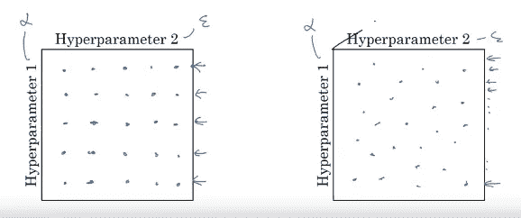

上图只考虑了两个超参数。如果我们有三个参数，那么我们可以使用第三维的立方体。通过在三维立方体中采样，我们可以为每个超参数尝试更多的值。

**2。使用合适的标尺选择超参数**

我们看到，在超参数范围内随机采样可以更有效地搜索超参数空间。选择一个合适的尺度来研究超参数是很重要的。

为了理解这一点，考虑隐藏单元的数量超参数。我们感兴趣的范围是从 50 到 100。我们可以使用包含 50 到 100 之间的值的网格来找到最佳值:

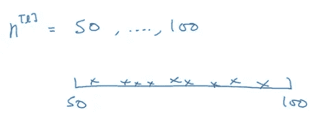

现在考虑范围在 0.0001 和 1 之间的学习率。如果我们用这些极值画一条数线，并随机均匀地采样这些值，大约 90%的值将落在 0.1 到 1 之间。换句话说，我们使用 90%的资源来搜索 0.1 到 1 之间的值，仅使用 10%的资源来搜索 0.0001 到 0.1 之间的值。这看起来不正确！相反，我们可以使用对数标度来选择值:

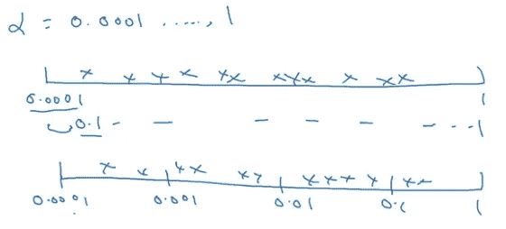

## 批量标准化

深度学习中的一个重要思想是一种叫做批量归一化的算法，它有助于更快地训练一种算法。

回想一下，在逻辑回归中，标准化输入可以加速学习。

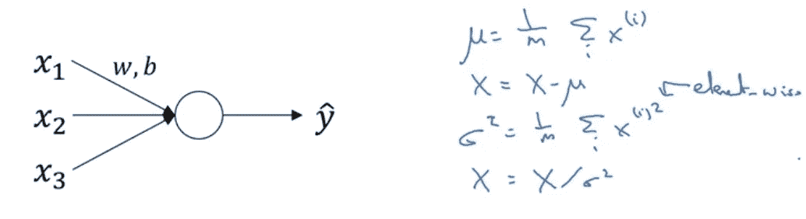

在更深的模型中，除了输入特性，我们在所有层中都有激活。如果我们能归一化激活的均值和方差，使 W 和 b 的训练更有效，这不是很好吗？比如我们想在下面的网络中更快的训练 W3 和 b3。由于 a2 是下一层的输入，所以会影响 W3 和 b3 的训练。

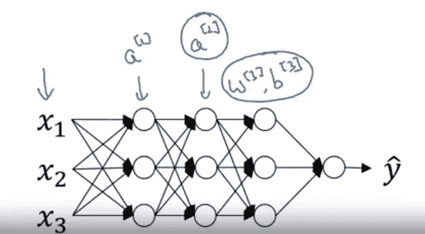

下面是我们如何在单个训练层中实现批量标准化:

给定神经网络 z 到 Z^m 中的一些中间值，归一化可以计算如下:

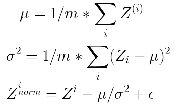

这里，为了数值稳定性，增加了ε。Z 的每个分量的平均值为 0，方差为 1。对于隐藏单元，如果我们对每个组件都有相同的均值和方差，那就没有意义了。因此，对隐藏单元进行不同的分配会更有意义。我们可以利用下面的公式来计算 Z tilda。

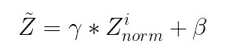

其中γ和β是可学习的参数。Batch norm 将规范化过程应用于输入图层和深层图层。训练输入层和隐藏层之间的唯一区别是，我们不希望对隐藏层的所有值应用零均值和方差 1，因为我们希望利用非线性函数。隐藏层具有标准化的均值和方差，其中两者都由显式参数γ和β控制。

**向网络添加批量定额**

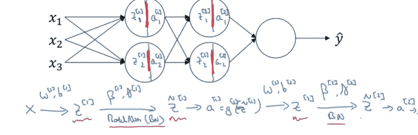

**批量定额为什么真的管用？**

1.  将输入要素归一化为均值为 0 且方差为 1 可提高速度，类似于批量归一化对隐藏图层的处理。
2.  考虑[协变量移位](/@izadi/what-is-covariate-shift-d7a7af541e6)的场景，其中分布随着另一个数据集而改变，并且算法无法在该数据集上进行归纳。同样，在神经网络中，如果我们考虑任何隐藏层，输入值会不断变化，导致协变量移位。批量定额减少了这些隐藏单位值分布的移动量。

**一次测试时批量定额**

当我们对训练数据应用 batch norm 时，它与小批量一起工作，步骤如下所示。

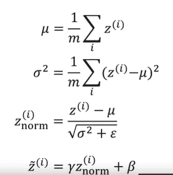

但是在测试期间，我们希望一次处理一个例子。因此，我们将使用指数加权平均值来计算 Z 范数的值。

## 多类分类

逻辑回归的推广被称为 softmax 回归，它可以让我们进行预测以识别两个以上的类。在下图中，外层将有四个输出单元，我们将尝试确定这四个类别的概率。

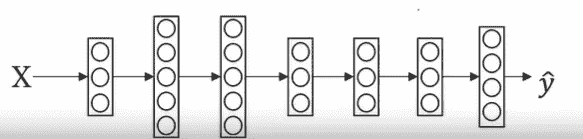

为了计算每个类的概率，我们将使用 softmax 激活函数，它不同于其他激活函数，如 relu。在 softmax 激活函数中，我们将获取一个临时变量 t，并通过对每个输出单元进行元素求和来计算其值，如下所示。这里，我们考虑将 4 作为输出参数。

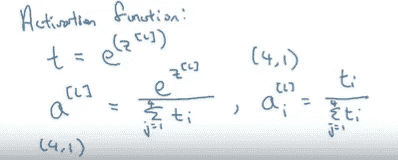

那么输出 a1 将是归一化为 sum 1 的向量 t，如下例所示。

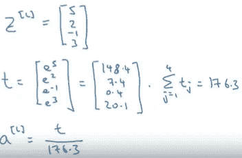

以下是使用 softmax 分类创建的决策界限的几个示例。

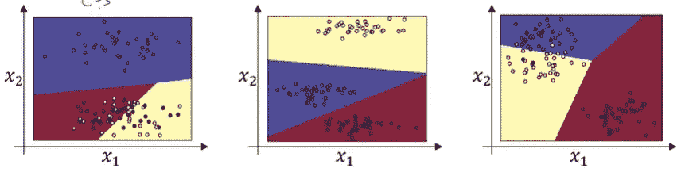

这样，我们完成了深度学习专业化的第二个课程。

请关注我，获取更多关于机器学习的有用文章。

***做一个终身学习者！！快乐学习！！***