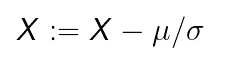
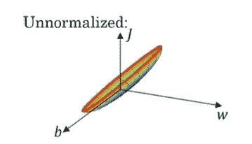
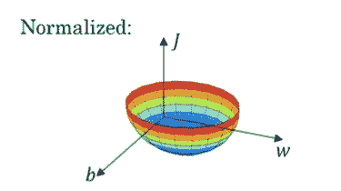
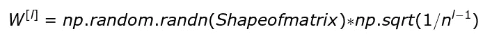
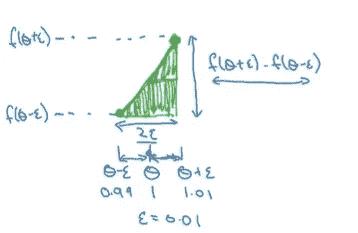
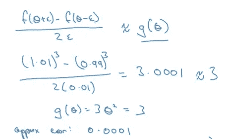
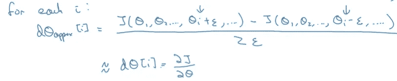

# 深度学习专业化课程笔记

> 原文：<https://medium.com/analytics-vidhya/deep-learning-specialization-course-notes-138ecd5ad4ef?source=collection_archive---------19----------------------->

## 课程 2:改进神经网络:超参数调整、正则化和优化(第一周笔记继续..)

到目前为止，我们已经学会了将测试集分为训练集、开发集和测试集。我们还学习了正规化。在本文中，我们将了解加速神经网络训练的方法。不要再拖延了，让我们开始吧。

如果你还没有看过我关于第一周笔记的文章，请快速参考[这个](https://link.medium.com/7dLKWMxMfdb)链接。

## 加速神经网络训练的方法

## **1。标准化输入**

在训练神经网络时，加速训练的技术之一是标准化输入。例如，如果我们的训练集中有两个特征，那么我们可以计算这两个特征的均值和方差，并使用以下公式使用均值和方差对这两个特征进行归一化。

我们应该对测试数据使用相同的均值和方差，因为我们需要两个数据都经过相同的转换。

**正常化起作用的原因**

如果我们使用非标准化的特征，代价函数可能看起来很长。

而如果我们使用标准化的输入，成本函数可能看起来非常对称。

如果特征在非常不同的尺度上，假设特征 X1 的范围是从 1 到 1，000，而特征 X2 的范围是从 0 到 1，那么结果是参数 w1 和 w2 的比值或值的范围将最终呈现非常不同的值。此外，对于未标准化的特征，我们将不得不保持最小的学习速率，因为在它达到最小值之前将需要几个步骤，而如果我们具有球形轮廓，我们可以保持较大的学习步骤，从而导致较大的步骤达到最小值。

## **2。消失/爆炸渐变**

训练深度神经网络的问题之一是数据消失或爆炸梯度。在训练时，导数/斜率可能取一个巨大的值或一个非常小的值，这会使训练变得困难。为了理解爆炸梯度问题，让我们从线性函数开始，

g(z) = z。

y= w[l]*w[l-1]*w[l-2]…w[1]*X 但是 w[1]*x = z[1]。当我们使用线性激活函数时，a[1]将等于 g(z)，g(z)又等于 z[1]。以及 a[2] = w[2]*a[1] = w[2]*w[1]*X。

因此，如果 w 的值很大，那么 y 的值将爆炸，如果 w 的值减小，那么 y 的值将指数减小。因此，可以说激活函数将作为层 l 的函数指数地增加或减少

这个问题的部分解决方案是在初始化权重时仔细选择。

## 3.深度网络的权重初始化

在 n 个特征的情况下，我们希望 w 尽可能小，因为 z 是 w[i]x[i]的和。

一个合理的做法是将 w 的方差设置为 1/n，其中 n 是进入神经元的特征数量。因此，对于 l 层，w 的值可以初始化如下。

如果我们使用 Relu 函数，那么 2 是上式中的首选值。如果 w 的值是通过方差控制的，那么 z 也将在相似的尺度上取值。它不能完全解决问题，但是它有助于控制 w 的值，使得梯度不会爆炸或消失。

## 4.梯度的数值近似

在实现反向传播时，有一种称为梯度检查的测试有助于确保反向传播的正确实现，但在建立梯度检查之前，让我们先讨论一下如何近似计算梯度。

考虑一个函数 f，其中 f(theta) = theta，现在如果我们绘制 theta 的函数并将其值微移至两侧，这将为我们提供一个更好的梯度近似值，而不是仅微移一侧的值，如下图所示。

图片来源:吴恩达

图片来源:吴恩达

## 梯度检查

要执行梯度检查，请遵循下面提到的步骤。

1.  取所有的参数 w 和 b，把它们重塑成一个巨大的向量θ。因此，成本函数将只是向量θ的函数。
2.  取所有导数参数 dw1，db1…dw[l]，db[l]并将它们整形为一个巨型向量 dtheta。
3.  评估 dtheta 是否是成本函数 J 的斜率
4.  要评估斜率，请遵循下图所示的步骤。

现在，用 I 的每一个值计算上面的等式，并通过计算两个向量之间的欧几里德距离来比较它们。如果欧几里德距离的值大约小于或等于 10^-7，那么我们可以假设反向传播被正确地实现。如果该值在 10^-5 附近，那么我们可以说我们将不得不重新考虑我们的反向传播步骤。

## **坡度检查实施说明**

*   仅在调试期间使用梯度检查。
*   如果算法没有通过等级检查，那么尝试识别组件值中的错误。
*   请记住在计算成本函数时包括正则化
*   它不适用于辍学正规化。

## **其他来源**

**Kurtis Pykes:** [深度神经网络中的消失/爆炸梯度问题](https://towardsdatascience.com/the-vanishing-exploding-gradient-problem-in-deep-neural-networks-191358470c11)

**坚持阅读，快乐学习**:)