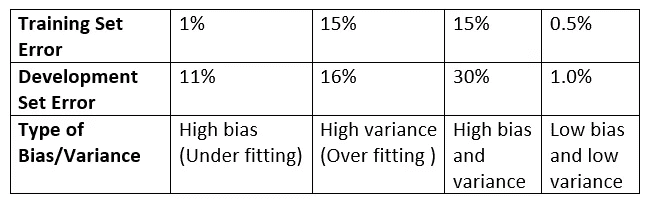
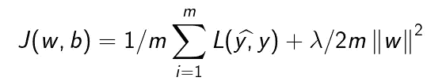
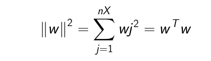
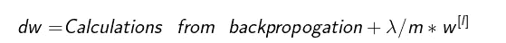
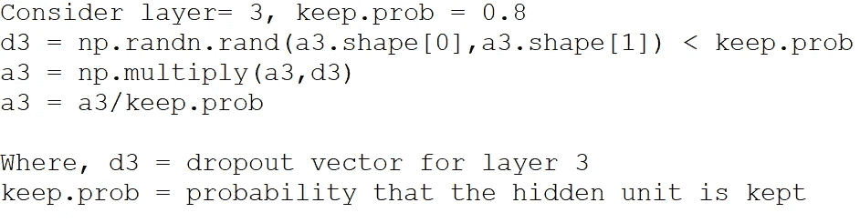

# 深度学习专业化课程笔记

> 原文：<https://medium.com/analytics-vidhya/deep-learning-specialization-course-notes-3cb2734ea36e?source=collection_archive---------24----------------------->

## 课程 2:改进神经网络:超参数调整、正则化和优化

图片来源:www.giveffect.com

我从 Coursera 开始写深度学习专业化课程的课程笔记。当我写的时候，我的概念变得清晰，我对主题有了更好的理解。希望这些笔记对大家有用。

有了这篇文章，我准备跳到深度学习专业化课程的课程 2。如果你还没有看我关于第一门课的文章，请点击[这个](/analytics-vidhya/deep-learning-specialization-353c997af655)链接。

本课程将集中于机器学习的实践方面，例如学习使神经网络工作良好的方面。它将从超参数调整到优化算法，使它们能够快速运行。不要再拖延了，让我们开始吧。

## 如何选择培训、开发和测试集

在训练数据时，我们必须做出几个决定，例如选择隐藏单元的数量、激活函数的类型、隐藏层的数量、学习速率等，并且不可能一次正确预测所有的参数和超参数。因此，机器学习是一个高度迭代的过程，我们从一个想法开始，在代码中实现它，并尝试运行它。根据结果，我们尝试改进这个想法，并不断迭代，直到我们找到一个更好的神经网络。

决定我们进展速度的参数之一是我们在这个迭代周期中的效率。另一个重要的参数是在训练、开发和测试集中设置数据，从而提高效率。

传统上，当我们有数据时，我们会保留其中的很大一部分用于训练，称为**训练集**。然后其中的一部分将用于交叉验证或开发，称为**交叉验证集或开发集。**其中一部分将用于最终测试，称为**测试集**。

随着工作流的进行，我们使用训练集来训练几个算法，并使用许多不同的算法来查看哪一个在 dev 集上执行得最好。一旦我们完成了这种方法，我们将采用我们的最终模型，并在测试集上对其进行评估，以获得该算法表现如何的公正评估。在以前，将数据分成 70/30%的训练和测试部分，或者 60/20/20%的训练、开发和测试部分，这是一种被广泛接受的做法。在现代大数据时代，将有数百万的数据，我们可能不需要开发集的整个 20%来测试算法。例如，如果我们有一百万个例子，那么我们可以将 10，000 个例子作为开发集，10，000 个作为测试集，这样就有 98%是训练集，1%是开发集，1%是测试集。

在训练算法时观察到的一个更常见的错误是在不匹配的训练和测试集上训练它。我们应该遵循的经验法则是确保所有集合都来自同一个分布。

将数据分成训练/开发集或训练/开发/测试集允许我们更快地迭代，并测量偏差和方差，以便我们可以有效地改进算法。

## 偏差和方差

当算法使用某些特征在更大的数据集中进行更好的概括时，这被称为**高偏差或欠拟合**。相反，当一个算法变得对某些噪声敏感时，它被称为**高方差或过拟合**。

了解偏差和方差的两个关键数字是**训练集误差和开发集误差。**在训练数据集时，如果我们的训练集误差低而开发集误差高，那么该算法将被认为具有高方差，因为它无法在开发集上很好地推广。相反，如果数据集具有较高的训练集误差和大致相同的偏差集误差，则该算法被认为具有较高的偏差。假设基本误差或人为误差为 0%,两种情况都被认为是有效的，并且两组都来自相同的分布。下面是一些偏差和方差的例子。

根据算法是否遭受高偏差或高方差或两者，我们可以尝试做几件事来改进算法。

## 机器学习的基本方法

为了改进算法以具有低偏差或方差，我们可以遵循一些基本步骤。

1.  训练初始模型
2.  确定模型是否具有高偏差，如果是，尝试选取具有更多隐藏层或隐藏单元的网络，或者尝试训练模型更长一点时间。
3.  确定模型是否具有高方差，如果是，尝试获取更多数据或尝试正则化。
4.  不断重复第 3 步和第 4 步，直到我们得到最适合的。

## L2 正则化

减少方差的基本技术之一是**正则化**。让我们理解它是如何应用于算法的。我们将使用逻辑回归来发展正规化的概念。

为了在逻辑回归的损失函数中添加正则化，我们将使用被称为正则化参数的λ和 w 参数的 L2 范数，w 参数只不过是 x 个特征的 w 之和。

通常，只有 w 被考虑用于正则化，因为它是高维参数向量，而 b 只是单个数字，因此在实践中正则化 b 参数没有太大区别。

lambda 的值通常是使用开发集来设置的，我们在开发集中尝试不同的值，看看什么是最好的。如下所示，通过在计算 dw 值时添加正则化项，它可以与梯度下降一起使用。

## 为什么正则化减少过拟合？

关于为什么正则化参数减少过拟合，很少有直觉。

1.  如果我们将 lambda 的值增大到巨大，则权重矩阵减小到零，从而导致简化的网络，这可能导致高偏差。因此，谨慎选择λ值是明智的。
2.  另一个直觉，让我们考虑一下 tan-h 函数。对于小的 z 值，tan-h 函数充当线性函数，并且如果我们将λ的值增大到巨大，则权重矩阵减小到更小的值，最终反映更小的 z 值。

## 辍学正规化

L2 正则化是一种常用的正则化技术，但剔除正则化和 L2 一样强大。

在退出正则化中，我们将访问神经网络中的每个节点，并设置消除神经网络中节点的概率。然后，我们删除到这些节点的输入和输出链接，这导致了一个小的和减少的网络。对于另一组训练示例，我们将消除另一组节点，并对每个训练示例重复此步骤。这似乎是一个疯狂的技术，但它的工作。

实现退出正则化的一种常用技术是反向退出。让我们看看如何在一个层中实现它。

在 d3 矩阵中，任何隐藏单元有 80%的几率为 1，20%的几率为 0。当 a3 和 d3 之间发生乘法时，20%的值将被清零，因此，在计算 z 的值时仅使用 80%的激活函数。

## 为什么退学行得通？

1.  Dropout 随机地消除隐藏单元，从而导致一个小网络，而小网络应该具有正则化效果。
2.  对于任何特定的单元来说，要完成它的工作，它都需要输入，但是在丢失的情况下，输入可以被随机消除，因此，它不能依赖于一个特征，所以它必须分散权重。

## 其他正则化技术

**数据扩充:**为了减少过度拟合，增加训练样本可能是一个不错的选择，但有时会被证明代价高昂。因此，在计算机视觉领域的情况下，我们可以通过旋转、裁剪、翻转和缩放数据来增加现有的示例，而不是获得更多的训练示例。获取新数据总是一个好的选择，但是数据扩充是增加示例数量的一种廉价方式。

**提前停止:**在这种方法中，当我们运行梯度下降时，我们应该绘制成本函数，因为它预计会随着 dev set 误差而降低。通常，dev set 误差预计在初始水平降低，然后从那里增加。提前停止会在最低值处停止训练，假设算法在这些值下表现最佳。

要继续阅读本周的笔记，请查看[这个](/analytics-vidhya/deep-learning-specialization-course-notes-138ecd5ad4ef)链接。

**快乐学习！！**