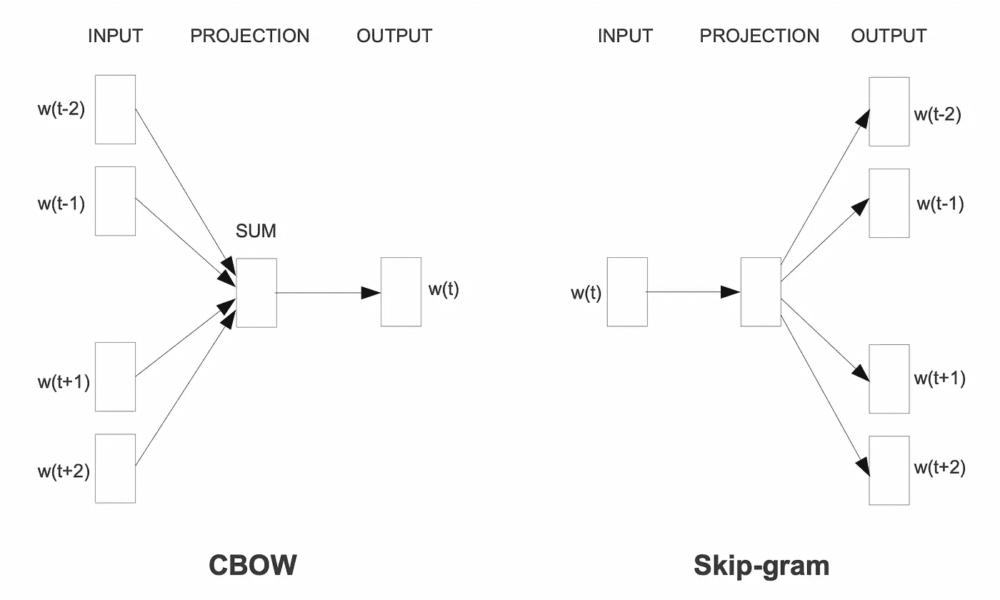

# 文本表示的深度学习技术—第 1 部分

> 原文：<https://medium.com/analytics-vidhya/deep-learning-techniques-for-text-representation-part-1-75c4ad4aa133?source=collection_archive---------1----------------------->


图片来源:[https://eewc.com/what-do-you-call-it/dictionarym/](https://eewc.com/what-do-you-call-it/dictionarym/)

全球范围内，可用的数字文本数据的数量在持续增长。因此，能够从大型文本语料库中快速获取必要的数据变得越来越重要。在传统的自然语言处理应用中，手工制作的特征更多地来源于数据。手工制作功能需要很长时间，对于每个活动或特定领域的挑战，可能需要多次制作。正因为如此，传统的自然语言处理系统面临着可扩展性和通用性的问题。

另一方面，深度学习从数据和几个级别的表示中提取信息，没有任何手工制作的特征。因此，该模型可以通过在地面上进行微调来推广。这是深度学习最重要的优势。因此，学习到的信息可以被构建为逐层组合。在不同的任务中，最低级别的表示经常被共享。传统的 NLP 单词被视为原子符号，并且单词之间的语义链接不由原子符号表示来捕捉。深度学习算法捕捉到这些关系，并允许下一个 NLP 系统导出更复杂的推理和知识。此外，人类语言的递归是在深度学习中自然处理的。具有特定结构的单词和短语构成了人类语言。特别是递归神经模型在捕获序列信息方面明显更好。

正如我前面提到的，在传统的 NLP 系统中，将单词视为原子符号，因此使用一键编码来表示固定词汇表中的单词，而使用一包单词(BoW)来表示文档。像[ 0 0 0 1 0 0 0 …]这样的表示将通过一键编码生成。向量的大小就是词汇量的大小。使用这种表示法，经常会产生大的稀疏向量。

# **分布式表示**

当一个单词的表示与另一个单词的表示不独立或不互斥时，就称为分布式文本表示。它的配置可以表示数据中的各种度量和概念。结果，关于一个单词的信息分散在它所代表的向量中。这不同于离散表示(原子表示)，在离散表示中，每个单词都被认为是不同的，与其他单词无关。下面我将总结几种先进的深度学习算法，它们呈现文本的分布式表示。

## **Word2Vec**

Word2vec 算法提出了一种基于相邻单词的单词表示方法(Thomas M. et al 2013)。当 word2vec 算法用足够的数据训练时，它可以捕获单词之间的语法和语义关系。例如，“King”和“Queen”彼此有关系，通过对这些单词的生成向量进行代数运算，我们可以找到这些单词之间相似性的近似。

```
 [King]    -    [Man]    +    [Woman]    =    [Queen]
```

总之，该模型将大量单词作为输入，并生成具有数百维的向量空间，将语料库中的每个唯一单词分配给空间中的匹配向量。单词向量被放置在向量空间中，使得语料库中具有相似上下文的单词彼此接近。

**Word2vec 架构**

Word2vec 模型是一个三层神经网络架构，有输入层、隐藏层和输出层。因为我们不能向神经网络输入字符串，所以我们将一个热编码向量作为输入提供给 word2vec。该向量长度等于词汇表的大小(语料库中唯一单词的数量),并且除了指示我们希望表示的单词的索引被设置为“1”之外，用零填充。单词嵌入是隐藏层的权重，隐藏层是典型的全连接(密集)层，而输出层为词汇表的目标术语生成概率。


图片来源:【https://israelg99.github.io/2017-03-23-Word2Vec-Explained/ 

词嵌入由隐藏层权重矩阵的行给出，其中隐藏层作为查找表工作。所有这些都导致学习这个隐藏层权重矩阵，然后一旦训练完成就丢弃输出层。

Word2vec 模型以低得多的计算成本观察到相当大的精度改进。word2vec 算法有两种风格，跳过 Gram 模型和 CBOW(连续单词包)模型。



图片来源:【https://arxiv.org/pdf/1301.3781.pdf 

**CBOW 型号:**

这非常类似于前馈神经网络语言模型架构。该模型用于通过使用 n 个未来单词和 n 个过去单词来产生单词嵌入。使用上下文的分布式表示来预测窗口中间的单词。单词的顺序不影响投影，所以它被称为单词包，与标准的单词包模型不同，它使用上下文的连续分布式表示。所以这个模型被称为连续词包模型。

**跳格模型:**

而 CBOW 模型在给定一组周围单词的情况下预测中间单词，而 skip-gram 模型则相反。更准确地说，它将每个当前单词作为具有连续投影层的对数线性分类器的输入，并预测 n 个过去和 n 个未来单词。已经证明，扩大范围提高了结果字向量的质量，同时增加了处理的复杂性。

CBOW 模型比 Skip-Gram 具有更快的训练时间，尽管 Skip-Gram 模型在更大的数据集上表现更好，但需要更多的训练时间。另一方面，这些向量在用于确定句法和语义单词相似性的测试集上提供了最先进的性能。

## 快速文本

作为香草 Word2Vec 模型的扩展，脸书在 2016 年推出了快速文本模型，并在 2017 年进行了修订。(Bojanowski 等人，2017 年)。word2vec 模型的主要缺点是无法处理不在训练语料库中的单词。FastText 模型克服了这个问题，它允许有效地训练大型语料库，并为不在训练数据中的单词计算单词表示。

这一范式来源于 word2vec 模型的作者提出的连续跳格模型。skipgram 方法通过为每个单词生成一个不同的向量表示来忽略单词的底层结构。为了解释这些信息，快速文本提供了一种替代策略。在这种方法中，每个单词由一包字符 n 元语法表示，在开头和结尾有特殊的边界符号<and>。也包括单词 w 本身。这将子词信息添加到模型中，并通过嵌入帮助理解后缀和前缀。因此，它还可以计算未出现在训练数据中的单词的有效表示。它通过取其 n-gram 向量的和来做到这一点。</and>

以“学习”这个词为例。当 n=3 时，单词 learning 表示为<le ear="" arn="" rn="">，特殊序列表示为<learn>。值得注意的是，对应于单词 ear 的序列<ear>不同于对应于单词 learn 的三元组 ear。在使用字符 n-gram 表示单词之后，训练跳过 gram 模型来学习嵌入。</ear></learn></le>

**参考书目**

word 2 vec:[https://arxiv.org/abs/1301.3781](https://arxiv.org/abs/1301.3781)

https://arxiv.org/abs/1607.04606