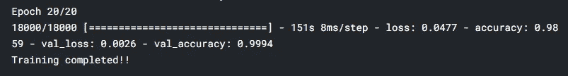
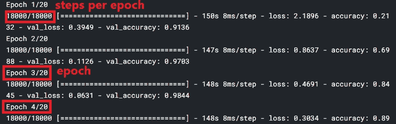
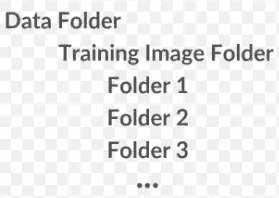

# 深度学习，总结的方法第一部分

> 原文：<https://medium.com/analytics-vidhya/deep-learning-the-summarized-way-part-1-23e2eee01ddd?source=collection_archive---------16----------------------->

网上和书本上有很多关于深度学习的资源。但是很难找到一个统一的版本，所以我决定想出一些文章，以概括的方式呈现主题。

**这篇文章是给谁看的？**这篇文章将真正帮助那些已经学习了深度学习的****基础知识的人，并希望*刷新他们的记忆*。我会尽我所能使它对新来者友好，但我不会涉及太多的细节。****

****外面有如此多的资源。为什么会这样？如前所述，很难找到统一的资源。相信我，我不会用太多的理论来膨胀文章，*只有必要的信息*刷新你的记忆。****

******简短声明:**为了提高对特定主题的理解，我可能会使用一些外行的类比，这些类比在该主题的真实理论中并不适用，但肯定会帮助您更好地理解该主题。此外，我的大部分 DL 知识都是受 [Pyimagesearch](https://www.pyimagesearch.com/) 和 [MLMastery](https://machinelearningmastery.com/) 的启发，所以你可能会注意到他们文章中的一些参考。****

# ****什么是 Keras，Tensorflow，OpenCV？****

****Tensorflow 和 Theano 是用于通用数学计算的库。虽然你可能主要在深度学习领域听说过它们，但它们也用于许多其他应用。****

****Keras 是一个深度学习框架，位于 Tensorflow 或 Theano 之上，通过提供如此多的实用函数和 API，帮助您轻松抽象地进行深度学习。实际的深度学习工作发生在后端系统(Tensorflow 或 Theano)中，Keras 通过对所有样板代码负责，使您的生活更加轻松。****

****OpenCV 与深度学习世界完全无关，通常用于计算机视觉和基本的图像操作(读取/显示/操作图像)。****

# ****什么是深度学习？****

****深度学习(DL)是机器学习的一个子领域，而机器学习又是人工智能(AI)的一个子领域。****

******监督 ML** :算法在一个既有输入又有输出(标签)的数据集上训练。该算法旨在为所提供的看不见的数据找到输出标签。示例:逻辑回归、支持向量机(SVM)、人工神经网络(ANN)。深度学习使用 ANN 作为其核心，有时这两者可以互换使用。****

******无监督 ML:** 该算法在有一些输入但没有输入标签的数据集上进行训练。该算法旨在将相似类型的输入分组到一个聚类中。这方面的例子有 k 均值聚类和 PCA(主成分分析)。****

# ****流行的数据集和架构****

******热门数据集:** MNIST(手写数字灰度图像)、CIFAR-10(飞机、鸟、猫、卡车等十类……)、ImageNet(拥有 22000 类的数据集)。****

******流行架构:** AlexNet，VGGNet，ResNet，MobileNet，GoogLeNet。****

****名字末尾的‘Net’字真的让我搞不清楚是数据集还是架构。例如，ImageNet 是一个数据集，而 ResNet 是一个体系结构。****

# ****DL 网络成分****

1.  *******数据集:*** 由于深度学习是一种监督学习，所以你的数据应该既有输入也有输出标签。****
2.  *******一个模型/架构:*** 层数，每层神经元数。****
3.  *******损失函数:*** 量化模型在训练数据集上学习时表现的“好”或“差”。如果类别是> 2，我们使用*分类交叉熵*。对于 2 类，我们使用*二进制交叉熵*。****
4.  *******优化方法*** :根据我们从上一步得到的值(模型好坏)，应该用什么方法来调整模型参数。一些技术是随机梯度下降(SGD)、RMSProp、Adagrad、Adadelta、Adam。****

# ****模型参数与超参数****

****模型参数是一个变量，其值“*模型可以在训练期间自己学习*。DL 网络中的模型参数通常被分配一些初始值(*库自行处理，不需要您做任何事*)，并且模型在训练期间学习这些参数的最佳值。这类参数的最好例子是神经网络中神经元/节点的*权重*。****

****超参数是一个变量，其值为您期望的值*，并且该参数的值*从未由基于数据集的模型*估计或学习。肯定有一个选项可以在训练时更新该值(使用像 decay 这样的概念)，但这需要由您来完成，而模型不会这样做。一些例子是*学习率*，时期数。这些是在反复试验中起作用的参数，你必须不断地调整它们来改进你的模型，但是随着你获得经验，你会变得善于定义它们。*****

> *****模型权重是模型参数，而学习速率、批量大小和时期数是超参数。*****

# *****资料组*****

*******训练数据集:**模型用来拟合其模型参数的数据。此数据集参与模型定型。*****

*******验证数据集:**模型使用的*数据，用于报告训练时每个历元后的准确度或损失。该数据集也参与模型训练。******

> *****如果您看到下面的示例输出，模型使用训练数据集进行一个时期的训练，然后使用验证数据集检查它在当前时期的表现，并基于它调整其模型参数。*****

**********

*****模型训练的示例输出*****

*******测试数据集:**您*使用的数据*用于评估模型在训练后的表现。该数据集仅用于测试，模型在训练期间不会使用它。*****

> *****因此，验证数据集由模型用于评估目的，而测试数据集由您用于评估目的。*****
> 
> *****通常，验证数据集可以从训练数据集(训练数据集的 20%)中导出，但是如果训练数据集非常小，则可以使用测试数据集作为验证数据集。*****

# *****纪元与批处理*****

*****在训练时，模型从训练数据集中选取一个样本，尝试使用其当前模型参数预测输出，并根据该预测的好坏，尝试调整其模型参数。*****

*******批量大小**表示模型在调整模型参数之前处理的样本数量。它可以在每 1 个样本(批大小=1)后调整它，或者可能在整个数据集(批大小=数据集的长度)后调整它。*****

*******历元数**是训练数据集中的完整遍数/回合数。假设您有 5 个纪元。因此，如果模型已经到达数据集的末尾，它将跳回数据集的第一个样本，再次遍历并处理整个数据集，直到结束，这个循环将重复 5 次。*****

*****如果您在下面看到训练过程的样本输出，您会注意到我们有 20 个时期，每个时期有 18000 步。每个历元的步数通常使用 length _ of _ your _ datset//BATCH _ SIZE 计算，您仍然可以选择提供自定义值，但我建议使用此公式。*****

**********

*****培训过程的输出示例*****

*****注意，批量大小不同于每个时期的步数。每个时期的步骤实际上是根据批量大小计算的，但是参数的调整是根据批量大小的值而不是每个时期的步骤的值进行的。*****

# *****一些常用术语*****

1.  *******反向传播:**任何深度学习模型的工作原理主要涉及两个过程:
    模型从输入数据集中挑选一批图像，并尝试使用其当前模型参数来预测每幅图像的输出。这是正向传播。
    根据预测的好坏，模型计算梯度(误差),并使用该梯度更新所有模型参数。这被称为反向传播。*****
2.  *******一个热门编码:**假设你有一个数据集，其中的输出标签是一些常量值，例如，“猫”或“狗”或“0”“1”。深度学习模型不能对这些类型的标签起作用，相反，它希望它们是某种向量。一种热编码将这些标签转换成某种向量。例如，“猫”将被转换为[0，0，1]，“狗”将被转换为[0，1，0]。*****
3.  *******将模型架构作为图像查看:**Keras 的 *plot_model()* 函数帮助您绘制和可视化您的模型。它给出了关于层、输入和输出的所有细节。*****
4.  *******将模型保存到磁盘:***model . save()*允许您以 HDF5 格式将模型序列化到磁盘。*****

# *****解释优化方法*****

*****正向传递完成后，模型需要更新其参数。模型在这次更新中使用的策略是由我们在定义模型架构时使用的优化算法决定的。以下是一些常用的优化算法:*****

1.  *******普通梯度下降(VGD):** 这里的普通只是表示这是传统的梯度下降算法，其中模型在遍历整个数据集之后更新其参数(具体是权重)。*****
2.  *******随机梯度下降(SGD):** 这里模型在处理小批量训练数据后更新其参数。*****

> *******VGD:**batch _ size =数据集长度；**SGD:**1<batch _ size<=小于数据集长度的某个随机数。*****

*****3. **Adagrad:** 对不经常改变的参数进行较大的更新，而对经常改变的参数进行较小的更新。主要优点是我们不必手动调整学习率，算法的自适应特性有助于自动调整。缺点是有些缓存问题后来用 **Adadelta** 解决了。*****

*****4. **RMSProp*******

*****5.**亚当*******

*****使用哪一个？*****

> *****除了 SGD 和 Adam，我几乎没见过有人用别的优化方法。PyImagesearch 的 Adrian Rosebrock 博士个人建议从 SGD 开始，然后是 Adam，最后是 RMSProp，因为 Adam 在大多数情况下往往会优于 RMSProp。*****

# *****数据扩充*****

*****您的模型与它所处理的数据集一样好。因此，您的数据集应该涵盖模型在现实世界中可能看到的所有可能场景。数据增强从数据集中选取一幅图像，并对该图像应用各种变换(如旋转、缩放、剪切)，然后将该图像馈送到深度学习模型。唯一的目的是用各种数据的可能性来训练我们的模型。*****

*****我们使用 *ImageDataGenerator* 为我们处理数据扩充。代码看起来是这样的*****

```
***traindatagen = ImageDataGenerator(zoom_range=0.15, fill_mode="nearest", rescale=1\. / 255, width_shift_range=0.1,
                                  height_shift_range=0.1)

train_generator = traindatagen.flow_from_directory(directory="./train_custom", target_size=(128, 128),
                                                   batch_size=BATCH_SIZE, class_mode="categorical")***
```

******flow_from_directory()* 方法对于加载数据集非常方便。唯一的先决条件是，它希望数据保存在分层的文件夹结构中(如果还没有，我通常使用定制的 python 脚本来准备这种文件夹结构)。备选选项是 *flow()* ，它不期望这个文件夹结构。*****

**********

******flow_from_directory()需要这种类型的*层次文件夹结构。Folder1、Folder2 代表每个类*****

> *****数据扩充仅应用于训练和验证数据集，而不会应用于测试数据集。*****

# *****方便的回调(培训监控和模型检查点)*****

*******训练监控:**如前所述，模型超参数是您在查看当前模型性能时必须调整的参数。你不能只是预测模型超参数，并期望它们在第一次就起作用。但是如果你的模型需要 23 个小时来完成训练呢？你会等 23 个小时，然后做出调整的决定吗？你不能只是坐着等待训练完成，然后检查训练的表现。相反，模型性能监控应该与训练并行进行。这就是训练监视器派上用场的地方。*****

> *****Keras 允许您定义自定义回调函数，并将它们传递给模型。每当模型被训练时，这些函数将被 Keras 调用。您还可以选择指定 Keras 在模型训练期间何时(纪元完成后、训练开始前或训练完成后)调用您的函数。Keras 还传递函数请求的模型参数，如当前训练精度、验证损失等。您甚至可以提供多个回调函数，它们将由 Keras 按顺序调用。*****

*****基于您的回调函数在模型训练期间从 Keras 接收到的参数，您可以做出决策，如绘制一个图表以确定准确性或损失，并将它们保存到磁盘。这有助于您在模型接受训练时，并行地可视化和评估您的模型训练。*****

*****我不会讨论如何创建这种类型的训练监视器，但是你可以在这里检查一个示例(不是我的代码)[。](https://github.com/agoila/lisa-faster-R-CNN/blob/master/pyimagesearch/callbacks/trainingmonitor.py)*****

*******模型检查点:**如果您的培训过程即将完成，但您的系统不知何故关闭了或者云会话消失了，会发生什么？当您的模型满足某个条件时(比如每 10 秒或当模型性能提高时)，应该有一些自动的方法在磁盘上存储/检查您的模型。一旦你在你的磁盘上有了模型，你就可以从它弯曲的同一点继续训练。这里也使用了相同的回调原则，您可以指定检查点应该何时发生。Keras 会在训练期间调用你的检查点函数。下面是我如何定义检查点回调的一个小例子:*****

```
***filepath = "./checkpoints/model-checkpoint-{epoch:02d}-{val_accuracy:.2f}.hdf5"
modelCheckPoint = ModelCheckpoint(filepath, monitor='val_accuracy', verbose=1, save_best_only=True, mode='max')***
```

*****我希望 Keras 在每次我的模型的验证准确性增加时检查我的模型。一旦您定义了所有的回调函数，这就是您将这些回调传递给模型的方式:*****

```
***H = model.fit(train_generator, steps_per_epoch=len(train_generator) // BATCH_SIZE,
              validation_data=test_generator, validation_steps=len(test_generator) // BATCH_SIZE, epochs=EPOCHS,
              **callbacks=[TrainingMonitor("./perEpochGraph.png"), modelCheckpoint]**)***
```

# *****最后的话*****

*****我希望你喜欢这篇文章，它确实刷新了你的深度学习知识。编译这样的东西真的需要很大的努力，所以请在你的网络上分享这篇文章，不要忘记查看下一部分 的[，它涵盖了更多的概念。再次非常感谢来自](https://dhruv-pandey93.medium.com/deep-learning-the-summarized-way-part-2-35d88351a18a) [PyImagesearch](https://www.pyimagesearch.com/) 的 Adrian Rosebrock 博士和来自 [MLMastery](https://machinelearningmastery.com/) 的 Jason Brownlee，他们不仅帮助我理解了 DL 基础知识，还为我走向实用的 DL 技术铺平了道路。*****