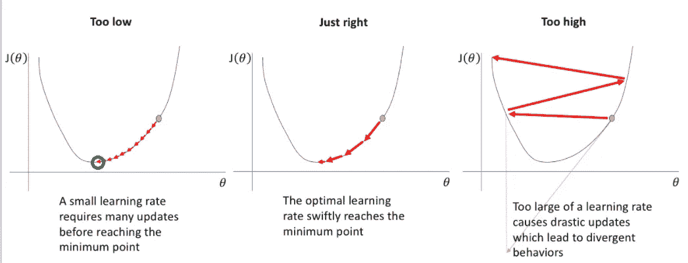
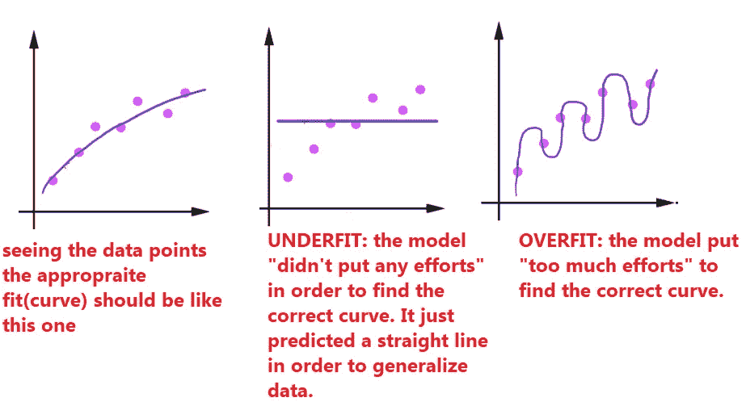
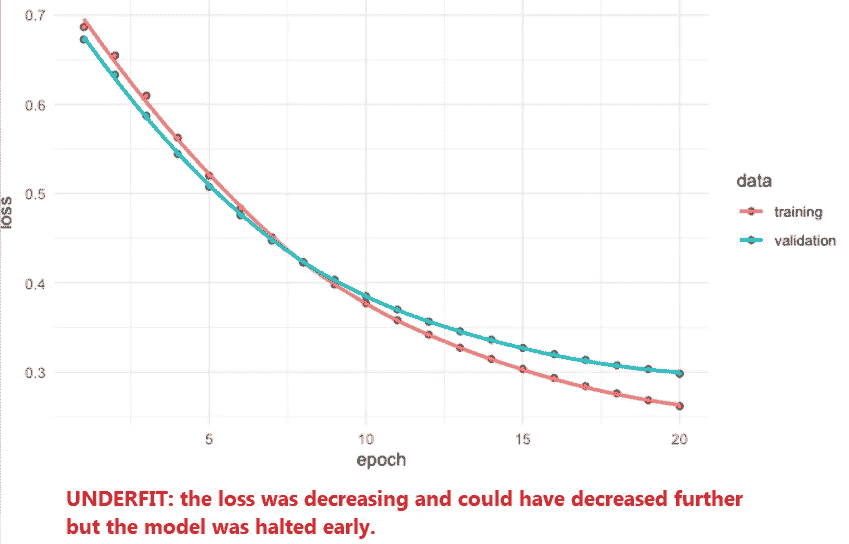
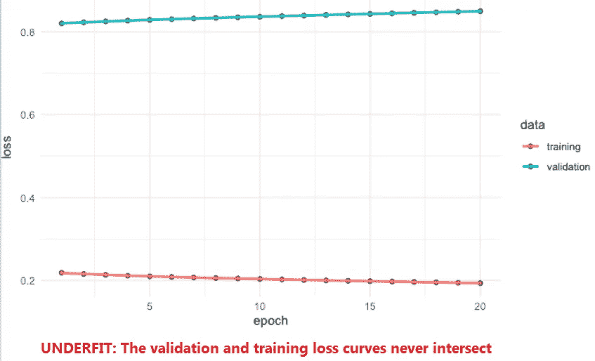
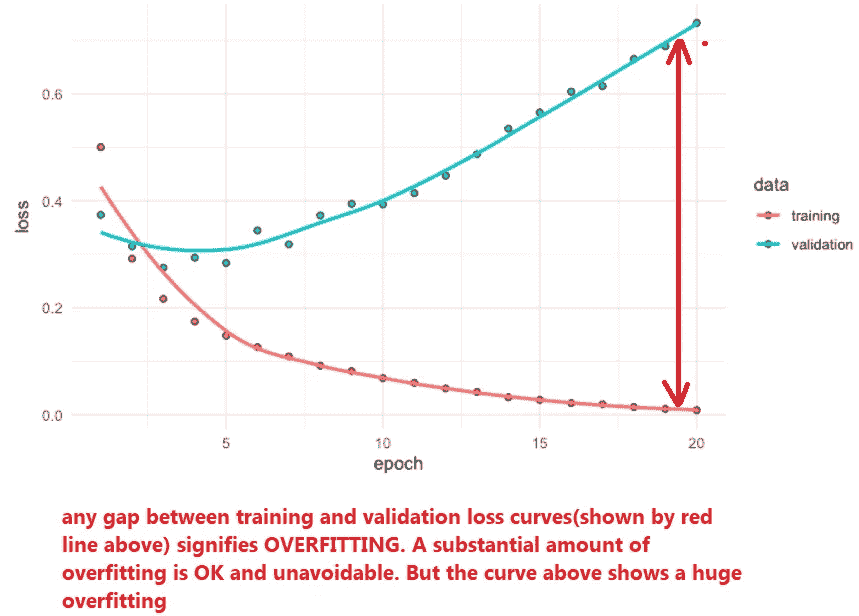
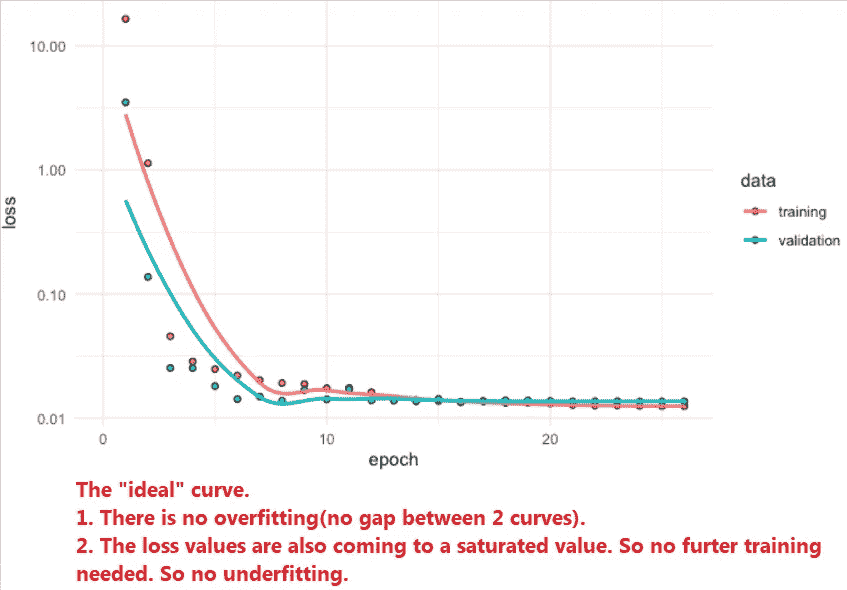
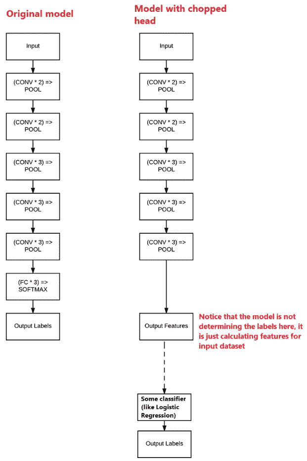
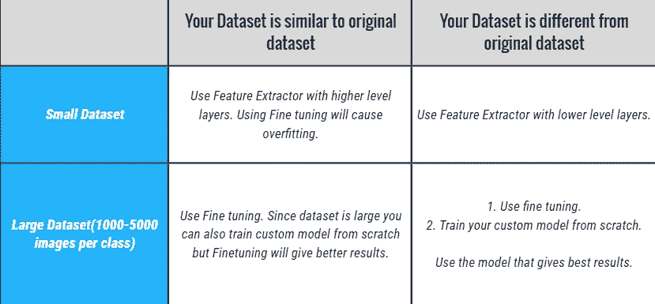

# 深度学习，总结的方法第二部分

> 原文：<https://medium.com/analytics-vidhya/deep-learning-the-summarized-way-part-2-35d88351a18a?source=collection_archive---------21----------------------->

作为 [Part-1](https://dhruv-pandey93.medium.com/deep-learning-the-summarized-way-part-1-23e2eee01ddd) 的延续，我以一种统一的方式给你带来了更多深度学习的概念。请看介绍和*“这篇文章是给你的吗？”*在[的第一部分](https://dhruv-pandey93.medium.com/deep-learning-the-summarized-way-part-1-23e2eee01ddd)。

# 学习率和调度程序

优化算法告诉*何时*更新模型参数。学习率告诉*应该对模型参数进行多少*更新。优化算法的目标是降低模型的损失或达到最小点(第一幅图像中的绿色标记)。学习率决定了在反向传播过程中，为了达到最小值或点，对模型参数进行多大或多小的更新。

发现有些术语很难理解，检查[第 1 部分](https://dhruv-pandey93.medium.com/deep-learning-the-summarized-way-part-1-23e2eee01ddd)中解释清楚的地方。



学习率解释。图片来源:[此处](https://www.jeremyjordan.me/nn-learning-rate/)。

> 学习率是一个超参数，这意味着您必须自己更新参数，模型在训练期间不会更新(或学习)它，其值通常在 0.0 和 1.0 之间。

**学习率调度器:**一种选择是完全运行模型，等待输出，然后自己调整学习率。另一种选择是定义一个定制函数，让 Keras 处理更新过程。第二个选项是所谓的 LR 调度程序。Keras 提供了 *LearningRateScheduler* 类，允许我们定义一个自定义函数，然后在 LR 计算的训练过程中自动应用它。该函数应该将纪元编号作为参数，然后根据我们定义的函数计算我们的期望学习率。

# 深度学习问题的标准步骤

在任何深度学习问题中，都有一些固定的步骤。这里稍微提一下这些步骤。

1.  为每个超参数准备一组**全局变量**。这些变量可以帮助你直接从笔记本的顶部改变这些值，而不需要在长代码中寻找它们。
2.  加载训练和验证数据并应用**数据扩充**。如果没有单独的验证数据，请执行拆分成培训数据。
3.  准备**模型架构**。每一层都有一个必须定义的激活函数。在全连接(FC)或密集层的开始，您必须将输入展平一次。最终的 FC 或密集图层的输出应该与您预测的类的数量相同。
4.  **编译你的模型**。这一步包括定义损失函数和优化算法。
5.  **定义回调函数**，你的模型将在正确的时间调用这些函数。强烈建议使用训练监视器和 EpochCheckpoint。
6.  **训练你的模型**。这是整个管道的核心，也是最耗时的部分。GPU 资源实际上只需要这一步。
7.  绘制你的曲线。一旦训练过程完成，您就有了模型、绘图验证和损失曲线。
8.  **评估模型:**如果曲线看起来不错，在测试数据集上做一些测试，然后在真实图像上做一些测试。找出模型的混淆矩阵。完全由你决定，你想用你训练好的模型做什么？
9.  **如果需要，调整超参数**。如果模型没有按照预期执行，对超参数进行小的修改。

您可以查看我的[示例笔记本](https://www.kaggle.com/pdhruv93/fingers-count-scratch)以了解代码中每个步骤是如何实际执行的。

# 欠拟合和过拟合

这是目前为止一个深度学习从业者需要了解的最重要的话题。如果你意识到了这些概念，你就可以对如何改进你的模型做出好的决定。



正确配合与欠配合和过配合

**欠拟合:**当我们的模型无法捕捉数据的潜在趋势时，就会发生欠拟合。*对训练数据表现差，对测试数据泛化能力差。在这种情况下，模型在训练和测试数据上往往具有较低的准确度分数。*这是相当容易打击的，只需要增加更多的数据用于训练或者增加更多的层/神经元到你的模型中。

**过拟合:**据说，当我们的模型只是掌握了输入数据，而不是试图学习底层泛化时，就会发生过拟合。*在训练数据上表现良好，对其他数据的泛化能力较差。对抗过度拟合的最好方法是应用正则化技术，我们将在下一节讨论。*

识别欠拟合和过拟合的最佳方法是使用精度和损耗曲线。我**强烈推荐**查[这篇文章](https://rstudio-conf-2020.github.io/dl-keras-tf/notebooks/learning-curve-diagnostics.nb.html)(非本人)精彩讲解。这肯定会帮助您做出提高模型性能的决策。

# 过度拟合的补救措施(调整技术)

1.  **简化模型架构:**如果与它们应该学习的图像相比，模型过于复杂，那么它们倾向于“抓住”输入。尝试减少层数或每层中的神经元，尽管没有具体的方法来确定要去除多少。
2.  **使用数据扩充:**尝试向模型提供各种数据。
3.  **L1 和 L2 正则化:**这些技术给我们的原始损失函数增加了额外的“惩罚”。在对图像进行操作的 DL 网络中，您通常会使用 L2 正则化。
4.  **批量标准化:**如您所见，过度拟合与输入数据有很大关系。如果不改变模型架构，我们可以在输入数据中做一些改变，这将再次有助于防止过度拟合。我们向我们的模型添加了一个新的批处理规范化层*和*，它对来自前一层的输入执行规范化和标准化操作。BN 已被证明在减少训练神经网络所需的历元数方面极其有效。
    批量标准化在通道上操作，因此我们需要指定标准化哪个轴。
    *axis=-1 暗示通道最后排序[行][列][通道]。
    axis=1 表示通道优先排序[通道][行][列]。*
5.  **Dropout:**当创建模型架构时，我们在中间添加 Dropout 层。脱落层随机断开前一层到下一层的输入。Dropout 确保下一层的神经元不完全依赖于上一层神经元(这样它们就不会“抓住”任何东西)。即使前几层的一些神经元被关闭，下一层的神经元也应该能够工作。一个*退出百分比 p* 指定在训练期间，这一层中 p%的神经元将被随机关闭。

# “理想”曲线

所有的图像都取自[这里](https://rstudio-conf-2020.github.io/dl-keras-tf/notebooks/learning-curve-diagnostics.nb.html)。



图片来源[此处](https://rstudio-conf-2020.github.io/dl-keras-tf/notebooks/learning-curve-diagnostics.nb.html)



图片来源[此处](https://rstudio-conf-2020.github.io/dl-keras-tf/notebooks/learning-curve-diagnostics.nb.html)



图片来源[此处](https://rstudio-conf-2020.github.io/dl-keras-tf/notebooks/learning-curve-diagnostics.nb.html)



图片来源[此处](https://rstudio-conf-2020.github.io/dl-keras-tf/notebooks/learning-curve-diagnostics.nb.html)

# 一些常用术语

1.  **Rank1 和 Rank5 准确度:** Rank1 准确度是顶部预测与基本事实标签相匹配的预测的百分比。在模型必须预测的 10 个类别中，您的模型预测图像是一只狗，并且该图像的地面标签也是一只狗。这是你报告的标准类型的准确性。
    另一方面，Rank5 准确性对模型稍显宽松，并采用模型做出的前 5 个预测。假设在前面的示例中，模型预测了狗是猫的图像，但如果我们看到模型做出的前 5 个预测，也有狗的预测，因此这种情况不会计入 Rank1 准确性，但仍会计入 Rank5 准确性。
2.  **动量:**还记得学习率讨论中的这个图像吗。目标是到达山或斜坡的底部。这种势头给我们的学习速度增加了一点“力量”，这样我们就可以更早一点达到最低水平。可以通过改变学习速率来改变速度。那我们为什么需要动力？因为与学习率相比，它是聪明的。动量增加了梯度指向相同方向的模型参数/权重的更新(调整)强度，并降低了梯度切换方向的参数/权重的更新强度。


学习率解释。图片来源:[此处](https://www.jeremyjordan.me/nn-learning-rate/)。

3.**内斯特罗夫的加速度:**假设你已经积累了动量，并以巨大的速度向最小值移动，当你即将达到最小值(目标)时，你必须以某种方式降低速度。内斯特罗夫的加速度作为一个校正参数来更新动量，并为模型提供模型即将达到目标的近似想法，因此相应地改变您的动量。

# 迁移学习

深度学习模型需要大量的输入数据来从头开始训练。数据集的大小和质量是成功模型的重要参数。如果没有足够的数据量，从头训练一个模型是没有任何意义的。这就是迁移学习发挥作用的地方。在迁移学习中，我们使用一些现有的训练模型作为我们自己定制模型的起点。使用迁移学习，你可以训练一个新的模型，在最初训练的范围之外对类别标签进行分类。(本节所有参考文献和图片均来源于 [PyImagesearch](https://www.pyimagesearch.com/) ，解释的太好了，感觉不像是自己写的话)。

进行迁移学习主要有两种方式:

1.  **特征提取器:**当将网络视为特征提取器时，我们本质上是在任意点“切断”网络(通常在完全连接的层之前)。然后，我们将自定义数据集传递给这个斩波网络，并获取新斩波网络生成的要素。然后将这些特征传递给一些简单的分类器，如(逻辑回归)，在那里进行实际的标签确定工作。
    最初的 CNN 本身并不负责识别这些新类别，相反，我们使用 CNN 作为中介特征提取器。下游机器学习分类器将负责学习从 CNN 提取的特征的潜在模式。



特征抽出

代码中的截头是这样完成的:

```
model = VGG16(weights="imagenet", include_top=False)
```

2.**微调:**我们将执行*网络手术*并修改实际架构，这样我们就可以重新训练部分网络，而不是简单地应用特征提取。应用微调允许我们应用预先训练的网络来识别它们最初没有被训练过的类；此外，该方法可以导致比特征提取更高的准确度。这种方法的步骤如下:

1.拿一个模型或架构(像 ResNet 或 VGGNet)和*切掉*它的最后一组全连接(FC)层(即网络的“头”)。
2。用一组新的随机初始化的全连接(FC)层替换磁头。
3。*冻结*头部以下的所有层，因此它们的权重不能更新(即反向传播中的反向传递不能到达它们)。
4。让新层*预热*。这是通过使用非常小的学习速率训练网络来实现的，因此新的 FC 层集合可以在网络中较早地从先前学习的 CONV 层开始学习模式。

以下是这些步骤的示例代码:

```
#chop off the head
baseModel = VGG16(weights="imagenet", include_top=False, 62 input_tensor = Input(shape=(224, 224, 3)))
#create new head
headModel = FCHeadNet.build(baseModel, len(classNames), 256)
#replace chopped off head with new head
model = Model(inputs=baseModel.input, outputs=headModel)

#Freeze layers
for layer in baseModel.layers:
    layer.trainable = False
```

## 什么时候用迁移学习，用哪种方法？

来自 [PyImagesearch](https://www.pyimagesearch.com/) 的 Adrian Rosebrock 博士提供了一种极好的方法来决定何时从头开始使用迁移学习 vs 训练模型。我将用表格的方式来展示。



使用哪种方法？参考自 [PyImagesearch](https://www.pyimagesearch.com/)

# 最后的话

至此，我觉得我已经涵盖了大部分“基本的”DL 概念。你的旅程不应该局限于这些文章和概念。DL 是一个广阔的世界，需要你不断的努力和学习。编这些文章真的花了我不少心血，请大家在网络上分享一下。如果我有更多的时间，我一定会想出这个系列的一些后续部分。再次非常感谢来自 [PyImagesearch](https://www.pyimagesearch.com/) 的 Adrian Rosebrock 博士和来自 [MLMastery](https://machinelearningmastery.com/) 的 Jason Brownlee，我推荐每个人仔细阅读他们的文章和编码技术，这不仅会帮助你理解 DL 基础知识，还会为实用的 DL 技术铺平道路。

[***链接到本文第 1 部分。***](https://dhruv-pandey93.medium.com/deep-learning-the-summarized-way-part-1-23e2eee01ddd)