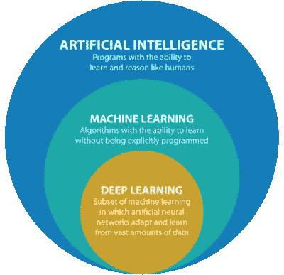

# 深度学习与机器学习——它们有什么不同？

> 原文：<https://medium.com/analytics-vidhya/deep-learning-vs-machine-learning-what-makes-them-different-c5cd8cd5ef9d?source=collection_archive---------13----------------------->

对大多数人来说，深度学习和机器学习短语听起来像是人工智能世界中可以互换的流行语。然而，这不是真的。因此，任何希望更好地理解人工智能领域的人都应该从理解这些术语及其区别开始。

