# 带密码朋克的深度学习

> 原文：<https://medium.com/analytics-vidhya/deep-learning-w-cryptopunks-6b27dc767fab?source=collection_archive---------1----------------------->

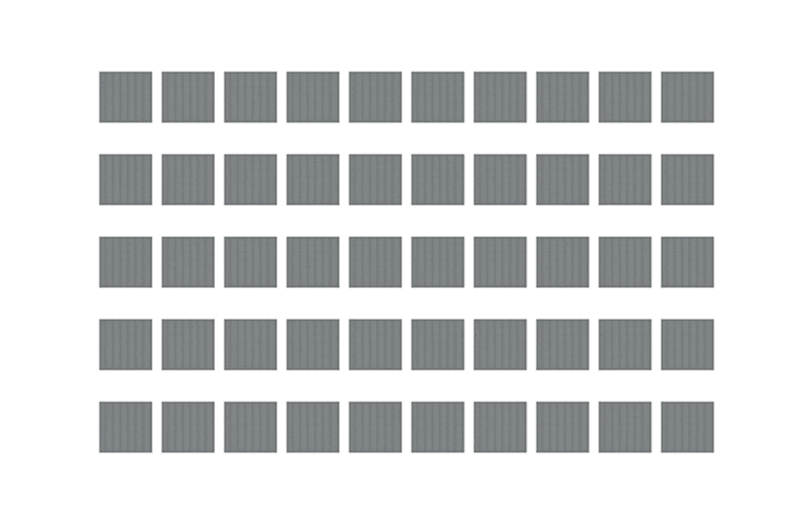

隐朋克 DCGAN——前 80 个时代

*探索深度学习&用 Python 实现隐朋克 NFT 系列的计算机视觉。*

## 介绍

C [ryptoPunks](https://opensea.io/collection/cryptopunks) ，[无聊猿](https://opensea.io/collection/boredapeyachtclub)，[矮胖企鹅](https://opensea.io/collection/pudgypenguins)……你没听说过吗？

NFT 是 2021 年的部分加密创新，部分投机狂热；抓住那些对过去一年比特币、以太坊和其他顶级加密货币提供的数百倍回报略感厌倦的人的心。

数字所有权让人们非常兴奋，位于区块链以太坊的 CryptoPunk NFT 收藏馆(目前价值超过 100 亿美元)就是最好的例子。

正如 NFT 之前的许多加密创新一样，这些东西很可能会继续存在。在本文中，我将为 NFT 添加一些进一步的实用工具，因为我相信这个集合可以作为探索一些计算机视觉挑战的有趣数据集。

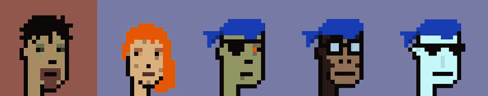

类型:男性，女性，僵尸，猿，外星人(从左到右)

大多数传统的计算机视觉任务需要标签来训练。我们很幸运——因为每个隐朋克都有一个单一的“类型”标签，其中一个是——**男性、女性、僵尸、猿、外星人**——如上图所示。

他们还有 0 到 7 个“配件”标签，总共有 87 种独特的配件。

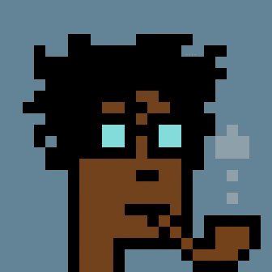

隐朋克# 3——类型:男性，配件:乱发，书呆子眼镜，烟斗

因此，crypto punk——以及数十亿美元的数字艺术收藏——是一个完美的标记数据集，可以用于计算机视觉实验。通过尝试对或多或少具有代表性的类型和配件进行分类，还有调整分类任务难度的空间。让我们开始吧。

# 内容

> 0.介绍
> 
> 1.从 OpenSea API 创建数据集
> 
> 2.密码朋克类型分类(w 超参数调谐)
> 
> 3.CryptoPunk 类型和配件分类(w 超参数调谐)
> 
> 4.深层传统生成对抗网络

## 1.从 OpenSea API 创建数据集

penSea 是 NFT 最受欢迎的市场，如果你有预算，你可以在这里买到你的第一个隐朋克。它还提供了一个可访问的 API，带有很好的文档来检索图像、价格数据、钱包活动等等。

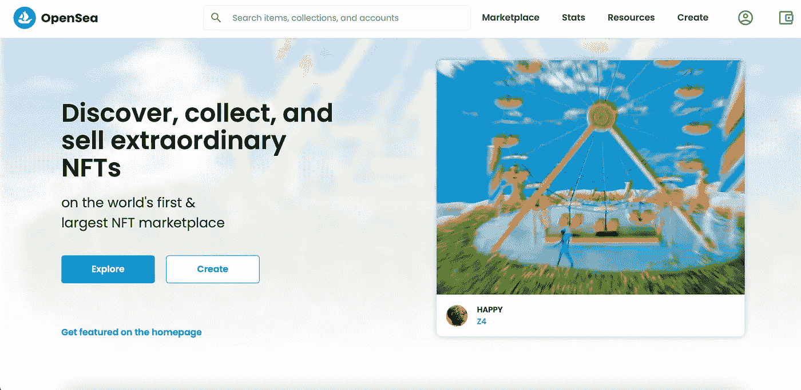

OpenSea 主页

首先，我们提取所有的 CryptoPunk 图像及其相关的类型和附件标签。你可以在我的 [GitHub](https://github.com/tom-forbes/Deep-Learning-with-CryptoPunks) 上看到我是如何详细做这件事的，以及这篇文章中的所有内容。从 OpenSea 查询 CryptoPunk 数据的简单格式如下所示。

我们现在有了自己的图像和相关的标签，所以让我们建立我们的第一个 CNN。

## 2.具有超参数调谐的密码朋克类型分类

我从一个好的基线开始任何分类任务都很重要。我们将尝试通过建立一个 2D CNN 来对密码朋克的类型进行分类，仅仅使用图像作为输入，但即使在我们到达那里之前，我们也知道一些事情。

男性 6039 人，女性 3840 人，僵尸 88 人，猿人 24 人，外星人 9 人。所以我们最好的模型前基线是猜测我们看到的每一个图像都是男性。我们有 60.4%的几率是正确的。我们的模型必须做得更好才值得。

## **建造 CNN**

现在我们有了目标，我们可以定义我们的第一个模型。我们将内置 [Keras](https://keras.io) 并使用[权重&偏差](https://wandb.ai/home)执行超参数调整。如果您之前没有使用过权重&偏差，您可能需要创建一个免费帐户。

为了提高我们的分类准确性，我们将执行贝叶斯超参数优化，这是一种比随机或网格等其他搜索技术更有效的优化搜索技术。在这里，我们围绕我们的优化定义配置，并选择一些不同的参数。

现在，我们可以加载数据并训练模型。

我们每次训练的参数和结果都记录在权重和偏差中。下面是我这次培训的全部结果。

## **结果**

 [## 密码朋克类型分类

### 权重与偏见，机器学习的开发工具

wandb.ai](https://wandb.ai/tomforbes/cryptopunk-type?workspace=user-tomforbes) 

我们的结果非常有说服力，我们已经解决了这个简单的密码朋克分类任务。我们的验证 AUC 指标在 7 列中的 6 列达到 100%。

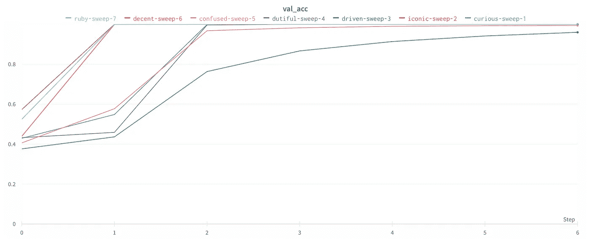

密码朋克类型分类—验证 AUC

重量和偏差中最有用的可视化之一是平行坐标图。我们可以比较输入和结果，看看什么有效，什么无效。看起来当 conv 层有 64 个过滤器和 0.00005 的学习率时，扫描做得很好。

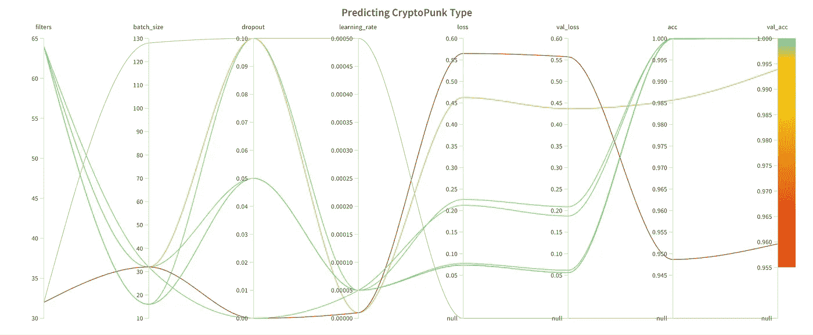

隐朋克类型分类—平行坐标图

这相当简单——让我们增加难度。

## 3.具有超参数调谐的 CryptoPunk 类型和配件分类

现在，我们将尝试解决完整功能集的分类问题。我们将遵循与之前类似的方法，看看我们在权重&偏差方面的表现如何。

现在总共有 92 个二进制类要预测，每个图像的基线预测将是一个没有配饰的男性朋克，因为任何一个配饰都很可能不存在。我们使用以下公式计算基线精度:

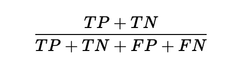

其中 TP =真阳性，TN =真阴性，FP =假阳性，FN =假阴性

运行这个代码产生了大约 92% *的**基线准确度。***这是相当高的，但这也是因为配件稀少。因此，我们需要一个模型来分类 92%以上的有用特征。

现在让我们训练，看看我们是否在这个基线上有所提高。再次，我的结果可以在下面看到。

## **结果**

 [## 隐朋克型配件

### 权重与偏见，机器学习的开发工具

wandb.ai](https://wandb.ai/tomforbes/cryptopunk-type-accessory?workspace=user-tomforbes) 

查看验证 AUC，我们可以看到一些运行非常接近 1。我们的最佳结果是 0.9958，这几乎是完美的，但也不完全是。

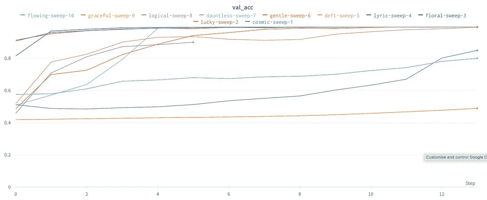

CryptoPunk 类型和配件分类—验证 AUC

几个组合产生了最接近最好的结果，看起来像是零辍学和更高的学习率产生了最好的结果。

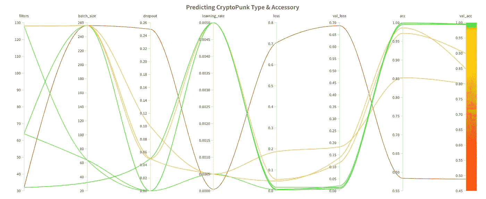

隐朋克类型和配件分类—平行坐标图

让我们在分类缺失的地方进行分解。

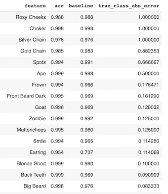

按基线改善程度排列的特性(最差的排在第一位)

## **击穿**

我们的结果显示，该模型在 3 个特征上未能提高基线。尽管测试集中只有 2 个样本，但它也很难对“猿”的类型进行分类。

总的来说，我们的模型很好地识别了大多数特征。我们可以通过使用原始图像大小来改进我们的模型，因为这可能有助于在调整大小时可能会丢失的一些较小的功能。我们还可以尝试模型架构和进一步的超参数调整。

## 4.DCGAN 朋克

现在我们将变得更有创造性，并尝试使用 DCGAN(深度条件生成对抗网络)来生成一些原始的密码朋克。让我们试着一个字一个字地解释这到底意味着什么。

*   Deep:多层神经网络。
*   有条件的:可以给定产生特定结果的条件/标签
*   生成式:模型生成图像，而不是像本文前面的部分那样生成预测值。
*   对抗性的:模型架构被认为是对抗性的，因为它由竞争的“鉴别器”和“生成器”组件组成。鉴别器试图将给定的图像分类为真实或虚假，而生成器试图欺骗鉴别器将虚假图像分类为真实。随着网络的学习，生成器必须创建更真实的图像，以欺骗鉴别器，同时鉴别器在检测假图像方面也越来越好。
*   网络:一个神经网络。

> 因为这是一个有条件的网络，我们的条件将是:“男性还是女性？”

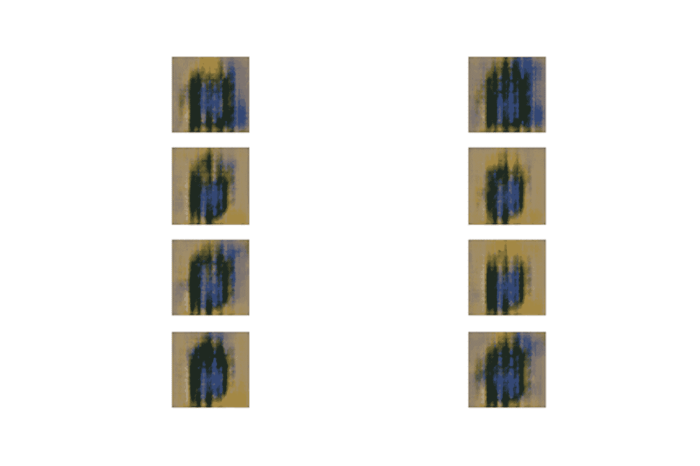

DCGAN 朋克——女性和男性(左和右)——纪元 0-65

## ***结果***

在训练开始时，图像质量差且随机，但随着网络的学习，图像得到改善，并被分成男性和女性类别。

这就是这篇文章，我希望你觉得有趣！

*附:你可以在我的* [*Github*](https://github.com/tom-forbes/Deep-Learning-with-CryptoPunks) *上找到所有代码。*