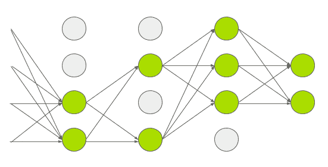

# 深入的神经网络

> 原文：<https://medium.com/analytics-vidhya/deep-neural-networks-into-deeper-849cca54a301?source=collection_archive---------5----------------------->

数据科学领域最艰难的工作是训练 DNN

# 动机

在过去的两年里，我一直在数据科学领域工作，这总是让我在该领域学习和了解得更好。来到 DNN 后，我感觉工作起来更舒服了，并收集了一些技巧来使神经网络运行得更快，并为我的模型获得最佳精度。通过这篇文章，我传播了那些让最艰难的工作变得简单的技巧。


克林特·王茂林在 [Unsplash](https://unsplash.com?utm_source=medium&utm_medium=referral) 上拍摄的照片

**由于计算时间和精力，训练 DNN 的**是一项艰巨的任务。在处理 DNN 问题时，很少出现这样的问题:

1.  消失梯度的上升，在某些情况下，爆炸梯度。
2.  训练可能极其缓慢。
3.  过度拟合训练集，尤其是在数据太小且有噪声的情况下，这种情况非常常见。

# 内容

1.  消失和爆炸渐变
2.  预应变层
3.  优化者
4.  正则化技术

# 消失和爆炸渐变

由于权重需要更新，这个问题主要出现在反向传播算法中。因此，通过这种算法，随着过程移动到可能出现“消失梯度”(擦除层中的梯度)的较低层，梯度将越来越小。

在其他情况下，随着过程移动到较低层，梯度会越来越大，并出现“爆炸梯度”的问题

在逻辑激活函数中，当输入变大时，函数在 0 或 1 处饱和，导数非常接近 0。因此，当反向传播开始时，它实际上没有通过网络反向传播的梯度；并且随着反向传播向下通过顶层，存在的小梯度不断被稀释。因此，没有什么留给下层。

> *ReLU 激活功能并不完美，因为它遇到了一个被称为“死亡 ReLU”的问题。在训练期间，一些神经元可能会死亡(停止输出除零以外的任何值)。*

*   渗漏的 ReLUs 永远不会死，他们可能会陷入长期昏迷，但他们有机会最终醒来
*   要使用 LeakyReLU 激活功能，则创建一个 leaky ReLU 层，并将其添加到您的模型中，就在您要应用它的层之后:

## 批量标准化

这种技术通过归一化解决了消失和梯度问题。同样，我们不能保证用上面的初始化器解决梯度问题，但是用 BN 我们可以。在每个隐藏层的激活函数之前或之后，在模型中添加一个操作。该操作简单地将中心置零并标准化输入，然后使用每层两个新的参数向量来缩放和移动结果；一个用于缩放，另一个用于移位。换句话说，该操作让模型学习每个图层输入的最佳比例和平均值。在大多数情况下，如果我们添加一个 BN 层作为第一层，那么不需要标准化你的训练集(例如:使用一个标准的缩放器), BN 层就可以了。

计算批处理实例的统计数据是不可靠的。所以有解决的办法；通过神经网络运行整个训练集，并计算 BN 层每个输入的平均值和标准偏差。在进行预测时，这些“最终”输入平均值和标准偏差可以用来代替批量输入和标准偏差。大多数情况下，BN 在训练期间通过使用层的输入平均值和标准偏差的移动平均值来估计这些最终统计数据。当初始化批处理规范化层时，整个过程是自动完成的。

*   当我们使用 BN 时，训练可能会慢一点，但性能是好的。
*   BN 有四个与前一层输出形状相乘的参数。
*   在四个参数中，两个是可以反向传播训练的，另外两个是移动平均。

*   当初始化模型中的 BN 层时，我们甚至可以通过上面的代码使用这种方法。首先，我们可以从隐藏层中移除激活函数，然后将它们添加到 BN 层之后，BN 层还包括每个输入的一个偏移参数，您可以使用偏置项将其设置为 False，从隐藏层中移除该参数。

## 渐变剪辑

这是用于分解梯度问题的最重要的技术，在反向传播过程中剪切梯度，使它们永远不会超过阈值限制。这种技术主要用于 RNN 氏症。在实践中，这很有效。实现剪辑是一件事在 Keras 与剪辑值或剪辑规范参数在优化。

*   从上面的代码来看；优化器会将渐变向量的每个分量裁剪为-1.0 到 1.0 之间的值。
*   如果我们需要不改变渐变向量方向的渐变剪辑，您应该使用剪辑规范而不是剪辑值按规范进行剪辑。
*   如果原始梯度向量是[0.9，100.0]；如果设置 clipvalue=1.0，那么[0.9，1.0]和 clipnorm=1.0，那么[0.00899964，0.999595]

# 预应变层

我们将讨论三种不同类型的预训练层:

1.  迁移学习
2.  无监督预训练
3.  辅助任务的预训练

## 迁移学习

从零开始构建 DNN 是困难且耗时的，因此我们可以使用预先训练的模型(已经训练的模型)来解决相同时间的问题。当使用预训练模型时，我们有一个令人信服的使用隐藏层和输出层的过程。

*   我们可以将预训练模型中的重用层冻结到新模型中。
*   对于某些问题，我们需要与预训练模型输出不同的输出，以便我们可以对输出层进行更改，并使用预训练模型中的其余层。
*   我们甚至可以通过冻结预训练模型中的上层来利用它们，而下层可以被丢弃，并使用具有所需输出的不同层。
*   如果您有大量的训练数据，您甚至可以向新模型添加更多的隐藏层。
*   迁移学习中最大的问题是用新模型匹配预训练模型的输入形状。我们必须重塑数据的输入形状，以匹配预先训练的模型输入形状。当输入具有相似的低级特征时，迁移学习效果最好。
*   为新模型初始化新的输出层并保留预训练模型中的隐藏层会在训练时产生较大的误差，因为梯度可能会破坏重复使用的权重。为了解决这个问题，我们必须通过设置 trainable = False 来冻结重用层几个时期

## 无监督预训练

它也被称为自我监督学习，在这种学习中，它必须在没有正确标记的数据的情况下进行自我学习。因此，它与监督学习非常不同，并且很难在其上找到预先训练的模型。如果一个数据没有合适的标签，那么我们必须为该数据收集标签，如果它是一个相当大的训练集，那么？但是，我们仍然可以通过自动编码器和 GAN(生成对抗网络)来执行无监督的预训练。然后，我们可以重用自动编码器和 GAN 的较低层，并在最后添加您的输出层，然后用监督学习微调最终网络。

*   当你有一个复杂的任务，很少有标记数据，但有大量的未标记数据时，无监督的预训练是很好的使用 GAN 的&自动编码器。

## 辅助任务的预训练

我们可以使用一个辅助任务来训练我们的神经网络，通过它可以很容易地获得或生成标记数据，然后将其重新用于我们的任务。第一神经网络较低层从输入中学习可能被第二神经网络重用的特征。

*   例如，如果我们想要建立一个神经网络来对少数名人的人脸进行分类，但不幸的是，要训练的图片很少，并且没有太多图片输入到网络中，那么我们可以使用具有类似问题的人脸识别的预训练模型。
*   因此，我们可以重用那些较低层来训练人脸分类。
*   通过这一点，我们可以说，较低的层可以适当地检查用于构建神经网络的特征，并且更有力地用于其他模型构建。

> 自我监督学习是指从数据本身自动生成标签，然后使用监督学习技术在生成的“带标签”数据集上训练模型。最好将其归类为一种无监督学习。

# 优化者

当涉及到优化器时，它用于加速训练神经网络。大多数情况下，梯度下降优化器广泛用于神经网络训练，并且使用许多更快速的优化器，例如:

*   动量优化
*   内斯特罗夫加速梯度
*   阿达格拉德
*   RMSProp
*   亚当和那达慕优化。
*   学习率调度

## **动量优化**

由于动量，优化器可能会过冲一点，然后回来，再次过冲，并在稳定在最小值之前像这样振荡多次。这是系统中有一点摩擦是好事的原因之一。它消除了这些振荡，从而加快了收敛速度。

*   它跟踪过去梯度的指数衰减平均值。

```
optimizer = keras.optimizer.SGD(lr=0.001, momentum=0.9)
```

## **内斯特罗夫加速梯度**

用它简单地设置`nesterov=True`一般比动量优化要快

```
optimizer = keras.optimizer.SGD(lr=0.001,momentum=0.9,nesterov=True)
```

## **阿达格拉德**

它经常执行简单的二次问题，但在训练神经网络时，它通常会过早停止。学习下降如此之多，以至于算法在达到全局最优之前完全停止。

*   尽管 Keras 有一个 AdaGrad 优化器，但我们不能将其用于深度神经网络，而是可以用于更简单的任务，如线性回归。

## **RMSProp**

它比 Adagrad 优化程序更有效。在 Adam optimization 出现之前，它是研究人员首选的优化器。

*   它跟踪过去平方梯度的指数衰减平均值。

```
optimizer = keras.optimizers.RMSprop(lr=0.001, rho=0.9)
```

## **亚当**

它代表自适应矩估计，结合了动量和 RMSProp 优化的思想。就像他们记录过去和过去平方梯度的指数衰减一样。

*   因为 Adam 是像(AdaGrad & RMSProp)这样的自适应学习速率算法。它需要较少的学习率超参数的调整。
*   最重要的是，Adam 比梯度下降更容易使用。

## **学习率调度**

在训练最适合构建 DNN 的神经网络时，学习率起着至关重要的作用。这些无非就是建立一个有学习率的网络来快速学习，减少时间消耗。设置学习速率有点难找到准确的速率，因为我们不能为网络设置太高和太低的速率，它需要平衡的学习速率。

*   高学习率会导致训练时的发散，低学习率最终会收敛到最优。
*   更好的网络培训需要均衡的学习率。
*   我们可以通过对模型进行数百次迭代训练，从一个非常小的值到一个非常大的值以指数方式增加学习率，然后查看学习曲线，选择一个略低于学习曲线开始回升时的学习率，来找到好的学习率。然后，您可以重新初始化该模型，并以该学习速率对其进行训练。
*   有许多不同的策略来降低训练期间的学习率。以低学习率开始，提高学习率，然后再下降，也是有益的。这些策略被称为“学习时间表”。
*   最常用的时间表:

1.  电力调度
2.  指数调度
3.  分段常数调度
4.  性能调度
5.  一.周期安排

> LearningRateScheduler 将在每个时期开始时更新优化器的`learning_rate`属性。

# 正规化

DNN 可以有数万个参数，有时甚至数百万个。这给了他们难以置信的自由度，意味着他们可以适应各种各样的复杂数据集。但是，这种巨大的灵活性也使网络容易过度适应训练集。那么我们需要正规化。由于正则化有许多技术，我们将讨论一些流行的技术。

## l1 和 l2 正则化

这里，l2 正则化约束神经网络的连接权重，如果您想要稀疏模型(许多权重等于 0)，则使用 l1 正则化。

*   l2()函数返回正则化函数，在训练过程中的每一步都会调用该正则化函数来计算正则化损失。然后，这将被添加到最终损失中。如您所料，如果您想要 l1 正则化，您可以只使用 keras . regulators . L1()。如果同时需要 l1 和 l2，请使用 keras . regulators . L1 _ L2()

## **辍学**

这是最优秀和最受欢迎的正则化技术之一。我们可以通过名字找到它是用来在层中放置几组神经元的。要使用 Keras 实现辍学，您可以使用 Keras。层次。拒绝传统社会的人

*   在训练期间，它随机丢弃一些输入(将它们设置为 0)并将剩余的输入除以保持概率。训练后，它什么都不做；只是将输入传递给下一层。



来源:学习 OpenCV

*   由于辍学仅在培训期间有效，比较培训损失和验证损失可能会产生误导。特别是，模型可能会过度拟合训练集，但却有类似的训练和验证损失。因此，一定要评估培训损失，而不要中途退出(如培训后)
*   这些漏失不仅是因为过度拟合数据，也是因为拟合不足的问题。

## **最大范数正则化**

最大范数正则化没有将正则化损失项添加到总损失函数中。减少 r 会增加正则化的数量，并有助于减少过度拟合。最大范数正则化也有助于缓解不稳定的梯度问题(如果您不使用批量归一化)。

# 结论

恭喜你！您刚刚学习了一些很酷的技术，这些技术可以将数据科学中的棘手工作变得简单。通过这些技术，您可以解决梯度、计算速度和过拟合训练集的问题。

希望你喜欢！！感谢阅读。

这里是我的完整项目的 [repo](https://github.com/Akshit9/Birds-Recognization) 来检查本文中使用的代码。