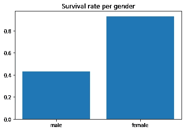

# TensorFlow 深度神经网络教程

> 原文：<https://medium.com/analytics-vidhya/deep-neural-networks-tutorial-with-tensorflow-d545e4417977?source=collection_archive---------9----------------------->


[图像信用](https://www.tutorialspoint.com/tensorflow/tensorflow_single_layer_perceptron.htm)

大家好！在这篇博客中，我将告诉你深度神经网络，或简称 DNN。在我的上一篇博客中，我已经告诉过你关于将讨论各种类型的神经网络的三部分博客，这是三部分博客的第一部分。

如果你以前几乎没有经验，只是想开始制作人工智能模型，可以关注这个博客。然而，我假设你有使用 Python 的经验。在这个博客中，我们将讨论 DNN 氏症，它是“神经网络”的复杂版本，可以接收和发送数字。

让我们开始吧。

让我们先定义一个“网络”。


这是我们能制作的最简单的神经网络。这个网络有 3 个输入和 1 个输出。“权重”只不过是帮助神经网络确定输入“强度”的数字。

为了弄清楚权重和节点(圆圈)之间的关系，考虑我们大脑中的一个神经元。它接收电信号作为输入，也输出电信号。假设你触摸一些温暖的东西。这种冲动会穿过神经元，然后到达大脑。在那里，它将冲动归类为微弱，因此它知道手指已经触摸到温暖的东西。现在，如果你触摸非常热的东西，一个更强的脉冲将穿过神经元，大脑将相应地对其进行分类。

神经网络中的权重做同样的工作，并帮助神经网络对脉冲/输入的“强度”进行分类。

神经网络只能有一个输入层和一个输出层。在图像中，输入层有 3 个节点，输出层有 1 个节点，但是它可以有我们想要的任意多个节点。

这种网络(如上图所示)可用于线性回归等基本上是直线的事情。线性回归可用于模拟显示线性模式的数据，如房价。随着占地面积的增加，成本也会增加。

深度神经网络只有一点不同。


[形象信用](https://www.kdnuggets.com/2020/02/deep-neural-networks.html)

它具有相同的输入层和输出层。但是为了对更复杂的数据建模，我们需要找出更多的特征，所以我们添加了一个隐藏层，在那里真正的奇迹发生了。在这些图层中，DNN 从更复杂的数据中提取要素。

所以让我们开始编码一个 DNN。我将使用 Kaggle 的泰坦尼克号比赛作为我的数据源。我们首先要对熊猫进行数据分析，然后用 TensorFlow 和 Keras 训练一个模型。

首先导入必要的模块:

```
import pandas as pd
import numpy as np
import tensorflow as tf
import tensorflow.keras as keras
import matplotlib.pyplot as plt
```

我用的是 TensorFlow 版本“2.2.0”。您可以通过键入以下命令来检查您的版本:

```
print(tf.__version__)
```

接下来，我们导入数据:

```
train_df = pd.read_csv("data/train.csv")train_df.head()
```


接下来，我们稍微整理一下数据:

```
train_df.drop(columns='Ticket', inplace=True)
train.df.dropna(inplace=True)
train_df.index = train_df['PassengerId']
train_df.columns = ['passenger_id', 'survived', 'pclass', 'name', 
                    'sex', 'age', 'sibsp', 'parch', 'fare', 'cabin', 'embarked']
train_df.drop(columns='passenger_id', inplace=True)
train_df.head()
```


接下来，我们给分类类分配数值来表示它们。这可以通过使用“map”来完成，它将通过将数据与输入字典进行比较来替换数据中的某些值。性别的一个例子是:

```
train_df['sex'] = train_df['sex'].map({"female":0, "male":1})
```

在清理了性别和登船等列之后，我们可以通过将年龄和费用列放在组下来进一步对数据进行分类。例如，第一个记录可能在 20-40 岁的年龄组。为此，我们使用“pd.cut”。这里有一个年龄的例子:

```
train_df['age'] = pd.cut(train_df['age'], bins=[0,20,40,60,80,100], 
labels=['0-20', '20-40', '40-60', '60-80', '80-100'])train_df['age'] = train_df['age'].map({
    '0-20': 0,
    '20-40': 1,
    '40-60': 2,
    '60-80': 3,
    '80-100': 4
})
```

在对票价做了同样的操作后，这将是我们的表:


我们这样做是为了比较我们现有的数据，并找出我们可以用来训练模型的特征。如果我们考虑性别，并编写代码显示存活下来的每种性别的数量以及每种性别的存活率，我会这样做:

```
gender = {
    'male': train_df[(train_df['sex'] == 1) & (train_df['survived'] == 1)].count()[1],
    'female': train_df[(train_df['sex'] == 0) & (train_df['survived'] == 1)].count()[1],
}f = plt.figure()
plt.bar(gender.keys(), gender.values())
plt.title("Number of people survived based on gender")
f.show()survival_rate = {
    'male': train_df[(train_df['sex'] == 1) & (train_df['survived'] == 1)].count()[1]/train_df[train_df['sex'] == 1].count()[1],
    'female': train_df[(train_df['sex'] == 0) & (train_df['survived'] == 1)].count()[1]/train_df[train_df['sex'] == 0].count()[1],
}g = plt.figure()
plt.bar(survival_rate.keys(), survival_rate.values())
plt.title('Survival rate per gender')
g.show()
```



我们可以对所有其他特性做同样的事情，代码保持不变。以下是所有其他功能的图表:


所有这些图表显示了一些可观察到的趋势，因此需要训练我们的人工智能模型。在训练前分析这样的数据真的很有帮助，因为它将有助于去除没有趋势的数据。

现在我们需要建立和训练一个模型。我将导入一个新的训练数据副本来处理，因为我想根据原始数据而不是类别数据来训练我的模型。但由于年龄和票价等数据的数量非常大，我们需要对这些数据进行归一化处理。标准化意味着我们只是在 0 和 1 之间缩小数据，因为神经网络在这样的范围内更好地工作。以下是我做的清理工作:

```
def normalise(series):
    return (series - series.min())/(series.max() - series.min())train = pd.read_csv('data/train.csv')
train = train[['Pclass', 'Sex', 'Age', 'SibSp', 'Parch', 'Fare', 'Embarked', 'Survived']]
train['relatives'] = train['SibSp'] + train['Parch']
train.drop(columns = ['SibSp', 'Parch'], inplace=True)
train.replace({'Sex': {'male': 0, 'female': 1}, 'Embarked': {"S": 0, "C": 1, "Q": 2}}, inplace=True)
train['Age'] = normalise(train['Age'])
train['Fare'] = normalise(train['Fare'])
train.head()
```


现在我们将构建我们的模型:

```
# creating a dictionary with the data
data = {
    'training data': np.array(train[['Pclass', 'Sex', 'Age', 'Fare', 'Embarked', 'relatives']]), 
    'labels': np.array(train['Survived'])
}####################################################################model = tf.keras.Sequential()
model.add(tf.keras.layers.Dense(units=6, activation='relu', input_shape=[6,]))
model.add(tf.keras.layers.Dense(units=20, activation='relu'))
model.add(tf.keras.layers.Dense(units=25, activation='relu'))
model.add(tf.keras.layers.Dense(units=20, activation='relu'))
model.add(tf.keras.layers.Dense(units=1, activation='relu'))opt = tf.keras.optimizers.Adam(learning_rate=1e-7)
model.compile(loss='binary_crossentropy', optimizer=opt, metrics=['acc'])hist = model.fit(data['training data'], data['labels'], verbose=False, epochs=500)
plt.plot(hist.history['acc'])
plt.show()
```

在这里，我制作了一个序列模型，因为我希望我的层按顺序排列，就像上面的神经网络图一样。“密集”层可能听起来很奇怪，但它只是一个普通层的名称。**记住“层”是数据进入和存在的节点(圆圈)的全部选择。**tensor flow 已经定义了复杂的计算，因此我们不需要做任何事情。编译方法及其参数告诉模型我们想要如何构建我们的模型。损失函数帮助我们确定我们的模型与实际值有多远。在这种情况下，它是二元交叉熵。二进制，因为我们的模型只有 2 种可能的输出:1(幸存)或 0(未幸存)。一个优化器帮助我们**到达**模型与实际值的误差最小的地方。度量只是告诉模型在训练时记录模型的准确性。

我在这里留下了很多东西，因为它们不是很重要，如果你简单地解决更多的人工智能问题，它们是可以理解的。如代码所示，我已经对我的模型(model.fit())进行了训练，下面是模型准确性的图表:


我们可以看到，它大约为 0.615(61.5%)。这对于第一次旅行来说很好。但是，您可以调整其他参数，例如学习率，它告诉模型以多快的速度找到解决方案。你也可以去 TensorFlow 官网看看其他的优化器(这里我用过 Adam)来改进你的模型。

今天就到这里吧！我希望你喜欢这个博客，并学到了一些东西。下一篇博客将是关于训练计算机视觉模型的。如果你喜欢这个博客，那么请分享它，并在媒体上关注我。

感谢阅读！