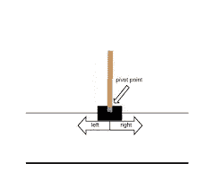
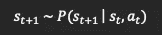
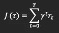
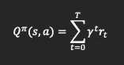

# 深度强化学习:快速概述

> 原文：<https://medium.com/analytics-vidhya/deep-reinforcement-learning-a-quick-overview-6ae43b4cf972?source=collection_archive---------2----------------------->

帕特里克·托马索在 [Unsplash](https://unsplash.com?utm_source=medium&utm_medium=referral) 上的照片

深度强化学习(RL)可以分解为两个部分。“深度”是指在其目的中使用神经网络，而强化学习(RL)被描述为使用奖励来强化行为。它是人工智能的一个活跃分支，每隔几个月就有新的发展。在本文中，我将只解释 RL 背后的概念，并且只进入描述 RL 模型的随机数学和一般函数。深度 RL 应用在玩视频游戏、运动、驾驶和机器人方面。在这些情况下，有一个目标，机器在采取下一个行动之前从环境中接收连续的反馈，等等。在代理人和环境之间有一个连续的反馈回路。本文中的几乎所有概念都可以参考 Laura Graesser 和 Wah Loon Keng 的“Python 中深度强化学习理论和实践的基础”。

如前所述，有一个*代理*或主体，如果你愿意，它作用于*环境。*环境中的每个时间戳称为一个*状态。*这可以想象成一个时间片或者动画序列中的一帧。代理观察状态并选择一个将它带到另一个状态的动作。这种状态转换与奖励有关。之所以称之为 RL，是因为奖励是驱动模型进入这个连续循环的因素。该系统有一个目标，奖励强化了有助于系统达到其目标的良好行为。

这个概念的一个简单的例子是一个掷骰子游戏，其中有一辆手推车沿着轨道移动，试图平衡顶部的一根柱子。目标是在 200 个时间步长内保持极点平衡。

钢管舞游戏(经典深度 RL 示例)

关于环境的状态或信息可以是描述[手推车位置、手推车速度、杆角度、杆角速度]的元组。这个动作是一个数字 0-1，告诉购物车向左(0)或向右(1)移动。游戏的终止是当杆子下落(>与垂直方向成 12 度)或当杆子停留≥200 个时间步时。

有状态空间(游戏的所有可能状态) *s* ，动作空间(游戏的所有动作) *a* ，三个参数的奖励函数(t 时刻的状态，t 时刻的动作，t+1 时刻的状态)描述了 RL 系统的基本信息单元。

给定上述信息我们的第一个函数，马尔可夫概率规则是非常有用的。

马尔可夫概率规则

该规则规定，对于给定的状态 s，给定状态的概率仅由当前状态和动作决定。前一个时间步长决定了下一个时间步长。翻译成我们的 CartPole 例子，马尔可夫链给我们一个状态，这个状态是由它以前的状态决定的。因此，输入 *s* 和 *a* 将会给我们一个新的状态来驱动算法前进。一个重要的注意事项是，我们将看到 *s* 和 *a* 如何与我们下面的等式相关联。

首先，要认识到的一个重要等式是:

目标方程(J)其中γ是贴现因子(0 到 1)，t =时间步长，r 是需要最大化的报酬。

上述函数的一个变体是:

其中左边是 Q pi，表示任何给定状态 s 的预期收益(报酬),动作 a。

上述三个等式描述了深度 RL 中的三种主要算法。第一个功能是一个***环境模型*** *。*第二个方程是一个 ***政策函数****，第三个方程是一个***价值函数。****

*第一个函数马尔可夫模型在环境模型中是有用的。环境模型用于人工智能棋类游戏、围棋、西洋双陆棋等。该模型在做出最佳移动之前，使用马尔可夫链概率规则来绘制或“想象”所有状态和动作。这种想法的一个例子是蒙特卡罗树搜索(MCTS)，其中称为蒙特卡罗展开的样本动作序列被探索并具有估计值。给定这些展开，计算机选择最佳的行动过程。*

*让我们解释一下第二个功能。Tau 指的是一集的轨迹。一集是从 t=0 到环境终止的收集时间步长。轨迹(tau)指的是 *s，a，r…* 到时间 t 的序列。策略函数(pi)的重要性在于它驱动模型前进，同时它的最大化导致 RL 系统的“学习”。注意:在这种情况下，pi(策略函数)的最大化实际上是无数次运行 *s* 和 *a 直到我们找到 pi 的最大值的结果。我们使用* ***梯度上升*** *并将术语****θ****引入方程。**

*与此等式直接相关的是最终函数，它是一个价值函数，通过最大化其回报来帮助 RL 模型学习。它测量状态动作对的“好”或“坏”程度，并且它的最大化也是 RL 模型“学习”的原因同样，这里的最大化与上面的一样(使用θ梯度上升)。*

*最后，还有两种或多种上述算法的组合方法。行动者-批评者算法使用策略函数来行动，使用价值函数来批评。属于这一类别的这种算法是 A3C、信任区域策略优化(TRPO)、深度确定性策略梯度(DDPG)、近似策略优化(PPO)和软行动者批评(SAC)，其中 PPO 被最广泛地使用。使用环境模型和/或策略/值函数的方法包括 AlphaGo 和 Dyna-Q。*

*算法的另一个分组是*非策略*对*策略。基于策略的*算法利用仅在同一策略内生成的数据，并在训练后丢弃，而*基于策略的*算法允许数据重用。非策略算法对内存的要求更高。*

*目前我们已经对 RL 的状态进行了概述。RL 的“深度”学习方面要求在我们的三种功能类型中应用神经网络。马尔可夫规则是使这些函数起作用的一个重要组成部分，许多研究正在这些模型上进行。强化学习正被用于视频游戏、机器人和 NLP 领域。聊天机器人，文本摘要，文本翻译，游戏，机器人，包括自动驾驶汽车都是 RL 令人兴奋的应用。它通过模仿人类的学习方式，通过反馈试错来做到这一点。虽然这只是对这个人工智能子领域的一个浅显的探索，但我希望它已经启发并让读者意识到 RL 的可能性和未来发展。*