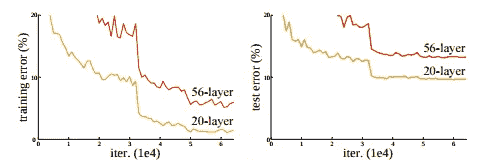
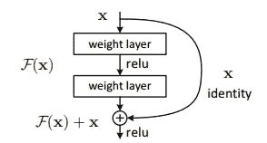
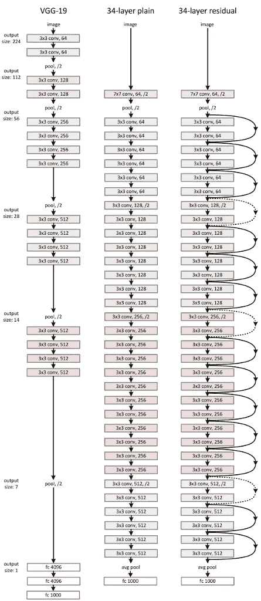
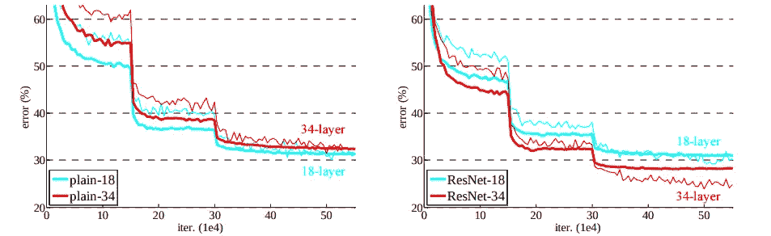

# 用于图像识别的深度残差学习(ResNet 论文解释)

> 原文：<https://medium.com/analytics-vidhya/deep-residual-learning-for-image-recognition-resnet-paper-explained-26b29e0fa73e?source=collection_archive---------7----------------------->

随着层数的增加，深度神经网络趋向于提供更高的精度。但是，随着我们深入网络，网络的准确性不增反减。随着越来越多的层被堆叠，出现了渐变消失的问题。该论文提到已经通过归一化初始化和中间归一化层解决了消失梯度。随着深度的增加，精度达到饱和，然后迅速下降。

*消失梯度:消失梯度是指深层多层前馈网络或 RNN 无法将有用的梯度信息从模型的输出端传播到模型输入端附近的层。在这种情况下，梯度变得非常小，并防止权重改变它们的值。这导致网络难以训练。

**训练错误** *(左)* **和测试错误** *(右)* **在 CIFAR-10** **上用 20 层和 56 层的“普通”网络**
[来源](https://arxiv.org/pdf/1512.03385)

上图显示，随着网络深度的增加，训练误差增加，从而增加了测试误差。这里，20 层网络的训练误差小于 56 层网络的误差。因此，网络不能很好地概括新数据，成为一个低效的模型。这种退化表明增加模型层无助于模型的性能，并且不是所有的系统都容易优化。

该论文通过引入深度剩余学习框架来解决退化问题。ResNet 的主要创新是剩余模块。残差模块具体是恒等式残差模块，它是两个卷积层的块，具有相同的滤波器数目和较小的滤波器大小。第二层的输出与第一卷积层的输入相加。

剩余学习:一个积木。
[来源](https://arxiv.org/pdf/1512.03385)

# 网络体系结构

本文将 VGGNet 的基线模型视为主要具有 3×3 滤波器的平面网络，具有两个设计规则:a)对于相同的输出特征图大小，层具有相同数量的滤波器；b)如果特征图大小减半，则滤波器的数量加倍，以保持每层的时间复杂度。网络以一个全局平均池层和一个 1000 路全连接层结束。

在普通网络的基础上，添加快捷连接，将普通版本转换为剩余版本。

**左** : VGG-19 型**中**:34 参数层平原网**右**:34 参数层残差网
[来源](https://arxiv.org/pdf/1512.03385)

# 履行

*   首先调整图像大小，将其短边采样为 256 x 480
*   采用了数据扩充技术
*   在每次卷积后和激活前进行批量标准化
*   随机梯度下降被用于训练具有 256 个小批量的网络。
*   使用 0.0001 的重量衰减和 0.9 的动量。

# 实验

Resnet 架构在由 1000 个类组成的 ImageNet 2012 分类数据集上进行评估。该模型在 128 万幅训练图像上进行训练，并在 5 万幅验证图像上进行评估。此外，100k 图像用于测试模型的准确性。

当在平面网络上执行实验时，34 层平面网络显示出比 18 层平面网络更高的验证误差。发现 34 层平面网络的训练误差高于 18 层平面网络。这里，当我们深入网络时，出现了一个降级问题。深度平面网络可能具有低收敛率，这会影响模型的准确性(影响训练误差的减少)。
与普通网络不同，每对 3×3 滤波器增加了一个快捷连接。在层数与普通网络相同的情况下，Resnet 34 的性能优于 Resnet 18 网络。Resnet-34 显示出较少的误差，并且在概括验证数据方面表现良好。这解决了普通深层网络中出现的性能下降问题。普通网络和剩余网络的比较如下所示:

ImageNet 培训。细曲线表示训练误差，粗曲线表示中心作物的验证误差。左图:18 层和 34 层的平面网络。右图:18 层和 34 层的结果。在该图中，残差网络与它们的普通对应物相比没有额外的参数。
[来源](https://arxiv.org/pdf/1512.03385)

参考

*   [用于图像识别的深度残差学习](https://arxiv.org/pdf/1512.03385)

*原载于 2021 年 1 月 1 日*[*https://prabinnepal.com*](https://prabinnepal.com/deep-residual-learning-for-image-recognition-resnet-paper-explained/)*。*