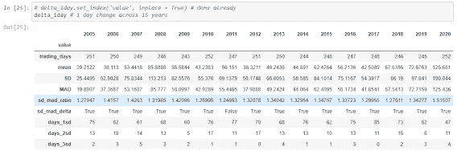

# 深入了解厚尾——15 年 NSE——python 中漂亮的 EDA

> 原文：<https://medium.com/analytics-vidhya/deeper-look-at-fat-tails-15-year-nse-nifty-eda-in-python-20c897390ca8?source=collection_archive---------9----------------------->


照片由[在](https://unsplash.com/@theblowup?utm_source=medium&utm_medium=referral) [Unsplash](https://unsplash.com?utm_source=medium&utm_medium=referral) 上放大

于是[的大祭司胖尾巴事件](https://fourweekmba.com/fat-tailed-distribution/)和[的黑天鹅；埃斯特雷米斯坦共和国总统](https://www.amazon.in/Incerto-Box-Set-Antifragile-Randomness/dp/0141985208/ref=sr_1_2?dchild=1&keywords=incerto+taleb&qid=1620620295&sr=8-2)开设了一个 [YouTube 频道](https://www.youtube.com/channel/UC8uY6yLP9BS4BUc9BSc0Jww)关于概率和统计的一些常见话题，如果你对金融市场感兴趣，你应该看看。这些主题与机器学习有很多共同点，所以如果你是数据科学家，请注意。

他关于厚尾事件的视频让我开始思考股票市场 200-500 点左右的大幅波动可能是也可能不是厚尾事件。所以我决定利用 NSE Nifty 过去 15 年的数据来探索这个问题。以下分析的所有源代码都在[GitHub repo](https://github.com/gurdeep101/fattailgain/tree/main/eda_nifty_15yr)中。

**数据下载**

虽然您可以从 NSE 历史数据部分获得数据；获取数据是一件痛苦的事情，因为它将搜索请求限制在 365 天的期限内。我发现了一个 [python 包 NSEPy](https://nsepy.xyz/) ，可以让我下载历史数据；你可以从这里得到它。

我下载了从 2005 年 1 月到 2020 年 12 月的过去 15 年的数据，保存在一个 CSV 文件中，以供进一步分析。该文件被保存为 csv 格式，并加载到一个单独的 jupyter 笔记本中以供进一步分析。

这是在一些基本的预处理和计算期初投资的 100 卢比的累积日回报后数据的样子。熊猫函数的价值转移，百分比变化和累积产品使这成为一个简单的任务。

```
# convert Date column from object to datetime to avoid problems later on
nifty['Date'] = pd.to_datetime(nifty['Date'])
# nifty.set_index('Date', inplace = True)
nifty.dtypes# add year column for groupby later on
nifty1['year'] = nifty1['Date'].dt.year
nifty1.columns# add column for daily return
nifty1['pct_change'] = nifty1['Close'].pct_change(periods = 1)
nifty1['daily_return_100rs'] = (1+nifty1['pct_change']).cumprod()*100
nifty1.tail(n=3)
```

简单的指数投资——忽略肥尾

如果我们认为波动性会随着时间的推移自行解决，我们会发现 100 卢比的投资已经增长了近 7 倍。694 也就是 31%的 CAGR！！我觉得很好。代码和结果如下

```
title_size = 15
tick_size = 13
label_size = 15fig, axes = plt.subplots(figsize = (15,15), nrows = 2, ncols = 1, squeeze = False)
# plt.style.use('basic')
axes[0][0].plot(nifty1['Date'], nifty1['Close'], lw = 2, alpha = 0.9, c = 'g')
axes[0][0].set_title('15 year Nifty Closing', fontsize = title_size)
axes[0][0].tick_params(axis = 'x', labelsize = tick_size)
axes[0][0].tick_params(axis = 'y', labelsize = tick_size)
axes[0][0].set_xlabel('Date', fontsize = label_size)
axes[0][0].set_ylabel('Closing Value', fontsize = label_size);axes[1][0].plot(nifty1['Date'], nifty1['daily_return_100rs'], lw = 2, alpha = 0.9)
axes[1][0].set_title('Value of 100 invested in Nifty', fontsize = title_size)
axes[1][0].set_xlabel('Date', fontsize = label_size)
axes[1][0].set_ylabel('Investment Value', fontsize = label_size)
axes[1][0].tick_params(axis = 'x', labelsize = tick_size)
axes[1][0].tick_params(axis = 'y', labelsize = tick_size)fig.savefig(save_path + 'data_output/nifty_15yr_results.jpg', dpi = 700)
```


这些长期回报预测的问题是，你的回报对进场和出场的时间非常敏感。比方说，如果你在 2008 年市场处于 6000 点水平时投资，并不得不忍受随后崩盘的痛苦。假设你不会发誓投资股票，并相信未来 12 年的长期投资，但却看到市场因 2020 年 3 月的 COVID 危机而暴跌至 7000 点。受到惊吓并在 3 月份赎回，你的年化收益率可能会比银行定期存款低 2.5%。

这意味着——市场的波动不容忽视。

**市场到底有多不稳定？**

[标准差(SD)](https://www.mathsisfun.com/data/standard-deviation.html) 是世界上最简单也是最常被(误)教授的波动性度量方法。又被 Taleb 堵[这个视频](https://www.youtube.com/watch?v=iKJy2YpYPe8)。简单地计算 15 年期间收盘值的标准差会产生误导，因为该指数在 15 年期间已经上涨，并且没有标准值或平均值可供我们计算偏差。


一个更好的方法是观察收盘价的变化。我们观察 1 天、2 天和 3 天期间收盘价的每日变化，并根据时间和变化量绘制它们(直方图)。我们以 1 天、2 天和 3 天为周期进行变化，因为当极端事件发生时，它们通常会在几天内发生。

```
# visualise this over a histogram and line plot
# 6 plots for 1day, 2day and 3day changes - histogram and line plotfig, ax = plt.subplots(3,2, figsize = (25,15))
ax[0][0].plot(nifty1['Date'], nifty1['daily_change'], alpha = 0.9)
ax[0][0].set_title('Daily Change by date', fontsize = title_size)
ax[0][0].tick_params(axis = 'y', labelsize = label_size)
ax[0][0].tick_params(axis = 'x', labelsize = label_size)ax[0][1].hist(nifty1['daily_change'], bins = 60, alpha = 0.9)
ax[0][1].set_title('Daily Change histogram', fontsize = title_size)
ax[0][1].tick_params(axis = 'y', labelsize = label_size)
ax[0][1].tick_params(axis = 'x', labelsize = label_size)ax[1][0].plot(nifty1['Date'], nifty1['2day_change'], alpha = 0.9)
ax[1][0].set_title('2 day Change by date', fontsize = title_size)
ax[1][0].tick_params(axis = 'y', labelsize = label_size)
ax[1][0].tick_params(axis = 'x', labelsize = label_size)ax[1][1].hist(nifty1['2day_change'], bins = 60, alpha = 0.9)
ax[1][1].set_title('2 Day Change histogram', fontsize = title_size)
ax[1][1].tick_params(axis = 'y', labelsize = label_size)
ax[1][1].tick_params(axis = 'x', labelsize = label_size)ax[2][0].plot(nifty1['Date'], nifty1['3day_change'], alpha = 0.9)
ax[2][0].set_title('3 Day Change by date', fontsize = title_size)
ax[2][0].tick_params(axis = 'y', labelsize = label_size)
ax[2][0].tick_params(axis = 'x', labelsize = label_size)ax[2][1].hist(nifty1['3day_change'], bins = 60, alpha = 0.9)
ax[2][1].set_title('3 Day Change histogram', fontsize = title_size)
ax[2][1].tick_params(axis = 'y', labelsize = label_size)
ax[2][1].tick_params(axis = 'x', labelsize = label_size)fig.savefig(save_path + 'data_output/nifty_change.jpg', dpi = 600)
```


我们看到了每日回报的波动性，以及这些值与标准正态分布的相似性。为了真正了解这些变化有多不稳定，我们将这些变化与标准正态分布的预期值进行比较。

标准正态分布的[68–95–99.7 规则](https://en.wikipedia.org/wiki/68%E2%80%9395%E2%80%9399.7_rule)是分别位于平均值的 1、2 和 3 个标准偏差内的正态分布值的百分比。如果你更倾向于数学，这篇文章对这背后的基本原理有很好的解释。

我们根据下面的标准正态分布，将 NSE Nifty 每日收盘变化的实际天数与预期天数进行比较。


上面的每一列是正态分布和 1 天、2 天和 3 天变化的天数；而每一行是标准偏差的数量。

我们预计有 1290 天(1–68%)的天数超过每日变化的 1 个标准差(1SD ),而 1 天、2 天和 3 天变化的实际值分别为 876、906 和 927 天。

真正令人惊讶的是，虽然正态分布会告诉我们，在 15 年(4030 天)的时间里，我们预计只有 12 天会大于平均值的±3 倍；实际值在 50 天的范围内！这差不多是 5 倍。虽然这个值本身相当大；它没有显示在上面的图中。

对我这个怀疑论者来说，这似乎好得不像是真的。我怀疑这仍然是因为 Nifty 在过去 15 年中上涨了 7 倍，如此大范围的平均值可能会影响标准差的计算。另一个要问的问题是一年中到底有多少这样的日子？在过去的 15 年里，肥尾事件是增加了还是减少了？

我们每年重复上述计算；分别计算每年的平均值、标准差和正态分布的偏差。为此，我们编写了一个函数来计算所需的值，并分别针对 1 天、2 天和 3 天的变化运行该函数。下面显示了 1 天更改的结果和代码示例，而笔记本上有所有时间段的代码和结果。

```
# function to call in the loop
def sd_count(nifty_yr):
    yr_values = [] # empty list to store values
    sd_mad_ratio = np.sqrt(np.pi/2)# = ~1.25 for std normal distbn

    yr_count = len(nifty_yr)
    yr_mean = np.mean(nifty_yr)
    yr_sd = np.std(nifty_yr)# ; print(yr_sd)
    yr_mad = mad_calc(nifty_yr) # call the function for MAD calculation
    yr_sd_mad_ratio = yr_sd/yr_mad # sd to MAD ratio
    yr_sd_mad_delta = yr_sd_mad_ratio > sd_mad_ratio # value 1 if ratio is greater than for Std Normal 

    yr_days_1sd = np.sum(np.where(abs(nifty_yr) > yr_sd, 1, 0)) # num days where change > 1SD
    yr_days_2sd = np.sum(np.where(abs(nifty_yr) > 2*yr_sd, 1, 0)) # num days where change > 2SD
    yr_days_3sd = np.sum(np.where(abs(nifty_yr) > 3*yr_sd, 1, 0)) # num days where change > 3SD

    yr_values = yr_values + [yr_count, yr_mean, yr_sd, yr_mad, yr_sd_mad_ratio, yr_sd_mad_delta, yr_days_1sd, yr_days_2sd, yr_days_3sd]
    return yr_values# loop over all years
for yr in yr_list:
    # print(type(yr))
    temp_df = nifty_data[nifty_data['year'].isin([yr])]
    # print(temp_df.year.unique())
    delta_1day[yr] = sd_count(temp_df['daily_change'])delta_1day.set_index('value', inplace = True)
delta_1day # 1 day change across 15 years
```



2005 年，一天变化的年度标准差为 47 点，到 2020 年已上升至 318 点。我们之前怀疑 Nifty 增加 7 倍会对平均值和 SD 计算产生影响。

我们看到每年超过 1SD、2SD 和 3SD 的天数或多或少是恒定的。[SD-MAD 比率](https://www.physicsforums.com/threads/mean-absolute-deviation-standard-deviation-ratio.199764/)略高于其预期值 1.25，这意味着每日收益的分布肯定不正常。如果你看过上面的塔勒布视频，你会很清楚这一点。

```
fig, ax = plt.subplots(4,1, figsize = (20,20), squeeze = False)ax[0][0].plot(delta_1sd['1day_change'], color = 'r')
ax[0][0].plot(delta_1sd['2day_change'], color = 'g')
ax[0][0].plot(delta_1sd['3day_change'], color = 'b')
ax[0][0].set_title('Days greater than 1 SD', fontsize = title_size)
ax[0][0].legend(['1day change', '2day change', '3day change'], loc = 'lower center', fontsize = label_size)
ax[0][0].tick_params(axis = 'x', labelsize = label_size)
ax[0][0].tick_params(axis = 'y', labelsize = label_size)
ax[0][0].set_ylim(0,100)ax[1][0].plot(delta_2sd['1day_change'], color = 'r')
ax[1][0].plot(delta_2sd['2day_change'], color = 'g')
ax[1][0].plot(delta_2sd['3day_change'], color = 'b')
ax[1][0].set_title('Days greater than 2 SD', fontsize = title_size)
ax[1][0].legend(['1day change', '2day change', '3day change'], loc = 'center', fontsize = label_size)
ax[1][0].tick_params(axis = 'x', labelsize = label_size)
ax[1][0].tick_params(axis = 'y', labelsize = label_size)
ax[1][0].set_ylim(0,50)ax[2][0].plot(delta_3sd['1day_change'], color = 'r')
ax[2][0].plot(delta_3sd['2day_change'], color = 'g')
ax[2][0].plot(delta_3sd['3day_change'], color = 'b')
ax[2][0].set_title('Days greater than 3 SD', fontsize = title_size)
ax[2][0].legend(['1day change', '2day change', '3day change'], loc = 'upper center', fontsize = label_size)
ax[2][0].tick_params(axis = 'x', labelsize = label_size)
ax[2][0].tick_params(axis = 'y', labelsize = label_size)
ax[2][0].set_ylim(0,50);ax[3][0].plot(mad_sad_df['1day_ratio'], color = 'r')
ax[3][0].plot(mad_sad_df['2day_ratio'], color = 'g')
ax[3][0].plot(mad_sad_df['3day_ratio'], color = 'b')
ax[3][0].set_title('SD to MAD ratio over time', fontsize = title_size)
ax[3][0].legend(['1day change', '2day change', '3day change'], loc = 'upper center', fontsize = label_size)
ax[3][0].tick_params(axis = 'x', labelsize = label_size)
ax[3][0].tick_params(axis = 'y', labelsize = label_size)fig.savefig(save_path + 'data_output/annual_sd_comp.jpg', dpi = 600)
```

让我们看看天数的变化如何随超过 1SD、2SD 和 3SD 的天数而变化，以及 15 年期间 SD-MAD 比率的总变化


我们从上面的图表中看到，对于 1 天、2 天和 3 天的变化，回报超过特定 SD 的天数是相似的。这将意味着，虽然突然的变化发生在 2-3 天内，但大量的变化发生在一天左右，这使得人们没有太多的时间做出反应。

SD-MAD 比率的范围在 1.25 和 1.52 之间，1 日变化趋势的值高于其他值。

假设上述图中的值彼此非常接近；我们取平均值，并与标准正态分布中的预期值进行比较。


每年，我们平均有 2 天的回报超过 Nifty 中平均回报的 3SD，而每年的预期是 0.75 天。我们在此确认交易所回报的非正态性，因为我们已经考虑了价值的变化，并查看了价值中正确的分子和分母！

非正态性——正还是负？

我们通常会将黑天鹅事件与市场崩溃和黑暗日子联系在一起。作为研究人员和寻求真理的人，我们不遵循传统智慧，而是让数据自己说话。让我们比较一下 2SD 的一天收益中正负变化的数量。

```
val = 2 # plug for calculating deviations greater than 1, 2 or 3 SD
sd_1day = pd.DataFrame(delta_1day.loc['SD',:].transpose().reset_index())
sd_1day['SD'] = val*sd_1day['SD']
sd_1day.columns = ['year', 'SD']
d = dict(zip(sd_1day['year'], sd_1day['SD'])); dnifty1['pos_sd_1day'] = nifty1['year'].map(d) # add SD value to column
nifty1['pos_delta'] = np.where(nifty1['daily_change'] > nifty1['pos_sd_1day'], 1, 0)
nifty1['neg_delta'] = np.where(nifty1['daily_change'] < (-val*nifty1['pos_sd_1day']), 1, 0)
nifty1.head()# group total of positive and nengative values by year
pos_delta = nifty1.groupby(['year']).agg({'pos_delta': 'sum'}); print(pos_delta)
neg_delta = nifty1.groupby(['year']).agg({'neg_delta' : 'sum'}); print(neg_delta)# plot both on graph
plt.figure(figsize = (15,5))
plt.plot(pos_delta, lw = 3, alpha = 0.6, color = 'g')
plt.plot(neg_delta, lw = 3, alpha = 0.6, color = 'b')
plt.legend(['positive change', 'negative change'],loc = 'upper right', fontsize = tick_size)
plt.title(f'Yearly count of positive and negative changes in daily returns over {val} SD', fontsize = label_size)
plt.tick_params(axis = 'x', labelsize = label_size)
plt.tick_params(axis = 'y', labelsize = label_size)plt.savefig(save_path + 'data_output/pos_neg_delta.jpg', dpi = 900)
```


在任何一年中，积极事件的数量都远远高于消极事件的数量！这意味着在厚尾中有下行保护和上行捕捉的空间。

**上行捕捉&下行保护**


由[卡洛斯·穆扎](https://unsplash.com/@kmuza?utm_source=medium&utm_medium=referral)在 [Unsplash](https://unsplash.com?utm_source=medium&utm_medium=referral) 上拍摄的照片

所以现在我们知道金融市场在左边和右边都有厚尾。我们来玩“如果”吧

如果我们抓住一部分上升空间，比如说 50%,保护我们自己免受 50%的下降空间，在理想的世界里，两者兼而有之！！

在上述每种情况下，我们 15 年前投资的 100 卢比今天会是什么样子？

我们在下面看到的明显更高的 a；尽管真正的收益来自于长期积累的复利。

保护下跌和从上涨中获取额外的 alpha 值是很重要的，但这本身不会产生惊天动地的回报，除非你能够将额外的收益重新投资到市场中，以获得复利回报。

```
plt.figure(figsize = (15,5))
plt.plot(nifty1['Date'], nifty1['daily_return_100rs'], lw = 2, alpha = 0.9, c = 'r', label = 'Simple Indexing')
plt.plot(nifty1['Date'], nifty1['pos_retrn_100rs'], lw = 2, alpha = 0.9, c = 'g', label = '50pct upside over 2SD - 1day change')
plt.plot(nifty1['Date'], nifty1['neg_retrn_100rs'], lw = 2, alpha = 0.9, c = 'b', label = '50pct_downside over 2SD - 1day change')
plt.plot(nifty1['Date'], nifty1['pos_neg_retrn_100rs'], lw = 2, alpha = 0.9, c = 'm', label = '50pct upside downside - 1day change')
plt.title('Value of Rs 100 invested in different scenarios in Nifty', fontsize = title_size)
plt.tick_params(axis = 'x', labelsize = label_size)
plt.tick_params(axis = 'y', labelsize = label_size)
plt.legend(loc = 'best')plt.savefig(save_path + 'data_output/upside_downside.jpg', dpi = 600)
```


**这有多真实？**

我们已经看到了大量关于厚尾的存在、黑天鹅事件的影响以及捕捉上行和下行保护的好处的分析。

能够做到这一点实际上是一个完全不同的世界，因为在现实世界中，我们需要考虑人类情感、市场时机、交易成本以及不提前预定利润而是保持投资的能力。

在极端事件中，我们需要考虑期权溢价、下滑和流动性。我们将在以后的文章中探讨这些问题。

用于分析的所有代码都在这个 [GitHub 页面](https://github.com/gurdeep101/fattailgain/tree/main/eda_nifty_15yr)中。

通过 [LinkedIn](https://www.linkedin.com/in/gurdeep101/) 、 [Twitter](https://twitter.com/gurdeep101) 或 [Medium](https://gurdeepsinghs.medium.com/) 与我联系，了解最新消息。那都是乡亲们！

注:所有内容均为研究目的，非投资建议。我建议你不要在没有咨询注册财务顾问的情况下尝试同样的做法，然后再做投资决定。