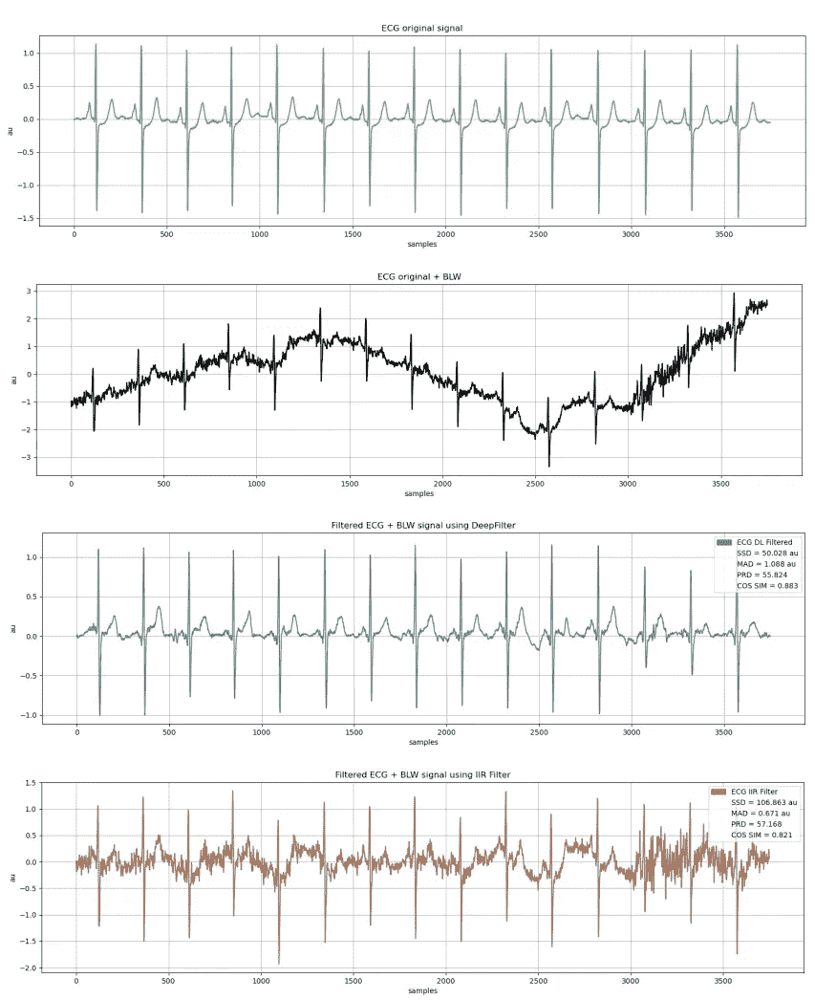

# DeepFilter:使用深度学习技术的 ECG 基线漂移消除滤波器

> 原文：<https://medium.com/analytics-vidhya/deepfilter-an-ecg-baseline-wander-removal-filter-using-deep-learning-techniques-af89f85377c3?source=collection_archive---------9----------------------->

*很高兴在* [***生物医学信号处理与控制***](https://www.sciencedirect.com/science/article/pii/S1746809421005899) *上发表的文章* ***DeepFilter:一种利用深度学习技术的心电基线漂移去除滤波器*** *。这是与弗朗西斯科·佩尔迪贡·罗梅罗**[*卡洛斯·R·巴斯克斯·塞斯德斯多*](https://www.researchgate.net/profile/Carlos-R-Seisdedos) *出色合作的结果。**