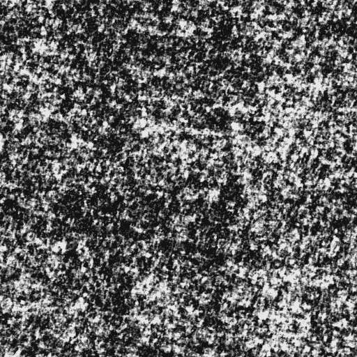

# 使用图像分割的产品缺陷检测

> 原文：<https://medium.com/analytics-vidhya/defect-detection-in-products-using-image-segmentation-a87a8863a9e5?source=collection_archive---------0----------------------->

# 目录

1.  介绍
2.  问题陈述
3.  ML 公式
4.  绩效指标
5.  理解数据
6.  数据准备
7.  建模
8.  培养
9.  基于测试数据的分割图预测
10.  未来作品
11.  参考

# 1.介绍

**什么是物体检测？**

给定一幅图像，我们人类可以识别该图像中存在的物体。例如，我们可以检测图像中是否有汽车、树木、人物等。*如果我们能够分析图像并检测物体，我们是否也能教会机器做同样的事情？*

答案是肯定的。随着深度学习和计算机视觉的兴起，我们可以自动进行物体检测。我们可以建立深度学习和计算机视觉模型，可以检测和定位对象，计算它们之间的距离，预测它们未来的阶段等。目标检测在计算机视觉和机器学习中有着广泛的应用。物体跟踪、闭路电视监控、人类活动识别，甚至自动驾驶汽车都利用了这项技术。为了更好地理解它，考虑下图。

图 1:道路交通物体检测

该图示出了从车辆看的道路交通图像的物体检测。这里我们可以看到它正在检测其他车辆、交通信号等。如果车辆是自动驾驶汽车，它应该能够检测行驶路径、其他车辆、行人、交通信号等，以便平稳和安全地驾驶。

如果你想知道更多关于物体检测的信息，你可以参考[这里](https://www.fritz.ai/object-detection/#:~:text=Object%20detection%20is%20a%20computer,all%20while%20accurately%20labeling%20them.)。

既然我们已经理解了对象检测，让我们转到一个稍微高级的技术，称为图像分割。

通过分析下图，我们很容易理解目标检测和图像分割的区别。

图 2:对象检测和图像分割

这两种方法都试图识别和定位图像中的对象。在对象检测中，这是通过使用边界框来实现的。算法或模型将通过在对象周围绘制矩形边界框来定位对象。在图像分割中，图像的每个像素都被标注。这意味着，给定一幅图像，分割模型试图通过将图像的所有像素分类为有意义的对象类别来进行像素分类。这也称为密集预测，因为它通过识别和理解每个像素属于什么对象来预测每个像素的意义。

*“图像分割的返回格式称为遮罩:一个与原始图像大小相同的图像，但对于每个像素，它只具有一个指示对象是否存在的布尔值。”*

我们将在这个案例研究中使用这种技术。想了解更多关于图像分割的知识，可以参考[这个](https://missinglink.ai/guides/computer-vision/image-segmentation-deep-learning-methods-applications/)。

现在我们有了一个关于物体检测和图像分割的想法。让我们进一步理解问题陈述。

# 2.问题陈述

我们得到了一些产品的图片。有些产品有缺陷，有些没有。给定一个产品的图像，我们需要检测它是否有缺陷。我们还需要定位这个缺陷。

# 3.ML 公式

这个问题可以表述为一个图像分割任务。给定一个产品的图像，我们需要为其绘制分割蒙版。如果产品有缺陷，分割图应该能够定位该缺陷。

# 4.绩效指标

分割问题中最常用的度量之一是交集/并集(IoU)分数。参考下图，它清楚地显示了 IoU 分数是如何计算的。

**IoU 是预测分割和真实分割之间的重叠面积除以预测分割和原始分割之间的合并面积。**

我们也可以把欠条分数写成 TPTP+FN+FP。你可以参考[这里](https://stats.stackexchange.com/questions/273537/f1-dice-score-vs-iou/276144#276144)了解更多信息

该指标的范围从 0 到 1。Iou 分数为 1 表示完全重叠，IoU 分数为 0 表示完全没有重叠。

本案例研究中使用的损失函数是骰子损失。骰子损失可以被认为是 1-骰子系数，其中骰子系数被定义为，

骰子系数=2*相交重叠面积

您可以在此阅读更多关于这些指标的信息[。](https://towardsdatascience.com/metrics-to-evaluate-your-semantic-segmentation-model-6bcb99639aa2#:~:text=3.-,Dice%20Coefficient%20(F1%20Score),of%20pixels%20in%20both%20images.)

# 5.理解数据

数据集包含两个文件夹—培训和测试。训练集由六类图像组成。每类图像被分成两个文件夹，其中一个文件夹包含 1000 个无缺陷图像，另一个包含 130 个有缺陷图像。下图显示了 train 文件夹中的文件夹。

图 3:训练数据集

以“_def”结尾的文件夹名包含相应类别的缺陷图像，没有“_def”的代表无缺陷图像。

测试文件夹包含一组 120 个缺陷图像，其分割图将被预测。

# 6.数据准备

# 6.1 准备图像数据和分割掩模

现在我们需要为每幅图像准备图像数据和相应的分割蒙版。我们把图像分成十二个文件夹。让我们看一些图片。

图 4:产品的样本图像

第一个图像代表有缺陷的产品，第二个图像代表无缺陷的图像。现在我们需要为这些图像准备分割图。分割图应该检测图像中的缺陷部分。对于上面的图像，预期的分割图将是这样的。

图 5:图 4 中图像的分段掩码

我们可以看到，在第一个图像中，椭圆形区域代表检测部分。第二个图像是空白的，因为它没有缺陷。

让我们分析一些更有缺陷的图像。

图 6:一些有缺陷图像的例子

我们可以看到缺陷在图像中以曲线或直线的形式出现。因此，为了将这些区域标记为缺陷，我们可以使用椭圆。

但是我们如何准备分割蒙版呢？需要人工标注吗？

幸运的是，我们得到了另一个包含分段掩码信息的文件。

每一行都包含有关图像被遮罩区域的信息。每列表示以下内容:图像的文件名、椭圆的半长轴、椭圆的半短轴、椭圆的旋转角度、椭球中心的 x 位置和椭球中心的 y 位置。

用于绘制椭圆的数据是使用 get_data 函数获得的，如下所示

我们可以使用这些信息，并使用[撇除](https://scikit-image.org/docs/dev/api/skimage.draw.html)功能绘制一个椭圆分割蒙版。

应当注意，这仅适用于有缺陷的图像。对于无缺陷的图像，我们需要创建空白图像作为分段掩码。

# 6.2 加载数据

结构化数据以如下所示的形式获得。

“图像”列包含每个图像的完整文件路径,“遮罩”列包含相应的遮罩图像。

下一步是加载数据。

# 7.建模

既然我们已经获得了所有的数据，下一步就是找到一个可以为图像生成分割蒙版的模型。我来介绍一下 UNet 模型，它非常流行于图像分割任务。

UNet 架构包含两条路径——收缩路径和扩张路径。下图将有助于更好地理解 Unet 架构。

图 Unet 架构

模型结构类似于英文字母“U ”,因此得名 Unet。模型的左侧包含收缩路径(也称为编码器)，它有助于捕捉图像中的上下文。编码器只是传统的卷积层和最大池层的堆栈。在这里，我们可以看到池层减少了图像的高度和宽度，增加了深度或通道的数量。在收缩路径的末端，模型将理解图像中存在的形状、图案、边缘等，但是它丢失了它存在于“何处”的信息。

因为我们的问题是获得图像的分割图，所以我们仅从收缩路径获得的信息是不够的。我们需要一个高分辨率的图像作为输出，其中所有像素被分类。

*“如果我们使用一个有池层和密集层的规则卷积网络，我们会丢失“在哪里”的信息，只保留“是什么”的信息，而这些信息并不是我们想要的。在细分的情况下，我们既需要“什么”也需要“在哪里”的信息。*

因此，我们需要对图像进行上采样，以保留“位置”信息。这是在右侧的扩展路径中完成的。扩展路径(也称为解码器)用于使用上采样技术对捕获的上下文进行定位。有各种上采样技术，如双线性插值、最近邻法、转置卷积等。如果你有兴趣了解更多关于上采样技术的内容，可以参考[这个](https://towardsdatascience.com/transposed-convolution-demystified-84ca81b4baba)。

# 8.培养

现在，我们已经准备好了训练的所有数据，模型也决定了。现在让我们训练模型。

由于无缺陷图像的数量远高于有缺陷图像的数量，为了获得更好的结果，我们只从无缺陷图像中抽取一个样本。该模型是使用 adam optimizer 编译的，我们使用骰子损失作为损失函数。使用的性能指标是 iou 得分。

经过 10 个时期后，我们能够实现 0.98 的 iou 分数和 0.007 的骰子损失，这已经相当不错了。让我们看看一些图像的分割图。

我们可以看到，该模型能够预测与原始分割图相似的分割图。

# 9.基于测试数据的分割图预测

现在让我们尝试解决手头的问题，即预测和绘制测试图像的分割掩模。下图显示了一些测试图像的预测分割图。

我们可以看到，该模型给出了良好的测试性能，并且能够检测测试图像中的缺陷。

如有任何疑问或建议，可通过 [**LinkedIn**](https://www.linkedin.com/in/vinitha-v-n-5a0560179/) 联系我。

# 10.未来作品

如上所述，与无缺陷图像相比，缺陷图像的数量非常低。因此，我们可以通过对有缺陷的图像应用上采样和增强技术来改进训练。

# 11.参考

1.  [https://towards data science . com/understanding-semantic-segmentation-with-unet-6 be 4f 42 D4 b 47](https://towardsdatascience.com/understanding-semantic-segmentation-with-unet-6be4f42d4b47)
2.  [https://towards data science . com/metrics-to-evaluate-your-semantic-segmentation-model-6 BCB 99639 aa 2](https://towardsdatascience.com/metrics-to-evaluate-your-semantic-segmentation-model-6bcb99639aa2)
3.  [https://towards data science . com/transposed-卷积-去神秘化-84ca81b4baba](https://towardsdatascience.com/transposed-convolution-demystified-84ca81b4baba)