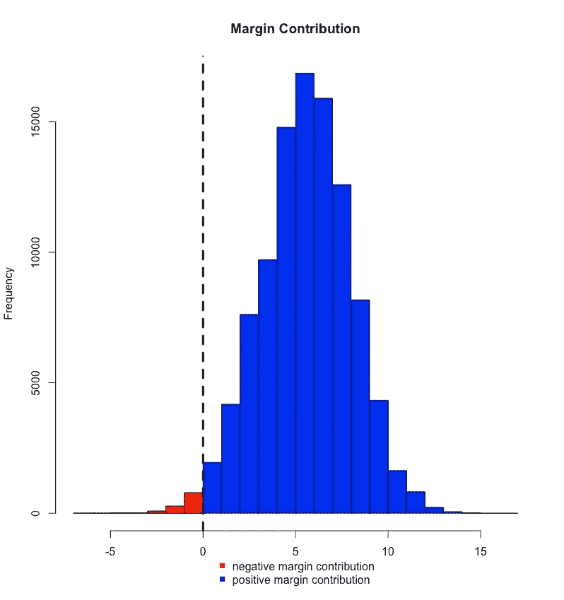
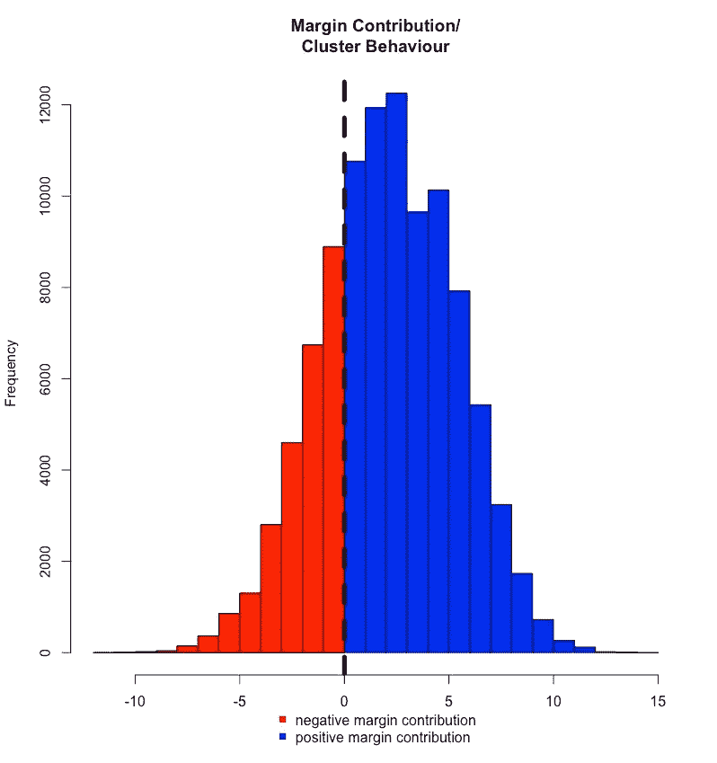
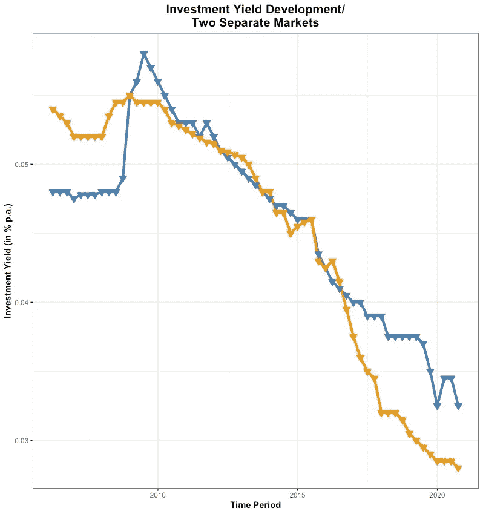
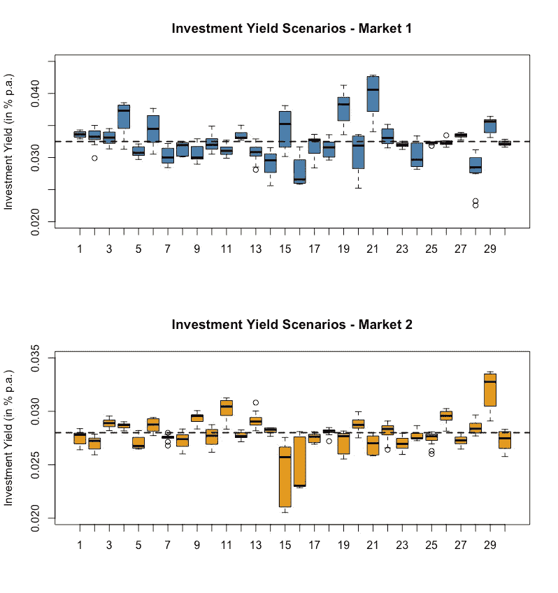
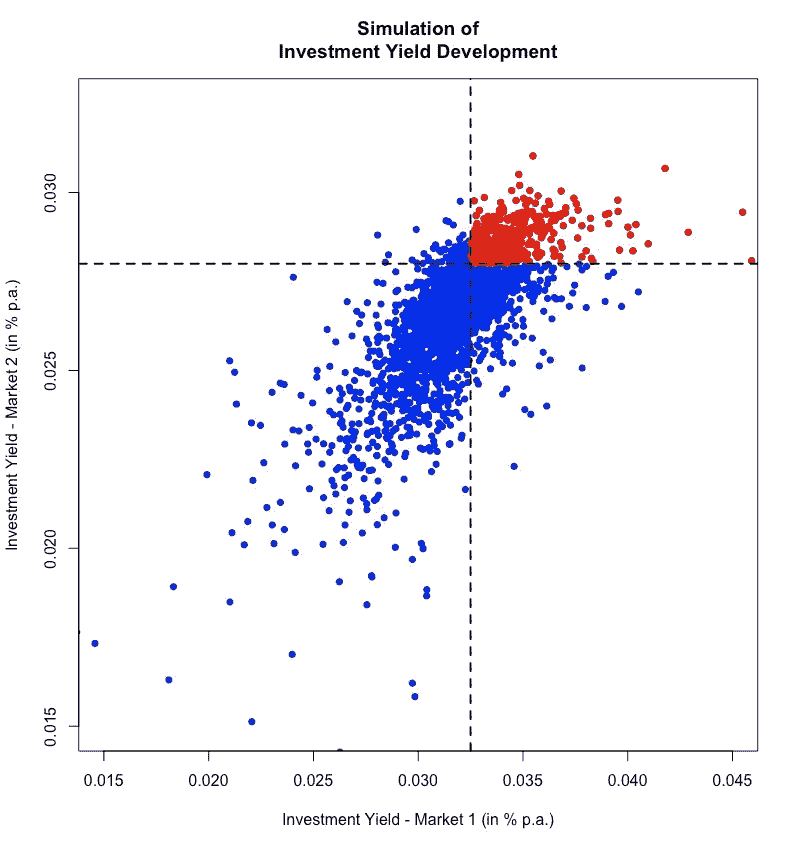

# 商业房地产投资中市场风险群的定义

> 原文：<https://medium.com/analytics-vidhya/defining-market-risk-clusters-in-commercial-real-estate-investments-5e1a6b18e40c?source=collection_archive---------15----------------------->

# 基本问题

当大量的事物对相同的触发事件做出反应时，这些事物必须被视为集群。

从风险的角度来看，集群是非常讨厌的，因为它们往往表现出不可理解和突然的行为，导致不可预见的，有时甚至是致命的风险暴露。

原因是，扣动正确的扳机，每个反应不再相互独立。而且，相关事件显示出与独立事件完全不同的(风险)行为。

因此，识别集群风险在风险管理操作中至关重要。

不幸的是，集群通常没有清晰的边界，因此很容易被发现。

根据行业、资产类别或单一市场等标记集群风险的传统风险方法可能无法理解整个风险状况，可能达不到其目的。

数据驱动的风险解决方案能够引入更复杂的风险管理方法，以应对这一问题。

在这方面，我们可以使用相当广泛的工具，如统计建模、机器学习技术和网络分析。

但是，目前我们着眼于商业房地产投资的集群风险的影响。

# 集群风险——一个基本示例

贷款组合在最低保证金水平上进行校准，因此负保证金贡献的风险仅为 1 %。保证金水平基于从早期违约经验中得出的假设违约比率。因此，贷款组合的风险状况如下:

作者图片

然而，当集群风险控制了投资组合时,**风险状况会发生巨大变化。模拟集群风险的释放，同时保持贷款组合的结构不变，这表明组合的风险状况显著增加:**

作者图片

简言之，**负边际贡献的风险从 1 %升至近 20 %！！！！**

这是怎么做到的？

嗯，保证金校准是在假设投资组合中的单个违约案例是独立的情况下，以一定的违约率进行的。

这一假设在集群中不成立**在触发事件(如特大经济危机)非常严重以至于单个违约事件开始相互影响的情况下，这一假设不成立。**

结果是短期内风险情景急剧恶化。

# 房地产投资和区域集群

在房地产领域，避免集群风险或至少降低其影响的一种方法是分散投资于不同的房地产资产类别和/或不同的房地产市场。虽然，有时这可能还不够，正如我们的市场多样化的例子所示。

假设，一个投资者有一个房地产投资组合，由相同的资产类别组成，但位于两个不同的市场。换句话说，市场多样化是策略。

然而，就投资收益而言，这两个市场显示出以下经验性发展:

作者图片

到目前为止，很明显两个市场与**有很强的关联性**，因此趋向于同一个方向。涉及两个市场的市场多元化战略可能不是一个好主意，因为这些市场似乎正在建立一个**区域集群**。

将这一区域集群纳入投资组合的风险评估，模拟了 3 年投资期的可能投资收益情景。以下是每个市场的模拟收益率情景示例:

作者图片

在 3 年期限结束时，我们的投资者在两个市场面临以下可能的收益率组合:

作者图片

风险模拟也揭示了两个市场之间的联系。鉴于这些市场的当前市场状况(黑色虚线)，**区域集群的存在导致 20 %的风险，即房地产投资组合同时面临两个市场的低迷。**

就投资收益率而言，这是**危险区**(见图中红色区域)，在这里**的价值确实往南**。

就市场价值而言，这可能意味着整个投资组合的价值下降 7 %甚至高达 20 %，这当然会对投资组合的表现产生巨大影响。

# 结论

如图所示，集群风险肯定是一个需要识别和处理的问题。

问题在于，集群风险并不总是显而易见的，或者是由非常事件临时引发的。

传统的风险管理方法在检测集群的隐藏模式方面是薄弱的，并且不总是反映集群在行动中的后果。

来自高级统计建模、机器学习或网络分析领域的更复杂的风险技术为解决这些关键问题提供了大量帮助。

有关使用数据驱动的金融风险解决方案的更多信息，请访问 d-darks.com