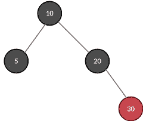

# 红黑树中的删除

> 原文：<https://medium.com/analytics-vidhya/deletion-in-red-black-rb-tree-92301e1474ea?source=collection_archive---------0----------------------->

R-B 树中的删除比其他二叉树稍微复杂一点。在这里，我用合适的例子展示了删除操作，以演示所有的情况。

## **先决条件:**

您应该对二叉查找树(BST)上执行的所有操作和 R-B 树中的插入操作有所了解。您应该熟悉节点的兄弟、父、祖等术语。

## **快速回顾一下 R-B 树:**

1.  红黑树是一个二叉查找树，每个节点为其颜色(红/黑)多存储一位
2.  这棵树大约是平衡的。
3.  每个节点不是红色就是黑色。
4.  根是黑色的
5.  每片叶子都是黑色的
6.  如果一个节点是红色的，那么它的两个子节点都是黑色的。
7.  对于每个节点，从该节点到后代叶子的所有简单路径都包含相同数量的黑色节点。

## **为什么需要一棵 R-B 树？**

您可能会想，既然已经有了各种其他的树数据结构(B 树、BST、AV)，为什么还需要这么复杂的数据结构。嗯，说 R-B 树没用是不公平的。就像任何其他数据结构一样，R-B 树有它自己的优缺点。R-B 树主要用于频繁执行插入和/或删除的系统中。该树保证了搜索、删除和插入操作的时间复杂度为 O(log n)。

## 零节点

图 1:具有零节点的 RB 树

图 2:没有零节点的 RB 树

每个叶节点都有一个唯一的不可见的子节点，称为 NIL 节点。它们总是被涂成黑色。

图 [1](https://cdn-images-1.medium.com/max/400/1*WTBxBlLFB99oZ34V0wLNUQ.jpeg) 和图 [2](https://cdn-images-1.medium.com/max/640/1*W8cMNgfzTJ9wjNC9HLzaEw.jpeg) 等效。没有必要在图中指定零节点。但是它们在执行删除时很重要。当您删除一个节点时，它变成一个 NIL 节点，并被标记为一个双黑 DB 节点(我将很快介绍这一点)。

总而言之，这就是所有的零节点。

## 删除案例

永远记住一件事-

> 在删除元素(键)后，红黑树应该仍然是红黑树。

下表有助于确定案例及其要执行的相应操作集。没必要全部记住。在这里，DB 代表双黑。别担心。下面的例子将解释什么是 DB。

跳过这张表，跳到下一节。需要的时候再回来。

表 1:从红黑树中删除一个键的各种情况

## **例 1:从图 3 的 RB 树中删除 30**

图 3:初始 RB 树

你首先要搜索 30，一旦找到就执行 BST 删除(假设你知道)。对于值为“30”的节点，找到左子树的最大值或右子树的最小值，并用该值替换 30。这就是 BST 删除(简而言之)。

图 4:用右子树的最小元素替换 30 后的 RB 树

得到的 RB 树将类似于图 4 中的 RB 树。元素 30 被删除，并且该值被 38 成功替换。但是现在的任务是删除重复的元素 38。

转到上方的表[，您将观察到该树满足案例 1。](https://cdn-images-1.medium.com/max/800/1*zlA3UhMzmHrN_QCmEj3s9A.jpeg)

图 5:移除红叶节点后

因为具有元素 38 的节点是一个*红色*叶节点，移除它，树看起来如图 5 所示。

请注意，如果您执行了正确的操作，该树将仍然保留 RB 树的所有属性。

## **例 2:** 从图 6 的 RB 树中删除 15

图 6:初始 RB 树

15 可以很容易地从树中删除(BST 删除)。在 RB 树的情况下，如果一个叶子节点被删除，你用一个**双黑(DB)** 零节点替换它(图 7)。它由一个双圈表示。

图 7:添加 NIL 节点代替 15

现在，整个问题是通过一些行动来摆脱这个坏男孩 DB。

回到我们的规则书(表)，案例 3 完全符合。

图 8:应用动作后删除的 NIL 节点

简而言之，删除 DB，然后将其兄弟的颜色与其父的颜色交换(图 8)。

你已经很专业了！看看你能否解决接下来的例子。

## **例 3:** 从图 9(A)中删除‘15’。

图 9: (A)初始 RB 树，(B)添加 NIL 节点代替 15

删除值为 15 的节点，通常用 DB nil 节点替换它，如图所示。现在，DB 的兄弟姐妹是黑色的，兄弟姐妹的两个孩子也是黑色的(不要忘记隐藏的 NIL 节点！)，满足情况 3 的所有条件。这里，

图 10:应用情况 3 后的 RB 树

1.  DB 的父母 20 岁
2.  DB 的父母是*黑人*
3.  DB 的兄弟姐妹 30 岁

记住这些要点，执行这些操作，您将得到如图 10 所示的 RB 树。

20 变成 DB，因此问题还没有解决。重新应用案例 3(自己检查条件如何匹配)。

图 11:应用情况 3 后的 RB 树

生成的树看起来如图 11 所示。

数据库仍然存在(呃！！！！).重新检查哪种情况适用。

图 12:应用动作后删除的 NIL 节点

找到了吗？是情况 2，最简单的！

根解析 DB 并成为一个*黑色*节点。你成功地删除了 15 个。

## **例 4:** 从图 13 中删除“15”

图 13: (A)初始 RB 树，(B)添加 NIL 节点代替 15

首先，根据 BST 规则搜索 15，然后删除它。第二，用 DB NIL 节点替换删除的节点，如图 13 (B)所示。

DB 的同胞是*红色。*显然，情况 4 是适用的。

图 14:应用情况 4 后的 RB 树

(a)用 DB 的兄弟姐妹的颜色交换 DB 的父母的颜色。我知道这很令人困惑，但是放轻松，继续跟着我。该树如图 14 所示。

图 15

(b)在 DB 方向上在父节点处执行旋转。树变得像图 15 中的树。DB 还在(它有什么问题！).

(c)检查哪个案例可以应用于当前树。找到了，案例 3。

图 16:应用动作后删除的 NIL 节点

(d)如所解释的那样应用情况 3，并且 RB 树从 DB 节点中释放出来，如图 16 所示。

我知道这很无聊，但是我发誓如果你练习这些例子 2-3 次，你会很好的理解 RB 树中删除的概念。

## **例 5:** 从图 17 中删除‘1’

图 17: (A)初始 RB 树，(B)添加 NIL 节点代替 1

执行基本的预备步骤——删除值为 1 的节点并用 DB NIL 节点替换它，如图 17(B)所示。检查符合当前树的案例，它是案例 3(DB 的兄弟是*布莱克*)。

图 18:应用情况 3 后的 RB 树

如上所述应用案例 3，您将得到如图 18 所示的树。

节点 5 现在已经变成了一个*双黑*节点。我们需要摆脱它。

搜索可以应用的案例，案例 5 似乎适合此处(而不是案例 3)。

图 19: (A)交换 30 和 25 的颜色后的树(B)旋转后的树

情况 5 应用如下-

(A)交换节点 30 和 25 的颜色(图 19(A))

(b)在兄弟节点处以与 DB 节点相反的方向旋转。因此，在节点 30 执行右旋转，树变成如图 19 (B)所示。

*双黑*节点还在树上出没！重新检查可以应用于此树的案例，我们发现案例 6(不要陷入案例 3)似乎是合适的。

图 20

应用情况 6 如下-

(a)用 DB 的兄弟交换 DB 的父代的颜色。

(B)在 DB 的父节点处沿 DB 的方向执行旋转(图 20(B))。

图 21:应用动作后删除的 NIL 节点

(c)将 DB 节点更改为*黑色*节点。此外，将 DB 的兄弟的 far- *red* child 的颜色改为黑色，最终的 RB 树将如图 21 所示。

然后，瞧！RB 树没有元素 1 以及任何*双节点*。现在的生活很好。

## 结论

我已经举例说明了在红黑树上执行删除操作的所有可能情况。毫无疑问，这看起来很累，但是如果你根据需要多次尝试这些例子，你会很容易理解这个概念。

还有，你可以在 [Twitter](https://twitter.com/SwatiRajwal) 和 [LinkedIn](https://www.linkedin.com/in/swati-r-84682b12b/) 上问我一个问题！

## 参考

1.  托马斯·h·科尔曼，查尔斯·e·莱瑟森，罗纳德·L·李维斯特，克利福德·斯坦:
    **算法导论，第 3 版。麻省理工学院出版社 2009，国际标准书号 978–0–262–03384–8。**
2.  珍妮的讲座 CS/IT 网络&JRF。(2019 年 11 月 10 日)。*红黑树删除|数据结构*【视频】。YouTube。https://www.youtube.com/watch?v=w5cvkTXY0vQ