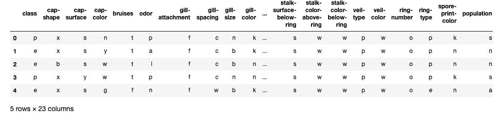
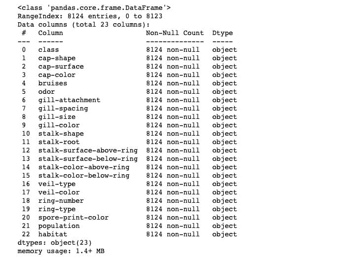
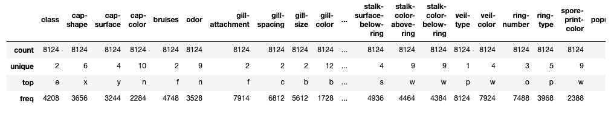
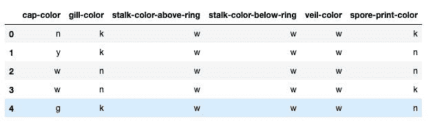
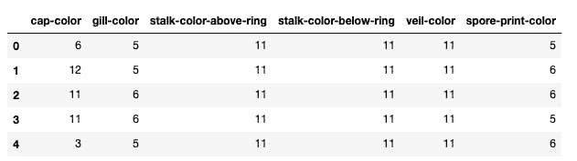
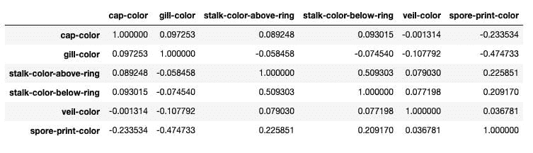
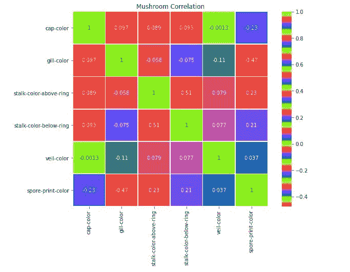
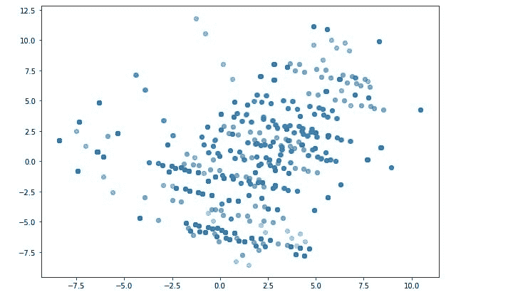
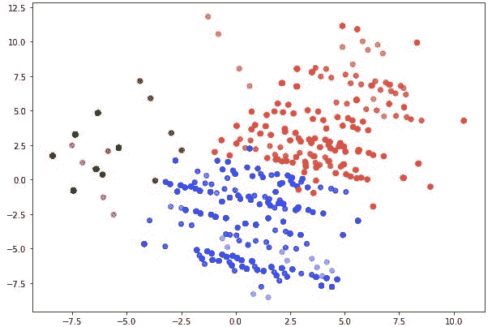

# 在 K-Means 聚类中演示 PCA

> 原文：<https://medium.com/analytics-vidhya/demonstrating-pca-in-k-means-clustering-e0ceb88db85a?source=collection_archive---------20----------------------->

主成分分析(PCA)是一种用于降低由大量相关变量组成的数据集的维度，同时尽可能多地保留数据集中存在的变化的方法。这是通过转换到一组新的变量，即主成分(PCs)来实现的，主成分是不相关的，并且是有序的，因此前几个变量保留了所有原始变量中存在的大部分变化。[来源](http://www.stat.columbia.edu/~fwood/Teaching/w4315/Fall2009/pca.pdf)。

# 数据收集:

为了证明这一点，我使用了来自 Kaggle 的数据集。我只关注颜色变量来实现上面的效果。在导入并加载数据集之后，我查看了前五列。

接下来，我查看了它的信息和统计信息。

# 数据预处理:

因为我只使用了颜色，所以我提取了颜色并创建了一个数据框。检查创建的数据框。

然后使用 Scikit-learn 库，我对分类变量进行编码，定义一个字典来存储编码，最后生成一个编码数据帧。

我检查了数据的相关性，并将其可视化。

# 主成分分析:

我用三个分量实例化了 PCA，拟合了模型，并通过分量的数量减少了颜色值的维数。

# k-表示:

最后阶段是应用一个简单的 K-Means，聚类数为 3，然后拟合。可视化集群。

# 结论:

这是对 K-均值聚类进行主成分分析的一个简单说明。代码在我的[回购](https://github.com/Nwosu-Ihueze/PCA)里，你可以在 [LinkedIn](https://www.linkedin.com/in/rosemary-nwosu-ihueze/) 上联系我，提出修改或建议。感谢您的阅读。