# 揭开三角洲湖的神秘面纱

> 原文：<https://medium.com/analytics-vidhya/demystifying-delta-lake-d15869fd3470?source=collection_archive---------0----------------------->


照片由 [Wynand Uys](https://unsplash.com/@wynand_uys?utm_source=medium&utm_medium=referral) 在 [Unsplash](https://unsplash.com?utm_source=medium&utm_medium=referral) 上拍摄

在真实的数据世界中，大多数业务问题都可以通过无处不在的关系数据库来解决，这显然是一个有效的选择，原因有几个。但随着社交媒体、机器数据(物联网设备、PoS 机)和交易数据公司的出现，它们开始生成和消费大型数据集。****大数据**一词被创造出来，用来表示这种不受管理的海量数据集。使用传统的商业智能工具解决业务问题，尤其是数据库的使用开始成为瓶颈，因为存储、管理和计算如此庞大的数据集需要经济高效且快速的处理解决方案。为了解决这些问题，雅虎参考了谷歌白皮书 MapReduce 的概念，创建了 Hadoop。然而，MapReduce 的传统算法有其自身的局限性，它不是围绕内存独立性设计的(它使用中间磁盘存储进行操作)。除此之外，MapReduce 及其相关工具主要是解决批量数据处理的问题，不支持任何属性、真正的流数据以及数据科学获得大数据洞察力的良好框架。**

**因此，为了解决 MapReduce 的问题，Apache spark 被引入作为大数据和机器学习的统一分析引擎。Apache Spark 的基本计算原理是内存处理。然而，除了 Spark 最初的进步之外，仍然存在一些根本差距，这些差距不能完全支持现代数据架构来存储、管理和处理大数据。例如，如果我们谈论被定义为**

*   **存储应该是廉价的，并且可以包含各种原始格式的数据(XML、JSON、CSV、ORC、PARQUET 等)**
*   **可以维护这些不同格式的历史转储。**
*   **历史数据可能需要不同类型的数据更改，这进一步要求对数据进行事务性操作。**

**以上定义为数据湖 ***灵活性的属性，如果组织和管理不当，会使其成为数据沼泽*** 。所有基于文件的体系结构也是如此，在这些体系结构中，数据是从数据湖中提取的。数据湖也带来了需要解决的挑战。**

*   **元数据的频繁刷新**
*   **处理模式更改并实施模式。**
*   **处理小文件(在接收和处理流数据的情况下)**
*   **修改现有数据。**
*   **优化性能**
*   **如果数据分布在许多文件中，并由一些列进行分区，则通过索引对数据进行管理和重新排序。**

**为了牢记上述挑战，并且不将宝贵的数据湖转化为数据沼泽，Databricks 推出了一款名为 Delta Lake 的产品。它是开源的，在这篇博客中，我们将看到它是如何有用的，以及我们可以在不同的数据应用中利用它。**

# **三角洲湖**

**Delta Lake 是一种基于文件的开源存储格式，使组织能够构建现代化的数据产品，将数据的治理和结构集中到一个地方，最重要的是提供数据的可靠性，以确保组织生成的洞察力是可信的。**

**它通过采用以下方式解决了上述主要挑战**

*   **开源文件格式(拼花地板)**
*   **对商业智能、机器学习和数据科学的一流支持。**
*   **解决数据仓库的主要挑战，包括**

****a .可靠性** —保持数据湖和数据仓库的一致性**

****b .数据陈旧** —与数据湖相比，仓库中的数据是陈旧的，因为它得到的更新越来越少。**

**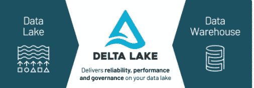**

**来源:https://databricks.com/product/data-lakehouse**

**现在，在阅读了 Delta Lake 的定义后，可能会出现一个天真的问题……很明显，这是一个存储系统，可以智能地管理以前无法填补的空白，但是**Delta Lake 究竟是如何组织和传输数据的？****

***这是通过遵循从数据接收到数据消费的数据质量模式来实现的。随着我们从摄取转向消费，数据的质量不断提高，越来越好。为了体现这一理念，Delta Lake 将这一数据质量流程定义为不同的层，分别称为青铜层、白银层和黄金层。***

****铜牌:**保持数据的原样(原始形式，如 JSON、Parquet、IOT 数据、XML 等)**

****白银:**更精细的组织数据视图。它可以被直接查询，且数据是干净、标准化的，并且可以被认为是真实的单一来源。**

****Gold:** 这是为不同业务用例保留的聚合数据层。**

**从**黄金**层，可以构建报告、分析，因为这是根据业务用例聚合数据的地方。**

**事实上，以上是一些花哨的名字，但这是实至名归的，因为**在每一层中，数据质量都得到了提高**，在最后阶段，我们获得了可用于分析的数据。**

**要了解三角洲湖如何应对上述挑战，我们需要深入了解其关键要素和特征。**

# **三角洲湖泊元素**

**三角洲湖有 **4 个主要元素**，作为构建三角洲湖特征的基础(特征将在下一节描述)。**

1.  ****Delta 文件—** 它使用了 ***Parquet 文件*** ，这是一个为存储表格数据而优化的柱状文件系统。**

*****问题:*** 如果使用**拼花文件，那么*有何不同？*****

********答:*** 的确，delta 使用 parquet 文件进行存储，但是 Parquet 表和 Delta 表之间的唯一区别是 **_delta_log** 文件夹，它存储 Delta 事务日志并帮助实现不同的 Delta 特性(将在下一节中讨论)。*****

*******2。增量表—** 它是一个由三个部分组成的数据集合*****

*****a)包含数据的数据文件*****

*****b)在跟踪元数据的 Metastore 中注册的增量表。*****

*****c)具有增量文件的事务日志，用于跟踪所有事务。*****

*******3。Delta 优化引擎—** Delta 引擎可加速数据湖操作，并支持从大规模 ETL 处理到即席交互式查询的各种工作负载。许多优化会自动应用。*****

*******4。Delta Lake 存储层—** 组织以低廉的成本将其数据保存在对象存储中的位置，以后可以使用 Delta 来访问这些文件。*****

# *****三角洲湖泊特征*****

## *******兼容 Apache Spark API*******

*****这是将底层存储和应用平稳切换到 Delta Lake 的一个重要功能。与 Apache Spark 兼容使得利用新特性变得容易。这个特性对于在 Spark 上开发但需要迁移到 Delta 的项目非常有用。*****

*******格式要求此流进入增量*******

*******在文件级*******

******任意文件格式- >拼花- >增量******

*******代码级*******

******与德尔塔基于相同的火花发动机的小调整。******

*****看看下面的片段-*****

```
***from delta.tables import DeltaTable 
parquet_table = "some_parquet_table"
partitioning_scheme = "some_id int"
DeltaTable.convertToDelta(spark, parquet_table, partitioning_scheme)***
```

*****上面的片段是不是看着很眼熟像 Spark 代码？*****

## *******酸性交易*******

*****写入增量存储的所有数据更改都是为了持久性而提交的，并保证不再有部分或损坏的文件。这意味着读取器可以读取一致的数据。*****

*****为了理解 ACID 行为，我们需要解包由 Delta lake 维护的事务文件，以促进这一属性。*****

*****为了检查事务日志，我们可以列出 **_delta_log** 文件夹，所有与事务相关的数据都在这些文件夹中被捕获。*****

*****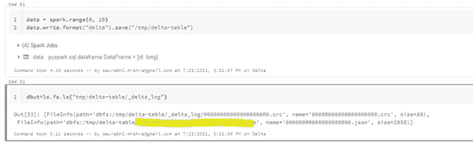*****

*****在 folder _delta_log 中，我们可以看到两个文件被创建为**。crc** 和**。json** 带一个零的大序列。如果数据上发生任何操作，那么**另一个。json 和。生成带有增量序列的 crc** 文件。了解这些文件捕获的内容以及它们对多种用途的益处非常重要。*****

*******CRC** (循环冗余校验)文件帮助 spark 优化其查询，因为它提供了数据的关键统计信息。*****

*****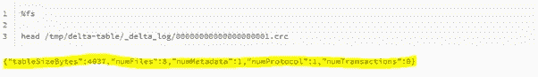**********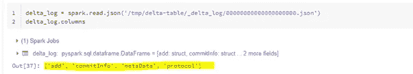*****

*****另一方面， **JSON** 文件捕获了很多信息。让我们读取 JSON 文件并列出 info 列，然后我们看到有 4 列名为 **add、commitInfo、metaData、**和 **protocol** 。*****

*****如果进一步展开**添加栏**，我们得到确认**数据变更**、**修改时间、路径、大小、**和数据基本统计的内容。*****

*******扩大加列*******

*****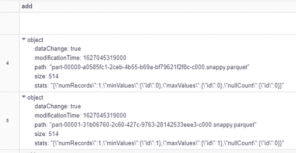*****

*******扩展元数据列*******

*****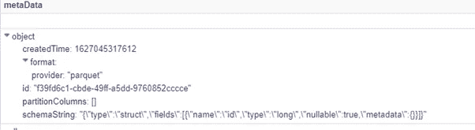*****

*******提交信息—** 关于提交的信息。*****

*******协议—** 通过将 Delta Lake 事务日志切换到最新的软件协议(读写器版本)来启用新功能*****

*****现在，让我们尝试从写入的路径创建一个表，并尝试从表中更新记录。*****

*****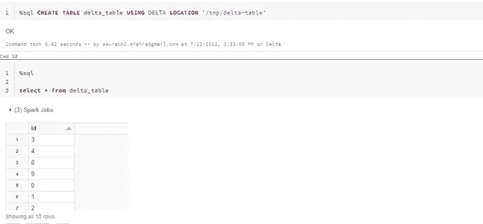**********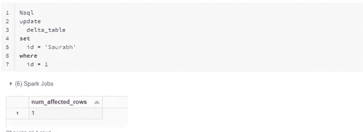*****

*****为新的 id 值更新数据。所以从内部来说。json 和。crc 文件也进行了更改，以捕捉这一新的数据变化。让我们重新读取 **_delta_log** 文件夹及其文件*****

*****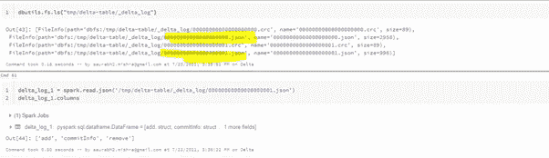*****

*****我们现在看到了什么变化？*****

*****我们可以看到，随着表的更新，另一个 **JSON & CRC** 文件被创建。如果我们打开 0000000000000000001.json 文件并查看其中的列(您注意到这里有什么吗？在文件 00000000000000000000.json 中，列 **add 存在于**中，因为我们添加了记录，现在添加了一个额外的列作为 **remove** 以显示更新的数据)和内容，然后我们可以找到数据集已发生的事务的所有信息。*****

*****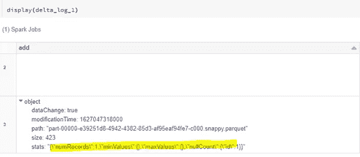**********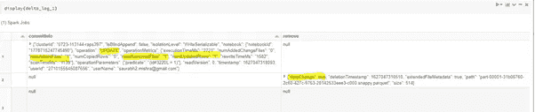*****

*****因此，对于每个操作，Delta 在内部维护文件以捕获其相关信息，这是维护大量额外信息的地方，以便做出处理不同操作的决定，并启用数据的所有良好功能，这在以前对于其他文件格式是不可能的。*****

*******外卖—*******

******三角洲湖泊* ***交易日志*** *是一个* ***单一来源的真实数据*** *。ACID 还使 Delta 能够支持****upsert****和*[***merge***](https://docs.databricks.com/spark/latest/spark-sql/language-manual/delta-merge-into.html)*。******

## *******读取模式*******

*****这是一个概念，当数据从存储位置取出时，它被应用于计划或模式。*****

*****在 Delta 之前，在 Spark 或 Hadoop 传统架构中，每当添加一个带有附加数据集的表时，每次读取所有新添加的带有旧记录的数据集时，我们都需要使用 **MSCK 修复表**命令来刷新备份文件系统的 **metastore** 。但是，在 delta 中，这个问题得到了解决，无论用户何时查询数据，都可以确保获得最新的数据集。*****

## *******数据版本化又名时间旅行*******

*****数据版本化是一个类似的概念，我们遵循代码版本化(git 或任何其他代码管理软件)。我们可以根据时间或具体数字(版本)切换到数据集的不同版本。这个特性简化了为不断变化的数据集构建管道的过程。不断变化的数据带来了审计挑战、重现实验、修复数据错误以及回滚以切换所需状态(如果需要)。*****

*******怎么用？*******

*****从**增量表中选择特定版本或时间戳的数据很容易。*******

```
***.option("timestampAsOf", timestamp_expr) => **to get specific timestamp e.g. option("timestampAsOf", "2018–10–18T22:15:12.013Z")**
.option("versionAsOf", version) => **to get specific version e.g. option("versionAsOf", 9)*****
```

*****也可以回滚到不同的版本*****

## *******模式实施或模式验证*******

*****检查 *写* 上 ***数据的模式验证，帮助确保数据的正确性。拒绝写入与定义的模式不匹配的表是一项强制检查。********

*****遵循这些规则来确定是否允许对表进行写操作*****

*   *****不能包含目标表的架构中不存在的任何附加列*****
*   *****列数据类型不能与目标表中的列数据类型不同。*****
*   *****不能包含仅大小写不同的列名( **Delta 区分大小写— *Delta*** *和****Delta****不相同)******

********注意** —这个特性有助于验证很多东西，我们通常在实际项目中为这些东西创建定制的数据验证器。仅仅有一个标准的 **delta** 格式就可以避免很多数据问题。******

## ********图式进化********

******它帮助用户轻松地修改表的当前模式，以适应随时间变化的新数据。该特性的一般用途是在**追加**和**覆盖**操作期间自动调整模式以包含一个或多个新列。******

********怎么用？********

******在将数据帧写入增量文件的过程中，我们需要将 **mergeSchema** 属性设置为 true。******

```
****df.write.format("delta")\
.mode("overwrite")\
.option("path", "file_path")\
.option("**mergeSchema**", "**true**")\
.partitionBy("partition_col")\
.saveAsTable("table_name")****
```

******还可以检索增量表历史******

```
****DESCRIBE HISTORY <table_name>-- get the full history of the table
DESCRIBE HISTORY delta.<delta_file_path>****
```

# ******最佳化******

******到目前为止，我们已经看到增量文件捕获了操作文件的一些统计数据。这些统计数据是由 Delta lake 的创建者出于某种目的编写的，其中一个明显的目的是利用优化并增强 Delta Lake 的性能。******

******在这最后一节中，我们将学习一些优化技术，这些技术可以用来(如果需要的话)提高增量文件/表的性能。******

## ********a.** **通过压缩优化********

******优化操作执行文件压缩，即将小文件压缩成较大的文件(最大 1 GB)。******

******Delta **不支持**优化**作为自动过程**，但是期望用户根据需要来执行。******

********怎么用？********

```
****Optimize <table_name> **OR** delta.`delta file location`****
```

## ********b .**Z 顺序******

******这是一种通过保持数据点的局部性来将多维数据并置到一维的技术。简而言之，这是一种将相关信息保存在同一组文件中的方法。在内部，它创建更少的文件来保存数据，当搜索或查询启动时，它扫描更少的文件来获得结果。******

******一旦我们在某些列上应用 ZORDER(不能在分区列上应用), Delta 在幕后执行以下活动******

*   ******获取分区中现有的拼花文件。******
*   ******根据为 [**ZORDER**](https://en.wikipedia.org/wiki/Z-order_curve) **选择的列映射拼花文件中的行。********
*   ******在只有一列的情况下，上面的映射变成了线性排序。******
*   ******将排序后的数据重新写入新的拼花文件。******

*********问题:*** *如何选择 ZORDER 列？*******

*********答案:*** 经验法则是选择那些筛选数据集合最大的列(低基数列但不选择分区列)。也可以选择多个列，但这会降低局部性的有效性。******

********怎么用？********

```
*****OPTIMIZE table_identifier [WHERE clause]**[ZORDER BY (col_name1, col_name2, ...)]  --* ***be mindful not to use partition column.*******
```

## ********c .**分区修剪******

******它用于加速查询，以最小化读取的数据量。简单的意思是总是在 where 子句中放置分区列来过滤数据。******

## ********d .**数据跳过******

******应用 where 子句在查询中添加更多列来过滤记录，并提示增量文件(保存统计信息的文件)跳过不必要的信息。******

## ********e .**真空******

******方便的命令，只保留相关文件，节省存储成本。******

********怎么用？********

```
****VACUUM <name-of-table> RETAIN <number-of-hours>****
```

******我试图捕捉我对 delta 的理解，我发现理解它的功能是很重要的，这样就可以在不同的用例中充分利用它。如果我们致力于构建或设计任何分析解决方案(数据湖、数据仓库、机器学习、处理流数据等。)可以安全地选择增量作为数据处理的标准存储。******

******感谢您的阅读💕******

## ******参考******

******如果你想更深入地了解它，这是一本由三角洲湖创造者写的极好的 [**书**](https://databricks.com/blog/2021/06/22/get-your-free-copy-of-delta-lake-the-definitive-guide-early-release.html) 。******

******[https://databricks . com/WP-content/uploads/2020/08/p975-armbrust . pdf](https://databricks.com/wp-content/uploads/2020/08/p975-armbrust.pdf)******

******[http://cidrdb.org/cidr2021/papers/cidr2021_paper17.pdf](http://cidrdb.org/cidr2021/papers/cidr2021_paper17.pdf)******

******[https://databricks.com/product/delta-lake-on-databricks](https://databricks.com/product/delta-lake-on-databricks)******

******[https://docs . databricks . com/delta/optimizations/file-mgmt . html](https://docs.databricks.com/delta/optimizations/file-mgmt.html)******