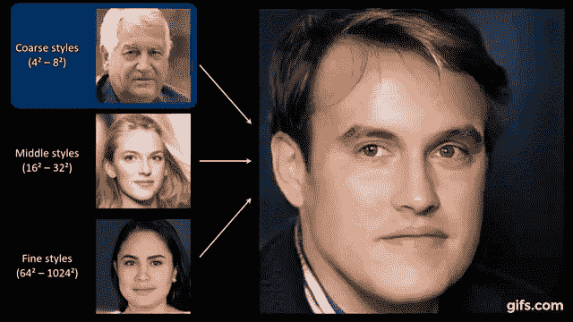
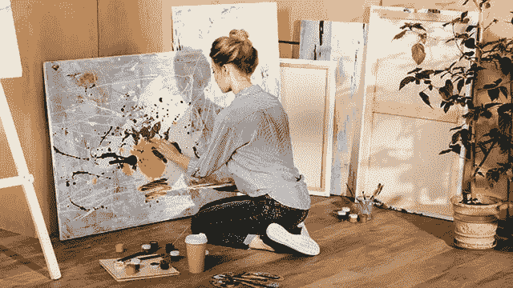
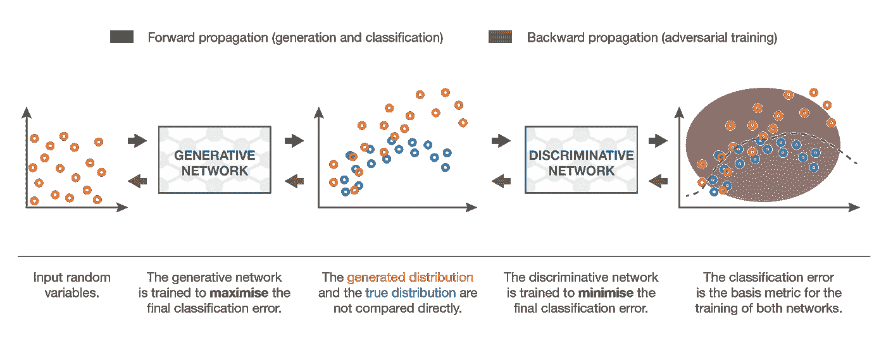
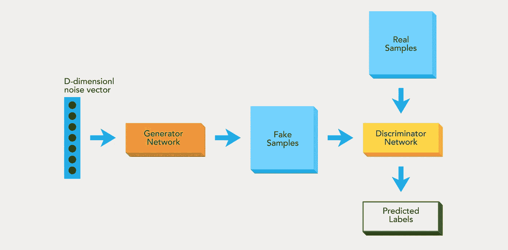
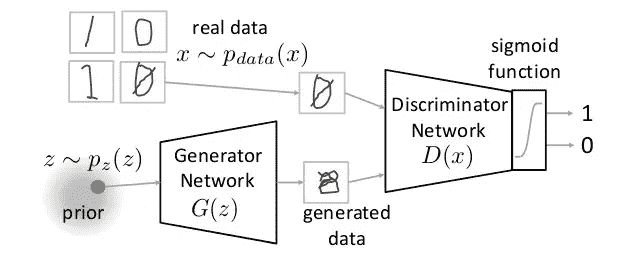
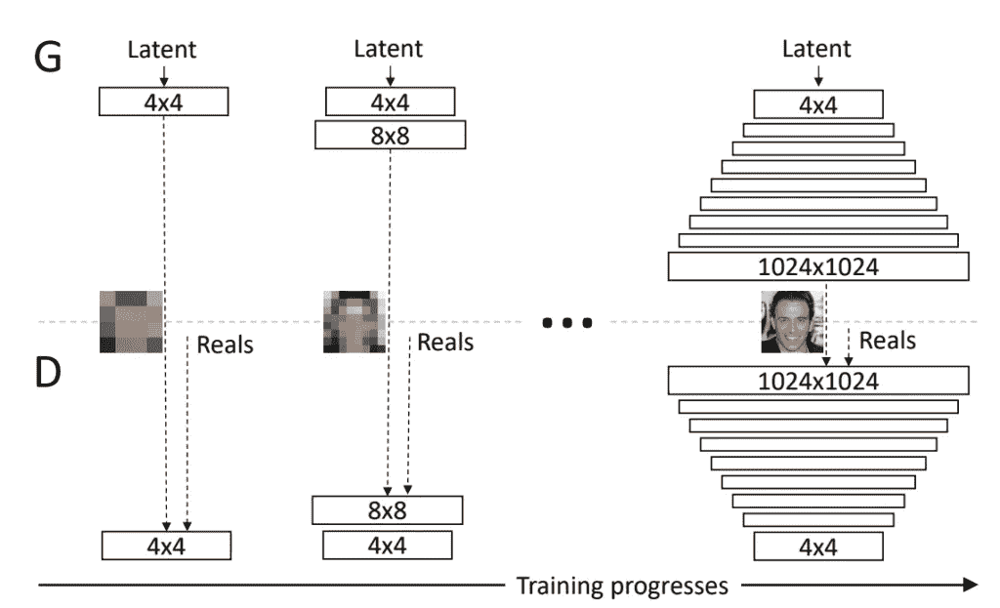
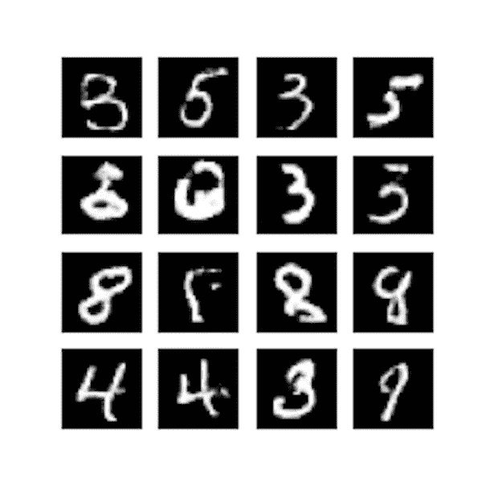
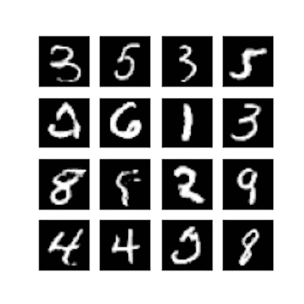
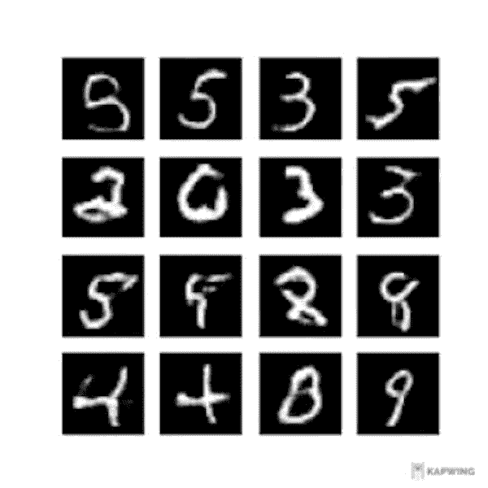

# 揭开 GANS 的神秘面纱并实现 DCGANS

> 原文：<https://medium.com/analytics-vidhya/demystifying-gans-and-implementation-of-dcgans-5e2f30619d8?source=collection_archive---------8----------------------->

学分:gif.com

现在，如果你在机器学习社区有点活跃，你应该已经听说过 **GANS** (生成对抗网络)

## GANS 到底是什么？

简而言之，GANS 让两个神经网络互相竞争，我知道我对上面的陈述没有说清楚，所以让我给你打个比方。

让我们考虑伪造者和调查者之间的关系

学分:everydaysigth.com

伪造者的任务是创作著名艺术家原画的赝品。如果这件赝品能冒充真品，伪造者就能从这件赝品中获得一大笔钱。

另一方面，艺术调查员的任务是抓住这些制造赝品的伪造者。他是怎么做到的？他知道是什么让原创艺术家与众不同，以及他应该创作什么样的画。他用手中的作品评估这些知识，以检查它是真是假。

伪造者与调查者之间的竞赛仍在继续，最终造就了世界级的调查者(不幸的是，也造就了世界级的伪造者)。

现在你可能想知道它和 GANS 有什么关系？GANS 以类似的方式工作，其中**生成器**(伪造者)负责创建假数据(图像)，而**鉴别器**(调查者)负责查看数据并移除假数据，以及向生成器提供必要的反馈以创建更好的图像。

信用 TDS

生成器神经网络将随机噪声作为输入来生成一些图像，这些图像与一些真实图像混合并发送给鉴别器，鉴别器网络的任务是从真实数据或生成器中获取输入，并尝试预测该输入是真实的还是生成的。

让我们在尝试实现一个基本的 **DCGANS** (深度卷积 GANS)的同时，尝试了解一下技术细节

深度卷积 GAN (DCGAN)是演示如何构建实用 GAN 的模型之一，该 GAN 可以自学如何合成新图像。DCGAN 非常类似于 GAN，但它特别关注使用深度卷积网络来代替全连接网络。

## DCGAN 实施

现在让我们尝试使用 **mnist_dataset 来实现 DCGANs。**

## 导入库

我们将使用[**tensor flow 2.0**](https://www.tensorflow.org/)来实现 DCGAN，我们将使用以下层: **Dense** 、 **Conv2D** 和 **Conv2DTranspose** 。我们将使用 **RMSprop** 作为模型和绘图的优化器，我使用了 matplotlib 库。

## 生成器神经网络

学分:[https://www . mygreatlearning . com/blog/generative-adversarial-networks-gans/](https://www.mygreatlearning.com/blog/generative-adversarial-networks-gans/)

正如我们从上面的图像中看到的，生成器首先将随机噪声作为输入，在 DCGANS 中，我们使用 **Conv2DTranspose** 对其进行解卷积，并生成虚假数据，然后将这些数据与鉴别器进行比较，我们在构建这个模型时使用了函数方法，如果您对函数方法的确切含义感到困惑，可以参考我以前的博客[T5 这里 ](/analytics-vidhya/functional-api-model-with-tensorflow-2-0-y-network-ed59bfd810)

在上面的生成器网络中，我们首先对数据进行整形，在滤波器[128，64，32，1]中，我们增加步长，然后使用 **Conv2DTranspose** 将其转换为图像输出并返回生成器模型。

## 鉴别器神经网络

演职员表:[https://robotronblog.com/2017/09/05/gans/](https://robotronblog.com/2017/09/05/gans/)

现在，让我们尝试构建模型的鉴别器部分，它充当调查器，将真实图像标记为 1.0，将生成器神经网络生成的伪图像标记为 0.0。 **Sigmoid** 激活函数用于在该模型中区分真假图像。

在鉴别器模型中，我们使用了 **Conv2D** 层来捕捉图像中的特征，由于我们使用了 **Sigmoid** 作为激活函数，输出将为 0.0(假)或 1.0(真)。

## 训练 GAN 模型

学分:机器学习掌握

现在让我们分批交替训练**鉴别器**和**对抗**网络，首先用真实和虚假图像训练鉴别器，然后用伪装成真实的虚假图像训练对抗网络，最后我们用来自鉴别器的反馈每 500 个间隔产生虚假图像。

> 记住要稳定 GAN，并确保发生器学到一些东西，鉴别器应该比发生器更强大(训练有素),只有这样它才能向发生器发送有价值的反馈，从中学习并创建更好的假图像

在上面的训练函数中，我们使用随机噪声生成假图像，然后将这些假图像添加到真实数据中，然后我们用这些数据训练鉴别器，其中将真实图像标记为 1，将假图像标记为 0，我们将训练它并存储它的损失和准确性。

在训练鉴别器之后，我们将训练对抗网络，其中假图像被标记为 1.0，并且在训练对抗网络时，鉴别器权重被冻结，并且仅训练生成器，并且我们将创建用于绘制生成器神经网络已经生成的图像的函数，并且我们还为每 500 个时间步长保存该当前模型。

## 绘制发电机图像

18000 个历元时生成的图像

现在让我们创建一个函数，它绘制生成的图像，并以每 500 个时间步长保存它们

在上面的函数中，我们创建了一个图像网格，其中生成器尝试使用噪声和来自鉴别器的反馈来重新创建图像，我们将所有这些图像存储在一个名为 *GAN_mnist* 的文件夹中

## 构建和训练模型

40000 个历元时生成的图像

因为我们已经为生成器和鉴别器创建了函数，所以让我们尝试构建和训练所有的网络

我们正在加载 Mnist_dataset，然后首先训练模型的鉴别器部分(正如我在上面提到的 DCGAN 模型的稳定性和进展),然后我们从生成器中提取噪声来生成图像

**对抗网络=生成器+鉴别器**，在训练对抗网络时我们冻结了鉴别器的权重，之后我们编译了对抗网络，其中我们使用了*二元交叉熵*作为损失函数。

## 运行 DCGAN

现在让我们运行模型

上面的代码首先检查你是否有预先训练好的保存模型，如果有，它从那里继续训练，如果没有，它重新开始

这是我在训练 mnist DCGANS 时得到的结果

这是 40000 个时代中生成图像变化的视频

结束(至少现在)

你可以从 [**这里**](https://github.com/Pavankunchala/Deep-Learning/blob/master/Tensorflow_Basics/GANS/DCGANS/dcGans_mnist.py) 找到博客的代码

**PS** :如果你有任何疑问，你可以给我发邮件[这里](http://pavankunchalapk@gmail.com/) (pavankunchalapk@gmail.com)，你可以在我的 linkedin 上联系我，从 [**这里**](https://www.linkedin.com/in/pavan-kumar-reddy-kunchala/) 你也可以在我的 Github 上查看我的其他代码(它有非常酷的东西)，从 [**这里**](https://github.com/Pavankunchala)

我也在寻找深度学习和计算机视觉领域的自由职业机会，如果你愿意合作，请在这里给我发邮件([pavankunchalapk@gmail.com](mailto:pavankunchalapk@gmail.com)

祝你有美好的一天！