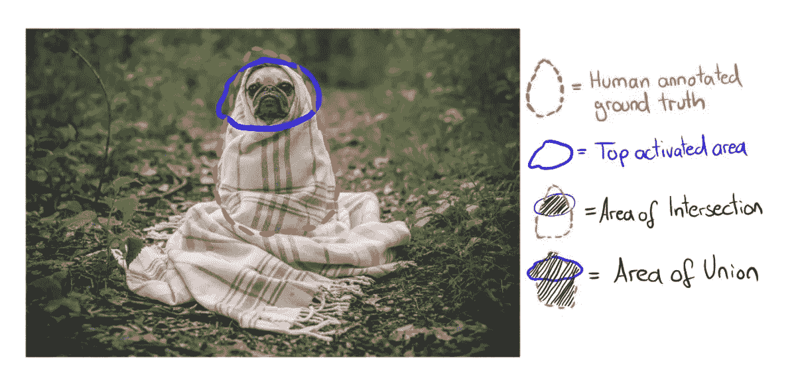

# 通过网络剖析揭示神经网络中的隐藏单元

> 原文：<https://medium.com/analytics-vidhya/demystifying-hidden-units-in-neural-networks-through-network-dissection-7d3ac657c428?source=collection_archive---------14----------------------->

## 麻省理工学院 CSAIL 的研究人员通过他们引人入胜的论文“[网络剖析:量化深度视觉表征的可解释性](http://netdissect.csail.mit.edu/)”阐述了神经网络预测背后的思维过程。

由[阿丽娜·格鲁布尼亚](https://unsplash.com/@alinnnaaaa)在 Unsplash 上拍摄的照片

你有没有想过神经网络(NN)一旦被训练后是如何进行预测的？解剖 NN，找出隐藏单元都学了什么，岂不是很有意思？你认为隐藏单元对训练后的神经网络预测有什么贡献？嗯，当一个人的模型继续训练时，他有足够的时间来思考这种复杂的深层网络。唉，一个深度学习的新手怎么可能把探头放在隐藏的单元上，解读出来。所以，我很自然地抛弃了这些想法，直到我偶然发现了论文“[网络剖析:量化深度视觉表征的可解释性](http://netdissect.csail.mit.edu/final-network-dissection.pdf)”。

# 关于论文:

来自麻省理工学院 CSAIL 的研究人员提出了一种称为“[网络剖析](http://netdissect.csail.mit.edu/)的技术，他们在二进制分割任务中评估 CNN 中的每个单独的卷积单元，以表征一个单元的行为。换句话说，这种方法通过向网络的隐藏单元提供有意义的标签来解释网络。他们已经表明，解释单元可以用来为分类器给出的单个图像预测提供解释。

过去，对隐藏单元的观察表明，人类可以解释的概念有时会出现在网络中的单个单元中。例如，在场景分类网络 中已经观察到 [**对象检测器单元，并且在视觉识别任务**](https://arxiv.org/pdf/1412.6856.pdf) **中已经出现 [**部分检测器。**](https://arxiv.org/pdf/1607.03738.pdf)**

使用“网络剖析”，作者评估了这种概念检测器在深度网络中的出现，量化了 CNN 中单个单元的可解释性，并试图回答问题-“*CNN 是否学习了被解开的特征？”。
注意:解开的特征是狭义定义的隐藏单元，编码特定的现实世界概念。*

# 网络剖析法:

单个单元的可解释性通过测量隐藏单元的响应和一组视觉概念之间的一致性来量化。人类可以理解的概念包括像颜色这样的低级概念和像物体这样的高级概念。通过测量与每个单元最匹配的概念，网络剖析可以分解层中表示的概念类型。

使用网络剖析量化单个单元的可解释性分三步进行:

## **1:用人类标注的视觉概念采集图像。**

为了识别一组广泛的视觉概念的基础事实样本，作者组装了一个新的异构数据集，称为***。***

> ****广泛且密集标记的数据集****(****Broden****)*统一了几个密集标记的图像数据集: [ADE](https://people.csail.mit.edu/bzhou/publication/scene-parse-camera-ready.pdf) 、[开放曲面](https://www.cs.cornell.edu/~sbell/pdf/siggraph2014-intrinsic.pdf)、 [Pascal-Context](https://www.cs.toronto.edu/~urtasun/publications/mottaghi_et_al_cvpr14.pdf) 、 [Pascal-Part](https://arxiv.org/pdf/1406.2031.pdf) 和[可描述纹理数据集](https://www.robots.ox.ac.uk/~vgg/publications/2014/Cimpoi14/cimpoi14.pdf)。这些数据集包含各种上下文中的各种对象、场景、对象部分、纹理和材质的示例。*

**

*图:Broden 数据集中的标签类型示例。(图来自 [Bau &周等人。铝(2017)](http://netdissect.csail.mit.edu/final-network-dissection.pdf) )*

*在 Broden 数据集中有大约 60，000 幅图像和跨越 1197 个视觉概念的注释。对于大多数视觉概念来说，图像是按像素标记的，除了纹理和场景，它们为整个图像给出了单独的标记。此外，每个图像像素都标有 11 种常见颜色名称中的一种。这样，每个图像都将获得一个注释遮罩，每个视觉概念都有 **L** _c， **c** 。*

## *2:检索单个单元的激活**。***

*为了收集单个单元对概念的反应，来自 Broden 数据集的图像被输入到 CNN，并向前传递。*

1.  *对于每个卷积单元( **k** )，将每个输入图像( **x** )从 Broden 数据集馈入 CNN，计算激活图， **A_** k( **x** )。
    *激活图是卷积运算后单元的输出。* ***注:*** *在一个单元中，一个核或滤波器与图像体进行卷积。**
2.  *计算所有图像上的激活分布， **a_** k。a_ k 是一个实值映射。*
3.  *要将其转换为二进制图，请计算一个顶分位数阈值 **T_** k，使得 P(**a _**k>**T _**k)= 0.005。这意味着图像 **x** 的单元“ **k** 的所有激活的 0.5%大于 **T_** k。*
4.  *通常，神经网络越深入，激活图的尺寸越小。为了获得二进制分割图，使用双线性插值将较低分辨率的激活图 **A** _k( **x** )缩放到图像分辨率，得到 **S** _k( **x** )。*
5.  *将激活图二值化:获得一个新的掩膜，**M**_ k(**x**)=**S**_ k(**x**)≥**T**_ k(**x**)，使得一个像素根据是否超过激活阈值 **T** _k.
    *来开启或关闭。注意:这些激活掩膜标记高度激活的区域。**

## ***3:量化激活——概念比对。***

*现在我们有了人类标记的概念面具， **L** _c(来自步骤 1)和激活面具， **M** _k(来自步骤 2)。接下来，我们需要确定激活特定节点的视觉概念。换句话说，我们试图确定每个节点“寻找”的是哪个概念。*

*这是通过将激活掩码与所有标记的概念进行比较来完成的。我们量化激活掩码， **M** _k 和概念掩码， **L** _c 之间的比对，并使用**交集除以并集(IoU)** 得分。*

**

*图:**交集超过并集(IoU)** 得分公式。*

***IoU 得分** =(被两个遮罩识别为概念 **c** 的像素数量) **/**
(被识别为概念 **c** 的唯一像素的总数)*

**

*图:如何计算 IoU 分数的示例。(来源:[可解释机器学习](https://christophm.github.io/interpretable-ml-book/cnn-features.html#network-dissection))*

> ***IoU** _(k，c)的值是单元 **k** 在检测概念 **c 时的精度**如果 **IoU 得分超过阈值，我们认为 **k** 是概念 **c** 的检测器。***

*作者选择 0.04 作为将一个单元分类为特定概念检测器的阈值。一个单元可以检测多个概念，并选择排名最高的标签进行分析。*

*为了量化层的可解释性，在层中识别的唯一概念的数量记为**唯一检测器的数量**。*

# *实验:*

*随着框架的建立，作者在不同的网络架构(AlexNet，GoogLeNet，VGG，ResNet)上测试了网络解剖，这些网络架构是在不同的数据集(ImageNet，Places205，Places365)上从头开始训练的。对于自我监督的训练任务，AlexNet 接受了解谜和跟踪等任务的训练。*

****ImageNet****是一个*以对象为中心的*数据集，拥有来自 1000 个类的 120 万张图片。***地点 205*** 和 ***地点 365*** 是一个以*场景为中心的*数据集，分别有 205 和 365 个类别。Places205 包含 240 万张图片，Places365 包含 160 万张来自厨房和客厅等类别的图片。**

## **以下是他们的一些发现:**

1.  **作者在较高层发现了高级概念的检测器，在较低层发现了低级概念(即低级概念如*颜色*和*纹理*在 *conv1* 和 *conv2、*中占主导地位，而更多的*对象*和*部分*检测器出现在 *conv5 中)。***
2.  **接受监督任务训练的网络比接受自我监督任务训练的网络拥有更多独特的检测器。**
3.  **独特概念检测器的数量随着训练迭代次数的增加而增加。**
4.  **批量标准化减少了唯一概念检测器的数量，而增加层中单元的数量会增加可解释单元的数量。**
5.  **ResNet > VGG > GoogLeNet > AlexNet 的可解释性。在 Places > ImageNet 上训练的模型的可解释性。**

****

**图来自 [Bau &周等人 2017](http://netdissect.csail.mit.edu/final-network-dissection.pdf) 。**

# **结论:**

**网络剖析帮助我们理解在神经网络中出现了什么涌现的概念，允许我们量化它的可解释性。虽然概念检测器出现在网络中，但并不是神经网络中的所有单元都是可解释的，这证明了网络中的部分非纠缠表示。**

****

**图:图层中可解释单元的总数。(图来自 [Bau &周等。铝(2017)](http://netdissect.csail.mit.edu/final-network-dissection.pdf)**

> **作者还使用网络剖析生成性对抗网络(GANs)。你可以在这里找到项目[。](https://gandissect.csail.mit.edu/)**

**希望这篇文章对你有所帮助。感谢您的阅读！**