# 使用定制的 ML 模型、API 和包，用 FLASK WEBAPP 揭开自然语言处理(NLP)的神秘面纱(第 1 部分)

> 原文：<https://medium.com/analytics-vidhya/demystifying-natural-language-processing-nlp-with-webapp-using-custom-ml-model-and-api-built-ec96eb9507bc?source=collection_archive---------29----------------------->

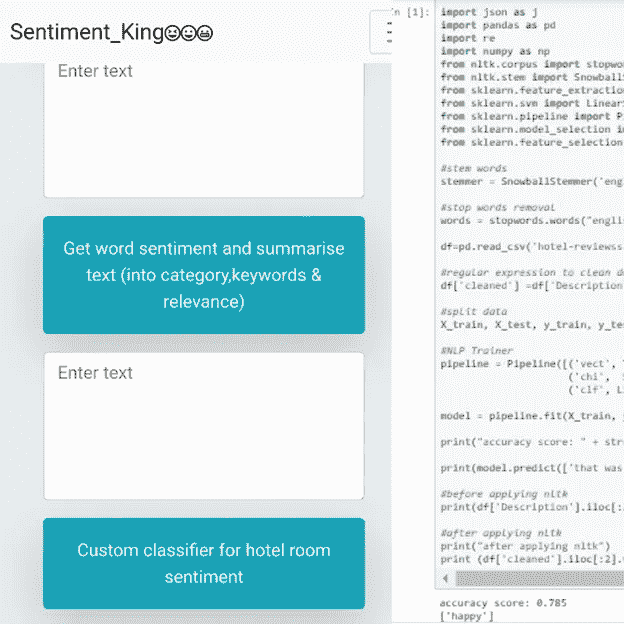

## 解释定制**建立酒店评论 NLP 情感机器学习模型**

# 介绍

**目标**:该项目需要为 webapp 解释定制的酒店评论 NLP ml 模型。

我们将解释自然语言处理(NLP)的关键概念，并基于酒店评论数据集构建酒店评论情感的 NLP 分类器，清理数据集，并使用 sklearn nltk 库，同时应用一些关键的 NLP 概念，如词干、停用词、正则表达式…来清理数据集。

**注意:**python 中流行的自然语言处理库是 NLTK 模块，它包含了 nlp 的包。

**数据集描述:**数据集来自一家领先的旅游网站，包含客户提供的酒店评论。

**数据集链接**:[https://www.kaggle.com/harmanpreet93/hotelreviews](https://www.kaggle.com/harmanpreet93/hotelreviews)

# **大纲:**

1.  **自然语言处理中的关键概念**
2.  **定制酒店客房情感机器学习模型中使用的 NLP 概念**
3.  **用 TFIDF 矢量器和分类器训练定制的酒店评论情感 ML 模型，然后建立预测和保存模型**

# 1.**自然语言处理中的关键概念**

**1.1 文集**

正文，单数。Corpora 是 this 的复数。例如:医学期刊集。

nltk 中语料库的 Eg

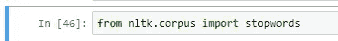

**nltk 中语料库的 eg**

1.2 .词典

单词及其含义。例如:英语词典。然而，考虑到不同的字段将有不同的词汇。

**1.3 .标记或标记化**

每一个“实体”都是基于规则被分割的任何事物的一部分。例如，当一个句子被“标记化”成单词时，每个单词都是一个标记。每个句子也可以是一个标记，如果你把一个段落中的句子标记出来。

如 nltk 中的令牌

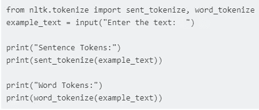

**如 nltk 中的 token**

**1.4 .词干化**

是一种标准化方法。除了涉及时态之外，单词的许多变体表达相同的意思。我们这样做的原因是为了缩短查找，并规范句子。基本上，它是在去除动词和时态部分后找到单词的词根。最流行的词干算法之一是 Porter stemmer，它从 1979 年就出现了。

例如 nltk 中的词干

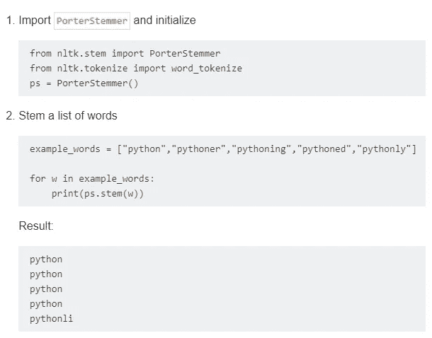

**如 nltk 中的词干**

**1.5。停止言语**

**Stopwords** 是**英语单词**，对一个句子没有太大的意义。它们可以被安全地忽略，而不会牺牲句子的意义。例如，**的词**像 the，he，a，have 等。

nltk 中停用词的 Eg

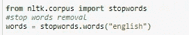

**例如 nltk 中的停用词**

**1.6。引理化**

词汇化与词干化相关，不同之处在于词汇化能够基于单词的[词汇](https://en.wikipedia.org/wiki/Lemma_(morphology))捕获规范形式。

**引理化**通常指的是旨在仅去除屈折词尾，并返回单词的基本形式或词典形式，这就是所谓的引理。例如

```
Examples of lemmatization:

-> rocks : rock
-> corpora : corpus
-> better : good 
```

词汇化软件包包括:Wordnet 词汇化器、Spacy 词汇化器、TextBlob、CLiPS 模式、Stanford CoreNLP、Gensim 词汇化器和 TreeTagger

nltk 中词汇化的 Eg

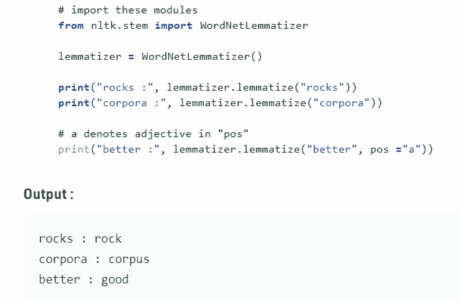

**nltk 中词条解释的 Eg**

**1.7。词性标注**

**词性标注**是给句子中的每个单词加上适当的**词性**的任务。我们已经知道**词类**包括名词、动词、副词、形容词、代词、连词及其子类。最流行的词性标注是将单词识别为名词、动词、形容词等。

POS 标签列表如下，举例说明每个 POS 代表什么。

*   CC 并列连词
*   CD 基数
*   JJ 形容词“大”等。

例如 nltk 中的 POS

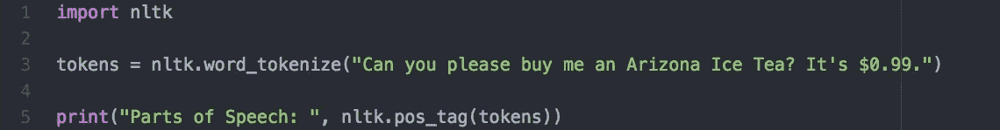

例如 nltk 中的 POS

**1.8。正则表达式**

正则表达式是构成搜索模式的一系列字符。

RegEx 可用于检查字符串是否包含指定的搜索模式。

重要的字符有:

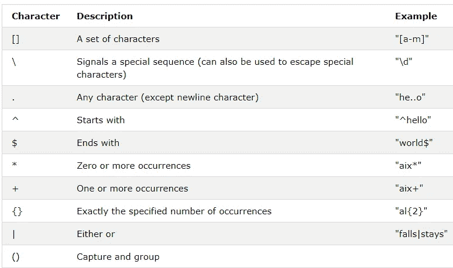

正则表达式元字符

注意:每种编程语言都有一个正则表达式模块。例如在 python 中:它被称为“re”

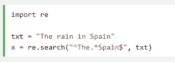

在 python 中

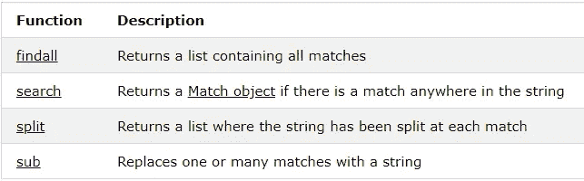

例如自定义分类器中使用的正则表达式

# 2 **定制酒店评论情感 ML 模型中使用的 NLP 概念**

图书馆需要建立酒店房间情感机器学习模型

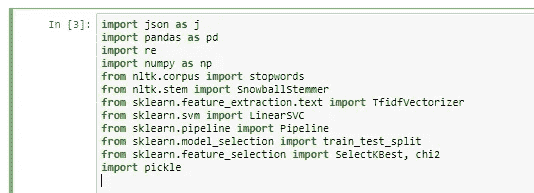

**构建酒店评论情感机器学习模型所需的库**

加载并查看酒店点评数据集

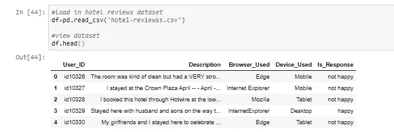

**加载酒店点评数据集并查看**

**2.1 词干:**

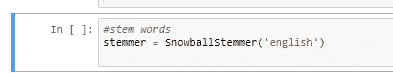

阻止酒店评论数据集

**2.2 停用词**

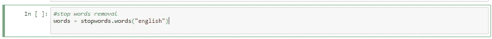

**获取酒店评论数据集的停用词**

**2.3 使用 lambda 函数将停用词和词干词应用于酒店评论数据集。:**应用此功能有助于清理描述列

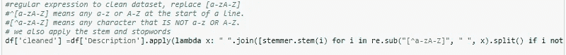

**使用 lambda 函数将停用词和词干词应用于酒店评论数据集。**

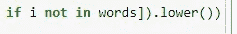

代码的延续

**2.4 正则表达式:**

我们使用 re.sub 用空格或空字符串替换[a- **zA** - **Z**

**注意:**

^[a-**za**-**z**]**表示**任何 A-Z 或行首的 a-z。

【^a-**za**-**z****表示**任何不是 A-Z 或 a-z 的字符

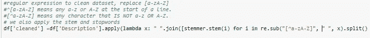

**对酒店评论数据集的描述列应用正则表达式**

**2.5 比较应用 nltk 关键概念后清理的列与数据集的普通描述列:W** e 看到正则表达式删除了特殊字符、停用词并对其进行了词干处理。

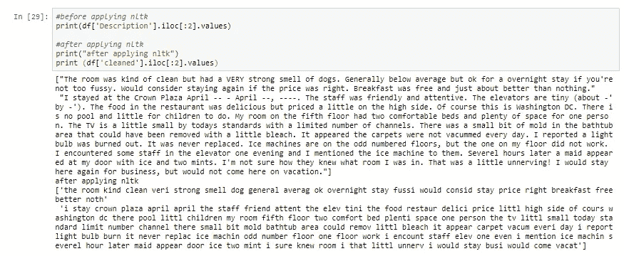

**比较应用 nltk 关键概念后清理的列与数据集的简单描述列:**

# **3 用 TFIDF 矢量器和分类器训练定制的酒店房间情感 ML 模型，然后建立预测和保存模型**

**3.1 拆分数据**

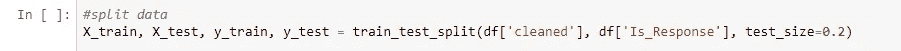

**拆分成训练和测试数据**

**3.2 训练:**我们用*类* `sklearn.pipeline.**Pipeline**`()定义 tfidf 矢量器、[sk learn . feature _ selection](https://scikit-learn.org/stable/modules/generated/sklearn.feature_selection.SelectKBest.html)eg selectk best 算法、分类器(LinearSVC)。

**TfidfVectorizer** —将文本转换为可用作估计器输入的特征向量。词汇表是一个字典，它将矩阵中的每个单词转换成特征索引，每个唯一的单词都有一个特征索引。…在每个向量中，数字(权重)代表特征 **tf** - **idf** 得分

**分类** **模型或分类器**，预测分类标签(类别)。数值预测**模型**连续值函数。例如:逻辑回归，线性预测…

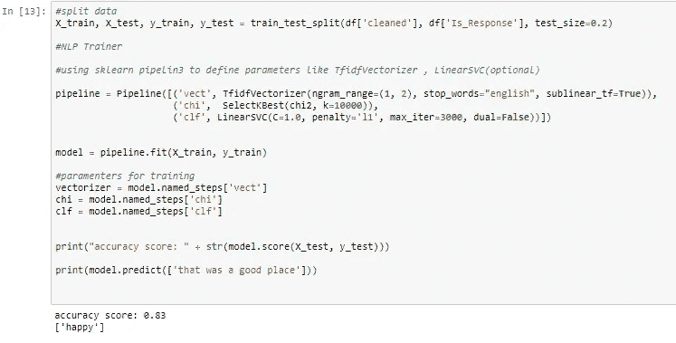

**使用流水线定义 tfidvectorizer、linearsvc 分类器和 kbest 特征提取**

**或无管道**

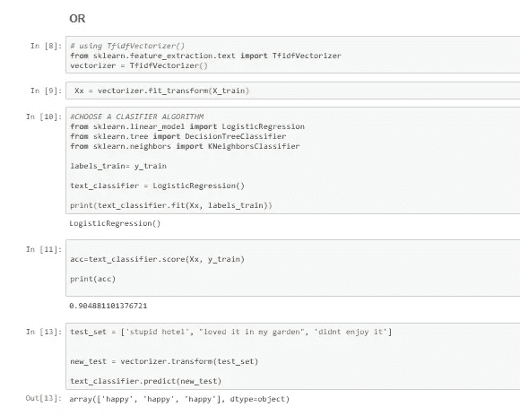

**不带管道的 tfidvectorizer】**

**3.3** 用泡菜保存训练好的模型

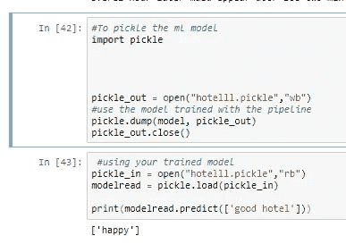

**保存并使用您训练好的模型**

**3.4 使用 Wordcloud 可视化数据集描述列中最常见的单词(可选)**

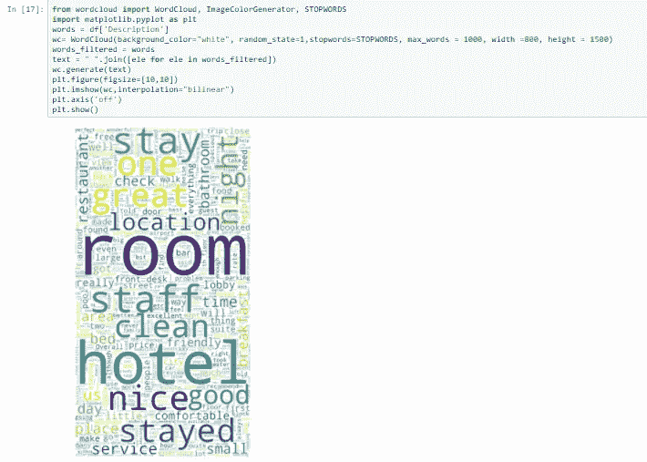

使用 Wordcloud 可视化数据(可选)

# 4.结论

该项目解释了如何通过应用 nlp 概念(数据清理)，使用 nltk 库、tfidf 矢量器和分类器训练和保存模型，从数据集训练情感 nlp ml 分类器。

**作家**:奥卢耶德·塞贡。答(jnr)

**说明笔记本和数据集:**

【https://github.com/juniorboycoder/HOTELREVIEWS_SENTIMENT 

**使用的资源(引用):**

 [## nltk -基本示例| nltk 教程

### nltk 文档:基本示例

riptutorial.com](https://riptutorial.com/nltk/example/30787/basic-example) [](https://www.w3schools.com/python/python_regex.asp) [## Python 正则表达式

### 正则表达式是构成搜索模式的一系列字符。正则表达式可以用来检查是否…

www.w3schools.com](https://www.w3schools.com/python/python_regex.asp) [](https://www.geeksforgeeks.org/python-lemmatization-with-nltk/) [## Python |使用 NLTK - GeeksforGeeks 的词汇化

### Python |带 NLTK 的词法分析词法分析是将一个…

www.geeksforgeeks.org](https://www.geeksforgeeks.org/python-lemmatization-with-nltk/) [](https://www.wikipedia.org/) [## 维基百科(一个基于 wiki 技术的多语言的百科全书协作计划ˌ也是一部用不同语言写成的网络百科全书ˌ 其目标及宗旨是为全人类提供自由的百科全书)ˌ开放性的百科全书

### 维基百科是一个免费的在线百科全书，由世界各地的志愿者创建和编辑，由维基媒体托管…

www.wikipedia.org](https://www.wikipedia.org/) 

**链接到第二部分**:[https://juniorboyboy 2 . medium . com/demystifying-natural-language-processing-NLP-with-flask-web app-using-custom-ml-model-API-and-891 b 414 BC 231](https://juniorboyboy2.medium.com/demystifying-natural-language-processing-nlp-with-flask-webapp-using-custom-ml-model-api-and-891b414bc231)

**领英简介**:[https://www.linkedin.com/in/oluyede-segun-jr-a-a5550b167/](https://www.linkedin.com/in/oluyede-segun-adedeji-jr-a5550b167/)

**推特简介**:[https://twitter.com/oluyedejun1](https://twitter.com/oluyedejun1)

**标签**:# NLP # NLTK #情感#机器学习