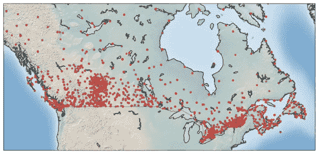
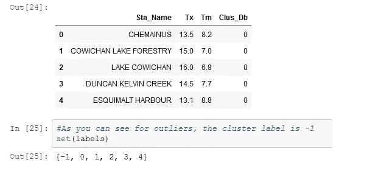
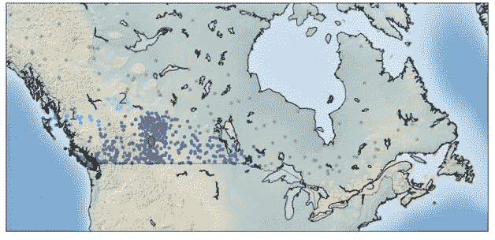

# 含噪声的应用程序的基于密度的空间聚类含噪声的应用程序的基于密度的空间聚类以在地图上显示站点

> 原文：<https://medium.com/analytics-vidhya/density-based-spatial-clustering-of-applications-with-noise-density-based-spatial-clustering-of-f981822ce09e?source=collection_archive---------20----------------------->

有几种聚类技术和算法被广泛应用于各个领域和行业。这些聚类算法分为七类，如分层算法、基于密度的算法、推荐引擎、市场细分、分割算法、基于图的算法、组合算法、基于网格的算法和基于模型的算法。

当聚类具有不同的形状、大小和密度时，以及当数据包含噪声和离群点时，在对象中发现聚类变得困难，特别是高维对象。为了创建任意形状的集群和形成不同密度的集群，我们必须依赖于基于密度的带噪声应用空间聚类(DBSCAN)集群。它的工作基于两个参数:ε和最小点ε来确定一个指定的半径，如果其中包含足够数量的点，我们称之为密集区域最小样本。它对地理数据使用欧几里德距离和大圆距离

```
Let us try to understand with an example. We will use DBSCAN algorithm by using the dataset “weather.csv” file (Reference for source: [https://s3-api.us-geo.objectstorage.softlayer.net/cf-courses-data/CognitiveClass](https://s3-api.us-geo.objectstorage.softlayer.net/cf-courses-data/CognitiveClass/ML0101ENv3/labs/weather-stations20140101-20141231.csv)) and find the group of stations which show the same weather condition.
```

**可视化**

使用底图包，它将帮助我们在地图上可视化车站。我们必须使用 matplotlib 底图工具包在 Python 中的地图上绘制 2D 数据。请记住，每个数据点的大小代表每个站一年中最高温度的平均值。



图一。地图上站点的可视化

**基于经纬度的站点聚类**

使用底图包，它将帮助我们在地图上可视化车站。我们必须使用 matplotlib 底图工具包在 Python 中的地图上绘制 2D 数据。请记住，每个数据点的大小代表每个站一年中最高温度的平均值。

**使用底图可视化集群**

让我们想象一下这些集群。jupyter notebook 中的代码执行后，它将绘制以下地图，并打印出集群编号和平均温度。举个例子，

聚类 3 的平均温度值为-15.300，而聚类 1 的平均温度值为 1.95。



图二。平均温度下的聚类数

**基于平均、最高和最低温度的站点聚类**

现在，让我们在 5 维数据集上重新运行 DBSCAN。

**站点聚类的最终可视化**

让我们设想 9 个基站的平均温度聚类。



图 3。具有平均温度的 9 个基站的聚类

**结论**

因此，在上面的例子中，我们熟悉了聚类算法 DBSCAN，以及它如何有助于找到显示相同天气条件的一组站点。因此，它不仅可以找到不同的任意形状的聚类，而且还可以通过忽略密度较低的区域或噪声来找到以数据为中心的样本中密度较高的部分。请记住，有一个更好的最新版本的算法，称为 HDBSCAN，它使用层次聚类结合常规 DBSCAN。它比 DBSCAN 快得多，也准确得多。