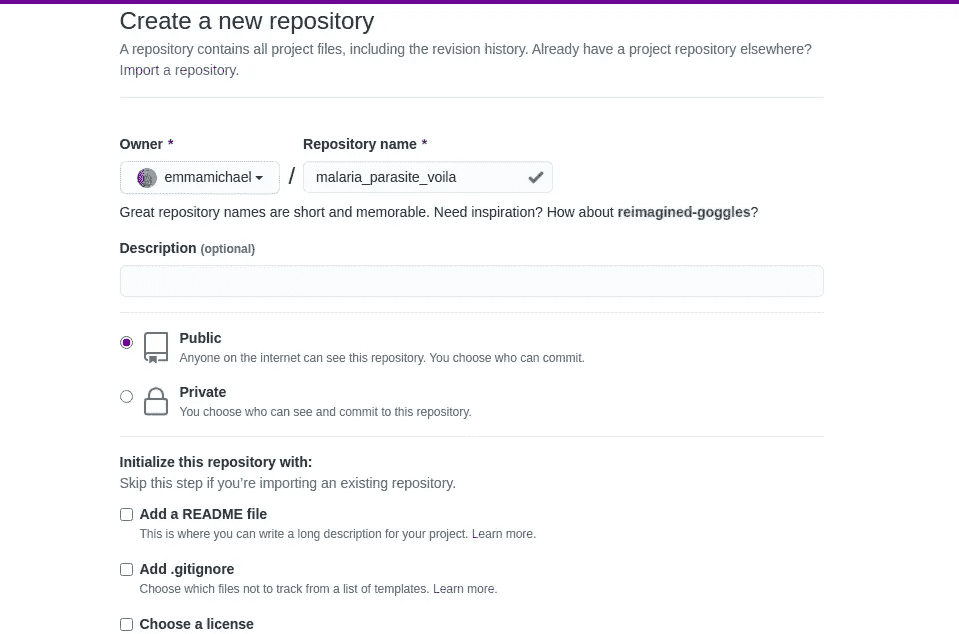
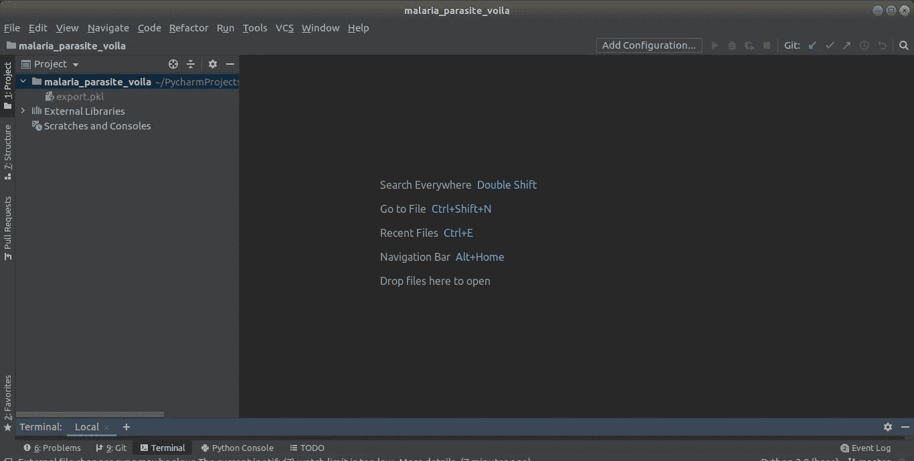
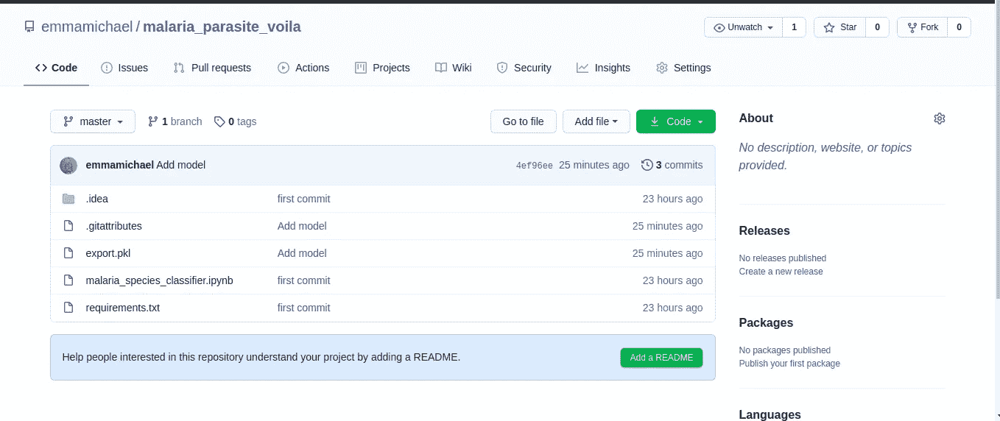
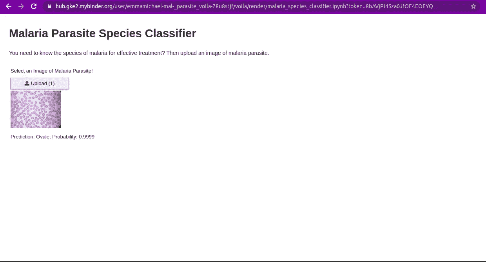

# 使用 Binder 部署 Fast.ai 训练模型

> 原文：<https://medium.com/analytics-vidhya/deploy-a-fast-ai-trained-model-using-binder-ce717a2ca66c?source=collection_archive---------16----------------------->

## 将您的笔记本变成真正的应用程序，并使用 binder 进行部署


照片由[克里斯蒂娜@ wocintechchat.com](https://unsplash.com/@wocintechchat?utm_source=medium&utm_medium=referral)在 [Unsplash](https://unsplash.com?utm_source=medium&utm_medium=referral) 上拍摄

这是“**了解模型部署的数据源和准备流程**”系列的第 3 部分。在系列的这一部分，我们将使用 binder 部署我们训练过的深度学习模型。

查看最终部署的 app:[https://my binder . org/v2/GH/Emma Michael/malaria _ 寄生虫 _voila/HEAD？URL path = % 2f voila % 2f fronder % 2f malaria _ species _ classifier . ipynb](https://mybinder.org/v2/gh/emmakodes/malaria_parasite_voila/HEAD?urlpath=%2Fvoila%2Frender%2Fmalaria_species_classifier.ipynb)

该过程将按以下顺序实施:

1.  创建 Github 存储库

添加:

2.export.pkl 文件

3.requirements.txt 文件。

4.将笔记本变成应用程序

5.添加、提交并推送到 Github

6.发布到活页夹。

# 创建 Github 存储库

转到 Github 并创建一个新的存储库。我会把我的叫做[疟疾 _ 寄生虫 _ 瞧啊](https://github.com/emmamichael/malaria_parasite_voila)



# 将 export.pkl 文件添加到项目

将存储库克隆到 IDE(Pycharm)。

将创建并下载的 export.pkl 文件添加到我们的克隆项目中。



# 添加 requirements.txt 文件

在我们的项目中创建一个 requirements.txt 文件，并编写:

```
voila
fastai>=2
pillow<7
packaging
ipywidgets==7.5.1
```

# 将笔记本变成应用程序

我们将把我们用来训练模型的 jupyter 笔记本变成一个应用程序。为此，我们将使用 Voilà和 ipywidgets(来创建小部件)。

从 Kaggle 创建一个新的 Jupyter 笔记本，我们将只向这个笔记本添加创建和显示我们需要的小部件所需的代码，并对我们希望出现的任何文本进行标记。

```
#import fastai.vision.all and vision.widgets to create widgets **from fastai.vision.all import *
from fastai.vision.widgets import ***#Make the two text comments below a markdown in your notebook#Malaria Parasite Species Classifier#You need to know the species of malaria for effective treatment? #Then upload an image of malaria parasite.#declare path and load our export.pkl file
**path = Path()
learn_inf = load_learner(path/'export.pkl', cpu=True)**#declare a button,output,label widget
**btn_upload = widgets.FileUpload()
out_pl = widgets.Output()
lbl_pred = widgets.Label()**#define an on_data_change function which execute when an image is #uploaded.It gets the image uploaded,display the image,make a #prediction of the image and output prediction, probability of #predictions**def on_data_change(change):    
    lbl_pred.value = ''     
    img = PILImage.create(btn_upload.data[-1])     
    out_pl.clear_output()     
    with out_pl: display(img.to_thumb(128,128))     
    pred,pred_idx,probs = learn_inf.predict(img)    
    lbl_pred.value = f'Prediction: {pred}; Probability:{probs[pred_idx]:.04f}'**#button to click to upload image
**btn_upload.observe(on_data_change, names=['data'])**#display label,btn_upload,out_pl,lbl_pred vertically
**display(VBox([widgets.Label('Select an Image of Malaria Parasite!'), btn_upload, out_pl, lbl_pred]))**
```

瞧，这是我们的 requirements.txt 文件中的一个包，它将删除所有的单元格输入，只显示输出(包括 ipywidgets)以及我们的 Markdown 单元格。当我们部署我们的应用程序时，您会看到这一点。

**从 Kaggle 下载笔记本并将其添加到我们的克隆项目中。**

# 添加、提交并推送到 Github

在项目的终端中运行以下命令，将我们的项目添加、提交并推送到我们的远程存储库中。

```
git add .git commit -m “first commit”git push — set-upstream origin master
```

如果收到**检测到大文件的错误。你可能想尝试 Git 大文件存储。**然后我们需要设置 Git 大文件存储，使我们能够上传大文件或模型到 Github。

**对于 Debian 和 Ubuntu:**

在您的终端中运行以下命令，下载并安装 git lfs:

1.  `curl -s https://packagecloud.io/install/repositories/github/git-lfs/script.deb.sh | sudo bash`
2.  `sudo apt-get install git-lfs`
3.  `git lfs install`

其他系统用户，可以查看这个链接:【https://github.com/git-lfs/git-lfs/wiki/Installation

然后在项目的终端中运行以下命令:

1.  git lfs 音轨" *。pkl "
2.  git 添加。gitattributes
3.  git 添加 export.pkl
4.  git commit -m“添加模型”
5.  git push -u 原始主机

我们已经成功地将我们的大型模型推送到我们的远程回购。

你最后的回购应该是这样的:



您可以查看我的 Github 资源库:

【https://github.com/emmakodes/malaria_parasite_voila 

# 发布到活页夹

Binder 有助于将 git repo 转化为一系列交互式笔记本。

要在 Binder 上发布我们的 web 应用程序，我们需要遵循以下步骤:

1.转到[https://mybinder.org/](https://mybinder.org/)将该回购的 URL 粘贴到活页夹的 URL 字段。
2。更改“启动”按钮旁边的文件下拉列表，改为选择 URL。
3。在“要打开的 URL”栏中，输入/voila/render/name.ipynb(用您的笔记本名称替换名称)。

在我们的例子中，它将是/voila/render/malaria_species_classifier . ipynb，因为“malaria _ species _ classifier”是上面上传到 Github 的笔记本的名称。

4.点击右下角的剪贴板按钮复制 URL 并粘贴到安全的地方
。
5。单击启动。

第一次这样做时，Binder 大约需要 5 分钟来构建您的站点。在幕后，它是找到一个可以运行您的应用程序的虚拟机，分配存储空间，并收集 Jupyter、您的笔记本以及将您的笔记本呈现为 web 应用程序所需的文件。

最后，一旦应用程序开始运行，它会将您的浏览器导航到您的新 web 应用程序。您可以共享您复制的 URL，以允许其他人也访问您的应用程序。

最终结果:



App 正确预测卵圆形疟原虫的 png 图像

**在这里查看最后的 app:**[https://my binder . org/v2/GH/Emma Michael/malaria _ 寄生虫 _voila/HEAD？URL path = % 2f voila % 2f fronder % 2f malaria _ species _ classifier . ipynb](https://mybinder.org/v2/gh/emmakodes/malaria_parasite_voila/HEAD?urlpath=%2Fvoila%2Frender%2Fmalaria_species_classifier.ipynb)

**在 twitter 上关注我** [@emmakodes](https://twitter.com/emmakodes)

**领英:**https://www.linkedin.com/in/emmanuelonwuegbusi/

# 结论

我们已经成功地将我们的模型部署到 binder 中。如果您遵循了该系列，您就已经了解了获取数据以构建深度学习模型以及将应用程序部署到 Binder 等平台的过程。

第 1 部分:[了解模型部署的数据来源和准备流程](https://emmamichaelo.medium.com/learn-the-process-of-data-sourcing-and-preparation-to-model-deployment-4936c3b1f7b8)

第二部分:[利用 Fast.ai 进行疟原虫种类分类](https://emmamichaelo.medium.com/malaria-parasite-species-classification-using-fast-ai-4255b7ac1bff)

**参考文献**

[1]杰瑞米·霍华德和西尔万·古格，Fastai 和 Pytorch 的程序员深度学习(奥莱利媒体公司，2020 年)

PS:为了测试应用程序上传一个 png 图像。