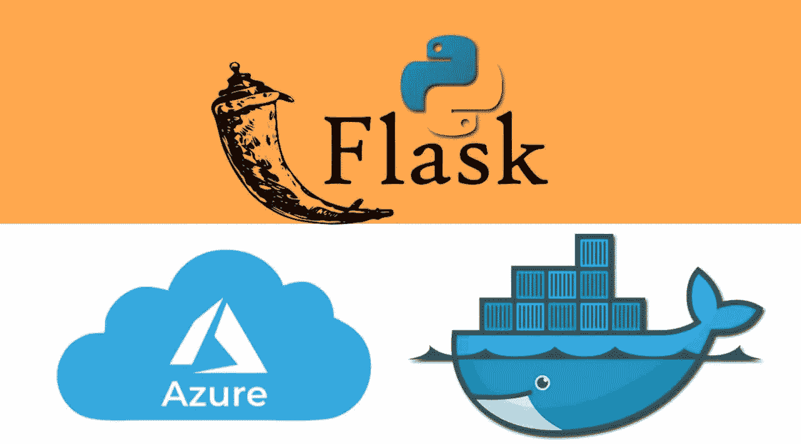
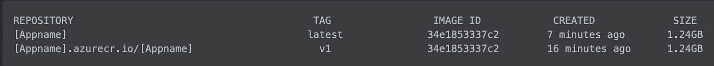

# 使用 Docker 将 Flask REST API 部署到 Azure 应用服务

> 原文：<https://medium.com/analytics-vidhya/deploy-a-flask-rest-api-to-azure-app-service-using-docker-8ab68a56c53e?source=collection_archive---------0----------------------->



在本教程中，我将讨论使用 Docker 将 Flask 应用程序部署到 Azure App Service。本博客的先决条件是:

*   计算机编程语言
*   瓶
*   docker(`**Dockerfile**`和`**Docker Compose**`的概念)
*   蓝色资源的一些概念，如`**Azure App Service, Azure Container Registry, Azure Resource Group**`等

用`**Dockerfile**`和`**docker-compose**`构建的样品瓶架 API 可以在[这里](https://github.com/kartheekgottipati/Docker-compose-flask-redis-deploy)找到。我将从终端做所有的步骤，因为这将是有益的 CICD 项目的实施。虽然，我用的是 macOS，但我认为 Ubuntu(或任何其他 Linux)用户可以使用相同的命令。我已经尽力使这个教程非常紧凑。下面是步骤。

# 构建和测试

通过构建 docker 映像并运行它来构建和测试应用程序。导航到您的项目存储库并运行，

```
$ docker compose build
$ docker compose up
```

# 安装 Azure CLI

这个构建的 docker 映像需要被推送到`Azure container registry`并且`Azure app Service`将选择这个映像并作为服务运行。因此，要与 azure 进行交互，需要安装`Azure CLI`。

```
$ brew update && brew install azure-cli
$ az login
```

# 创建 Azure 资源组

要在 Azure 中执行任何操作，都需要一个资源组。`Azure App Service, Azure Container Registry, Azure Kubernetes, Azure SQL Database`等，都是资源组的组成部分。一个资源组中的组件可以与另一个资源组中的组件通信。对于这个项目，您需要首先创建一个资源组，然后在这个资源组中需要创建`Azure Container Registry`和`Azure App Service`。要在 Azure 中创建资源组，请运行以下命令，

```
$ az group create -l westus -n [ResourceGroupName]
```

`[ResourceGroupName]`将替换为所选的资源组名称。例如，如果选择的资源组是`my_azure_group,`，那么上面的命令将是，`$ az group create -l westus -n my_azure_group.`

# 创建 Azure 容器注册表(ACR)

```
$ az acr create --resource-group [ResourceGroupName] --name [ACRName] --sku Basic 
$ az acr login --name [ACRName]
```

第一行将使用提供的名称创建一个 ACR，第二行将要求登录以进行身份验证。

# 将本地 Docker 映像推送到 ACR

要查看当前本地图像列表，请使用 docker images 命令:
`$ docker images`

上述命令的输出显示了当前本地图像的列表:

```
REPOSITORY    TAG         IMAGE ID           CREATED           SIZE
[AppName]    latest      34e1853337c2      7 minutes ago      1.24GB
```

要在 ACR 中使用`[AppName]`容器图像，需要用注册中心的登录服务器地址标记图像。该标签用于将容器图像推送到图像注册中心时的路由。

要获得登录服务器地址，使用`az acr list`命令并查询`loginServer`，如下所示:

```
$ az acr list --resource-group [ResourceGroupName] --query "[].{acrLoginServer:loginServer}" --output table
```

这将给出以下输出:`[AppName].azurecr.io.`现在，用容器注册中心的 acrLoginServer 地址`[AppName].azurecr.io`标记本地`[AppName]`图像。为了指示图像版本，在图像名称的末尾添加`:v1`:

```
$ docker tag [AppName]:latest [AppName].azurecr.io/[AppName]:v1
```

要验证标签是否已应用，再次运行`docker images`。图像被标记上 ACR 实例地址和版本号。



构建并标记好映像后，将`[AppName].azurecr.io/[AppName]`映像推送到 ACR 实例。使用 docker push 并为映像名称提供 acrLoginServer 地址，如下所示:

```
$ docker push [AppName].azurecr.io/[AppName]:v1
```

# 创建应用服务

要创建应用服务，需要创建一个应用服务计划。

```
$ az appservice plan create --name [PlanName] --resource-group  [ResourceGroupName] --is-linux$ az webapp create --resource-group [ResourceGroupName] --plan [PlanName] --name [AppName] --deployment-container-image-name [AppName].azurecr.io/[AppName]:latest
```

# 设置端口

```
$ az webapp config appsettings set --resource-group [ResourceGroupName] --name [AppName] --settings WEBSITES_PORT=80
```

# 启用托管身份并检索主体 ID

```
az webapp identity assign --resource-group [ResourceGroupName] --name [AppName] --query principalId --output tsv
```

# 检索订阅 ID

```
az account show --query id --output tsv
```

# 授予 web 应用程序访问容器注册表的权限

将主体 ID 和订阅 ID 放在下面的命令中，这是从上面两个命令中检索的。连续部署需要以下命令。

```
$ az role assignment create --assignee [PrincipalID] --scope  /subscriptions/[SubscriptionID]/resourceGroups/[ResourceGroupName]/providers/Microsoft.ContainerRegistry/registries/[AppName] --role "AcrPull"
```

# 部署容器映像

```
$ az webapp config container set --name [AppName] --resource-group [ResourceGroupName] --docker-custom-image-name [AppName].azurecr.io/[AppName]:latest --docker-registry-server-url [https://[AppName].azurecr.io](https://secureaiacr.azurecr.io)
```

部署后，可以从未经验证的 URL`[AppName].azurewebsites.net`访问应用程序。您可以使用`Postman`来请求这个 URL 中的 API。

# 剧终

所以，这是本文的结尾，却是这个系列的开始。请在下面评论任何问题或建议。谢谢你。