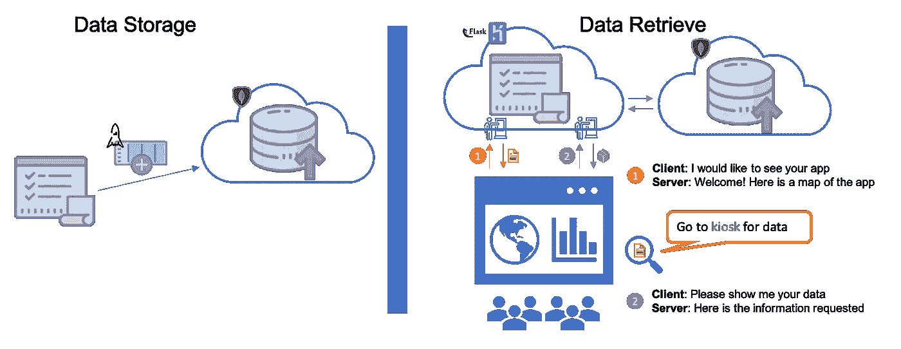

# 在 Heroku 上用 Python、Flask 和 MongoDB 在 10 分钟内部署一个 Web API

> 原文：<https://medium.com/analytics-vidhya/deploy-a-web-api-with-python-flask-and-mongodb-on-heroku-in-10-mins-71c4571c505d?source=collection_archive---------1----------------------->

在 Heroku 上使用 Python、Flask 和 MongoDB 构建 API 的分步指南

*注:本帖代码可在* [*这里*](https://github.com/kevinclee26/mongo_heroku_demo) 找到

用 Python、Flask 和 MongoDB 构建 SpaceX 发射历史 Web API(图片由作者提供)

API 代表**应用编程接口**。它是一个软件中介，允许系统相互通信。例如，当用户在浏览器中输入 URL 时，例如…