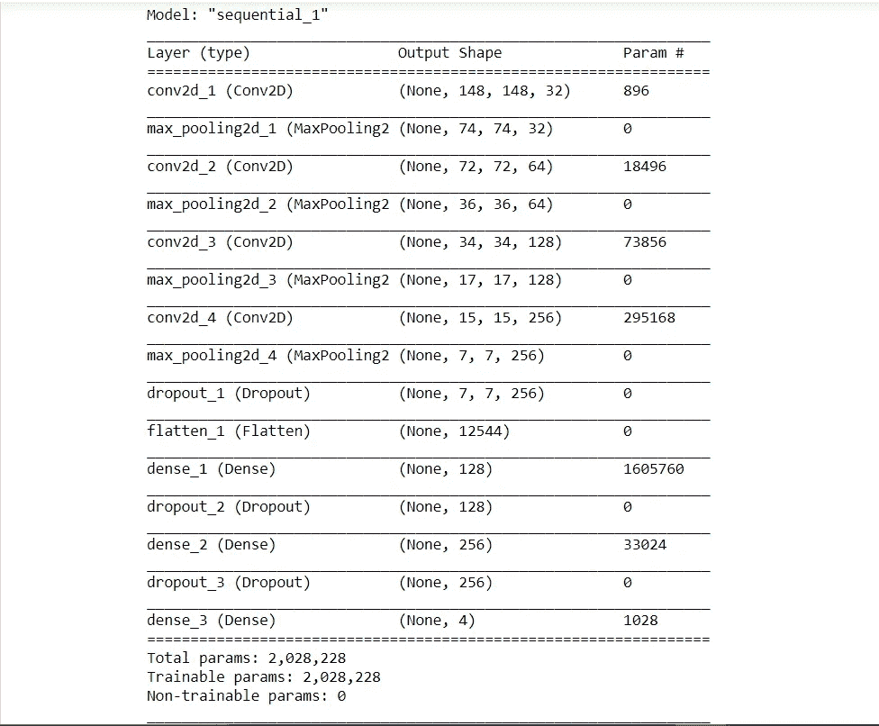
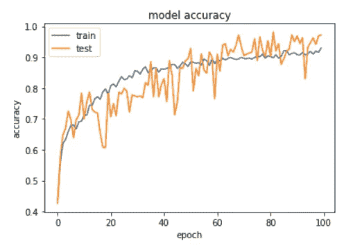
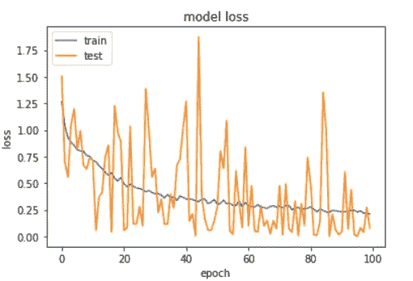
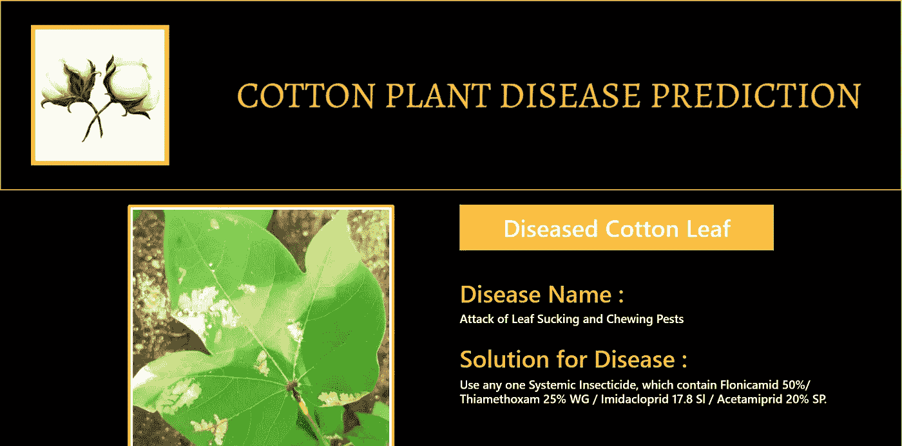
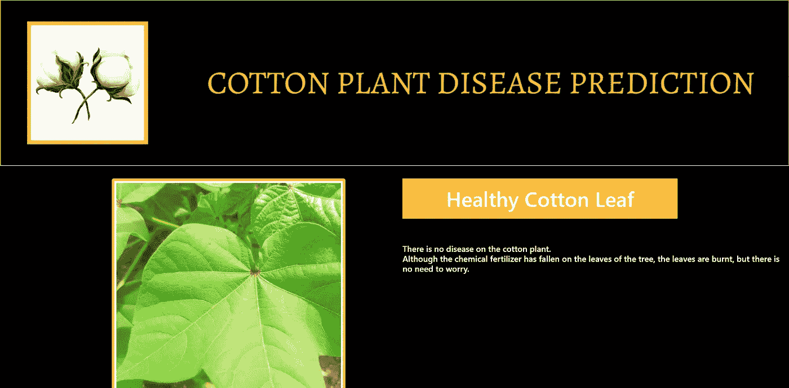
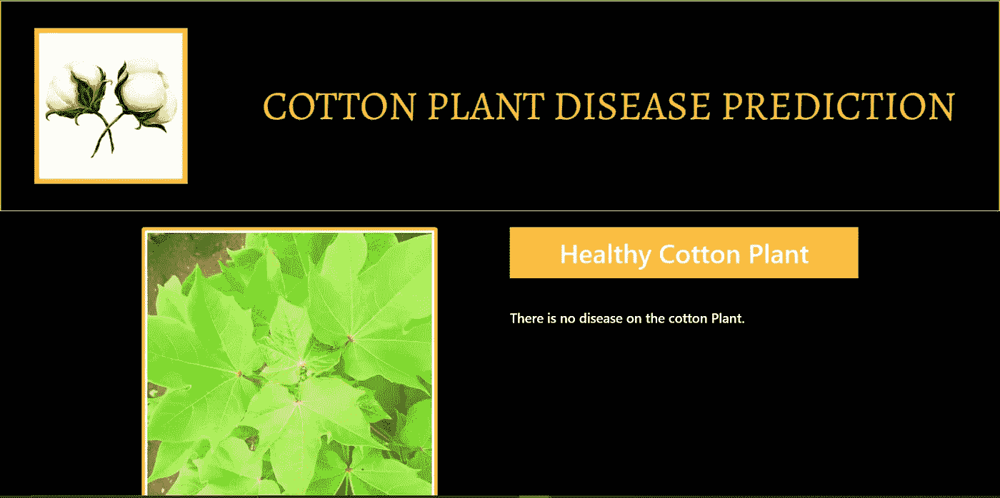

# 使用深度学习和 Flask 部署棉花病害预测

> 原文：<https://medium.com/analytics-vidhya/deploy-cotton-disease-prediction-using-deep-learning-flask-53aa9ccb0fdc?source=collection_archive---------7----------------------->

随着我国经济的增长，农业对一天财政的影响日益增大，农业仍然是一个广泛的部门，对我国起着非常重要的作用。而在农业领域，在专家的帮助下跟踪植物的疾病是非常昂贵的。需要一种能够自动检测疾病的系统，因为它可以在监测大面积作物领域中带来革命，然后在检测到疾病后可以尽快治疗植物叶片。有许多疾病影响着棉花和更多的农作物，影响着农业的许多领域。所以那些识别这种疾病以及如何从中康复的人。这一目标将通过我们的应用得到满足，这有助于预测棉花病害以及如何克服病害。

# **项目概述**

对于这个项目，我已经从 [Kaggel](https://www.kaggle.com/janmejaybhoi/cotton-disease-dataset) 下载数据集。在此数据集中，有三个文件夹，如培训、测试和验证文件夹。在该数据集中，有 4 个类别，如患病棉花叶、患病棉花植物、新鲜棉花叶、新鲜棉花植物。

对于这个项目，我已经使用 keras 库为我们的棉花疾病预测项目创建了深度学习模型卷积神经网络(CNN)。首先，我为什么在用 CNN，因为 CNN 的准确率高，所以用于图像分类识别。CNN 遵循一种分层模型，该模型致力于构建一个网络，就像一个漏斗，并最终给出一个完全连接的层，在该层中所有的神经元相互连接并处理输出。

获得数据集后，下一步是传递我们的 CNN 模型的训练数据，以学习识别或分类不同类别的图像。使用的模型架构是:

模型摘要

使用的损失函数是“稀疏分类交叉熵”,使用的优化器是“Adam”。为了训练模型，我们在后端使用了 Keras API 和 tensorflow。该模型表现出良好的性能，实现了体面

准确性和损失图

在创建 CNN 模型之后，按照数据科学生命周期，我们必须部署我们的模型。为了将模型部署到 web 应用程序中，我们使用 python 框架 Flask 将 CNN 模型与 HTML、CSS 和 JavaScript 文件连接起来。为了在烧瓶中使用模型，我们必须保存我们的模型。

保存模型后，使用 HTML、CSS 和 JAVASCRIPT 创建 web 应用程序，然后连接 Flask。所以，所有的事情终于完成了，我已经附上了我的 web 应用程序的一些输出。

病棉叶

健康棉叶

健康的棉花植物

此外，我为网站创建了聊天机器人，因为聊天机器人提供个性化的需求很高的体验。这个聊天机器人是使用 IBM watson assistant 创建的。

# **工具&技术:-**

**工具:-**

Jupyter 笔记本，Pycharm

**技术:-**

计算机编程语言

# **结论:-**

在这个项目中，我学到了一些关于深度学习的基本概念，CNN，python 框架 Flask，使用 IBM watson assistant 的聊天机器人和其他许多我在这个项目中学到的东西。

# **源代码:-**

[https://github . com/PrinceAjudiya/Deploy-Cotton-Disease-Prediction-Using-Deepl-learning-Flask](https://github.com/PrinceAjudiya/Deploy-Cotton-Disease-Prediction-Using-Deepl-learning-Flask)