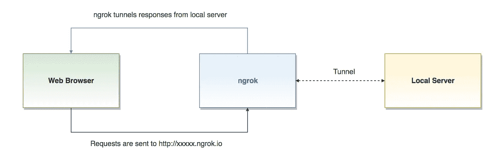

# 从 Jupyter 笔记本电脑轻松部署网络应用

> 原文：<https://medium.com/analytics-vidhya/deploy-flask-streamlit-apps-from-jupyter-notebook-and-google-colab-5c3729dc3647?source=collection_archive---------1----------------------->

你有没有想过是否有一种简单的方法来部署你刚刚制作的 **Flask 或 Streamlit** web 应用。嗯，有。你可以使用 **ngrok** 来部署你的笔记本，而不是使用 Heroku 和 Docker 来部署。不需要创建 Github 库或其他任何东西。

# 只需几行代码，就可以在笔记本上部署您的工作。

# ngrok 是如何工作的？

所以基本上 ngrok 所做的是，无论当前在你的**本地端口**上运行的是什么，都将在 ngrok 生成的**链路上**流式传输**。例如，假设您的 flask 应用程序运行在端口 5050 上，那么您可以使用 ngrok 直接部署它并获得一个可共享的链接！**

# 掌握代码

因此，在这个例子中，我们将使用 **streamlit** 制作一个电动汽车成本和减排计算器。因此，我们需要用户的 2 个输入，以及他们使用电动汽车行驶的每周距离，并使用这些信息来计算成本和减排。

所以让我们从为 ngrok 安装 streamlit 和一个 zip 文件开始。

安装完成后，你会在你的文件夹结构中看到一些新文件。别担心，你不需要做任何事情。

只需将下面的代码粘贴到一个单独的单元格中，您将得到您部署的链接。但是等等！我们还没有真正做好要部署的东西。因此，让我们创建一个 streamlit 应用程序。

下面的代码将创建所需的应用程序。所以我们正在做的，

1.  使用 2 个滑块来获取用户的输入
2.  在第 17 行创建列，并排显示元素。
3.  计算一周甚至一年的成本和减少的排放量。

现在唯一剩下的就是运行 app 了！

使用上面的代码运行应用程序，在输出中你会看到本地主机链接，但应用程序并没有运行。**使用您在上面创建的 ngrok 链接。**

# 好了，您已经有了一个部署好的仪表板！

你可以在这里找到 [Github Repo](https://github.com/NidhayPancholi/EV-Dashboard) ，它包含了一些额外的标签，包含了关于印度**充电站的信息**！

这是我在 LinkedIn 上的照片。