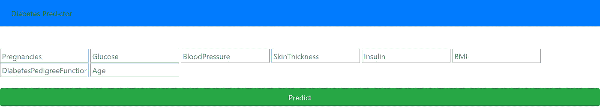
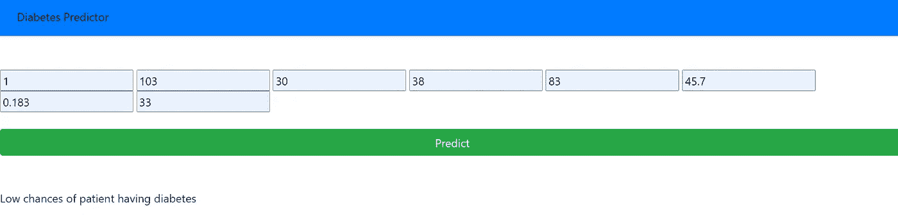
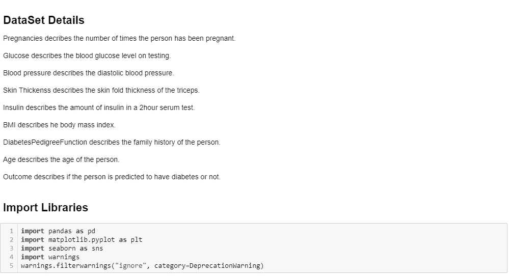
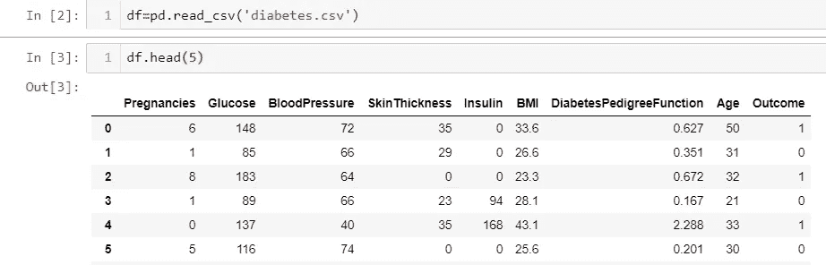
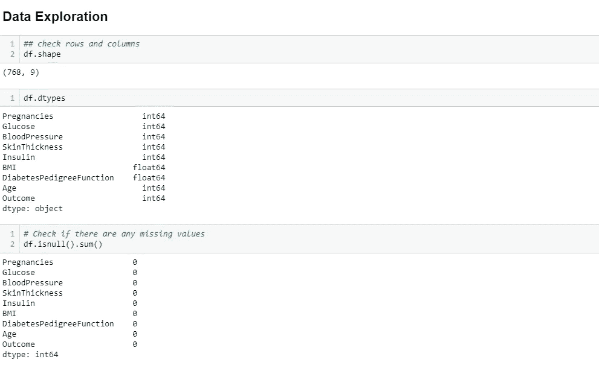
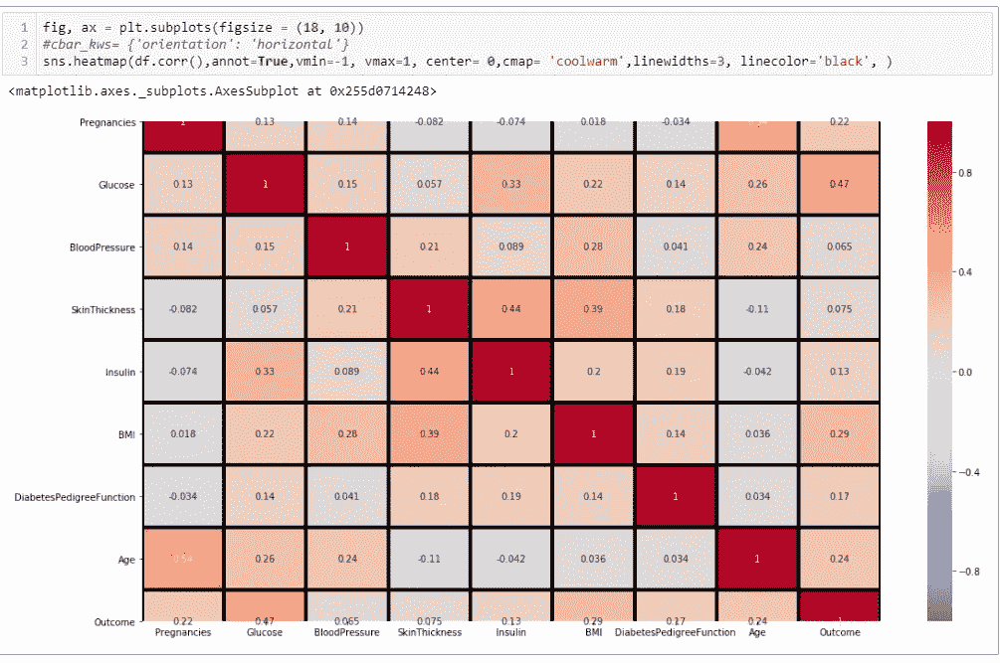
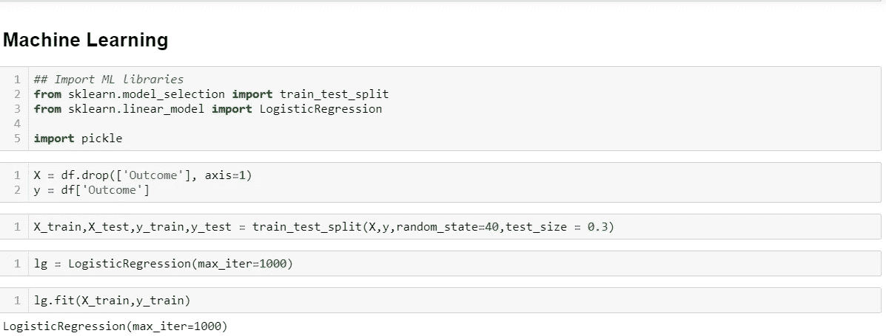
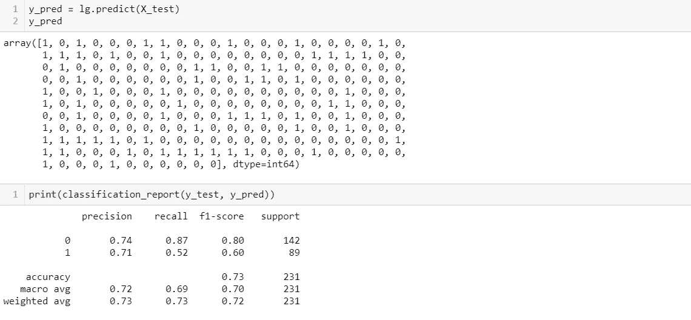
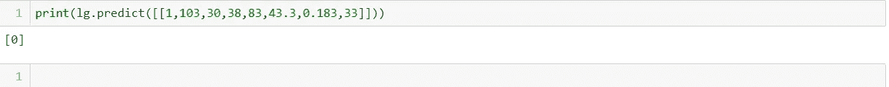

# 向 Heroku 初学者部署使用 Flask 的机器学习模型(第 1 部分)

> 原文：<https://medium.com/analytics-vidhya/deploy-machine-learning-model-using-flask-to-heroku-beginners-part-1-451b117a4c7e?source=collection_archive---------26----------------------->

您刚刚学习了如何创建机器学习模型。你的模型正在如你所愿地工作。但是你有一个难题，如何从你的笔记本中取出你的模型，并把它包装成一个人们可以轻松使用的产品。

本教程旨在向机器学习初学者介绍如何创建和部署机器学习模型。

1.  第一部分将是机器学习模型的演练。然而，本教程假设您已经掌握了机器学习模型的基础知识，因此本书并没有深入讨论数据预处理和模型实现。笔记本和烧瓶的其余部分，html 代码可以在 GitHub 上使用这个链接[https://github.com/Jnjerry/diabetespredictor](https://github.com/Jnjerry/diabetespredictor)找到。
2.  [第二部分](https://ngugijoan.medium.com/deploy-machine-learning-model-using-flask-to-heroku-beginners-part-2-6db424211e3d)将指导如何将你的机器学习模型嵌入到 flask 应用程序中，以便将该模型用作 web 应用程序。
3.  [第三部分](https://ngugijoan.medium.com/deploy-machine-learning-model-using-flask-to-heroku-beginners-part-3-849c2458c363)将指导你如何通过 GitHub 将你的机器学习部署到 Heroku。你可以在这里找到最终的输出[https://joan-diabetes-predictor.herokuapp.com/](https://joan-diabetes-predictor.herokuapp.com/)。

该模型通过测量几个医学预测指标来预测患者患糖尿病的可能性。

**第 1 部分:模型实现**

任何机器学习问题的第一部分通常是库的导入。为了更好地理解数据，我还加入了数据集描述。数据集由几个医学预测因子、独立变量和一个目标因变量**结果**组成。**结果 1** 表示患者患有糖尿病，而**结果 0** 表示患者在体检后没有患糖尿病。

加载数据集并探索它通常是下一步。

然后，我们继续研究数据集的形状、类型以及是否有任何缺失值。幸运的是，任何列中都没有丢失值，因此这不需要我们采取任何进一步的行动。

然后，我们继续通过如下所示的热图来识别和查看特征之间的相关性。

我们的热图显示了几列之间的强相关性。胰岛素与皮肤厚度高度相关。皮肤厚度也与身体质量指数高度相关。年龄与怀孕密切相关。

**机器学习**

本指南的机器学习部分从这里开始。我们使用逻辑回归模型来确定某人患糖尿病的可能性，该模型基于其他患者在测试后被发现患有糖尿病的历史医学预测。

我们从导入我们的机器学习库开始。然后，我们继续指定我们的 ***目标变量 y、结果*** ，以及我们的 ***自变量 X、*** ，它们是我们数据集中除结果之外的每隔一列。

然后，我们按照 70:30 的比例将数据集分成训练集和测试集。之后，我们调用我们的逻辑回归模型并将其标记为 **lg** ，然后继续在我们的训练数据集中拟合该模型。

然后，我们预测了我们的模型，并使用输出打印出精度、召回率、f1 分数的分类报告分数。

然后我们继续使用我们的模型进行预测，给出我们的医学预测。我们可以看到输出为 0，这意味着患者不太可能患有糖尿病。

第一部分到此结束。[下一部分](https://ngugijoan.medium.com/deploy-machine-learning-model-using-flask-to-heroku-beginners-part-2-6db424211e3d)是关于在 flask 应用程序中使用您的模型，并显示来自 web 页面的输出。