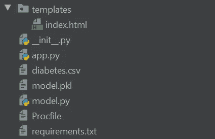
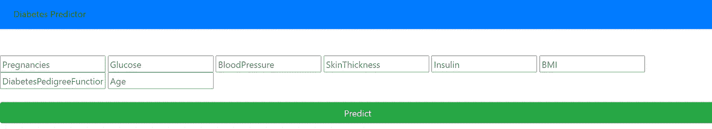
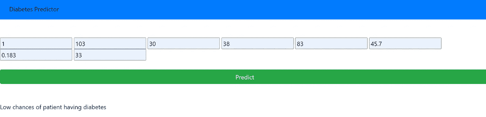
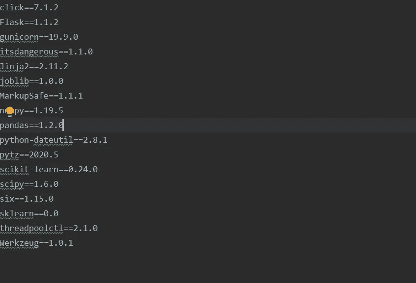
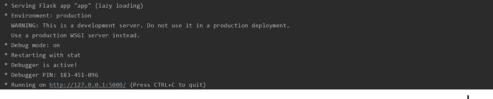
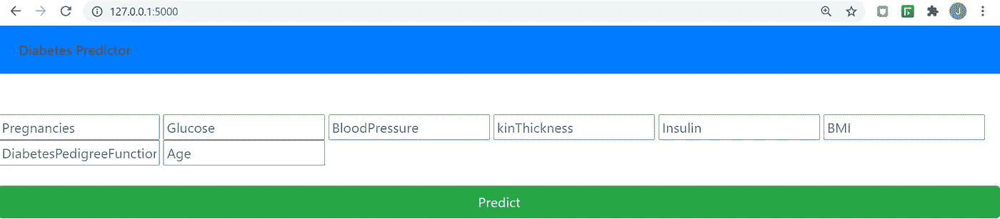
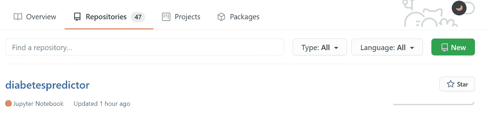
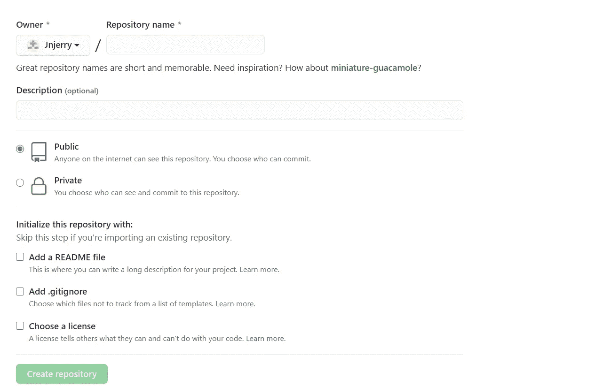
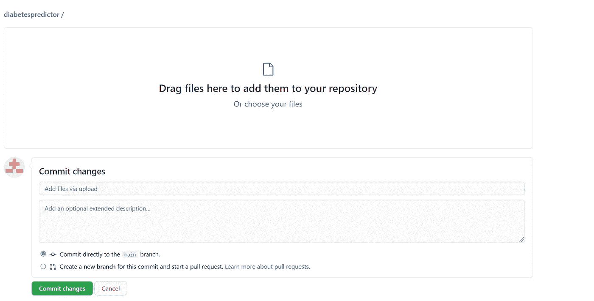
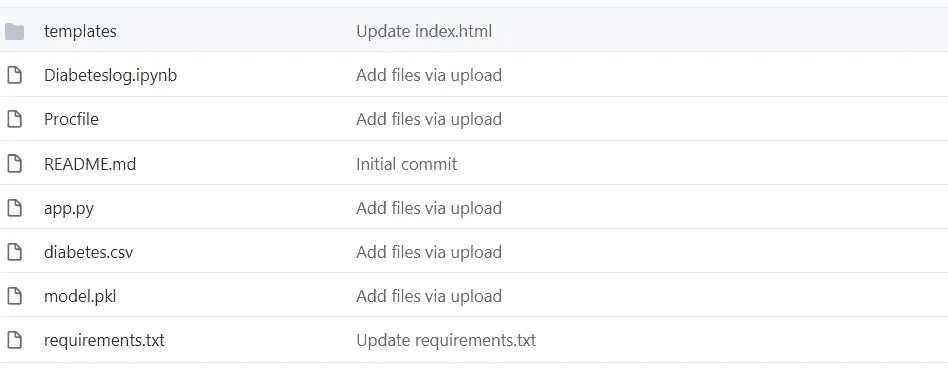

# 向 Heroku 初学者部署使用 Flask 的机器学习模型(第 2 部分)

> 原文：<https://medium.com/analytics-vidhya/deploy-machine-learning-model-using-flask-to-heroku-beginners-part-2-6db424211e3d?source=collection_archive---------11----------------------->

这是关于如何使用 Flask 在 Heroku 上创建和部署机器学习模型的教程的第二部分。[第一部分](https://ngugijoan.medium.com/deploy-machine-learning-model-using-flask-to-heroku-beginners-part-1-451b117a4c7e)是关于数据预处理和使用 JupyterNotebook 创建逻辑回归模型。

第 2 部分将指导如何构建你的 flask 应用程序，如何在其中嵌入你的机器学习模型，以及如何将应用程序上传到 [GitHub](https://github.com/Jnjerry/diabetespredictor) 上。

**构建烧瓶应用**

我用 PyCharm 作为我的 IDE。确保您已经安装了我们在模型中使用的包，以及 flask、numpy 和 Gunicorn。Gunicorn 将允许我们在 Heroku 上运行我们的 flask 应用程序。

*   瓶
*   熊猫
*   Numpy
*   sci kit-学习
*   格尼科恩
*   泡菜



我们的 flask 应用程序的高层结构有以下文件: **model.py** 包含我们的机器学习模型。我们的 **app.py** 包含我们的逻辑，它是我们导入 pickle 模型和 flask 模块的地方。 **model.pkl** 文件封装了我们的机器学习模型。我们的 index.html 输出我们的网页，Procfile 允许我们将我们的应用程序部署到 Heroku，我们的 requirements.txt 包含我们所有导入的库。

现在让我们把结构分解成几个步骤:

**第一步:Model.py**

我们使用之前创建的 JupyterNotebook 中的模型。只是这次我们不需要包括数据探索和机器学习模型验证步骤。我们删除了这些部分，因为我们已经测试了我们的模型，因此我们只需要导入我们的数据集，指定我们的 X 和 y 特征，分割我们的训练和测试集，并使它们适合我们的逻辑模型。

我这里的附加行是 **pickle.dump(logreg，open('model.pkl '，' wb '))。**我们实际上是使用我们的 pickle 库将我们训练好的模型 *(logreg)* 保存到磁盘上。当您运行 **python model.py** 时，您的 model.pkl 文件被保存。

```
import pandas as pd

df=pd.read_csv('diabetes.csv')

## Import ML libraries
from sklearn.model_selection import train_test_split
from sklearn.linear_model import LogisticRegression

import pickle

# Define our X and y features and split into training/test sets
X = df.drop(['Outcome'], axis=1)
y = df['Outcome']

X_train, X_test, y_train, y_test = train_test_split(X, y, test_size=0.3, random_state=109)

X_train.head()

logreg = LogisticRegression(max_iter=1000)
logreg.fit(X_train,y_train)

print(logreg.predict([[1,103,30,38,83,43.3,0.183,33]]))

# Saving model to disk
# Pickle serializes objects so they can be saved to a file, and loaded in a program again later on.
pickle.dump(logreg, open('model.pkl','wb'))
```

确保运行以下命令来输出您的 pickle 文件

```
python model.py
```

第二步:app.py

```
import numpy as np
from flask import Flask, request, render_template
import pickle

app = Flask(__name__)# read our pickle file and label our logisticmodel as model
model = pickle.load(open('model.pkl', 'rb'))

@app.route('/')
def home():
    return render_template('index.html')

@app.route('/predict',methods=['POST','GET'])
def predict():

    int_features = [float(x) for x in request.form.values()]
    final_features = [np.array(int_features)]
    prediction = model.predict(final_features)

    if prediction==0:
        return render_template('index.html',
                               prediction_text='Low chances of patient having diabetes'.format(prediction),
                               )
    else:
        return render_template('index.html',
                               prediction_text='High chances of patient having diabetes'.format(prediction),
                              )

if __name__ == "__main__":
    app.run(debug=True)
```

在这个文件中我们有两个方法: **home()** 和 **predict()。home 方法呈现了我们的 index.html 页面，并给出了下面的主页界面。**



当你点击上面的预测按钮以得到你的预测结果时，预测方法被调用，你得到如下的结果界面



我们还从 pickle 文件中导入了我们的模型，然后在 predict 方法中，我们获取用户在 index.html 文件的表单中输入的值，然后使用 pickle 文件中的模型继续预测这些值。用户输入的值本质上是来自 model.py 中的机器学习模型的 X 特征。

需要注意的一点是，为了更好的用户体验，我用一个字符串文本替换了结果 0 和 1，因此如果结果等于 0，则显示为 ***患者患糖尿病的几率低*** ，如果结果等于 1，则显示为 ***患者患糖尿病的几率高*。**

**第三步:Index.html**

我们的 index.html 很简单。它包含一个表单，我们将在其中输入我们的 **X 特性:**葡萄糖、身体质量指数等。如果形状特征不等于模型中 X 特征的数量，将会出现错误。第 **{{ prediction_text }}** 行是我们最终输出应该是**的地方。**在**app . py****{ { prediction _ text } }**等同于我们的**结果**特征。

```
<!DOCTYPE html>
<html >

<head>
  <meta charset="UTF-8">
  <title>COVID-19 Predictor</title>
 <!-- Latest compiled and minified CSS -->
<link rel="stylesheet" href="https://maxcdn.bootstrapcdn.com/bootstrap/4.5.2/css/bootstrap.min.css">

<!-- jQuery library -->
<script src="https://ajax.googleapis.com/ajax/libs/jquery/3.5.1/jquery.min.js"></script>

<!-- Popper JS -->
<script src="https://cdnjs.cloudflare.com/ajax/libs/popper.js/1.16.0/umd/popper.min.js"></script>

<!-- Latest compiled JavaScript -->
<script src="https://maxcdn.bootstrapcdn.com/bootstrap/4.5.2/js/bootstrap.min.js"></script>

</head>

<body>
<nav class="navbar navbar-expand-sm bg-primary navbar-light">
  <ul class="navbar-nav">
    <li class="nav-item active">
      <a class="nav-link" href="index.html">Diabetes Predictor</a>
    </li>

  </ul>
</nav>

  <br>
   <br>

   <form action="{{ url_for('predict')}}"method="post">
       <input type="text" name='Pregnancies' placeholder="Pregnancies" required="required" />
        <input type="text" name="Glucose" placeholder="Glucose" required="required" />
      <input type="text" name="BloodPressure" placeholder="BloodPressure" required="required" />
        <input type="text" name="SkinThickness" placeholder="kinThickness" required="required" />
        <input type="text" name="Insulin" placeholder="Insulin" required="required" />
      <input type="text" name="BMI" placeholder="BMI" required="required" />

        <input type="text" name="DiabetesPedigreeFunction" placeholder="DiabetesPedigreeFunction" required="required" />
      <input type="text" name="Age" placeholder="Age" required="required" />
<br>
       <br>
      <button type="submit" class="btn btn-success btn-block btn-large">Predict</button>

   </form>
       <br>
   <br>
   {{ prediction_text }}

</div>

</body>
</html>
```

**第四步:过程文件**

我们的 Procfile 是一个包含以下指令的单行文件:

```
web: gunicorn app:app
```

当您想要部署 web 应用程序时，这是一个必需的文件。应该准确的命名为 **Procfile，**类似 **Procfile.txt 的东西就不行了！这个文件描述了你想要如何运行你的网络应用程序。每种语言和框架都包含一种编写该文件的标准方式。左边的部分是流程类型；右边的部分是启动该进程所运行的命令。**

**第五步:requirements.txt**

在您的终端中运行以下命令:

```
pip freeze > requirements.txt
```

这是为我们提供 requirements.txt 文件的命令。这是一个非常重要的文件，它不仅指导其他开发人员使用您在应用程序中使用的 python 包的版本，而且也是 Heroku 在部署期间用来运行您的应用程序的文件。您的需求文件应该类似于下图。您的软件包和版本列表。Heroku 可能会在部署期间带来版本错误，您可以随时降级您的软件包版本。



您可以通过在终端中运行以下命令来测试和运行您的应用程序

```
python app.py
```

如果您在终端中得到以下响应，您就成功了



点击提供的链接，你应该有你的应用程序在你的本地机器上运行



最后一部分将会把你的代码推送到 GitHub。因为这不是一个 GitHub 教程，而且对你来说也可能是新的，在 GitHub 中拥有你的代码的最简单的方法就是像你在网上上传任何其他文件一样上传文件。

在您的 GitHub repositories 部分，选择 new 来创建您的新存储库(将包含您的代码的文件夹)。



给你的 repo 命名，你也可以勾选 **README** 文件，点击 **Create repository** 。



在新创建的存储库中，单击添加文件>上传文件。然后，您可以通过简单地在界面上拖动来添加 flask 应用程序文件。单击提交更改上传您的文件。



您的最终输出应该包含以下文件。*糖尿病日志*文件不在其中。这是我们在第 1 部分中用来创建和评估模型的笔记本文件。



太好了！这是我们教程的第二部分。最后一部分[第 3 部分](https://ngugijoan.medium.com/deploy-machine-learning-model-using-flask-to-heroku-beginners-part-3-849c2458c363)，是最简单的，它是一个关于如何将我们的应用从 GitHub 部署到 Heroku 的教程。