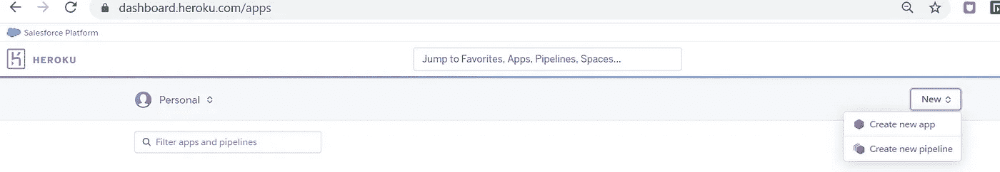
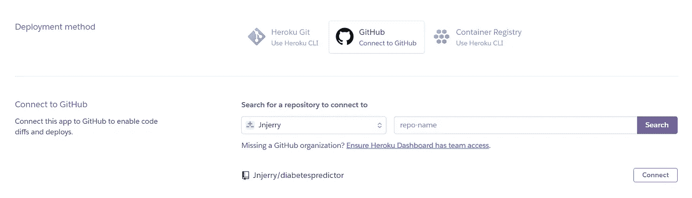
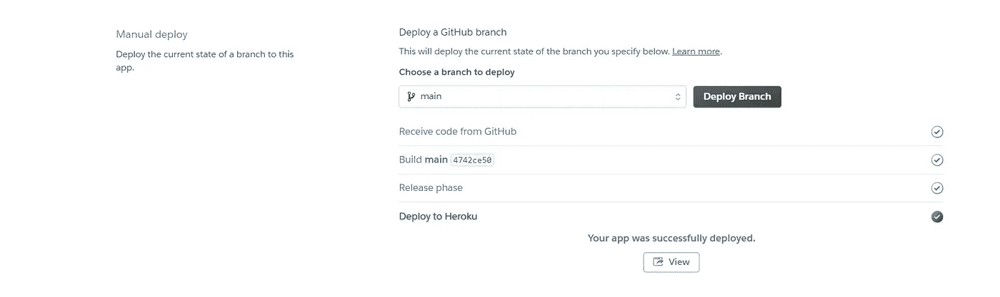
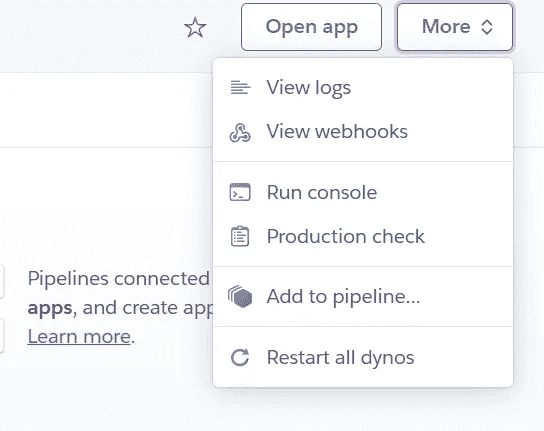

# 向 Heroku 初学者部署使用 Flask 的机器学习模型(第 3 部分)

> 原文：<https://medium.com/analytics-vidhya/deploy-machine-learning-model-using-flask-to-heroku-beginners-part-3-849c2458c363?source=collection_archive---------22----------------------->

本教程是关于如何通过 GitHub 使用 Flask 将机器学习模型部署到 Heroku 的指南的第 3 部分，也是最后一部分。

*   第一部分是 JupyterNotebook 上逻辑回归模型的复习。
*   [的第二部分](https://ngugijoan.medium.com/deploy-machine-learning-model-using-flask-to-heroku-beginners-part-2-6db424211e3d)是关于如何构建你的 flask 应用并在其中嵌入你的机器学习模型，以及将应用上传到 [GitHub](https://github.com/Jnjerry/diabetespredictor) 上。
*   我们的最后一部分将指导您如何将 flask 应用程序从 GitHub 部署到 Heroku。

**第一步:创建新应用**

从 Heroku 仪表盘点击**新建**，然后**创建新应用**，如下所示。

输入您的新应用名称，点击**创建应用**按钮保存更改。

**第二步:连接 GitHub**

从 **Deploy** 部分的新建应用程序中，选择 GitHub 作为您的部署方法。出现提示时，您需要允许 Heroku 访问 GitHub。一旦您成功连接到 GitHub，搜索您的 repo-name 并点击该 repo 上的 connect。

**第三步:部署**

在 manual deployment 部分，选择您的分支，在本例中我们的分支是主分支，然后单击 Deploy Branch。根据您的网速，此过程可能需要 2 到 10 分钟。如果你的应用部署成功，你会看到一个**视图**按钮。在我的情况下，**视图**按钮将我带到[https://joan-diabetes-predictor.herokuapp.com/](https://joan-diabetes-predictor.herokuapp.com/)

如果“查看”按钮显示以下错误，请不要惊慌:)

可能出了什么问题。在大多数情况下，通常是以下情况之一:

1.  软件包版本与 Heroku 中的版本不匹配。你可以随时降级。
2.  requirements.txt 文件中缺少 Gunicorn 包。
3.  遗漏 Procfile，或文件名拼写错误。确认里面的命令也没问题。

**查看日志**部分将指导您处理错误。当您修复代码时，再次重新部署您的分支。

这是关于如何通过 GitHub 使用 Flask 在 Heroku 上创建和部署机器学习模型的指南的最后一部分。编码快乐！