# 将 Web 应用从 GitHub 部署到 Azure

> 原文：<https://medium.com/analytics-vidhya/deploy-python-based-web-apps-from-github-to-azure-4cced626aa90?source=collection_archive---------16----------------------->

今天，我们来看看如何从 GitHub 部署一个 Web 应用到 Azure。

GitHub -> Azure

# **先决条件**:

Azure 帐户有资格访问创建资源，
熟悉网络应用，
GitHub 帐户至少有一个基于网络应用的回购，
Git 的基本知识。

# **第一步** : **在 Azure 上创建一个应用服务**

前往[portal.azure.com](https://portal.azure.com/)并登录(如果没有，请注册)。点击左侧边栏中的*“创建资源”*。

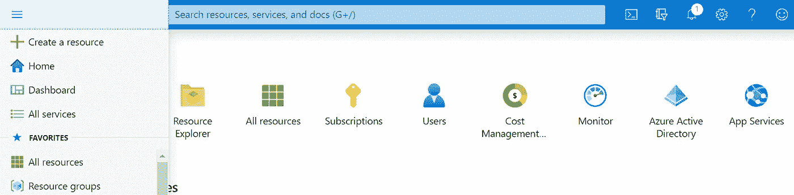

微软 Azure 主页

搜索“*Web App”*并点击。

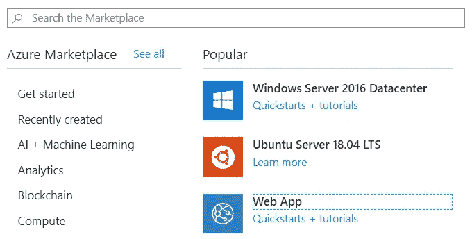

并按照您的帐户设置和代码库(**注** : *您可能会为复制本教程*时创建的一些资源付费)填写如下所示的详细信息。

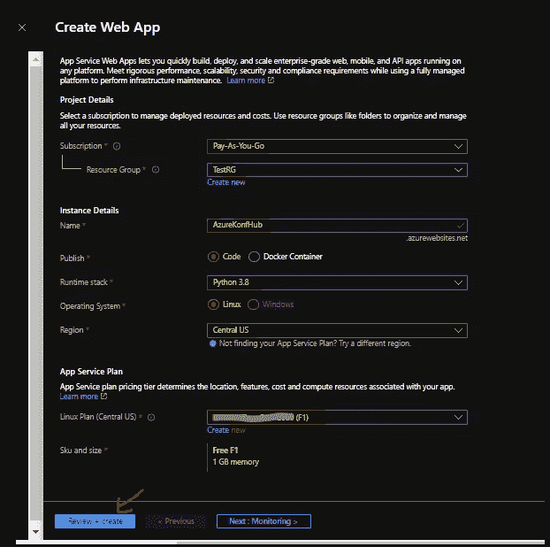

Azure 应用服务创建小部件菜单

**订阅**:现有的订阅名称(在我这里是*“现收现付”*)。
**资源组**:新建并命名它(在我的例子中是*“TestRG”，它已经是一个现有的资源组*)。
**名称**:你选择的 App 名称(在我这里是*“azurekonhub”*)。
**发布:**选择*代码*。
**运行时栈**:我挑了' *Python 3.8* '。(根据您的代码库相应选择)
**操作系统**:选择“ *Linux* ”(如果所选语言没有 Linux 选项，则选择 Windows)
**地区**:选择“*美国中部*”或任何其他提供 F1 应用服务计划层级的地区。
**应用服务计划::
Linux 计划(美国中部)**:创建一个新计划(*在我的情况下，它已经存在/你可能需要创建一个新计划。* )
**SKU 和大小:** *自由 F1* **(** 1 GB 内存)【挑这个大小】

点击**查看并创建**，确认后，点击**创建**按钮。Azure 部署所需资源可能需要一段时间。

# 步骤 2:配置应用服务的部署设置

部署过程完成后，您可以在 Azure Dashboards 的“所有资源”选项卡中看到之前创建的应用服务。

单击该资源并转到资源侧栏中的部署中心。

选择 **GitHub** 作为源代码控制提供者。如果你还没有从 Azure 授权 GitHub，它会通过要求你授权来打开一个新窗口。

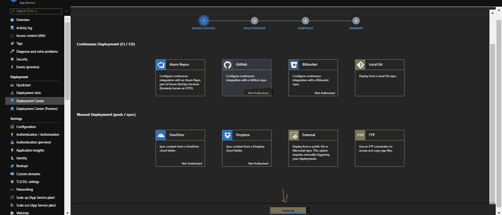

Azure — GitHub CI/CD 授权

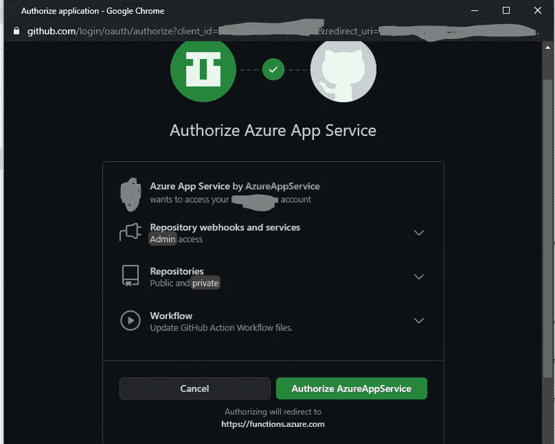

通过 Azure 应用服务进行 GitHub 授权

通过提供您的 GitHub 凭据点击授权，然后点击“**授权/批准**”。

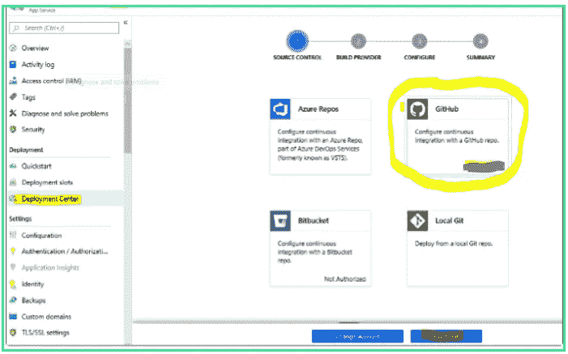

Azure CI/CD- GitHub

关闭 GitHub 授权后，你可以看到 Azure 中的**【继续】**选项，如上图所示。之后，您将选择构建提供者小部件。

选择' **Kudu** 作为您的构建提供者，并再次点击'**继续**。

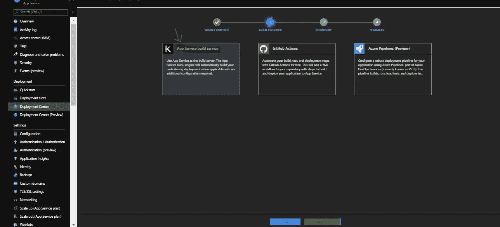

Azure 应用服务构建提供程序

您将被带到**配置**选项卡，以选择您的 GitHub 帐户中您想要发布到 Azure App 服务的相应回购。

**注意:** *如果你的 GitHub 里没有基于 Python 的 Web App，从* [*这里*](https://github.com/Azure-Samples/python-docs-hello-world) *分叉。然后，使用它部署到 Azure 应用服务中。*

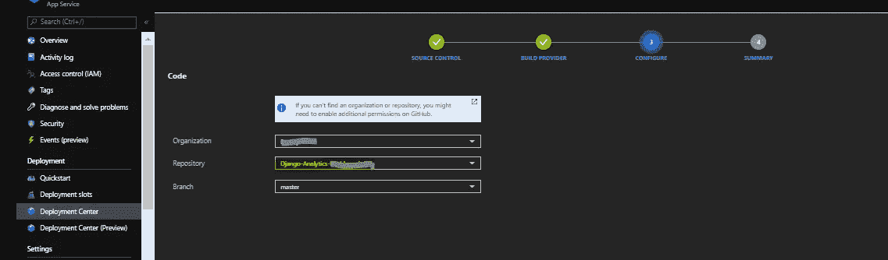

在 Azure 应用服务中配置 GitHub Repo

点击**继续**，将进入部署配置的最后一步，即查看摘要。您可以在这里看到哪个存储库将被推送到应用服务。

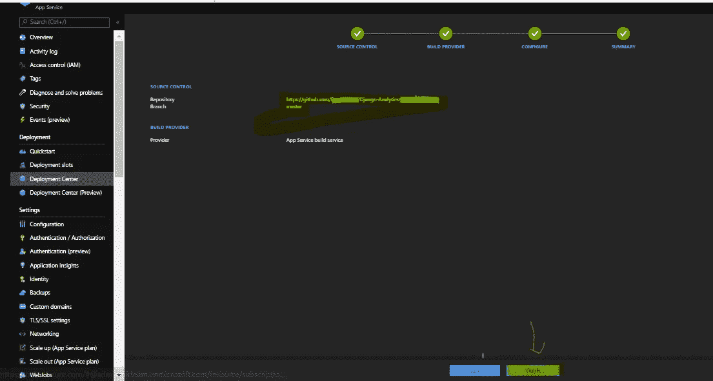

Azure 应用服务部署摘要

一旦你同意了，点击“**完成**按钮。几分钟之内，你就可以看到你的 GitHub 托管的 Web 应用在 Azure App Service 中启动并运行。

查看下图中应用服务资源下给出的 URL。会像“**https://<app _ name>. azure websites . net**”一样。对您的 web 应用程序进行相应的更改，以改变您的 web 应用程序的外观和感觉。

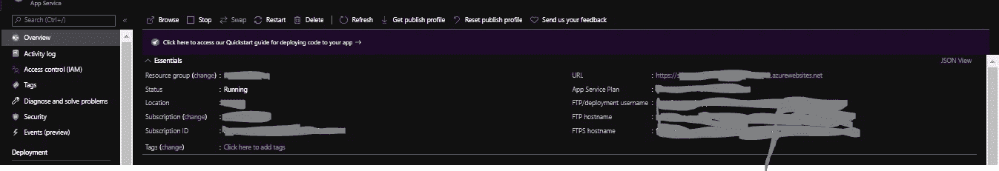

Azure 应用服务信息

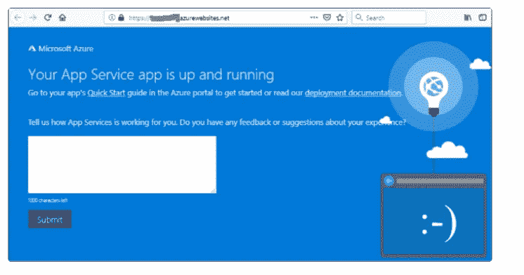

在 Azure 应用服务上访问部署的 Web 应用

最棒的是，你甚至可以在 Azure 中优化应用服务计划，以确保有多个部署槽用于不同的目的。例如，如果配置有效，在同一个应用服务中可以有一个生产部署槽和一个临时部署槽。

这就是我们如何在短时间内从 GitHub Repos 到 Azure 配置和部署基于 python 的 web 应用程序。

如果你喜欢这篇文章，可以考虑分享它，或者给我一个掌声，或者跟我来看更多这样的东西。我乐于接受建设性的批评。