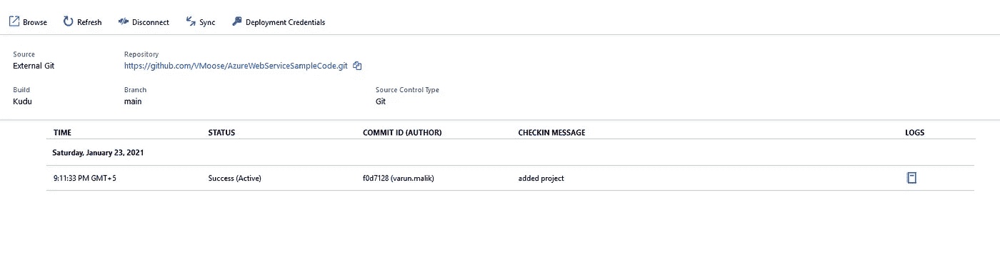
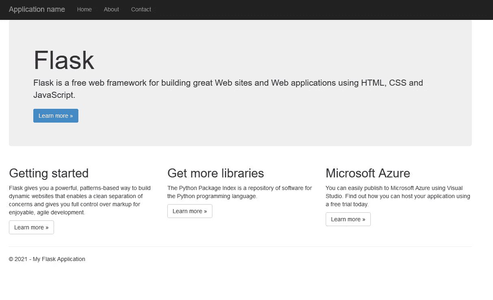

# 使用 ARM 模板将 Web 应用部署到 Azure

> 原文：<https://medium.com/analytics-vidhya/deploy-web-app-to-azure-using-arm-template-5aed7331a957?source=collection_archive---------2----------------------->

azure Resource Manager([ARM](https://docs.microsoft.com/en-us/azure/azure-resource-manager/templates/overview))是微软创建的原生基础设施即代码语言。ARM 模板以类似 JSON 的格式编写，并提供基于对 Azure 的 API 调用创建 Azure 资源的能力。

在这个演示中，ARM 模板的目的是**部署一个链接到 **GitHub Repo** 的 WebApp** 。

**先决条件:**

有效的 azure 订阅

部署在 GitHub 上的基础项目，如这里的

**第一步**:新建一个文件，命名为***azure deploy . JSON***

```
{
  "$schema": "https://schema.management.azure.com/schemas/2019-04-01/deploymentTemplate.json#",
  "contentVersion": "1.0.0.0",
  "parameters": {
    "webAppName": {
      "type": "string",
      "defaultValue": "[concat('webApp-', uniqueString(resourceGroup().id))]",
      "minLength": 2,
      "metadata": {
        "description": "Web app name."
      }
    },
    "location": {
      "type": "string",
      "defaultValue": "[resourceGroup().location]",
      "metadata": {
        "description": "Location for all resources."
      }
    },
    "sku": {
      "type": "string",
      "defaultValue": "F1",
      "metadata": {
        "description": "The SKU of App Service Plan."
      }
    },
    "linuxFxVersion": {
      "type": "string",
      "defaultValue": "PYTHON|3.7",
      "metadata": {
        "description": "The Runtime stack of current web app"
      }
    },
    "repoUrl": {
      "type": "string",
      "defaultValue": "",
      "metadata": {
        "description": "Optional Git Repo URL"
      }
    }
  },
  "variables": {
    "appServicePlanPortalName": "[concat('AppServicePlan-', parameters('webAppName'))]"
  },
  "resources": [
    {
      "type": "Microsoft.Web/serverfarms",
      "apiVersion": "2020-06-01",
      "name": "[variables('appServicePlanPortalName')]",
      "location": "[parameters('location')]",
      "sku": {
        "name": "[parameters('sku')]"
      },
      "kind": "linux",
      "properties": {
        "reserved": true
      }
    },
    {
      "type": "Microsoft.Web/sites",
      "apiVersion": "2020-06-01",
      "name": "[parameters('webAppName')]",
      "location": "[parameters('location')]",

      "dependsOn": [
        "[resourceId('Microsoft.Web/serverfarms', variables('appServicePlanPortalName'))]"
      ],
      "properties": {
        "serverFarmId": "[resourceId('Microsoft.Web/serverfarms', variables('appServicePlanPortalName'))]",
        "siteConfig": {
          "linuxFxVersion": "[parameters('linuxFxVersion')]"
        }
      },
      "resources": [
          {
            "type": "sourcecontrols",
            "apiVersion": "2020-06-01",
            "name": "web",
            "location": "[parameters('location')]",
            "dependsOn": [
              "[resourceId('Microsoft.Web/sites', parameters('webAppName'))]"
            ],
            "properties": {
              "repoUrl": "[parameters('repoUrl')]",
              "branch": "main",
              "isManualIntegration": true
            }
          }
        ]
    }
  ]
}
```

**第二步**:我们可以在上面的模板中编辑 **WebAppName** 、 **location** 、 **sku** 、 **linuxFxVersion** 和 **repoUrl** ，但是让我们创建***azure deploy . parameters . JSON***文件来存储参数值。

```
{
    "$schema": "https://schema.management.azure.com/schemas/2019-04-01/deploymentParameters.json#",
    "contentVersion": "1.0.0.1",
    "parameters": {
        "webAppName": {
            "value": "Azure-Web-App-ARM-Template"
        },
        "sku": {
            "value": "F1"
        },
        "linuxFxVersion": {
            "value": "PYTHON|3.7"
        },
        "repoUrl": {
            "value": "https://github.com/VMoose/AzureWebServiceSampleCode.git"
        }
    }
}
```

**步骤 3** :使用 Azure CLI 登录并运行命令:

> ***az 组部署创建—资源组<资源组名称> —模板文件"<azure deploy . JSON 路径> " —参数"<azure deploy . parameters . JSON 路径> "***

如果您还没有资源组，请使用以下命令创建一个:

> ***az 组创建—名称“资源—组”—位置“您的位置”***

**第四步**:部署中心应该是这样的:



您应该能够看到使用 webservice url 的应用程序，如下所示:



**有用链接**:

1.  https://github.com/Azure/azure-quickstart-templates:你可以找到多个像我在这里用过的模板。
2.  https://github.com/VMoose/AzureWebServiceSampleCode:你可以在这里找到我用的样品瓶代码。