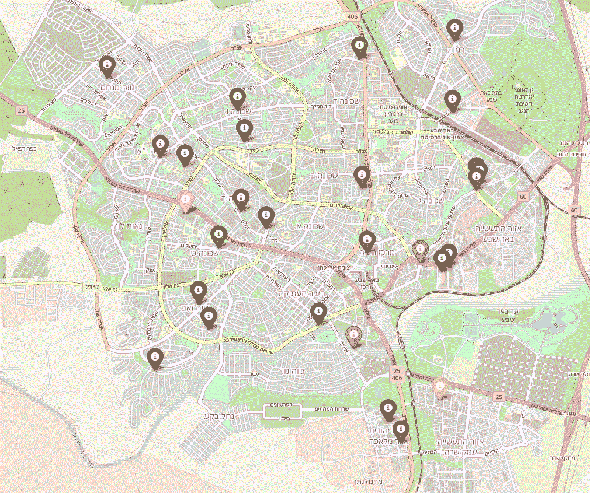
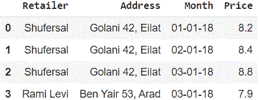
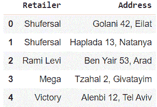
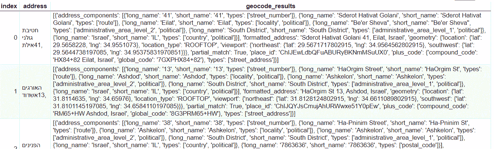
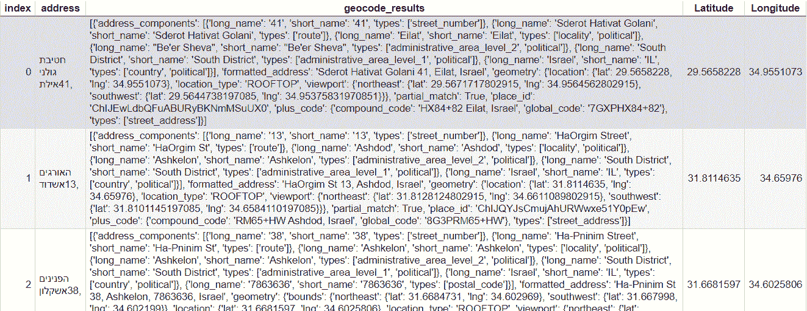
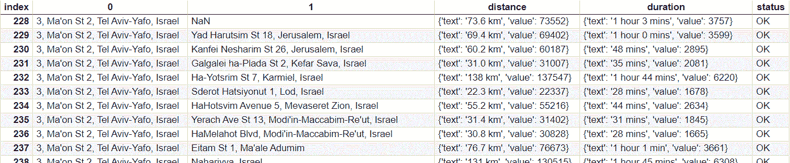
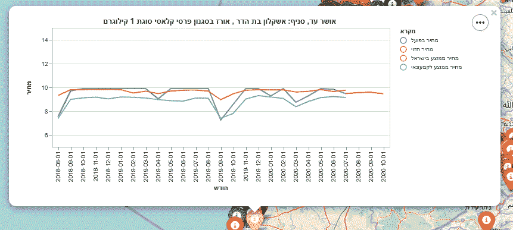
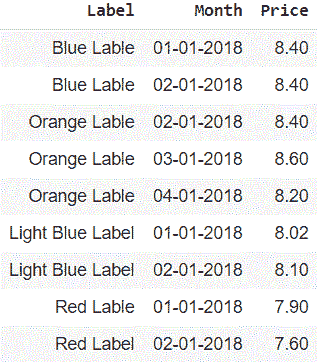

# 将您的 ML 模型部署到用于空间数据的交互式叶子地图

> 原文：<https://medium.com/analytics-vidhya/deploy-your-ml-model-to-an-interactive-folium-map-for-spatial-data-5de5269b64cd?source=collection_archive---------8----------------------->


[马尼什·马姆塔尼](https://www.facebook.com/manish.mamtani?__cft__[0]=AZXLUXLqc1mjIdcimWp2-qVc34Hg53-ohsDkj55_dZdLbbrUpZt1-qwMIOVHhcrkGHOCWQn3kPX_hrAm3X9IL_u4dr-3fMan1qJiIAr7RD3m31RtWrHgi1RBICymeY7bhuoWJuaBGu037HCzkYwtwVEb&__tn__=-UC*F)，新汉普郡秋天的颜色——航拍

COVID 19 会如何传播？房地产价格会是多少？发生车祸或犯罪的概率有多大？所有这些问题都与地理因素密切相关。

在本文中，我将展示如何使用一个`folium`地图来呈现模型预测。当我们想在本地展示我们的模型预测时，这个工具就变得很方便。

下图展示了以色列大米的过去和预测价格，这与当地的竞争和客户的经济特征密切相关。

以色列大米月价格

这种类型的展示允许读者探索局部水平上的模型预测，并且在分析涉及地理方面的情况下它非常适合。

## 语境

在这篇文章中，我展示了我们在[以色列经济规划研究所](https://www.iep.org.il/english/en-home)做的一个项目。该项目的目标是构建一个工具，允许客户比较和检查他们所在地区的零售价格。

我们有牛奶和大米等几种日常食品的数据。该数据跨越 24 个月，涵盖了以色列大型零售公司的所有商店。

对于每种产品，我们都训练了几个模型，包括 Catboost、XGBoost 和 LSTM，以预测不同地理位置的未来零售价格。

令人惊讶的是，虽然 RNN 和决策树在时间序列和横截面分析中很常见，但关于这些算法在面板数据中的使用的文献却很少，几乎不存在。我们的数据跨越时间，涵盖不同的地理位置(商店)。在训练模型时忽略数据的这些特征可能会导致我们高估我们的模型预测能力。

在即将发表的一篇文章中，我将详细说明我们如何实际训练该模型，结合滚动预测交叉验证[【11】](https://www.youtube.com/watch?v=g9iO2AwTXyI&t=607s)和传统的训练、交叉验证和测试集分割。在本文中，我将重点介绍如何利用`folium`包来呈现地理相关数据的模型预测。

由于数据生成过程也与地理特征相关，下面的一些步骤也与特征工程相关。文章内容如下。



地图上的商店，不同的颜色代表不同的零售公司，每个点就是一个商店。

1.  **用**提取坐标`**Google Maps API**`。该地区的顾客数量、他们的平均收入、竞争(表示为给定地区的商店数量)所有这些因素都会影响当地的零售价格。深入研究影响价格的地理和经济因素并不是本文的目的。坐标将允许我们为模型创建特征，为地图创建点。
2.  **用** `**Google Distance Matrix API**` **和自由选项提取店铺之间的道路距离和持续时间。**在某些情况下，我们可能希望使用物体之间的距离来为模型创建特征。在我们的案例中，我们使用了地理位置相近的商店的信息。
3.  **使用** `**altair**` **创建特定商店的历史图表**。我注意到，当您想要将图表作为弹出元素添加到一个 follow 地图中时，matplotlib 不太有用。Altair 提供了一个简单的解决方案。
4.  **如何创建叶子地图。**准备数据并反复运行商店，以在地图上创建新的标记。
5.  **奖励**:嵌入你的地图。树叶地图可以保存为 HTML 格式。要想上传到网站(比如 Medium)上，得先嵌入。

所以让我们开始吧！

# 1.从地址到坐标

起初，我们的数据可能看起来像这样



面板数据集(另存为 df)

我们想给每个`Address`分配两个坐标。谷歌对这个 API 的每 1000 次请求收取 5 美元，每个月我们免费获得 200 美元的使用费。与距离矩阵不同(见下一部分)，在这一部分中，我们只查找每个地址一次，所以我们只需要保留`Retailer`和`Address`。

```
addresses_df = df.filter(items = [‘Retailer’, ‘Address’]).\
 drop_duplicates().\
 reset_index(drop = True)
```

我们会得到这样一个缩短的数据:



地址数据(保存为地址)

鉴于我们的数据看起来像这样，我们可以进行下一步。网上有很多优秀的导游；我用的是[那款](https://towardsdatascience.com/pythons-geocoding-convert-a-list-of-addresses-into-a-map-f522ef513fd6)。但是，首先，我们必须创建一个 Google API 密钥；你可以在这里做那件事。

有了密钥后，我们可以使用`request`包向 Google 请求坐标。在下面的代码中，我们准备我们的客户端。

```
# working in a Colab framework, we first need to install googlemaps
!pip install -U googlemapsimport requestsimport googlemapsfrom datetime import datetimegmaps = googlemaps.Client(key='---YOUR KEY HERE---')
```

现在我们像那样跑过不同的地址

```
geocode = {}
geocode['index'] = []
geocode['address'] = []
geocode['geocode_results'] = []for j in range(len(addresses)):
  geocode_result = gmaps.geocode(addresses[j])
  geocode['index'].append(j)
  geocode['address'].append(addresses[j])
  geocode['geocode_results'].append(geocode_result)geocode_df = pd.DataFrame(geocode)
```

我们的数据应该是这样的



地理编码 _df

对于每个商店，谷歌的地理编码结果是一个看起来像字典的字符串。`ast`包允许我们将字典中的字符串转换成字典，所以我们运行我们的存储，提取纬度和经度，我们就完成了。

```
import ast
geocode_df['Latitude']  = None
geocode_df['Longitude'] = Nonefor j in range(geocode_df.shape[0]):
  try:
    # convert string to dictionary
    geocode_results_dict = \
       ast.literal_eval(geocode_df['geocode_results'][j])[0]
    # extract values
    geocode_df['Latitude'][j] = \
       geocode_results_dict['geometry']['location']['lat']
    geocode_df['Longitude'][j] = \
       geocode_results_dict['geometry']['location']['lng'] except:
    geocode_df['Latitude'][j] = None
    geocode_df['Longitude'][j] = Nonegeocode_df
```



带坐标的 geocode_df

现在我们有了每个商店的坐标。我们现在可以计算从一个商店到另一个商店的距离，或者为每个商店分配其位置属性。

# 2.从坐标到距离

这一部分并不完全与叶子地图相关，但它可能与建模步骤相关，所以我在这里添加它。

给定我们的坐标，我们希望创建一个距离矩阵，该矩阵的(I，j)元素表示商店 I 和商店 j 之间的距离。由于我们有单行道，或单向拥堵，该矩阵可能不是对称的。对角线假定为 0，因为从商店 I 到其自身的距离可以忽略不计。

我们可以使用`gmaps.distance_matrix`计算位置之间的距离。它接受元素、起点和目的地，并返回旅行花费的平均时间(以汽车为单位)和距离(以公里为单位)。

之前的计算相对便宜—我们只需要查找每个商店一次。在这里，另一方面，对于每个商店，我们画出与所有其他商店的距离。这增加了搜索的数量，并且可能是昂贵的。

在我的项目中，我不需要所有的距离——因为埃拉特的商店不与特拉维夫的商店竞争，所以我在预测对方的价格时不需要考虑第一个因素。在那个阶段，一些规则可能会有帮助，所以我们不需要计算**所有的**距离。

在阅读代码之前，我提供了一种计算两点之间空中距离的免费方法。这个计算的结果可以让你在第二步设置一个更精确的搜索(比如，只有当两点的空中距离小于 7 公里时，才使用 Google API 计算两点之间的距离——这是我的条件)。

我在这里使用了[的函数](https://stackoverflow.com/questions/19412462/getting-distance-between-two-points-based-on-latitude-longitude)。

```
import math

def distance(origin, destination):
    """
    Calculate the Haversine distance.

    Parameters
    ----------
    origin : tuple of float
        (lat, long)
    destination : tuple of float
        (lat, long)

    Returns
    -------
    distance_in_km : float

    Examples
    --------
    >>> origin = (48.1372, 11.5756)  # Munich
    >>> destination = (52.5186, 13.4083)  # Berlin
    >>> round(distance(origin, destination), 1)
    504.2
    """
    lat1, lon1 = origin
    lat2, lon2 = destination
    radius = 6371  # km

    dlat = math.radians(lat2 - lat1)
    dlon = math.radians(lon2 - lon1)
    a = \
      (math.sin(dlat / 2) * math.sin(dlat / 2) + \
       math.cos(math.radians(lat1)) * math.cos(math.radians(lat2))*\
       math.sin(dlon / 2) * math.sin(dlon / 2))
    c = 2 * math.atan2(math.sqrt(a), math.sqrt(1 - a))
    d = radius * c

    return d
```

在计算了`geocode_df`所有商店之间的成对空中距离并只保留距离小于 7 公里的组合后，我继续使用距离矩阵 API。

```
for i in range(geocode_df.shape[0]):
  # Create an empty dict
  distance_matrix_i = {'origin_address':[], 
                       'destination_address':[], 
                       'origin_google':[],
                       'destination_google': [],
                       'distance_text': [],
                       'distance_value': [],
                       'duration_text': [],
                       'duration_value': []} # Calculate Distance Sequentially
  for j in range(len(addresses)):
    ij_ans = gmaps.distance_matrix(
             origins=[geocode_df['address'][i]], 
             destinations = addresses[j], mode='driving') distance_matrix_i['origin_address'].\
       append(geocode_df['address'][i])
    distance_matrix_i['destination_address'].append(addresses[j])
    distance_matrix_i['origin_google'].\
       append(ij_ans['origin_addresses'][0])
    distance_matrix_i['destination_google'].\
       append(ij_ans['destination_addresses'][0]) # If destination was found
    if (ij_ans['rows'][0]['elements'][0]['status'] == 'OK'):
      distance_matrix_i['distance_text'].\
       append(ij_ans['rows'][0]['elements'][0]['distance']['text'])
      distance_matrix_i['distance_value'].\
       append(ij_ans['rows'][0]['elements'][0]['distance']['value'])
      distance_matrix_i['duration_text'].\
       append(ij_ans['rows'][0]['elements'][0]['duration']['text'])
      distance_matrix_i['duration_value'].\
       append(ij_ans['rows'][0]['elements'][0]['duration']['value']) else:
      distance_matrix_i['distance_text'].append(None)
      distance_matrix_i['distance_value'].append(None)
      distance_matrix_i['duration_text'].append(None)
      distance_matrix_i['duration_value'].append(None) distance_matrix_i_df = pd.DataFrame.from_dict(distance_matrix_i) distance_matrix_i_df.to_csv(f' --- Your Location ---', index = False)
```

我们的结果应该是这样的



谷歌距离矩阵结果，0 是起点，1 是终点

# 3.创建一个牛郎星图表

这个包并没有不友好到需要在单独的部分解释。尽管如此，对于我们的项目，我必须构建一个商店级别的图表，每次结合四个数据框架，所以我决定花几行来解释我所做的事情，以防您面临类似的情况。

最后，我们要在地图上分配每个商店/市场，图表如下。



蓝线代表给定商店以前的大米价格。橙色表示使用 CatBoost 模型预测的商店价格。红色表示以色列所有商店的大米月平均价格，浅蓝色线表示拥有当前商店的同一零售商的大米月平均价格。

为了创建如上的图表，我们需要制作如下的数据框。



牵牛星 _df

然后，我们使用以下代码创建图表

```
import altair as altsource = pd.DataFrame({
    'Month': temp_df.Month,
    'Price': temp_df.AVGPriceAfterOffer,
    'Label': temp_df.Label
})sw_bar = \
  alt.Chart(source).mark_line().encode(
    x=alt.Y('Month',scale=alt.Scale(domain=(Months))),
    y=alt.Y('Price', scale=alt.Scale(domain=(5, 15))),
  color='Label',
  strokeDash='Label').properties(title= 'chart_title_here')sw_bar.configure_title(
  fontSize=20,
  font='Courier',
  anchor='start',
  color='gray'
)
```

# 4.从商店级图表到交互式地图

到目前为止，我们准备了每个商店的坐标，并创建了一个商店级别的图表来显示其以前的价格和预测的价格，并将它们与整个以色列的平均价格进行比较。现在，我们将使用下面的代码在地图中部署这些元素(我假设您的项目与我们的不同，所以我不喜欢深入细节，而是停留在高级代码上。所以，下面我没有复制我的代码，而是用代码块角色来表示，这样你就可以把它放入你的案例中。

```
import folium
from folium.plugins import MarkerCluster
import ast
import altair as alt
import pandas as pd
import vegatext = ''# Define coordinates of where we want to center our map
israel_coords = [31.4117257, 35.0818155]# Create the map
my_map2 = folium.Map(location = israel_coords, zoom_start = 9) # Create a color pallet for different retail companiescolors = {
  'יינות ביתן': 'black',
  'פרש מרקט': 'pink',
  'חצי חינם': 'yellow',
  'מחסני השוק': 'darkblue',
  ...}# Create a DataFrame as altair_df, with country-level prices (that is loop invariant)
altair_df = ...for j in range(0,stores_df.shape[0]): # Create a DataFrame as altair_df, with store and retailer level
  # prices, and append it to the existed altair_df 
  altair_df = ... title_ = '--- Set a store dependent title here ---' # create graph
  source = pd.DataFrame({
    'Month': temp_df.Month,
    'Price': temp_df.AVGPriceAfterOffer,
    'Label': temp_df.Label
  })

  sw_bar = \
    alt.Chart(source).mark_line().encode(
      x=alt.Y('Month',scale=alt.Scale(domain=(Months))),
      y=alt.Y('Price', scale=alt.Scale(domain=(5, 15))),
    color='Label',
    strokeDash='Label').properties(title= 'chart_title_here') sw_bar.configure_title(
    fontSize=20,
    font='Courier',
    anchor='start',
    color='gray'
  ) # add the chart as a folium feature
  vega = folium.features.\
    VegaLite(sw_bar, width='100%', height='100%') # create popup
  sw_popup = folium.Popup(text,parse_html=True) # add chart to popup
  vega.add_to(sw_popup)

  # add to map (using our coordinates for store j)
  place = [df['Latitude'][j], df['Longitude'][j]] # create marker on the map, with optional popup text or 
  # Vincent visualization
  sw_marker = folium.features.\
    Marker(place, 
           icon=folium.\
           Icon(color=colors[XMerged['Retailer'][j]])) sw_marker.add_to(my_map2)my_map2
```

就是这样！我们现在应该可以看到本文开头的交互式地图。

# 5.奖励:嵌入您的地图

好了，现在我们已经完成了上面的所有步骤，现在我们有了`my_map2`，一个 HTML 文件，我们可以与我们组织中的同事共享，或者原样发送给客户端；但是如果我们想把它上传到我们的网站并保持它的交互性呢？一个中等职位，就像这个？然后我们必须先嵌入我们的地图。

试图将 HTML 文件原样上传到网站可能是不可能的。它由成千上万行 HTML 代码组成(在我的例子中)，并且它需要首先被嵌入。

试图通过 Gist 上传你的叶子地图可能会导致这个[错误](https://github.com/python-visualization/branca/issues/81)。相信我；我花了几个小时试图正确上传我的 HTML 地图。我发现这样做的最短和最可靠的方法是使用[数据面板](https://datapane.com/)服务。我在社区许可下上传了上面的地图，是免费的。

我跟随[这个](https://medium.com/r?url=https%3A%2F%2Ftowardsdatascience.com%2Fhow-to-embed-interactive-charts-on-your-medium-articles-and-website-6987f7b28472)伟大的教程走向数据科学。首先，我在 DataPane 中创建了一个令牌，然后，在 Colab 笔记本中，我再次创建了 my_map2，并像在教程中一样发布了它。结果出现在本文的顶部。