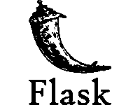
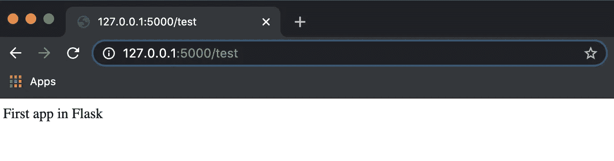
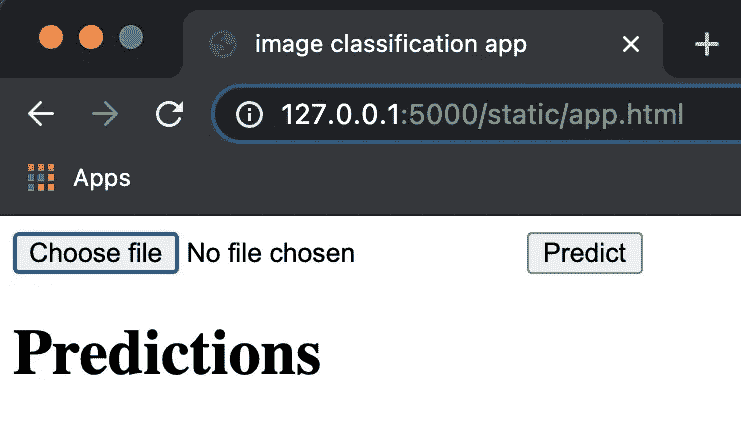
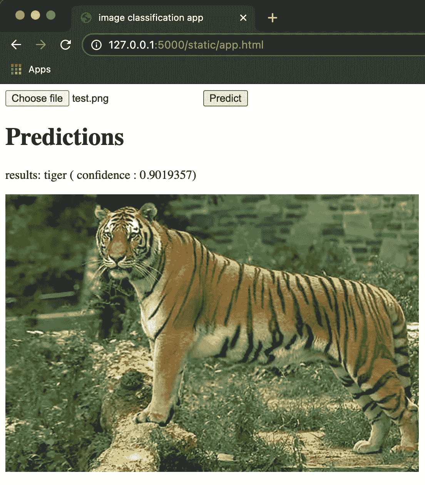

# 使用 Flask Web 服务部署您的模型

> 原文：<https://medium.com/analytics-vidhya/deploy-your-model-using-a-flask-web-service-461ccaef9ea0?source=collection_archive---------1----------------------->

## 创建您的深度学习 API，并在您的网站中使用它


当处理一个 ML 项目时，我们首先探索数据并选择合适的模型和预处理。然后我们训练和测试，直到我们达到预期的表现。之后，我们需要部署我们的模型，以便从网站或应用程序中使用它。

我们当然不能用笔记本，因为那会很乱！此外，除非我们的 web 应用程序是基于 Django 的，否则它甚至可能不是用 python 编写的。那么，我们如何将我们的模型部署为一个 API，然后从应用程序中调用它呢？

一种选择是将我们的模型转移到 web 服务中。这样，我们用 HTML 和 JavaScript 编写的 web 应用程序将能够通过与 python Flask Web 服务通信的 HTTP 请求来访问我们的模型。

为了更详细地说明这一点，我们遵循以下流程:

*   1.创建我们的模型
*   2.安装并发射烧瓶
*   3.用 Flask 交换数据并托管我们的模型
*   4.构建一个前端 web 应用程序来与我们的 API 进行通信
*   5.数据安全和隐私

# 1.创建我们的模型

在本文中，我们将简单地从 Keras 中选取一个预先训练好的模型，以便专注于下面的部分。我们将使用著名的 Resnet50 对包含一千个类的 ImageNet 数据进行训练。

# 2.安装并发射烧瓶



下面是在 python 环境中安装 Flask 的两种方法:

```
# *option 1 : pip*
pip install flask# *option 2 : conda*
conda install -c anaconda flask
```

接下来，我们将创建一个非常基本的应用程序，如果我们浏览 URL:“/test”，它将显示文本“Flask 中的第一个应用程序”。这只是为了看看我们的安装是否正常工作。下面是我们项目的结构:

```
flask_applications/
    app.py
```

这是我们的 app.py:

打开您的终端，转到“flask_applications/”文件夹来运行这个命令( [windows 等价物](http://windows.com)):

```
# run this the first time you declare an app
export FLASK_APP=app.py# then launch it
flask run --host=0.0.0.0
```

选择您喜欢的浏览器并导航到您终端上显示的地址: [http://127.0.0.1:5000](http://127.0.0.1:5000/static/app.html) 。现在转到激活我们的函数“test”的 url，所以在 url 中添加“/test”。



屏幕上显示程序运行的图片

我们做了第一个应用！这很好，但目前没什么用…

# 3.用 flask 交换数据并托管我们的模型

## 3.1 如何与 Flask 交换数据

我们想创建一个 Flask 应用程序，它将作为我们的 web 应用程序的后端。我们的 Flask 应用程序需要能够接收来自 HTTP post 请求的图像。它还需要以 Json 格式发回结果。

为此，我们将使用两个额外的库:“request”检索来自 post 请求的数据，而“jsonify”将结果转换为 json 格式。以下是我们更新的 app.py:

我们的应用程序的目标是将图像作为输入，并通过我们的模型传递它们。让我们再一次改变我们的 app.py😉

## 3.2 用烧瓶装载我们的模型

我们将从 post 请求中获得的数据是一个图像。我们想给我们的 ResNet50 提供这个图像来获得预测。之后，我们的 Flask 应该将结果存储为 Json 格式的 dictionary cast 并返回它。这是我们新版本的 app.py:

我们的后端完成了！下一步是创建一个前端 web 应用程序来与我们的 Flask 应用程序进行通信。

# 4.构建一个前端 web 应用程序来与我们的 API 进行通信

我们需要在项目中再添加一个文件:

```
flask_applications/
    app.py
    static/
        app.html
```

基本上，我们的 app.html 需要包括:

*   上传图像的输入
*   一个按钮，点击并激活一个脚本调用我们的 Flask 应用程序
*   显示预测结果的段落
*   显示上传图像的图像元素
*   当然还有与我们的烧瓶通信的脚本。这个脚本还用预测更新段落文本，用上传的图像更新图像元素。

现在，我们可以像以前一样启动应用程序，并导航到[http://0 . 0 . 0 . 0:5000/static/app . html](http://10.0.0.4:5000/static/predict.html)

您现在应该会看到这样一个网页:



上传一个”。png”图像并点击“预测”。



哇！好的，布局不是最漂亮的，但是你只是通过调用 Flask 应用程序在网页上使用了你的模型。基本上你创建了你的第一个深度学习 API。如果你成功了，恭喜你！

# 5.数据安全和隐私

简单回顾一下，我们上传了一张图片，并通过 HTTP Post 请求将其发送到我们的 Flask 应用程序。然后我们处理它，得到结果，并把它们作为 Json 发送回我们的前端。最后，我们的网页显示了响应。

这里我们只发送一个不包含有价值信息的图像。但是，如果我们想要发送像身份证或驾照这样的私人信息，会发生什么呢？我们不想冒这个险。

如果我们不通过网络传输数据，而是将数据保存在本地，并将模型发送到前端应用程序中运行。这样，一切都可以直接在浏览器中运行。因此，信息可以在浏览器中输入模型，而不必通过网络发送。

我们如何做到这一点？您可以使用 TensorFlow.js 库并将您的模型作为 JavaScript 运行:这将是我下一篇文章的主题😊

希望对你有所帮助。如果你喜欢看这篇文章，请留言，不要犹豫。

# 参考

[](https://flask.palletsprojects.com/en/1.1.x/) [## 欢迎使用 Flask - Flask 文档(1.1.x)

### 欢迎阅读 Flask 的文档。开始安装，然后了解快速入门概述。有…

flask.palletsprojects.com](https://flask.palletsprojects.com/en/1.1.x/) [](https://www.tensorflow.org/) [## 张量流

### 一个面向所有人的端到端开源机器学习平台。探索 TensorFlow 灵活的工具生态系统…

www.tensorflow.org](https://www.tensorflow.org/) [](https://deeplizard.com/) [## 深海蜥蜴——构建集体智慧

### filter_1 机器学习&深度学习基础 filter_2 Keras - Python 深度学习神经网络 API…

deeplizard.com](https://deeplizard.com/)