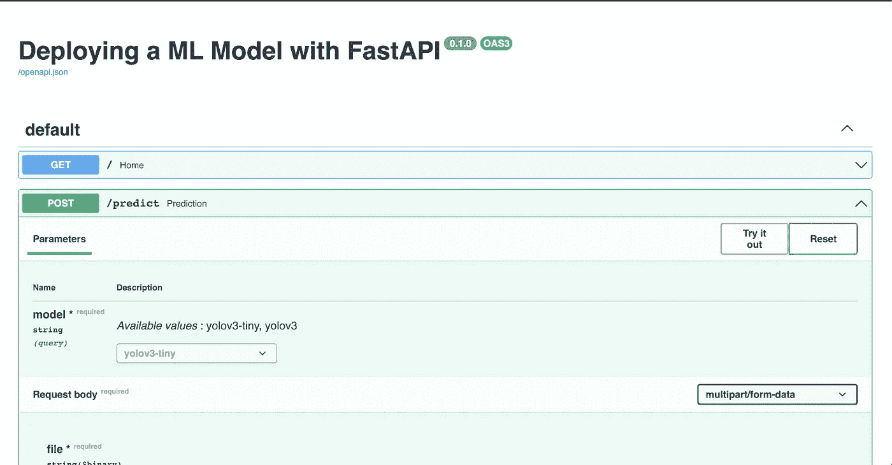
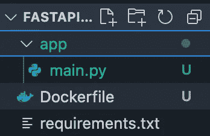
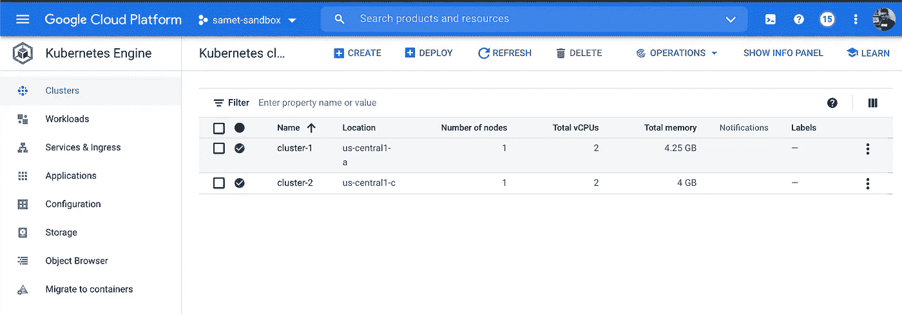
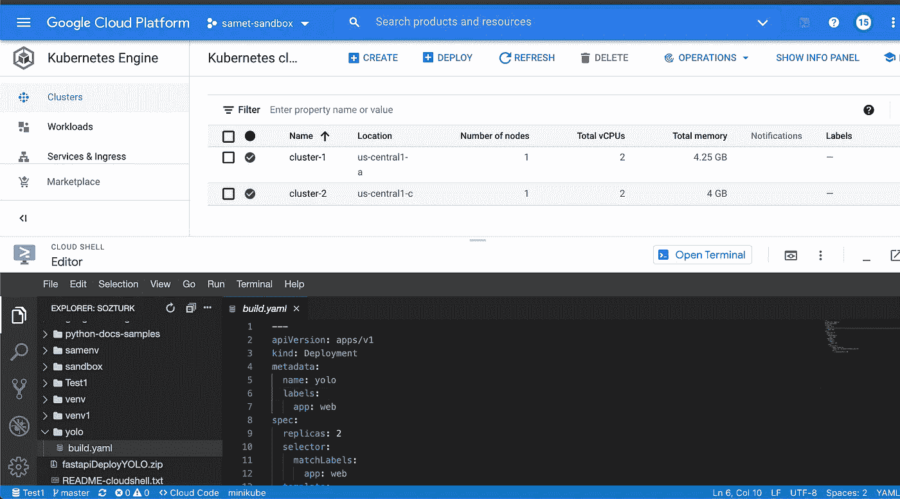
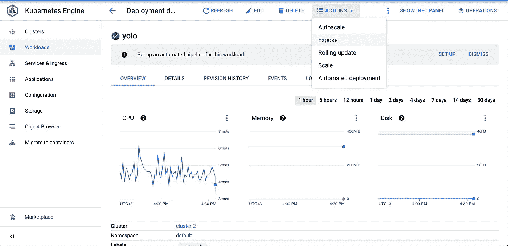
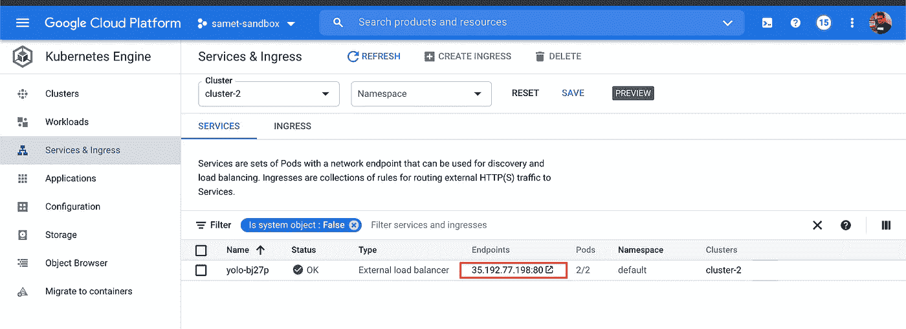
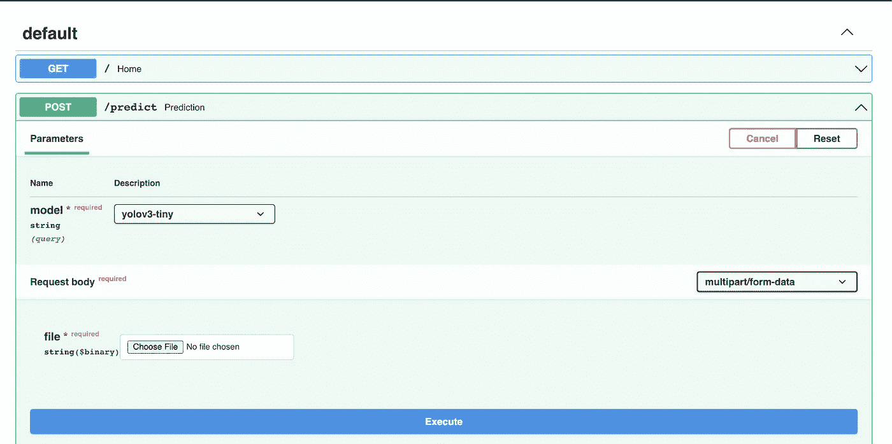

# 在 Google Kubernetes 引擎(Google 云平台)上使用 FastAPI 部署 ML 模型

> 原文：<https://medium.com/analytics-vidhya/deploying-a-ml-model-with-fastapi-on-google-kubernetes-engine-google-cloud-platform-bc2adbe0a35a?source=collection_archive---------7----------------------->

注意:整个项目可以在 Youtube 上看到，但是目前只有土耳其语版本。我相信我很快就会录制英文版或者中文版。

以相当高的准确度(或者你使用的任何度量标准)训练一个模型是很棒的，绝对值得开一瓶香槟。但是你现在打算怎么用呢？批量预测你电脑上的一切？这将是机器学习，相当于在你当地的咖啡店里，从你的笔记本电脑上显示你的网站。

我们要做的是让每个人都能通过一个 API 来访问它。如果你不知道 API 是什么，就把它想象成用户的一个端点。他们可以向您的 API 发送预测数据，这是一个 POST 请求，API 将使用预测进行响应。

这篇文章由两部分组成:

1.  开发 API

我们将使用预训练的 yolo-v3 和 yolo-v3-tiny 模型，因为这里的重点不是训练模型，而是部署它。我们将围绕您的模型包装 FastAPI。当我们完成这一部分时，我们将能够向本地主机上的 API 发送请求。

2.将它部署在谷歌云的 Kubernetes 引擎上

在第一部分之后，我们将能够向本地主机上的 API 发送请求。为了向世界开放您的模型，我们需要将它部署到公共端点。我选择了云和 Kubernetes 来消除可伸缩性问题。

## 开发 API

代码的某些部分来自 Andrew NG 的 MLOps 课程，但我打算比他走得更远。如果你熟悉计算机视觉，代码是很容易理解的，但是我必须为新手解释 FastAPI 部分。

FastAPI 几乎是类固醇的烧瓶，所以我们将创建不同的页面，如 website.com/home 的*或 website.com/about 的*。我们可以使用**@ app**decorator；即@ app(“/”)的意思是主页。此外，您可以通过/docs 页面测试您的 FastAPI 应用程序，这与 Flask 相比是一大优势。由于[类型提示](https://docs.python.org/3/library/typing.html)，这成为可能。换句话说，FastAPI 自动记录您的应用程序。**

**我们还在本地系统上创建一个目录来保存客户端发送给我们的图像和我们将在对象周围绘制框的图像。我们将把后者返回给客户，这样他们就可以看到我们模型的预测。**

**运行此代码后，您可以从本地主机访问它；如果您转到 localhost，您可以看到消息*“API 正在按预期工作。”*或[http://localhost:8000/docs](http://localhost:8000/docs)显示一个与此相同的屏幕:**

****

**我们创建的 FastAPI 文档页面**

**您可以尝试预测方法，看看您的模型是否工作正常。**

## **在 Google Cloud 的 Kubernetes 引擎上部署应用程序**

**我们现在已经进行了一半，但是这部分有点复杂；这就是我与同事合作完成这一部分的原因。我们将这个过程分为 4 个部分:**

1.  **将应用容器化**
2.  **将其上传到容器注册表**
3.  **在谷歌云上创建一个 Kubernetes 集群**
4.  **在群集上运行容器**
5.  **(奖金)设置自动缩放策略**

**既然你现在知道了这些步骤，无论何时你感到失落，你都可以回头看看这些步骤，然后找出我们在哪里。**

**如果您设置了您的帐户、项目和账单，我们可以立即开始行动。你把你的 app 放在一个名为“app”的文件夹下。在应用程序外部创建一个名为“Docker file”的 Docker 文件。就像这样:**

****

**目录树**

**然后写一个 Dockerfile 文件:**

**我不打算详细介绍 docker 容器。如果你是 Docker 的新用户，你可以阅读 Docker 文档或者在 [my github](https://github.com/samozturk/Docker-Notes/blob/main/Docker%20Notes%205f4cbe0250a64983972a6a3d0bbf70db.md) 上查看我的 Docker 笔记。**

**基础映像是 python，然后我们定义了工作目录。然后我们把所有东西都复制到容器的主目录中；已安装所需的库；暴露端口 80，并告诉 Docker 在运行容器时运行哪些命令。**

**我们构建了容器并在本地机器上运行。第二个是可选的，它只是为了演示的目的；只是想看看有没有用。第三个命令是把我们的容器推到一个注册中心，我们不喜欢 Docker Hub，Google Container Registry(gcr.io)。**

**如果你在第三个命令之前没有登录，打开终端，键入 **gcloud init** 按照步骤操作。然后输入**g cloud auth configure-docker**。这部分只是从你的本地机器上运行你的 gcloud 命令，我就不赘述了。**

****

**谷歌云 Kubernetes 引擎**

**如果你想看到所有正在运行的节点，你可以向云控制台输入 **kubectl get nodes -A** 。(-标志表示所有节点)**

**下一步，我们将需要云壳编辑器，而不是云壳终端。**

****

**云壳编辑器**

**我们将为 Kubernetes 部署创建 yaml 文件。这是:**

**关于 kubernetes yaml 文件的更多细节，请访问[这个站点](https://www.mirantis.com/blog/introduction-to-yaml-creating-a-kubernetes-deployment/)。然后我们需要使用这个 build.yaml 文件。**

**我们还可以看到第二个命令的部署。我们就快到了；我们所要做的就是公开我们的 kubernetes 工作负载，这可以在 UI 上完成。然后我们将有一个 IP 地址来发送请求给我们的 API。**

****

**Kubernetes 工作负载暴露**

**这项工作完成后，您可以前往“服务和入口”选项卡并查看您的端点。**

****

**我们的终点**

**您可以单击端点，您将看到:“API 正在按预期工作。”如果你想测试你的模型，你可以在 IP 地址中添加“/docs”并发送文件进行预测。你只需要上传一个文件，然后点击执行。**

****

**就这样了，伙计们。现在你为你的模型服务了。**

**奖励:设置自动缩放**

**如果我们在控制台上键入以下命令，我们会说 kubernetes 在 90%的 CPU 利用率后，将自动扩展到 6 个节点。**